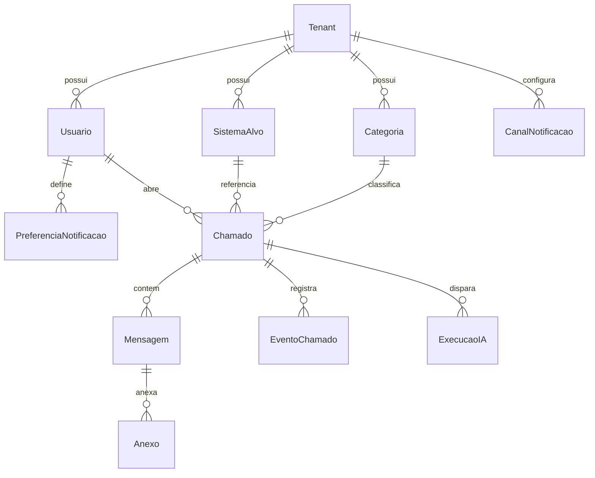
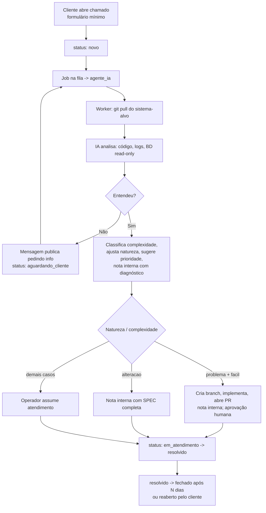

# 00 — Visão Geral e Objetivos

Este é o documento raiz da especificação da plataforma **Chamados**. Ele define o problema, a visão de produto, objetivos e não-objetivos, personas, princípios, métricas de sucesso e o **glossário canônico** (entidades, papéis e enums) que todos os demais documentos referenciam.

Os detalhes de implementação vivem em documentos próprios; este documento não os duplica:

| Tema | Documento |
| --- | --- |
| Stack, componentes, filas, storage, deploy, abstração de provider IA | `01-arquitetura.md` |
| Entidades, campos, relações, enums no BD, estratégia multi-tenant | `02-modelo-de-dados.md` |
| Auth, convites, matriz de permissões, service account da IA | `03-autenticacao-perfis-permissoes.md` |
| Ciclo de vida do chamado, máquina de estados, mensagens, anexos, busca | `04-chamados.md` |
| Pipeline de triagem, classificação, resolução automática, SPEC, guardrails | `05-agente-ia.md` |
| Gateways de notificação, adapters, eventos, templates, preferências | `06-notificacoes.md` |
| Tenant, provisionamento, branding, domínios, isolamento, sistemas-alvo | `07-multitenancy-whitelabel.md` |
| Mapa de telas, fluxos, portal do cliente vs. painel do operador | `08-ui-ux.md` |
| Ameaças, isolamento, uploads, XSS, prompt injection, LGPD | `09-seguranca-lgpd.md` |
| Fases de entrega, escopo do MVP, itens futuros | `10-roadmap-mvp.md` |

A fonte da verdade dos requisitos originais (IDs RF-xx / RNF-xx) é `specs/requisitos-originais.md`.

> DECIDIDO (2026-07-15): o nome definitivo do produto é "Chamados" — ver specs/decisoes.md (D-004).

---

## 1. Problema

O sistema atual de suporte é o **osTicket**, considerado obsoleto pela operação. As dores concretas que motivam a substituição:

- **Interface antiga e complexa.** Navegação pouco intuitiva, visual datado, curva de aprendizado alta para operadores e clientes.
- **Formulários enormes.** Abrir um chamado exige preencher muitos campos, o que desincentiva o cliente e atrasa o registro.
- **Pouca ou nenhuma automação.** Triagem, classificação e roteamento são manuais; o operador gasta tempo em trabalho repetitivo.
- **Sem IA.** Nenhum apoio inteligente para entender o problema, diagnosticar ou sugerir solução.

O resultado é baixa produtividade do operador, atrito para o cliente e tempo de resolução maior do que o necessário.

## 2. Visão do produto

Uma plataforma de chamados/suporte (helpdesk) **moderna, rápida e IA-first**, que substitui o osTicket. É **whitelabel e multi-tenant**: várias empresas convivem na mesma instalação, cada uma com sua marca, seus usuários, seus dados isolados e seus sistemas de software sob suporte.

O diferencial central é o **agente_ia**: um usuário de serviço que faz a triagem automática de **todo** chamado, com acesso ao código-fonte, aos logs e ao banco de dados (somente leitura) do sistema sobre o qual o chamado foi aberto. A IA entende, classifica, pede informações quando falta contexto, diagnostica e — em casos simples e bem compreendidos — pode até propor a correção via Pull Request (nunca direto em produção) ou entregar uma SPEC pronta para o desenvolvedor.

Para o **cliente**, a experiência é minimalista e transparente: abre chamado com um formulário curto, acompanha status e mensagens em tempo real. Para o **operador/admin**, a experiência prioriza produtividade: a IA já chega com diagnóstico, classificação e sugestões, restando a decisão e a aprovação humana.

## 3. Objetivos

1. **Reduzir o atrito de abertura**: formulário mínimo (título + descrição rich text e pouco mais). — RNF-01
2. **UX moderna e rápida** em portal do cliente e painel do operador. — RNF-02
3. **Triagem automática por IA** de todo chamado (entender, pedir info, classificar, diagnosticar). — RF-10 a RF-16
4. **Resolução assistida**: a IA propõe correções (PR) para problemas fáceis e gera SPECs para alterações, sempre sob aprovação humana. — RF-15, RF-16
5. **Transparência para o cliente**: status, prioridade, mensagens públicas e histórico sempre acessíveis. — RF-03, RF-04
6. **Produtividade para o operador**: menos trabalho manual de triagem e roteamento. — RF-07 a RF-09
7. **Whitelabel multi-tenant**: isolamento por tenant e branding por empresa. — RF-19
8. **Extensibilidade**: provider de IA e gateways de notificação plugáveis, trocáveis sem reescrever o núcleo. — RF-17, RF-18
9. **Metodologia spec-driven**: especificação escrita antes do código. — RNF-03

## 4. Não-objetivos

Escopo explicitamente **fora** do produto (ao menos na fase 1), para evitar ambiguidade:

- **Não** é uma ferramenta de gestão de projetos, sprints ou backlog de produto. Trata de chamados de suporte, não de planejamento de roadmap do cliente.
- **Não** faz deploy automático em produção. A IA cria branch e abre PR; merge e deploy exigem aprovação humana (guardrail — ver `05-agente-ia.md`).
- **Não** dá à IA acesso de **escrita** ao banco de dados dos sistemas-alvo. O acesso é **somente leitura**.
- **Não** é chat de suporte síncrono / live chat em tempo real com presença; a comunicação é assíncrona via timeline de mensagens.
- **Não** inclui telefonia/URA, base de conhecimento pública (KB) ou portal de FAQ na fase 1.
- **Não** implementa SLA contratual formal com penalidades na fase 1 (métricas de tempo existem; contratos de SLA ficam para depois).
- **Não** oferece app mobile nativo na fase 1 (web responsivo atende).
- **Não** migra automaticamente os dados históricos do osTicket na fase 1.

> DECIDIDO (2026-07-15): não haverá importador de dados do osTicket por ora; a transição mantém o osTicket acessível em modo leitura enquanto o histórico for necessário — ver specs/decisoes.md (D-005). Ver `10-roadmap-mvp.md`.

## 5. Personas

Quatro papéis, três humanos e um de serviço. Os nomes canônicos são **admin**, **operador**, **cliente** e **agente_ia**. A matriz detalhada de permissões está em `03-autenticacao-perfis-permissoes.md`.

### admin
Administra um tenant. Configura branding, domínios, sistemas-alvo, categorias, canais de notificação e políticas (ex.: prazo de fechamento automático, guardrails da IA). Convida e gerencia operadores e clientes. Tem acesso a tudo dentro do seu tenant.

> DECISÃO PENDENTE: existência de um papel super-admin de plataforma (cross-tenant) para operar a instalação inteira. Provisoriamente tratado como responsabilidade operacional fora do produto; ver `07-multitenancy-whitelabel.md`.

### operador
Atende os chamados. Vê tudo do chamado (inclusive notas internas e informações da IA), responde ao cliente, muda status/prioridade/atribuição, cria notas internas, aprova ou rejeita as ações propostas pela IA (merge de PR, aplicação de SPEC). É o principal usuário do painel de produtividade.

### cliente
Usuário final da empresa-tenant. Abre chamados com formulário mínimo, acompanha status/prioridade/mensagens públicas, responde a solicitações de informação, reabre chamados resolvidos. **Não** vê notas internas, complexidade nem dados técnicos da IA.

### agente_ia
Usuário de **serviço** (não humano) que participa dos chamados como um operador automatizado. Faz triagem, publica mensagens públicas (pedidos de informação) e notas internas (diagnóstico, SPEC, resultado de PR), classifica complexidade, ajusta natureza e sugere prioridade. Toda ação sua gera `EventoChamado` e é registrada em `ExecucaoIA`. Detalhes em `05-agente-ia.md`; sua natureza de service account em `03-autenticacao-perfis-permissoes.md`.

## 6. Princípios de produto

1. **Formulários mínimos.** Cada campo pedido ao cliente precisa se justificar. O padrão é título + descrição rich text; o resto é opcional ou inferido pela IA.
2. **IA-first.** A triagem por IA não é um extra: é o caminho padrão de todo chamado. O produto é desenhado em torno dela.
3. **UX moderna e rápida.** Baixa latência percebida, navegação limpa, mobile-friendly.
4. **Transparência para o cliente.** O cliente vê o estado real do seu chamado sem precisar perguntar; comunicação pública é clara e sem jargão.
5. **Produtividade para o operador.** A ferramenta remove trabalho repetitivo e entrega contexto pronto; o humano decide, não cataloga.
6. **Guardrails por padrão.** Ações de risco (mexer em código, deploy) passam por aprovação humana. Segurança e isolamento vêm antes de conveniência.
7. **Pluggable por dentro.** Provider de IA e gateways de notificação são abstrações trocáveis. O núcleo não conhece o fornecedor concreto.
8. **Isolamento multi-tenant inquebrável.** Nenhum dado vaza entre tenants. Isolamento é requisito de segurança, não de configuração (ver `09-seguranca-lgpd.md`).

## 7. Métricas de sucesso

Indicadores para avaliar se o produto cumpre a visão. Metas numéricas a calibrar após baseline do osTicket.

| Métrica | Definição | Direção |
| --- | --- | --- |
| Tempo de abertura de chamado | Tempo/campos que o cliente leva para submeter | ↓ |
| Taxa de triagem automática | % de chamados triados pela IA sem intervenção humana inicial | ↑ |
| Taxa de auto-resolução | % de chamados `problema`+`facil` resolvidos via PR proposto pela IA e aprovado | ↑ |
| Tempo até primeira resposta | Da criação até a primeira mensagem pública (humana ou IA) | ↓ |
| Tempo de resolução | Da criação até `resolvido` | ↓ |
| Retrabalho / reabertura | % de chamados `resolvido` reabertos pelo cliente | ↓ |
| Precisão da classificação | % de acerto de complexidade/natureza da IA vs. avaliação do operador | ↑ |
| Custo de IA por chamado | Custo médio agregado de `ExecucaoIA` por chamado | ↓ / controlado |
| Satisfação do cliente (CSAT) | Avaliação pós-fechamento | ↑ |

> DECISÃO PENDENTE: metas numéricas concretas por métrica, dependentes de baseline do osTicket e de instrumentação (ver `10-roadmap-mvp.md`).

---

## 8. Glossário canônico

Os nomes, entidades e valores de enums abaixo são **canônicos**: devem ser usados exatamente assim em todos os documentos e no código. Campos e relações detalhadas estão em `02-modelo-de-dados.md`.

### 8.1 Entidades

| Entidade | Descrição |
| --- | --- |
| **Tenant** | Empresa cliente da plataforma. Unidade de isolamento; possui branding, domínios, usuários e sistemas-alvo próprios. |
| **Usuario** | Conta de acesso vinculada a um tenant, com um papel (`admin`, `operador`, `cliente` ou `agente_ia`). |
| **SistemaAlvo** | Sistema de software do tenant sobre o qual os chamados são abertos. Guarda URL do repositório git + credenciais, fontes/caminhos de logs e conexão **somente leitura** ao banco de dados. Um tenant pode ter vários. |
| **Categoria** | Classificação de chamado do tenant. Todo chamado referencia um sistema-alvo **ou** a categoria geral do tenant. |
| **Chamado** | Solicitação de suporte. Tem natureza, status, prioridade, complexidade (interna), sistema-alvo/categoria e uma timeline de mensagens. |
| **Mensagem** | Entrada na timeline do chamado, com visibilidade `publica` ou `interna`. |
| **Anexo** | Arquivo/imagem associado a uma mensagem ou à descrição do chamado. |
| **EventoChamado** | Registro de auditoria/histórico de todo evento relevante (mudança de status/prioridade/atribuição, ações da IA). |
| **ExecucaoIA** | Registro de uma execução do agente_ia: entrada, ações, custo, duração e resultado. |
| **CanalNotificacao** | Configuração de um gateway de notificação (ex.: SMTP) no nível do tenant. |
| **PreferenciaNotificacao** | Preferências de notificação por usuário (quais eventos, quais canais). |

### 8.2 Papéis (roles)

| Papel | Tipo | Resumo |
| --- | --- | --- |
| **admin** | humano | Administra o tenant e suas configurações. |
| **operador** | humano | Atende chamados; aprova ações da IA. |
| **cliente** | humano | Abre e acompanha os próprios chamados. |
| **agente_ia** | serviço | Usuário automatizado que faz triagem e assiste a resolução. |

### 8.3 Enums

Valores **exatos**, usados em todos os documentos e no código.

**status do chamado**

| Valor | Significado |
| --- | --- |
| `novo` | Recém-criado, ainda não triado. |
| `em_triagem` | Sob análise da IA (ou aguardando triagem). |
| `aguardando_cliente` | Aguardando informação/resposta do cliente. |
| `em_atendimento` | Em tratamento por operador e/ou IA. |
| `resolvido` | Solução entregue; fecha automaticamente após N dias (configurável por tenant); reabrível pelo cliente → `em_atendimento`. |
| `fechado` | Terminal. |
| `cancelado` | Encerrado sem resolução. |

**natureza**

| Valor | Significado |
| --- | --- |
| `problema` | Algo não funciona como deveria. |
| `alteracao` | Pedido de mudança/nova funcionalidade no sistema. |

**prioridade**

| Valor |
| --- |
| `baixa` |
| `media` |
| `alta` |
| `urgente` |

**complexidade** (interna; visível só para operador/admin/agente_ia)

| Valor |
| --- |
| `facil` |
| `medio` |
| `dificil` |

**visibilidade de mensagem**

| Valor | Significado |
| --- | --- |
| `publica` | Visível ao cliente e a todos os papéis. |
| `interna` | Nota interna; visível só para operador/admin/agente_ia. |

A máquina de estados completa (transições válidas, fechamento automático, reabertura) está em `04-chamados.md`.

---

## 9. Fluxo de vida (resumo)

Visão macro para orientar a leitura dos demais documentos; a versão normativa está em `04-chamados.md` e `05-agente-ia.md`.

## 10. Restrições e decisões herdadas do brief

- **Implementação da IA (fase 1):** Claude Agent SDK com modelo Opus 4.8, em worker isolado (D-006). Camada de abstração de provider **obrigatória** para trocar engine/modelo no futuro. — RF-17 (detalhes em `01-arquitetura.md` e `05-agente-ia.md`).
- **Notificações:** gateways plugáveis (adapter pattern). Fase 1 e-mail (SMTP); fase 2 WhatsApp e outros. — RF-18 (detalhes em `06-notificacoes.md`).
- **Guardrail de resolução automática:** a IA nunca faz merge/deploy; sempre PR com aprovação humana. Relaxável por configuração do tenant no futuro. — `05-agente-ia.md`.

> DECIDIDO (2026-07-15): stack técnica confirmada — monorepo TypeScript, Next.js (App Router), PostgreSQL 16 com tenant_id + RLS, TypeORM, Redis + BullMQ, storage S3-compatível (MinIO/S3/R2), TipTap com sanitização server-side, better-auth. Ver `01-arquitetura.md` e specs/decisoes.md (D-001, D-007).
