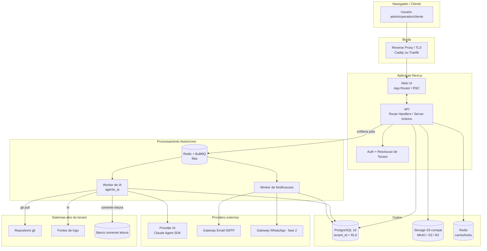

# Arquitetura do Sistema

Este documento define a arquitetura técnica da plataforma **Chamados**: stack recomendada com justificativas, componentes, fluxo de requisição multi-tenant, camada de abstração do provider de IA, ambientes, visão de deploy e observabilidade básica.

Escopo: decisões estruturais e de infraestrutura. Não detalha o schema do banco (ver `02-modelo-de-dados.md`), o pipeline de negócio da triagem (ver `05-agente-ia.md`) nem os adapters de cada gateway de notificação (ver `06-notificacoes.md`). Estratégia de isolamento por tenant e provisionamento em `07-multitenancy-whitelabel.md`; ameaças, uploads e prompt injection em `09-seguranca-lgpd.md`.

---

## 1. Princípios arquiteturais

Derivados dos princípios de produto (formulários mínimos, UX moderna, IA-first, multi-tenant whitelabel):

1. **Multi-tenant desde a fundação.** Todo dado pertence a um `Tenant`. Isolamento no banco por `tenant_id` + Row-Level Security (RLS); nunca confiar apenas na camada de aplicação.
2. **IA como cidadão de primeira classe, mas isolada.** O `agente_ia` roda em worker separado do web app, com acesso a recursos sensíveis (código-fonte, logs, banco somente leitura dos sistemas-alvo). Falha ou lentidão da IA nunca degrada o request síncrono do usuário.
3. **Assíncrono por padrão para trabalho pesado.** Triagem de IA, envio de notificações e `git pull` de repositórios rodam em filas, nunca no ciclo request/response.
4. **Provider de IA plugável.** Uma camada de abstração isola o pipeline do engine concreto (Claude Agent SDK hoje — D-006). Trocar de engine/modelo não deve exigir reescrita do pipeline (RF-17).
5. **Gateways de notificação plugáveis.** Adapter pattern para e-mail, WhatsApp e futuros canais (RF-18).
6. **Simples de operar no início.** Docker Compose single-host no começo; caminho de evolução para orquestração maior sem retrabalho estrutural.

---

## 2. Stack confirmada

> DECIDIDO (2026-07-15): a stack abaixo está **confirmada** (com TypeORM no lugar de Prisma e autenticação própria conforme spec 03 no lugar de better-auth) — ver specs/decisoes.md (D-001, D-010).

| Camada                | Escolha confirmada                            | Papel                                                               |
| --------------------- | --------------------------------------------- | ------------------------------------------------------------------- |
| Monorepo / linguagem  | TypeScript, monorepo (npm workspaces)         | Código compartilhado entre web e worker (tipos, validação, clients) |
| Web full-stack        | Next.js 16 (App Router)                       | UI + API (Route Handlers / Server Actions) numa base só             |
| Banco de dados        | PostgreSQL 16                                 | Persistência transacional; `tenant_id` + RLS                        |
| ORM                   | TypeORM                                       | Acesso ao banco (entities/repositories), migrações                  |
| Fila                  | Redis + BullMQ                                | Jobs de triagem de IA, notificações, manutenção                     |
| Cache / sessão        | Redis                                         | Cache, rate limiting, locks distribuídos                            |
| Storage de anexos     | S3-compatível (MinIO em dev; S3/R2 em prod)   | `Anexo`, imagens inline do rich text                                |
| Editor rich text      | TipTap + sanitização server-side              | Descrição/mensagens; imagens e anexos inline                        |
| Autenticação          | Autenticação própria conforme spec 03 (D-010) | Login, sessão, resolução de tenant por subdomínio/domínio           |
| Engine de IA (fase 1) | Claude Agent SDK, modelo Opus 4.8             | Execução da triagem em worker isolado                               |

### 2.1 Justificativas e alternativas consideradas

**Monorepo TypeScript.** Web app e worker de IA compartilham tipos das entidades canônicas (`Chamado`, `Mensagem`, `ExecucaoIA` etc.), schemas de validação (Zod) e o client do provider de IA. Um monorepo elimina duplicação e drift de contrato.

- Alternativas: repositórios separados (mais isolamento, mais overhead de versionamento de contratos compartilhados); poliglota com worker em Python. Python teria SDKs de IA maduros, porém pagaria custo de duplicar modelos de domínio e validação em duas linguagens. TypeScript ponta a ponta vence pela coesão, dado que o Claude Agent SDK/CLI é acessível a partir de Node.

**Next.js (App Router) full-stack.** Entrega UI moderna (SSR/RSC), API co-localizada e boa DX. Suporta o portal do cliente e o painel operador/admin (`08-ui-ux.md`) na mesma base.

- Alternativas: SPA (React/Vite) + API dedicada (NestJS/Fastify). Dá separação mais limpa entre front e back, ao custo de dois deployables e mais boilerplate. Para a fase inicial, a coesão do Next.js supera. Se a API crescer além do que Route Handlers comportam, extrai-se um serviço dedicado sem trocar o front.

**PostgreSQL 16 + RLS.** RLS aplica isolamento por `tenant_id` no nível do banco, defesa em profundidade além do filtro na aplicação. JSONB para campos flexíveis, full-text search nativo para busca de chamados (`04-chamados.md`).

- Alternativas: MySQL (RLS mais fraco); um banco por tenant (isolamento máximo, custo operacional e de migração alto — inviável para muitos tenants pequenos). Schema-per-tenant é meio-termo, porém complica migrações e pooling; RLS num schema compartilhado é o melhor equilíbrio para whitelabel com muitos tenants.

**TypeORM.** Escolhido (D-001) pelo controle explícito de transação/`queryRunner`, necessário para o isolamento por tenant: RLS exige que cada transação carregue o `tenant_id` corrente via `SET LOCAL app.current_tenant`. Todo acesso a dados passa por um helper `runInTenantContext(tenantId, fn)` que abre uma transação, aplica o `SET LOCAL` e executa as queries dentro dela — nunca um `SET` de sessão, para que a conexão do pool não vaze tenant entre requests (ver §5 e `02-modelo-de-dados.md`). O spike Prisma vs Drizzle foi cancelado.

**Redis + BullMQ.** Filas confiáveis com retries, backoff, agendamento (delayed jobs para o auto-fechamento de `resolvido`) e concorrência controlada. Redis também serve cache e locks.

- Alternativas: pg-boss (fila sobre o próprio Postgres — menos uma dependência, menor throughput/features); serviços gerenciados (SQS). BullMQ é maduro no ecossistema Node e cobre bem os padrões necessários.

**Storage S3-compatível.** Anexos e imagens inline não vão ao banco. MinIO em dev garante paridade com S3/R2 em prod. Uploads via URLs pré-assinadas; varredura e limites em `09-seguranca-lgpd.md`.

**Autenticação própria.** Implementada diretamente conforme spec 03 (D-010), substituindo o better-auth avaliado inicialmente: sem adapter oficial para TypeORM, com modelo de identidade global incompatível com a identidade por-tenant do sistema, e com camada de dados fora de `runInTenantContext` (RLS). Cobre os fluxos necessários (Argon2id, sessões server-side revogáveis por cookie opaco) e a resolução de tenant, além de acomodar a service account do `agente_ia`. Detalhes em `03-autenticacao-perfis-permissoes.md`.

> DECIDIDO (2026-07-15): autenticação implementada diretamente conforme esta spec (Argon2id + sessões server-side); better-auth descartado — ver specs/decisoes.md (D-010).

---

## 3. Componentes



### 3.1 Web app (Next.js)

Serve o portal do cliente e o painel operador/admin. Renderização via RSC; ações mutantes por Server Actions / Route Handlers. Responsável por autenticação, resolução do tenant a partir do host, aplicação de permissões (`03-autenticacao-perfis-permissoes.md`) e enfileiramento de jobs. Não executa trabalho pesado inline.

### 3.2 API

Não é um serviço separado na fase 1 — vive dentro do Next.js. Expõe as operações de `Chamado`, `Mensagem`, `Anexo` etc. e endpoints internos consumidos pelos workers (ex.: worker publica `Mensagem` da IA e grava `ExecucaoIA`). Toda escrita valida entrada (Zod) e respeita RLS.

### 3.3 Worker de IA (`agente_ia`)

Processo Node separado, consumidor da fila de triagem. Executa o pipeline de `05-agente-ia.md`: `git pull` do sistema-alvo, análise com acesso a código/logs/banco somente leitura, classificação de complexidade, publicação de `Mensagem` (publica ou interna) e registro de `ExecucaoIA`. Isolado por rede/permissões (`09-seguranca-lgpd.md`). Nunca compartilha processo com o web app: cargas longas e uso de CPU/IO da IA não podem afetar latência de request.

### 3.4 Worker de notificações

Consumidor da fila de notificações. Resolve `PreferenciaNotificacao` do usuário, renderiza template com branding do tenant e despacha pelo `CanalNotificacao` via o gateway adequado (adapter). Detalhes em `06-notificacoes.md`.

### 3.5 Fila (Redis + BullMQ)

Filas nomeadas por domínio: `triagem-ia`, `notificacoes`, `manutencao` (ex.: job agendado de auto-fechamento de chamados `resolvido` após N dias). Retries com backoff exponencial, dead-letter para inspeção e concorrência configurável por fila (a `triagem-ia` roda com concorrência baixa por ser cara).

### 3.6 Banco de dados (PostgreSQL)

Fonte de verdade de todas as entidades canônicas. Isolamento por `tenant_id` + RLS. Full-text search para busca de chamados. Schema em `02-modelo-de-dados.md`.

### 3.7 Storage de anexos

Guarda `Anexo` e imagens inline do rich text. Acesso por URLs pré-assinadas de curta duração; o banco guarda apenas metadados e chaves de objeto.

### 3.8 Gateways de notificação

Camada de adapters plugáveis. Fase 1: e-mail (SMTP). Fase 2: WhatsApp e outros. Contrato e catálogo em `06-notificacoes.md`.

---

## 4. Camada de abstração do provider de IA

Requisito central (RF-17): trocar o engine/modelo de IA no futuro sem reescrever o pipeline. O pipeline de negócio (`05-agente-ia.md`) fala **apenas** com esta interface; nunca importa o SDK concreto.

### 4.1 Contrato

O contrato do `AIProvider` é definido **canonicamente aqui** (§4.1) — este é o documento da camada de abstração do provider (RF-17). `05-agente-ia.md` §10 **referencia** este contrato e descreve como o pipeline de triagem o consome, sem redefini-lo, para evitar duas versões concorrentes da mesma abstração central. O pipeline de negócio consome sempre `AIProviderResult`, independentemente do engine concreto:

```typescript
interface AIProvider {
  nome: string; // ex.: "claude-agent-sdk"
  modelo: string; // ex.: "opus-4.8"

  executarTriagem(input: AIProviderInput): Promise<AIProviderResult>;
}

interface AIProviderInput {
  // Contexto do chamado — SEM credenciais do sistema-alvo.
  contexto: {
    titulo: string;
    descricao: string; // O PEDIDO do cliente em texto plano (D-014 — omissão era defeito)
    naturezaDeclarada: 'problema' | 'alteracao';
    prioridadeDeclarada: 'baixa' | 'media' | 'alta' | 'urgente' | null;
    solicitante: { nome: string; papel: string };
    timeline: MensagemTimeline[]; // timeline COMPLETA (publica E interna), com `visibilidade` demarcada por item — D-015
    sistemaAlvo: MetadadosSistemaAlvo; // metadados SEM credenciais (nem DSN, nem caminho de repo cru)
    conhecimento?: ConhecimentoSistema; // mapa do sistema (D-013), quando existente
  };

  // Exploração de código NATIVA (D-014): o provider real habilita Read/Grep/Glob do
  // Agent SDK (mesmas ferramentas do Claude Code) com cwd no checkout sincronizado e
  // guarda canUseTool negando qualquer caminho fora dele; Bash/Write/Edit/Web*/Task
  // permanecem desabilitadas. O worker fornece o diretório e o auditor:
  exploracao?: { checkoutDir: string; auditar(ferramenta: string, args: unknown): void };

  // Handles de ferramentas JÁ escopadas, injetados pelo worker (nunca conexões/credenciais cruas).
  // repo_buscar/repo_ler_arquivo permanecem como fallback (provider fake); no provider
  // real a exploração de repo é feita pelas ferramentas nativas acima (D-014).
  ferramentas: {
    repo_buscar(consulta: string): Promise<ResultadoBusca[]>;
    repo_ler_arquivo(caminho: string): Promise<string>;
    logs_consultar(filtro: FiltroLogs): Promise<LinhaLog[]>;
    bd_consultar(sql: string): Promise<Linha[]>; // SELECT-only, com timeout imposto pelo worker

    // Opcionais: só injetadas quando o gate de resolução automática está aberto
    // (05-agente-ia.md §6). Escrevem numa working copy DESCARTÁVEL, nunca no
    // cache persistente nem em produção; ausentes (undefined) fora do gate.
    repo_escrever_arquivo?(caminho: string, conteudo: string): Promise<void>;
    repo_criar_arquivo?(caminho: string, conteudo: string): Promise<void>;
  };

  limites: {
    timeoutMs: number;
    budgetUsd: number;
    maxTurnos: number;
  };
}

interface AIProviderResult {
  compreendido: boolean;
  confianca: number; // 0..1
  perguntasAoCliente: string[] | null;
  respostaAoCliente: string | null; // mensagem publica amigavel opcional (confirmacao/posicao/duvida resolvida); NUNCA detalhe tecnico — validada e rebaixavel pelo worker (D-015, 05-agente-ia.md §5.4)
  complexidade: 'facil' | 'medio' | 'dificil' | null;
  naturezaAjustada: 'problema' | 'alteracao' | null;
  prioridadeSugerida: 'baixa' | 'media' | 'alta' | 'urgente' | null;
  diagnostico: string | null;
  spec: string | null; // preenchido quando naturezaAjustada = 'alteracao'
  tentativaResolucao: {
    resumo: string; // resumo neutro e sanitizado da mudança proposta
    arquivosAlterados: string[]; // caminhos alterados na working copy descartável
    branch?: string; // preenchido pelo WORKER após criar a branch
    prUrl?: string | null; // preenchido pelo WORKER; null fora do GitHub (PR manual)
    situacao?: 'pr_aberto' | 'push_sem_pr' | 'falhou'; // preenchido pelo WORKER
  } | null;
  telemetria: {
    // obrigatória em toda resposta
    custoUsd: number;
    duracaoMs: number;
    tokensEntrada: number;
    tokensSaida: number;
  };
}
```

O worker preenche `AIProviderInput` a partir do chamado e das ferramentas já escopadas (read-only sempre; as de escrita só quando o gate de resolução automática está aberto — `05-agente-ia.md` §6); `05-agente-ia.md` §10 descreve como cada campo de `AIProviderResult` (`perguntasAoCliente`, `respostaAoCliente`, `complexidade`/`naturezaAjustada`/`prioridadeSugerida`, `diagnostico`, `spec`, `tentativaResolucao`) é traduzido em ações de domínio. Nenhuma redefinição do contrato vive em `05` — apenas o consumo.

`tentativaResolucao` divide responsabilidades pelo princípio de menor privilégio (`09-seguranca-lgpd.md` §4): o **provider** só escreve arquivos na working copy descartável via `repo_escrever_arquivo`/`repo_criar_arquivo` e devolve `resumo`/`arquivosAlterados` — ele não tem acesso a git nem à rede. O **worker**, que é quem detém a credencial do repositório, valida a tentativa, cria a branch, comita, faz push e abre o PR; só ele preenche `branch`/`prUrl`/`situacao`, depois do retorno do provider.

Notas de contrato (perspectiva arquitetural):

- **Nunca credenciais cruas no provider.** O worker injeta **handles de ferramentas já escopadas** (`repo_buscar`, `repo_ler_arquivo`, `logs_consultar`, `bd_consultar` SELECT-only com timeout; opcionalmente `repo_escrever_arquivo`/`repo_criar_arquivo` só com o gate de resolução aberto) — jamais o caminho do repositório, a DSN read-only, credencial de git ou qualquer credencial do sistema-alvo no input. A conexão real ao banco, o acesso ao filesystem e o acesso a git/rede vivem **apenas no worker**; assim um provider trocável, bugado ou comprometido não tem conectividade direta ao BD, ao repositório nem à rede, e a mediação do `bd_consultar` (SELECT-only + timeout) e das ferramentas read-only/escrita nunca é contornada (menor privilégio — `05-agente-ia.md` §4.2/§6/§10 e `09-seguranca-lgpd.md` §4.2).
- **O provider decide, o pipeline age.** O provider retorna uma decisão estruturada; a máquina de estados (mudar status para `aguardando_cliente`, publicar `Mensagem`, criar branch/PR, gravar `ExecucaoIA`) é responsabilidade do pipeline. Isso mantém o provider substituível.
- **Telemetria obrigatória** em toda resposta, via `AIProviderResult.telemetria` (`custoUsd`/`duracaoMs`/`tokensEntrada`/`tokensSaida`), alimentando `ExecucaoIA`.
- **Guardrails fora do provider.** O guardrail de "nunca fazer merge/deploy sem aprovação humana" vive no pipeline, não no engine — trocar de engine não pode afetá-lo (`05-agente-ia.md`, `09-seguranca-lgpd.md`).
- **Idempotência.** `executarTriagem` deve ser seguro para retry: efeitos colaterais externos (branch/PR) usam nomes determinísticos por `chamadoId`/tentativa.

### 4.2 Implementação fase 1 e troca de engine

`ClaudeAgentProvider` implementa `AIProvider` usando o Claude Agent SDK com Opus 4.8 (D-006), rodando no worker isolado. Trocar de engine (o "hermes ou algo assim" do RF-17) significa escrever outra classe que implemente `AIProvider` e selecioná-la por configuração:

```typescript
function resolverProvider(cfg: TenantAIConfig): AIProvider {
  switch (cfg.engine) {
    case 'claude-agent-sdk':
      return new ClaudeAgentProvider(cfg);
    // case 'outro-engine': return new OutroProvider(cfg);
    default:
      throw new Error(`engine de IA nao suportado: ${cfg.engine}`);
  }
}
```

> DECISÃO PENDENTE: a seleção de engine/modelo será global, por tenant ou por sistema-alvo? A recomendação é configurável por tenant, com default global.

---

## 5. Fluxo de requisição multi-tenant

Toda requisição é resolvida para um `Tenant` antes de tocar dados. Isolamento em duas camadas: aplicação (filtro/escopo) + banco (RLS).

```mermaid
sequenceDiagram
    participant B as Navegador
    participant RP as Reverse Proxy
    participant MW as Middleware Next.js
    participant H as Handler / Server Action
    participant DB as PostgreSQL (RLS)

    B->>RP: Get_https://acme.chamados.app/chamados
    RP->>MW: encaminha (host preservado)
    MW->>MW: resolve tenant pelo host (subdominio/dominio proprio)
    MW->>MW: valida sessao e papel (admin/operador/cliente)
    alt tenant inexistente ou inativo
        MW-->>B: 404 / pagina de tenant invalido
    else ok
        MW->>H: injeta {tenantId, userId, role}
        H->>DB: BEGIN; SET LOCAL app.current_tenant = tenantId
        H->>DB: query (RLS filtra por app.current_tenant)
        DB-->>H: apenas linhas do tenant
        H-->>B: resposta
    end
```

Pontos-chave:

1. **Resolução do tenant pelo host.** Subdomínio (`acme.chamados.app`) ou domínio próprio (`suporte.acme.com`) → `tenant_id`. Mapa host→tenant em cache (Redis) com TTL curto. Detalhes de provisionamento e domínios em `07-multitenancy-whitelabel.md`.
2. **Contexto propagado.** `{ tenantId, userId, role }` viaja explicitamente até a camada de dados; nada de estado global implícito.
3. **RLS por transação.** Cada transação executa `SET LOCAL app.current_tenant` antes das queries; as políticas RLS restringem as linhas ao tenant. Erro de aplicação que "esqueça" o filtro ainda é barrado pelo banco.
4. **Jobs carregam o tenant.** Todo payload de fila inclui `tenantId`; o worker abre sua transação com o mesmo `SET LOCAL` antes de escrever. O `agente_ia`, apesar de service account, opera sempre escopado a um tenant.

---

## 6. Ambientes e deploy

> DECIDIDO (2026-07-15): **toda a infraestrutura roda em containers** (D-002). Em dev, via `docker-compose`; em produção, em containers orquestrados. Nenhum serviço de infraestrutura (PostgreSQL, Redis, MinIO, proxy, workers) é instalado diretamente na máquina — garante paridade dev/prod e onboarding por `docker compose up -d`. Ver specs/decisoes.md (D-002).

### 6.1 Ambientes

| Ambiente    | Objetivo                       | Infra                                                                                    |
| ----------- | ------------------------------ | ---------------------------------------------------------------------------------------- |
| **dev**     | Desenvolvimento local          | Docker Compose: Postgres, Redis, MinIO, MailHog (SMTP fake); web e worker via hot reload |
| **staging** | Homologação, paridade com prod | Mesma imagem de prod, dados sintéticos, gateways em modo sandbox                         |
| **prod**    | Produção                       | Imagens versionadas, storage S3/R2, SMTP real, backups e monitoramento                   |

Paridade dev↔prod garantida por serviços S3-compatíveis (MinIO/S3) e mesmas imagens Docker.

### 6.2 Visão de deploy (início: Docker Compose)

Fase 1 em host único com Docker Compose. Serviços:

- `web` — Next.js (UI + API)
- `worker-ia` — worker do `agente_ia`
- `worker-notif` — worker de notificações
- `postgres` — PostgreSQL 16
- `redis` — fila + cache
- `minio` — storage (dev/staging; prod usa S3/R2 gerenciado)
- `proxy` — reverse proxy/TLS (Caddy ou Traefik), roteando por host e resolvendo wildcard de subdomínios

Separar `web`, `worker-ia` e `worker-notif` em serviços distintos desde o início (mesma imagem, comando diferente) permite escalar e isolar a IA sem refatorar. Migrações TypeORM rodam como passo de release antes de subir o `web`.

> DECISÃO PENDENTE: orquestração além do single-host (Kubernetes, Nomad, ou PaaS gerenciado) fica para quando a carga justificar. A separação em serviços já prepara o caminho; a decisão de plataforma é adiada.

> DECISÃO PENDENTE: Caddy vs Traefik para o reverse proxy — Caddy simplifica TLS automático (incl. certificados de domínios próprios de tenant); Traefik tem roteamento dinâmico mais rico. Impacta o fluxo de domínio próprio em `07-multitenancy-whitelabel.md`.

Roadmap de fases e escopo de MVP em `10-roadmap-mvp.md`.

---

## 7. Observabilidade básica

Mínimo para operar e depurar a fase 1; ampliado conforme o roadmap.

**Logs estruturados (JSON).** Biblioteca única (ex.: pino) em web e workers. Todo log carrega `tenantId`, `requestId`/`jobId` e, quando aplicável, `chamadoId`. Correlação request→job→ação da IA pelo `requestId`/`jobId`. Nunca logar segredos dos sistemas-alvo (credenciais git, URL do banco somente leitura) nem conteúdo sensível de chamados — ver `09-seguranca-lgpd.md`.

**Health checks.**

- `GET /health/live` — o processo está de pé (liveness).
- `GET /health/ready` — dependências acessíveis: Postgres, Redis, storage (readiness). O proxy só roteia para instâncias `ready`.
- Workers expõem heartbeat/health próprio (BullMQ + endpoint leve) para o orquestrador detectar travamento.

**Métricas de fila.** Tamanho das filas, taxa de falha, duração de jobs — especialmente `triagem-ia`, por ser cara. `ExecucaoIA` já persiste custo/duração por execução, servindo de base para análise de custo de IA por tenant.

**Erros.** Captura centralizada de exceções (ex.: Sentry) com escopo por tenant. Alertas para falhas repetidas no worker de IA e no gateway de notificações.

> DECISÃO PENDENTE: stack de métricas/traços (Prometheus+Grafana vs OpenTelemetry para um backend gerenciado) fica para além da fase 1; logs estruturados + health checks + métricas de fila são o piso obrigatório.

---

## 8. Resumo das dependências entre documentos

| Tema                                                                  | Documento responsável                  |
| --------------------------------------------------------------------- | -------------------------------------- |
| Schema, entidades, enums no BD, RLS detalhada                         | `02-modelo-de-dados.md`                |
| Auth, resolução de tenant, permissões, service account do `agente_ia` | `03-autenticacao-perfis-permissoes.md` |
| Ciclo de vida do chamado, rich text, anexos, busca                    | `04-chamados.md`                       |
| Pipeline de negócio da IA, guardrails, geração de SPEC                | `05-agente-ia.md`                      |
| Adapters de e-mail/WhatsApp, templates, preferências                  | `06-notificacoes.md`                   |
| Provisionamento, branding, domínios, sistemas-alvo                    | `07-multitenancy-whitelabel.md`        |
| Telas e fluxos                                                        | `08-ui-ux.md`                          |
| Ameaças, uploads, XSS, prompt injection, LGPD                         | `09-seguranca-lgpd.md`                 |
| Fases de entrega e escopo do MVP                                      | `10-roadmap-mvp.md`                    |
