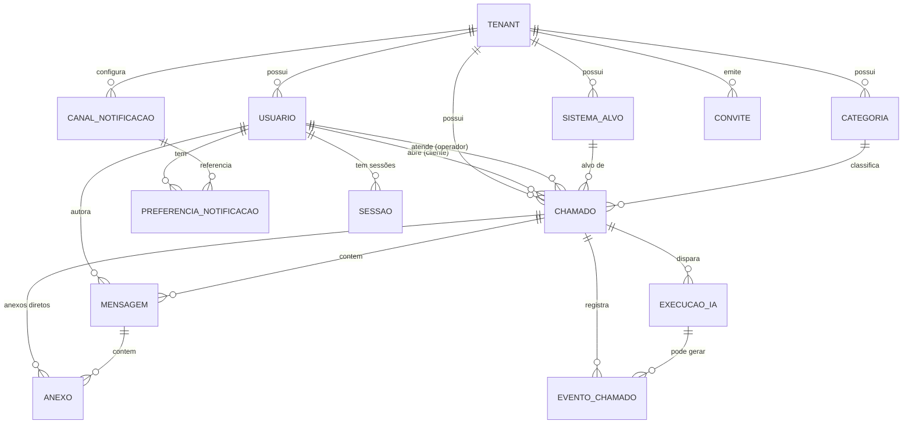

# Modelo de Dados

Este documento define as entidades canônicas da plataforma, seus campos, tipos, constraints e relações; os enums como tabelas de referência; a estratégia multi-tenant no banco (tenant_id em tudo + Row-Level Security); a numeração de chamados por tenant; os índices principais; o armazenamento de rich text; e as políticas de soft delete e retenção.

Regras de transição de status ficam em `04-chamados.md`; a matriz de permissões e o agente_ia como service account ficam em `03-autenticacao-perfis-permissoes.md`; detalhes de branding, provisionamento e sistemas-alvo ficam em `07-multitenancy-whitelabel.md`; a modelagem operacional da fila e do worker de IA fica em `05-agente-ia.md`.

> DECIDIDO (2026-07-15): a stack está confirmada (PostgreSQL 16 + Row-Level Security + TypeORM). Todo este documento assume PostgreSQL 16 com RLS e TypeORM — ver specs/decisoes.md (D-001).

## Convenções gerais

- **PKs**: UUID v7 (ordenável por tempo, bom para índice) em todas as tabelas, exceto tabelas de referência de enum. Coluna `id`.
- **tenant_id**: presente em TODA tabela de negócio (ver estratégia multi-tenant). Tipo UUID, FK para `tenant.id`, `NOT NULL`.
- **Timestamps**: `created_at` e `updated_at` (`timestamptz`, default `now()`), mantidos por trigger/ORM. Fuso sempre UTC.
- **Soft delete**: `deleted_at timestamptz NULL` nas entidades que exigem retenção/auditoria (ver seção Soft delete).
- **Nomes**: tabelas e colunas em `snake_case`; enums em `snake_case` com os valores canônicos do brief.
- **Dinheiro/custo**: `numeric(12,6)` para custos de IA (em USD); nunca float.
- **Texto livre curto**: `text` (sem limites artificiais de `varchar(n)`), com `CHECK` de tamanho onde fizer sentido.

## Enums (tabelas de referência)

Os enums abaixo usam EXATAMENTE os valores do brief canônico. Implementação recomendada: tipo `ENUM` nativo do PostgreSQL (validação no BD + performance). Onde houver necessidade de rótulos por tenant/idioma, usa-se tabela de tradução na camada de aplicação, não no BD.

> DECISÃO PENDENTE: ENUM nativo do PostgreSQL vs tabela de referência com FK. ENUM nativo é mais rígido (ALTER TYPE para novos valores); tabela de lookup é mais flexível. Recomendação: ENUM nativo para os enums fechados abaixo (mudam pouco).

### status_chamado
| valor | descrição |
|---|---|
| `novo` | recém-criado, ainda não entrou na triagem |
| `em_triagem` | job de IA na fila ou em execução |
| `aguardando_cliente` | IA/operador pediu informações; aguarda resposta do cliente |
| `em_atendimento` | em tratativa por operador e/ou IA |
| `resolvido` | solução entregue; fecha automaticamente após N dias (config. por tenant) |
| `fechado` | terminal; não reabre |
| `cancelado` | encerrado sem resolução |

### natureza
| valor | descrição |
|---|---|
| `problema` | defeito/incidente no sistema-alvo |
| `alteracao` | pedido de mudança/evolução |

### prioridade
| valor |
|---|
| `baixa` |
| `media` |
| `alta` |
| `urgente` |

### complexidade
Avaliação interna, visível só para operador/admin/agente_ia.
| valor |
|---|
| `facil` |
| `medio` |
| `dificil` |

### visibilidade_mensagem
| valor | descrição |
|---|---|
| `publica` | visível ao cliente na timeline |
| `interna` | nota interna; só operador/admin/agente_ia |

### papel (role do usuário)
| valor | descrição |
|---|---|
| `admin` | administra o tenant |
| `operador` | atende chamados |
| `cliente` | usuário final que abre chamados |
| `agente_ia` | usuário de serviço (automação); ver `03-autenticacao-perfis-permissoes.md` |

### tipo_evento (EventoChamado)
Taxonomia canônica única de eventos de auditoria. Esta lista é a **fonte da verdade** e deve ser replicada IDÊNTICA em `04-chamados.md` (§9) e no glossário de `00-visao-geral.md`. Decisões consolidadas: (a) eventos de IA são **granulares** (`ia_*`) — não existe um `acao_ia` genérico; (b) atribuição usa o par `operador_atribuido`/`operador_desatribuido`; (c) mudança de natureza/complexidade usa o sufixo `_alterada` (coerente com `prioridade_alterada`); (d) `status_alterado` cobre transições genéricas de status, mas as transições notáveis do ciclo de vida têm evento próprio (`chamado_reaberto`, `chamado_resolvido`, `chamado_fechado`, `chamado_fechado_auto`, `chamado_cancelado`) e NÃO emitem também `status_alterado` (sem duplicidade).

Valores canônicos:
- `chamado_criado`
- `status_alterado` — transições genéricas (payload `{de, para}`); não usado para as transições com evento dedicado abaixo
- `prioridade_alterada`
- `natureza_alterada`
- `complexidade_alterada`
- `operador_atribuido`
- `operador_desatribuido`
- `mensagem_publicada`
- `nota_interna_publicada`
- `anexo_adicionado`
- `chamado_reaberto`
- `chamado_resolvido`
- `chamado_fechado` — fechamento manual/terminal
- `chamado_fechado_auto` — fechado pelo job após `dias_fechamento_automatico`
- `chamado_cancelado`
- `ia_iniciou`
- `ia_pediu_info`
- `ia_diagnosticou`
- `ia_abriu_pr`
- `ia_gerou_spec`
- `ia_falhou`

> DECISÃO (resolvida): `04-chamados.md` §9 usava nomes divergentes (`natureza_ajustada`, `complexidade_definida`, `operador_atribuido/desatribuido`, `chamado_resolvido/fechado/cancelado`, `acao_ia`). Fica valendo a lista acima; 04 e 00 devem ser corrigidos para estes valores.

### canal_notificacao (tipo de canal)
Fase 1: `email`. Fase 2+: `whatsapp`, `sms`, `webhook`. Ver `06-notificacoes.md`.

### status_tenant
Governa o acesso ao tenant (ver `07-multitenancy-whitelabel.md` §1.1).
| valor | descrição |
|---|---|
| `em_provisionamento` | criado; apenas o admin acessa até concluir setup |
| `ativo` | operação normal |
| `suspenso` | acesso bloqueado (login negado) |
| `cancelado` | encerrado; terminal |

### status_usuario (status do vínculo usuário↔tenant)
Alinhado a `03-autenticacao-perfis-permissoes.md` §5. No modelo por-tenant (ver Usuario), o vínculo é a própria linha de `usuario`.
| valor | descrição |
|---|---|
| `pendente` | convidado, ainda não aceitou/ativou |
| `ativo` | acesso normal |
| `suspenso` | temporariamente bloqueado |
| `removido` | desligado do tenant (soft) |

### status_convite
Ciclo de vida de um convite (ver `03-autenticacao-perfis-permissoes.md` §4.2).
| valor | descrição |
|---|---|
| `pendente` | emitido, aguardando aceite dentro do TTL |
| `aceito` | consumido; usuário ativado |
| `expirado` | TTL vencido sem aceite |
| `revogado` | cancelado pelo admin |

### status_execucao_ia
Nomes canônicos únicos; `05-agente-ia.md` deve usar EXATAMENTE estes (não `running`/`falha`). `timeout` e `budget_excedido` são estados terminais próprios, distintos de `falhou` (falha genérica), para telemetria e guardrails.
| valor | descrição |
|---|---|
| `na_fila` | enfileirado |
| `executando` | worker em execução (equivale ao `running` de `05`) |
| `concluido` | terminou com resultado |
| `falhou` | erro genérico de execução |
| `timeout` | excedeu o tempo-limite |
| `budget_excedido` | excedeu o orçamento de custo/tokens |
| `cancelado` | abortado |

## Diagrama ER



## Entidades

### Tenant
Empresa/instância whitelabel. Raiz do isolamento. Detalhes de branding/domínios em `07-multitenancy-whitelabel.md`.

| campo | tipo | constraints | notas |
|---|---|---|---|
| id | uuid | PK | |
| nome | text | NOT NULL | razão/identificação interna |
| nome_exibicao | text | NOT NULL | nome público exibido em UI e e-mails (`07`/`06` referenciam este campo); `nome` permanece como identificação interna/razão social |
| slug | text | NOT NULL, UNIQUE | subdomínio base |
| dominio_proprio | text | UNIQUE NULL | domínio custom (nome canônico deste conceito; `03`/`07` referenciam este campo) |
| status | status_tenant (enum) | NOT NULL default 'em_provisionamento' | governa acesso: `suspenso` bloqueia login, `em_provisionamento` libera só o admin (ver `07-multitenancy-whitelabel.md`) |
| dias_fechamento_automatico | int | NOT NULL default 3 | resolvido → fechado após N dias (mesmo nome/valor em `04-chamados.md` e `07-multitenancy-whitelabel.md`) |
| ia_resolucao_automatica_habilitada | bool | NOT NULL default true | guardrail relaxável (ver `05-agente-ia.md` §6 e `07` §4.1) |
| config_branding | jsonb | NOT NULL default '{}' | cores, logo (ref) |
| created_at / updated_at / deleted_at | timestamptz | | |

`slug` e `dominio_proprio` são globais (sem tenant_id — é a própria raiz).

### Usuario
Pessoas e o service account de IA. **Modelo canônico: por-tenant** — cada usuário pertence a um único tenant (`tenant_id NOT NULL`), com `papel` e `status` na própria linha; o vínculo usuário↔tenant É a linha de `usuario`. Regras de comportamento de auth (login, sessões, convites, reset) em `03-autenticacao-perfis-permissoes.md`; as **estruturas de dados** de auth (esta tabela + `Sessao` + `Convite`) vivem aqui.

> DECISÃO (resolvida — estrutural): adotado o modelo **por-tenant** de `02`/`07` (um Usuario pertence a um único tenant; sem conta global compartilhada). `03-autenticacao-perfis-permissoes.md` §1 e §5 descreviam identidade global + N vínculos (mesmo e-mail cliente no tenant A e operador no B) — essa narrativa deve ser corrigida em 03. Mesmo e-mail em tenants diferentes = linhas independentes (a unicidade é por tenant).

| campo | tipo | constraints | notas |
|---|---|---|---|
| id | uuid | PK | |
| tenant_id | uuid | FK, NOT NULL | |
| email | text | NOT NULL | único por tenant |
| nome | text | NOT NULL | |
| papel | papel (enum) | NOT NULL | admin/operador/cliente/agente_ia |
| senha_hash | text | NULL | Argon2id; NULL para `agente_ia` e convites ainda não aceitos |
| credencial_servico_ref | text | NULL | só `agente_ia`: ponteiro p/ segredo em cofre, escopado ao tenant, rotacionável (ciclo de vida em `09-seguranca-lgpd.md`) |
| status | status_usuario (enum) | NOT NULL default 'ativo' | pendente/ativo/suspenso/removido (vínculo; ver `03` §5) |
| avatar_url | text | NULL | |
| ultimo_acesso_em | timestamptz | NULL | |
| created_at / updated_at / deleted_at | timestamptz | | |

- UNIQUE `(tenant_id, email)`.
- CHECK: no máximo um usuário com `papel = agente_ia` por tenant (parcial unique index).
- CHECK: `agente_ia` tem `senha_hash IS NULL` (autentica só por `credencial_servico_ref`); usuários humanos ativos têm `senha_hash IS NOT NULL` OU um convite pendente associado.

### Sessao
Sessões server-side (revogáveis) que suportam o cookie opaco de `03-autenticacao-perfis-permissoes.md` §4.4. O cookie carrega só um identificador opaco; o estado vive aqui.

| campo | tipo | constraints | notas |
|---|---|---|---|
| id | uuid | PK | |
| tenant_id | uuid | FK, NOT NULL | |
| usuario_id | uuid | FK, NOT NULL | |
| token_hash | text | NOT NULL, UNIQUE | hash do token opaco do cookie (nunca o token em claro) |
| expira_idle_em | timestamptz | NOT NULL | expiração por inatividade (renovada a cada uso) |
| expira_absoluta_em | timestamptz | NOT NULL | teto absoluto da sessão |
| revogada_em | timestamptz | NULL | preenchido em logout/revogação server-side |
| user_agent | text | NULL | |
| ip | inet | NULL | |
| created_at | timestamptz | NOT NULL | |

- Índice `(tenant_id, usuario_id)` para listar/revogar sessões de um usuário; `token_hash` UNIQUE para lookup no request.
- Append-only quanto a auditoria de acesso: revogação usa `revogada_em`, não delete físico; expurgo por retenção.

### Convite
Convites de acesso emitidos por admin (ver `03-autenticacao-perfis-permissoes.md` §4.2). Um convite aceito materializa uma linha de `usuario` com o `papel` convidado.

| campo | tipo | constraints | notas |
|---|---|---|---|
| id | uuid | PK | |
| tenant_id | uuid | FK, NOT NULL | |
| email | text | NOT NULL | destinatário |
| papel | papel (enum) | NOT NULL | papel a conceder no aceite |
| token_hash | text | NOT NULL, UNIQUE | hash do token único enviado por e-mail (TTL) |
| expira_em | timestamptz | NOT NULL | TTL do convite |
| status | status_convite (enum) | NOT NULL default 'pendente' | pendente/aceito/expirado/revogado |
| criado_por | uuid | FK NULL | admin emissor |
| aceito_em | timestamptz | NULL | |
| created_at / updated_at | timestamptz | | |

- UNIQUE parcial `(tenant_id, email)` WHERE `status='pendente'` (um convite pendente por e-mail por tenant); `token_hash` UNIQUE global.

### SistemaAlvo
Sistema de software do tenant sobre o qual os chamados são abertos. Guarda repositório git, fontes de logs e conexão somente-leitura ao BD do sistema. Credenciais NUNCA em texto puro — ver `09-seguranca-lgpd.md`. **Esta modelagem é canônica e deve espelhar `07-multitenancy-whitelabel.md` §5.1** (conexão de BD em campos separados; `descricao`, `logs_tipo`, `logs_credencial_ref` presentes nos dois docs).

| campo | tipo | constraints | notas |
|---|---|---|---|
| id | uuid | PK | |
| tenant_id | uuid | FK, NOT NULL | |
| nome | text | NOT NULL | |
| descricao | text | NULL | descrição livre do sistema |
| git_repo_url | text | NOT NULL | |
| git_credencial_ref | text | NULL | ponteiro para secret manager |
| git_branch_padrao | text | NOT NULL default 'main' | |
| logs_tipo | text | NULL | tipo/fonte de logs (ex.: 'arquivo', 'cloudwatch', 'loki') |
| logs_config | jsonb | NOT NULL default '{}' | caminhos/parâmetros de logs |
| logs_credencial_ref | text | NULL | ponteiro p/ credencial de acesso aos logs |
| bd_tipo | text | NULL | SGBD (ex.: 'postgres', 'mysql') |
| bd_host | text | NULL | host do BD do sistema-alvo |
| bd_porta | int | NULL | porta |
| bd_nome | text | NULL | nome do banco |
| bd_credencial_ref | text | NULL | ponteiro p/ credencial read-only (usuário/senha em cofre) |
| ativo | bool | NOT NULL default true | |
| created_at / updated_at / deleted_at | timestamptz | | |

- UNIQUE `(tenant_id, nome)`.
- Conexão de BD modelada em **campos separados** (`bd_tipo`/`bd_host`/`bd_porta`/`bd_nome` + `bd_credencial_ref`), NÃO como DSN único — mesma representação de `07` §5.1. A conexão é sempre somente-leitura.
- Nenhum secret (token git, senha do BD, credencial de logs) é persistido em claro: apenas referências (`*_ref`) a um cofre de segredos. Ver `09-seguranca-lgpd.md`.

### Categoria
Classificação do tenant. Um chamado referencia um sistema-alvo OU a categoria geral do tenant.

| campo | tipo | constraints |
|---|---|---|
| id | uuid | PK |
| tenant_id | uuid | FK, NOT NULL |
| nome | text | NOT NULL |
| descricao | text | NULL |
| ativo | bool | NOT NULL default true |
| created_at / updated_at / deleted_at | timestamptz | |

- UNIQUE `(tenant_id, nome)`.

### Chamado
Entidade central.

| campo | tipo | constraints | notas |
|---|---|---|---|
| id | uuid | PK | |
| tenant_id | uuid | FK, NOT NULL | |
| numero | bigint | NOT NULL | sequencial por tenant (ver Numeração) |
| sistema_alvo_id | uuid | FK NULL | obrigatório se tenant tem >1 sistema |
| categoria_id | uuid | FK NULL | usado quando não há sistema-alvo |
| cliente_id | uuid | FK, NOT NULL | autor (papel cliente) |
| operador_id | uuid | FK NULL | atribuído |
| titulo | text | NOT NULL | CHECK length 3..160 (mesmo limite da tabela de limites em `04-chamados.md` §5) |
| descricao_json | jsonb | NOT NULL | documento do editor (ver Rich text) |
| descricao_html | text | NOT NULL | HTML sanitizado (ver Rich text) |
| status | status_chamado | NOT NULL default 'novo' | |
| natureza | natureza | NOT NULL | problema/alteracao |
| prioridade | prioridade | NOT NULL default 'media' | cliente pode sugerir |
| complexidade | complexidade | NULL | interna; definida pela IA/operador |
| resolvido_em | timestamptz | NULL | marca início da janela de auto-fechamento |
| fechar_automaticamente_em | timestamptz | NULL | resolvido_em + dias_fechamento_automatico |
| fechado_em | timestamptz | NULL | terminal |
| reaberto_count | int | NOT NULL default 0 | |
| created_at / updated_at / deleted_at | timestamptz | | |

- UNIQUE `(tenant_id, numero)`.
- CHECK: `sistema_alvo_id IS NOT NULL OR categoria_id IS NOT NULL` (todo chamado referencia um dos dois).
- Regras de quando cada `status` pode mudar: `04-chamados.md`.

### Mensagem
Itens da timeline. Notas internas usam `visibilidade = interna`.

| campo | tipo | constraints | notas |
|---|---|---|---|
| id | uuid | PK | |
| tenant_id | uuid | FK, NOT NULL | |
| chamado_id | uuid | FK, NOT NULL | |
| autor_id | uuid | FK, NOT NULL | pode ser o agente_ia |
| visibilidade | visibilidade_mensagem | NOT NULL default 'publica' | |
| corpo_json | jsonb | NOT NULL | documento do editor |
| corpo_html | text | NOT NULL | HTML sanitizado |
| execucao_ia_id | uuid | FK NULL | se gerada por execução de IA |
| created_at / updated_at / deleted_at | timestamptz | | |

- Índice `(tenant_id, chamado_id, created_at)` para render da timeline.
- Mensagens `interna` NUNCA são retornadas em queries do portal do cliente (filtro na camada de dados + RLS/policy de app).

### Anexo
Arquivos: anexados diretos ao chamado ou embutidos/anexados a uma mensagem (imagens inline do rich text também referenciam Anexo).

| campo | tipo | constraints | notas |
|---|---|---|---|
| id | uuid | PK | |
| tenant_id | uuid | FK, NOT NULL | |
| chamado_id | uuid | FK NULL | |
| mensagem_id | uuid | FK NULL | |
| nome_arquivo | text | NOT NULL | nome original |
| content_type | text | NOT NULL | MIME validado no upload |
| tamanho_bytes | bigint | NOT NULL | |
| storage_key | text | NOT NULL | chave no bucket S3-compat |
| checksum_sha256 | text | NULL | dedupe/integridade |
| inline | bool | NOT NULL default false | true = imagem embutida no rich text |
| created_at / deleted_at | timestamptz | | |

- CHECK: `chamado_id IS NOT NULL OR mensagem_id IS NOT NULL`.
- Objeto físico no storage; a linha guarda só metadados + `storage_key`. Regras de upload/validação em `09-seguranca-lgpd.md`.

### EventoChamado
Auditoria/histórico imutável. Todo evento relevante gera uma linha (append-only).

| campo | tipo | constraints | notas |
|---|---|---|---|
| id | uuid | PK | |
| tenant_id | uuid | FK, NOT NULL | |
| chamado_id | uuid | FK, NOT NULL | |
| tipo | tipo_evento (enum) | NOT NULL | |
| ator_id | uuid | FK NULL | usuário/agente_ia; NULL = sistema |
| execucao_ia_id | uuid | FK NULL | |
| dados | jsonb | NOT NULL default '{}' | payload (ex.: {de, para}) |
| created_at | timestamptz | NOT NULL | |

- Sem `updated_at`/`deleted_at`: append-only. Não sofre soft delete; retido conforme política.
- Índice `(tenant_id, chamado_id, created_at)`.

### ExecucaoIA
Registro de cada execução do pipeline do agente_ia. Detalhes de comportamento em `05-agente-ia.md`.

| campo | tipo | constraints | notas |
|---|---|---|---|
| id | uuid | PK | |
| tenant_id | uuid | FK, NOT NULL | |
| chamado_id | uuid | FK, NOT NULL | |
| status | status_execucao_ia | NOT NULL default 'na_fila' | |
| provider | text | NOT NULL | ex.: 'claude-code' (abstração de provider) |
| modelo | text | NOT NULL | ex.: 'opus-4.8' |
| gatilho | text | NOT NULL | ex.: 'chamado_criado', 'resposta_cliente' |
| entrada | jsonb | NOT NULL default '{}' | snapshot do input |
| acoes | jsonb | NOT NULL default '[]' | trilha de ações (git pull, PR, etc.) |
| resultado | jsonb | NULL | diagnóstico/PR/spec |
| custo_usd | numeric(12,6) | NULL | |
| tokens_entrada | int | NULL | |
| tokens_saida | int | NULL | |
| duracao_ms | int | NULL | |
| erro | text | NULL | quando `falhou` |
| iniciado_em | timestamptz | NULL | |
| finalizado_em | timestamptz | NULL | |
| created_at | timestamptz | NOT NULL | |

- Índice `(tenant_id, chamado_id, created_at)`.

### CanalNotificacao
Configuração de um canal/gateway plugável por tenant (adapter pattern). Detalhe em `06-notificacoes.md`.

| campo | tipo | constraints | notas |
|---|---|---|---|
| id | uuid | PK | |
| tenant_id | uuid | FK, NOT NULL | |
| tipo | canal_notificacao (enum) | NOT NULL | email/whatsapp/... |
| config | jsonb | NOT NULL default '{}' | SMTP host, remetente etc. (segredos por ref) |
| ativo | bool | NOT NULL default true | |
| created_at / updated_at / deleted_at | timestamptz | | |

- UNIQUE `(tenant_id, tipo)` (um canal por tipo por tenant na fase 1).

### PreferenciaNotificacao
Preferências por usuário e evento.

| campo | tipo | constraints | notas |
|---|---|---|---|
| id | uuid | PK | |
| tenant_id | uuid | FK, NOT NULL | |
| usuario_id | uuid | FK, NOT NULL | |
| evento | text | NOT NULL | ex.: 'nova_mensagem_publica', 'mudanca_status' |
| canal_id | uuid | FK, NOT NULL | referencia CanalNotificacao |
| habilitado | bool | NOT NULL default true | |
| created_at / updated_at | timestamptz | | |

- UNIQUE `(tenant_id, usuario_id, evento, canal_id)`.

## Estratégia multi-tenant no banco

Isolamento por **`tenant_id` em toda tabela de negócio + Row-Level Security (RLS) do PostgreSQL** como defesa em profundidade (mesmo que a aplicação erre um filtro, o BD bloqueia).

**Nome canônico da variável de sessão do RLS: `app.current_tenant`.** Este é o ÚNICO nome usado pelas policies e pela aplicação; `01-arquitetura.md` e `09-seguranca-lgpd.md` usam exatamente este mesmo nome. Se a aplicação setar um nome e a policy ler outro, `current_setting` retorna vazio e o isolamento falha.

**Regra normativa (evita vazamento cross-tenant no pool):** toda requisição/job abre uma **transação explícita** e define o tenant corrente com escopo **local à transação** ANTES de qualquer query — `SET LOCAL` ou `set_config('app.current_tenant', $1, true)` (o 3º argumento `true` = local). **É PROIBIDO** `SET`/`set_config(..., false)` em nível de sessão: num pool (TypeORM/PgBouncer) um SET de sessão persiste na conexão e a próxima requisição que a reutilize herda o tenant anterior, fazendo a RLS liberar linhas do tenant errado. Nenhuma query que dependa de contexto de tenant pode rodar fora de transação. Com TypeORM, esse contrato é encapsulado no helper `runInTenantContext(tenantId, fn)` (detalhado abaixo); todo acesso a dados passa por ele. Como guarda de pool, o checkout deve garantir contexto limpo (`RESET ALL`/`DISCARD` na devolução da conexão, ou verificação de que não há query com tenant fora de transação).

- Resolução do tenant por subdomínio/domínio ocorre a cada request (ver `07-multitenancy-whitelabel.md`); o UUID resolvido é injetado via `SET LOCAL` no início da transação.
- Cada tabela com `tenant_id` habilita RLS e define policy:

```sql
ALTER TABLE chamado ENABLE ROW LEVEL SECURITY;
ALTER TABLE chamado FORCE ROW LEVEL SECURITY;

CREATE POLICY tenant_isolation ON chamado
  USING (tenant_id = current_setting('app.current_tenant')::uuid)
  WITH CHECK (tenant_id = current_setting('app.current_tenant')::uuid);
```

Uso correto por request (transacional, escopo local):

```sql
BEGIN;
  SELECT set_config('app.current_tenant', '<uuid-do-tenant>', true); -- true = SET LOCAL
  -- ... queries do request, todas sob RLS do tenant corrente ...
COMMIT;
```

- A aplicação conecta com um **role sem BYPASSRLS**. Migrações/tarefas administrativas usam um role separado com bypass, jamais o role de request.
- `USING` filtra leituras; `WITH CHECK` impede inserir/atualizar linha de outro tenant.

> DECISÃO PENDENTE: modelo de deploy do banco — schema único compartilhado com RLS (recomendado, mais simples de operar) vs schema-per-tenant. A recomendação é schema único + RLS; schema-per-tenant só se surgir requisito forte de isolamento físico.

> DECIDIDO (2026-07-15): com TypeORM (D-001), o `SET LOCAL app.current_tenant` é injetado pelo helper `runInTenantContext(tenantId, fn)`: ele obtém um `queryRunner`, abre uma transação, executa `SELECT set_config('app.current_tenant', $1, true)` (3º argumento `true` = local à transação) e roda `fn` — com todas as queries/repositories do request — dentro dessa transação. Todo acesso a dados passa por esse helper; é **proibido** `SET`/`set_config(..., false)` de sessão, honrando a regra normativa acima (sempre local à transação, nunca de sessão, para que a conexão do pool não vaze tenant entre requests). Ver specs/decisoes.md (D-001).

## Numeração de chamados por tenant

Cada chamado tem `numero` sequencial e legível **por tenant** (ex.: #1, #2, ...), independente do UUID interno. Requisitos: sem buracos previsíveis exploráveis entre tenants, sem colisão sob concorrência.

- Recomendação: tabela `tenant_contador` com `(tenant_id, proximo_numero)` e incremento atômico dentro da transação de criação do chamado:

```sql
UPDATE tenant_contador
   SET proximo_numero = proximo_numero + 1
 WHERE tenant_id = $1
RETURNING proximo_numero - 1 AS numero;
```

- Alternativa: uma sequence do PostgreSQL por tenant (criada no provisionamento). Mais rápida, porém gera muitos objetos e pode deixar buracos em rollback.
- UNIQUE `(tenant_id, numero)` garante integridade em qualquer estratégia.

> DECISÃO PENDENTE: tabela de contador (transacional, sem buracos, um lock por tenant) vs sequence por tenant (rápida, com buracos). Recomendação: tabela de contador pela legibilidade e ausência de buracos.

## Armazenamento de rich text

Descrições e mensagens são rich text (TipTap recomendado). Guardamos **duas representações**:

- **`*_json` (jsonb)**: documento nativo do editor (ProseMirror/TipTap). Fonte da verdade para reedição; preserva estrutura exata.
- **`*_html` (text)**: HTML **sanitizado no servidor** para render seguro. Nunca renderizar HTML vindo do cliente sem sanitização. Regras/allowlist de sanitização em `09-seguranca-lgpd.md`.

- Imagens/anexos inline referenciam linhas de `Anexo` (`inline = true`); o JSON guarda o `anexo_id`/`storage_key`, não o binário. URLs de exibição são geradas sob demanda (assinadas), não persistidas no corpo.
- Busca full-text opera sobre uma projeção textual (`tsvector`) derivada do HTML/JSON — ver `04-chamados.md` para a estratégia de busca.

> DECISÃO PENDENTE: extrair texto puro para uma coluna `tsvector` gerada (índice GIN) vs busca externa. Recomendação inicial: `tsvector` no PostgreSQL (`portuguese`), suficiente para o MVP.

## Índices principais

| tabela | índice | finalidade |
|---|---|---|
| usuario | UNIQUE `(tenant_id, email)` | login/unicidade |
| usuario | parcial UNIQUE `(tenant_id)` WHERE `papel='agente_ia'` | um agente_ia por tenant |
| sessao | UNIQUE `(token_hash)` | lookup de sessão por request |
| sessao | `(tenant_id, usuario_id)` | listar/revogar sessões do usuário |
| convite | UNIQUE `(token_hash)` | validação do token de convite |
| convite | parcial UNIQUE `(tenant_id, email)` WHERE `status='pendente'` | um convite pendente por e-mail |
| chamado | UNIQUE `(tenant_id, numero)` | numeração legível |
| chamado | `(tenant_id, status, updated_at DESC)` | listagem/filtragem do painel |
| chamado | `(tenant_id, cliente_id, created_at DESC)` | portal do cliente |
| chamado | `(tenant_id, operador_id, status)` | fila do operador |
| chamado | `(tenant_id, fechar_automaticamente_em)` WHERE `status='resolvido'` | job de auto-fechamento |
| mensagem | `(tenant_id, chamado_id, created_at)` | timeline |
| evento_chamado | `(tenant_id, chamado_id, created_at)` | histórico |
| execucao_ia | `(tenant_id, chamado_id, created_at)` | trilha de IA |
| anexo | `(tenant_id, chamado_id)` / `(tenant_id, mensagem_id)` | listar anexos |
| chamado | GIN sobre `tsvector` do conteúdo | busca full-text |

Todos os índices de negócio começam por `tenant_id` (alinhado ao filtro de RLS e à seletividade por tenant).

## Soft delete e retenção

- **Soft delete** (`deleted_at`) aplica-se a: `tenant`, `usuario`, `sistema_alvo`, `categoria`, `chamado`, `mensagem`, `anexo`, `canal_notificacao`. Queries de aplicação filtram `deleted_at IS NULL` por padrão.
- **Append-only (nunca soft-deletados)**: `evento_chamado` e `execucao_ia` — são trilha de auditoria e devem permanecer íntegros; expurgo só por política de retenção explícita.
- **Sessao/Convite**: não usam `deleted_at`. `sessao` é revogada via `revogada_em` e expurgada por retenção após expirar; `convite` transita de status (`revogado`/`expirado`) e é expurgado por retenção. Ambos guardam apenas `token_hash`, nunca o token em claro.
- **Anexos**: soft delete marca a linha; o objeto físico no storage é removido por um job de GC após período de carência, respeitando checksum/dedupe.
- **Cliente reabrindo chamado resolvido**: não deleta nada; incrementa `reaberto_count`, limpa `resolvido_em`/`fechar_automaticamente_em` e volta status para `em_atendimento` (regra completa em `04-chamados.md`).
- **Retenção/LGPD**: prazos de retenção, anonimização de dados pessoais e direito ao esquecimento são definidos em `09-seguranca-lgpd.md`. Este documento apenas garante que as colunas (`deleted_at`) e a separação auditoria/negócio existem para suportá-los.

> DECISÃO PENDENTE: prazos concretos de retenção por entidade e política de anonimização (hard delete de PII em `usuario`/`mensagem` mantendo a trilha `evento_chamado` referencialmente válida) — a definir em `09-seguranca-lgpd.md`.
