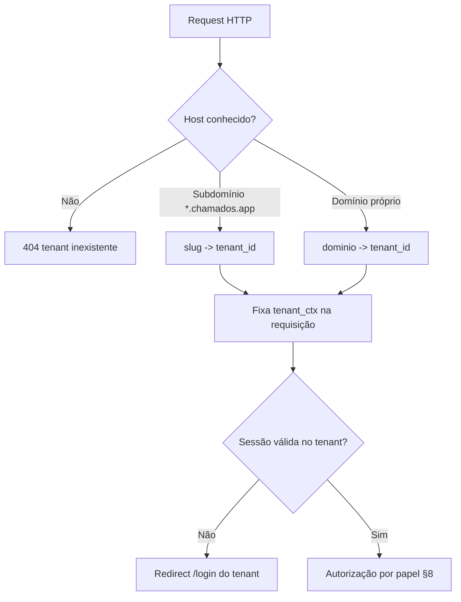
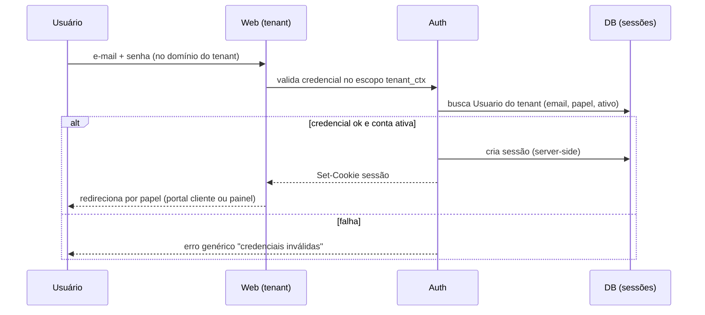
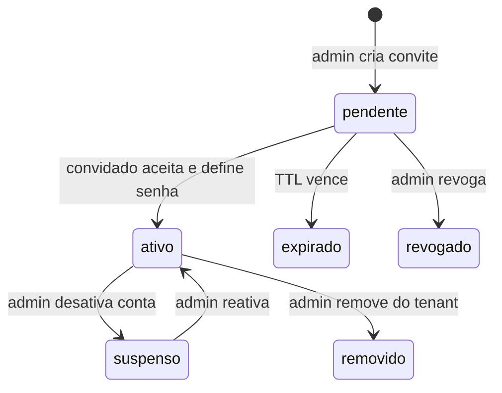
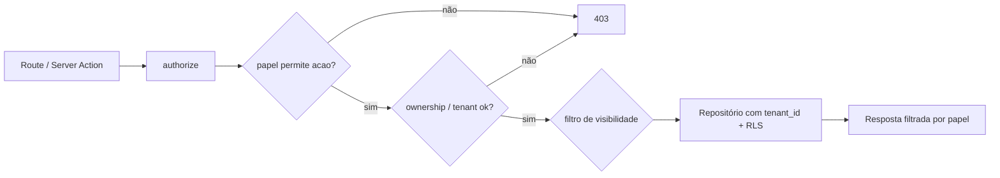

# Autenticação, Perfis e Permissões

Este documento define como usuários se autenticam na plataforma **Chamados**, como o
tenant é resolvido a partir da requisição, como usuários são convidados e vinculados
a um tenant, e a matriz completa de permissões por papel × recurso × ação. Cobre
também o tratamento do **agente_ia** como *service account* e a fronteira de dados que
o **cliente** NUNCA enxerga.

Referências:
- Modelagem das tabelas (`Usuario`, `Tenant`, sessões, convites, credenciais do
  agente_ia): ver `02-modelo-de-dados.md`.
- Telas de login, convite, aceite e reset: ver `08-ui-ux.md`.
- Isolamento físico multi-tenant no banco (RLS) e provisionamento de tenant: ver
  `07-multitenancy-whitelabel.md`.
- Ameaças, hardening de sessão, prompt injection e LGPD: ver `09-seguranca-lgpd.md`.

Requisitos cobertos: RF-01, RF-02, RF-07, RF-08, RF-09, RF-13, RF-19.

---

## 1. Papéis (roles)

A plataforma tem exatamente quatro papéis. **A identidade do `Usuario` é escopada ao
tenant**: cada `Usuario` pertence a um único tenant e carrega **um** papel na própria
linha (ver `02-modelo-de-dados.md` e §5). O mesmo endereço de e-mail pode existir em
tenants diferentes — por exemplo `cliente` no tenant A e `operador` no tenant B —, mas
como **contas independentes** (linhas de `Usuario` distintas, com senha própria em cada
tenant), não como uma identidade global compartilhada.

| Papel | Tipo | Descrição |
|-------|------|-----------|
| `admin` | humano | Administra o tenant: usuários, sistemas-alvo, categorias, branding, configurações, notificações. Faz tudo que o operador faz. |
| `operador` | humano | Atende chamados: lê tudo do chamado, responde publicamente, escreve notas internas, muda status/prioridade/atribuição, aprova ações da IA. |
| `cliente` | humano | Usuário final do tenant. Abre e acompanha os próprios chamados. Visão restrita (§7). |
| `agente_ia` | serviço | Usuário de serviço automatizado. Participa dos chamados como operador automatizado, com escopo limitado (§6). |

> DECISÃO PENDENTE: se `admin` e `operador` devem ser papéis mutuamente exclusivos ou
> se `admin` é um flag adicional sobre `operador`. Este documento assume papéis
> exclusivos com herança de capacidades (admin ⊇ operador).

> DECISÃO PENDENTE: existência de um **super-admin de plataforma** (staff do provedor
> whitelabel) cross-tenant para provisionar tenants. Provável que sim; escopo e auth
> desse papel serão tratados em `07-multitenancy-whitelabel.md`.

---

## 2. Stack de autenticação

> DECIDIDO (2026-07-15): autenticação implementada diretamente conforme esta spec
> (Argon2id + sessões server-side); better-auth descartado — ver specs/decisoes.md
> (D-010). O restante deste documento descreve o modelo diretamente implementado.

Decisões fixas independentes da lib:
- **Autenticação primária por e-mail + senha**, escopada ao tenant resolvido.
- Senhas com **Argon2id** (fallback bcrypt cost ≥ 12). Nunca reversível.
- Sessões **server-side** (registro em tabela de sessão + cookie opaco), não JWT
  stateless — permite revogação imediata (logout, troca de senha, expulsão do tenant).
- Cookie `httpOnly`, `Secure`, `SameSite=Lax`, com nome/escopo por domínio do tenant.
- **agente_ia não usa esse fluxo** — autentica por credencial de serviço (§6).

> DECISÃO PENDENTE: SSO/OIDC por tenant (Google Workspace, Microsoft Entra) para
> operadores/admins corporativos. Desejável na fase 2; a modelagem de `Usuario` deve
> reservar espaço para provedores de identidade externos.

---

## 3. Resolução de tenant

Todo request autenticado ocorre no contexto de **um** tenant. O tenant é resolvido
pelo host da requisição, ANTES da autenticação, e fixa o escopo de todas as consultas
subsequentes (incluindo o `tenant_id` do RLS — ver `07-multitenancy-whitelabel.md`).

Estratégia:
1. **Subdomínio**: `acme.chamados.app` → tenant cujo `slug = acme`.
2. **Domínio próprio**: `suporte.acme.com` → tenant cujo `dominio_proprio` casa com
   o host (validado por CNAME + certificado emitido; ver `07`).
3. Host desconhecido → página institucional/erro 404 de tenant. Nunca vaza lista de
   tenants.

Regras de fronteira:
- A sessão é **válida somente no tenant onde foi criada**. Um cookie de `acme` não
  autentica em `beta`, mesmo que exista uma conta com o mesmo e-mail em ambos os tenants
  (são `Usuario` distintos, sem senha nem sessão compartilhadas).
- Toda query de dados aplica o filtro `tenant_id = tenant_ctx` na camada de aplicação
  **e** via RLS no PostgreSQL (defesa em profundidade).
- O `login` valida a credencial contra o `Usuario` **do tenant resolvido**
  (`UNIQUE (tenant_id, email)`), não contra um e-mail global. E-mail sem conta ativa no
  tenant resolvido = credencial inválida (mesma mensagem genérica de erro para não vazar
  existência de conta).

---

## 4. Fluxos de autenticação

### 4.1 Login

- **Rate limiting** por IP + por conta (ex.: 5 tentativas / 15 min); backoff
  progressivo. Detalhes de hardening em `09-seguranca-lgpd.md`.
- Após login, redireciona conforme papel: `cliente` → portal do cliente;
  `operador`/`admin` → painel; ver mapa de telas em `08-ui-ux.md`.

> DECISÃO PENDENTE: 2FA (TOTP) obrigatório para `admin`, opcional para `operador`.
> Recomendação: obrigatório para admin na fase 1.

### 4.2 Convite de usuários (pelo admin)

Não há auto-cadastro público por padrão. Usuários entram por **convite**.

- Quem convida: `admin` pode convidar qualquer papel; `operador` pode convidar apenas
  `cliente` (se habilitado por configuração do tenant). Cliente não convida ninguém.
- O convite cria um registro pendente (e-mail + papel + tenant + token único com TTL,
  ex. 7 dias) e dispara notificação por e-mail (via camada de notificações,
  `06-notificacoes.md`).
- O convidado acessa o link, define a senha e a conta (`Usuario` do tenant) torna-se
  **ativa**.
- Reenvio e revogação de convite pendente disponíveis ao admin.
- Como a identidade é escopada ao tenant, convidar um e-mail **cria uma nova conta
  `Usuario` naquele tenant** (com senha própria), independentemente de o mesmo e-mail já
  existir em outros tenants. Um e-mail que já tem conta **no tenant resolvido** não pode
  ser convidado de novo (`UNIQUE (tenant_id, email)`); ajusta-se o papel/estado da conta
  existente.

> DECISÃO PENDENTE: permitir **auto-registro de cliente** (signup público no domínio do
> tenant) como opção por-tenant, para reduzir atrito. Default: desligado (só convite).

### 4.3 Reset e troca de senha

- **Esqueci a senha**: usuário informa e-mail no domínio do tenant; se houver conta
  ativa **naquele tenant**, envia link com token de uso único (TTL curto, ex. 1 h).
  Resposta sempre genérica ("se existir uma conta, enviaremos um e-mail") para não
  enumerar contas.
- **Troca de senha logado**: exige senha atual.
- Qualquer reset/troca de senha **invalida todas as sessões ativas** daquela conta
  (revogação server-side).

### 4.4 Sessões

- Duração deslizante (ex.: idle 8 h, absoluta 30 dias). Configurável por tenant.
- Painel "sessões ativas" permite ao usuário encerrar sessões; admin pode encerrar
  sessões de qualquer usuário do seu tenant.
- Eventos de segurança (login novo dispositivo, reset) podem gerar notificação.

> DECISÃO PENDENTE: valores exatos de TTL de sessão e se são globais ou por tenant.

---

## 5. Identidade do usuário e escopo por tenant

- **Identidade escopada ao tenant** (modelo canônico de `02-modelo-de-dados.md`): cada
  `Usuario` pertence a **um único tenant** (`tenant_id NOT NULL`) e carrega `email`,
  `nome`, hash de senha, `papel` e `ativo` na própria linha. Unicidade por
  `UNIQUE (tenant_id, email)`. **Não há conta global compartilhada entre tenants** —
  consistente com `07-multitenancy-whitelabel.md` §1.
- O mesmo endereço de e-mail pode ter contas em tenants diferentes; são **`Usuario`
  distintos** (ids, senhas e sessões independentes), podendo ter papéis diferentes em
  cada tenant. Dentro de um tenant, um `Usuario` tem **exatamente um** papel.
- Autorização sempre resolve papel = `Usuario(tenant_ctx, email).papel`. Sem conta ativa
  no tenant resolvido ⇒ tratado como não autenticado ali.
- Desativar (`ativo = false`) ou remover (soft delete) uma conta revoga acesso
  imediatamente (sessões invalidadas), sem apagar o histórico de chamados/mensagens que o
  usuário produziu (auditoria e LGPD, ver `09`).

> Nota de reconciliação: versões anteriores deste documento descreviam uma "identidade
> global + N vínculos". O modelo canônico adotado é **identidade por-tenant** (uma linha
> de `Usuario` por tenant), conforme `02-modelo-de-dados.md` e `07-multitenancy-whitelabel.md`.

---

## 6. agente_ia como service account

O `agente_ia` é um `Usuario` de serviço, **um por tenant**, provisionado automaticamente
junto do tenant. Ele participa dos chamados (autoria de mensagens/notas/eventos) como
qualquer operador automatizado, mas **não é uma pessoa** e não usa login por senha.

Características:
- **Sem senha e sem sessão interativa.** Autentica-se de máquina-para-máquina: o worker
  do pipeline (ver `05-agente-ia.md`) porta uma credencial de serviço escopada ao
  `tenant_id` (ex.: chave de API/segredo assinado, rotacionável, guardada em cofre —
  detalhe em `02` e `09`).
- **Escopo limitado**: o agente_ia atua **apenas dentro dos chamados** e artefatos de
  IA. Não administra o tenant, não gerencia usuários, não altera branding nem
  configurações, e não aprova as próprias ações (guardrail — ver `05`).
- **Identidade visível**: mensagens e eventos autorados por ele aparecem atribuídos ao
  agente_ia (nome/avatar de marca do tenant), com transparência ao cliente nas
  mensagens `publica`.
- **Toda ação sua gera `EventoChamado`** e, quando executa o pipeline, um registro
  `ExecucaoIA` (entrada, ações, custo, duração, resultado). `ExecucaoIA` é invisível ao
  cliente (§7).
- **Credenciais dos sistemas-alvo** (git, logs, banco somente-leitura) NÃO pertencem ao
  agente_ia como identidade de app; são configuração do `SistemaAlvo` consumida pelo
  worker isolado. O agente_ia dentro da aplicação Chamados só tem permissão de
  ler/escrever no domínio do chamado. Ver `07` (SistemaAlvo) e `09` (isolamento do
  worker e princípio do menor privilégio).

Poderes do agente_ia dentro do chamado (subconjunto do operador):
- Publicar mensagem `publica` (pedido de informação ao cliente — RF-11).
- Publicar nota `interna` (diagnóstico, SPEC de alteração, resultado de tentativa de
  resolução — RF-16).
- Classificar `complexidade` (facil/medio/dificil — RF-12), validar/ajustar `natureza`,
  sugerir `prioridade`.
- Transicionar status conforme a máquina de estados (ex.: `em_triagem` →
  `aguardando_cliente`), dentro do permitido em `04-chamados.md`.

Poderes que o agente_ia NÃO tem:
- Fechar chamado, cancelar chamado, fazer merge/deploy de PR, ou qualquer ação que a
  política de guardrail reserve a humano (relaxável por configuração do tenant no
  futuro — ver `05`).
- Gerenciar usuários, sistemas-alvo, categorias, configurações ou notificações do tenant.

---

## 7. O que o cliente NUNCA vê

Fronteira de dados inegociável do papel `cliente` (RF-04, RF-07, RF-08, RF-09).
Aplicada tanto na API (filtros server-side) quanto na UI (`08-ui-ux.md`):

| Recurso / campo | Cliente vê? | Observação |
|-----------------|-------------|------------|
| Mensagem `visibilidade = publica` | Sim | Timeline pública do chamado. |
| Mensagem `visibilidade = interna` (nota interna) | **Não** | Nunca serializada para o cliente. |
| `complexidade` (facil/medio/dificil) | **Não** | Campo estritamente interno. |
| `ExecucaoIA` (entrada, ações, custo, duração, resultado) | **Não** | Nem existência, nem metadados. |
| `natureza`, `status`, `prioridade` | Sim | Acompanhamento (RF-04). |
| Diagnóstico técnico da IA (nota interna) | **Não** | É nota interna. |
| SPEC de alteração gerada pela IA | **Não** | Nota interna para o dev (RF-16). |
| PRs/branches criados pela IA | **Não** | Detalhe operacional interno. |
| Atribuição de operador, notas de bastidor | **Não** | Só o fato de estar "em atendimento". |
| Histórico dos **próprios** chamados fechados | Sim | RF-04. |
| Chamados de outros usuários/empresas | **Não** | Isolamento por tenant e por autoria. |

Regra de ouro: qualquer serializer/endpoint exposto ao papel `cliente` deve **excluir por
padrão** notas internas, complexidade e ExecucaoIA — allowlist de campos, não denylist.

---

## 8. Matriz de permissões (papel × recurso × ação)

Convenções: ✅ permitido · ⚠️ condicional (nota) · ❌ negado. `admin` inclui tudo de
`operador`. Ações sobre chamados respeitam também a máquina de estados de
`04-chamados.md`.

### 8.1 Chamados e conteúdo

| Recurso · Ação | admin | operador | cliente | agente_ia |
|---|---|---|---|---|
| Chamado · criar | ✅ | ✅ | ✅ (próprio) | ❌ |
| Chamado · ler | ✅ (tenant) | ✅ (tenant) | ⚠️ só os próprios | ✅ (tenant) |
| Chamado · mudar status | ✅ | ✅ | ⚠️ só reabrir `resolvido`→`em_atendimento` | ⚠️ transições de triagem |
| Chamado · mudar prioridade | ✅ | ✅ | ❌ (define apenas na abertura — ver `04-chamados.md` §3.2) | ⚠️ sugerir |
| Chamado · mudar natureza | ✅ | ✅ | ❌ (define apenas na abertura — ver `04-chamados.md` §3.1) | ⚠️ validar/ajustar |
| Chamado · atribuir operador | ✅ | ✅ | ❌ | ❌ |
| Chamado · classificar `complexidade` | ✅ | ✅ | ❌ | ✅ |
| Chamado · fechar | ✅ | ✅ | ❌ | ❌ |
| Chamado · cancelar | ✅ | ✅ | ⚠️ apenas os próprios chamados, e apenas em `novo`/`aguardando_cliente` (regras finas de transição em `04-chamados.md` §1.3) | ❌ |
| Mensagem `publica` · escrever | ✅ | ✅ | ✅ (nos próprios) | ✅ |
| Mensagem `publica` · ler | ✅ | ✅ | ✅ (nos próprios) | ✅ |
| Mensagem `interna` · escrever | ✅ | ✅ | ❌ | ✅ |
| Mensagem `interna` · ler | ✅ | ✅ | ❌ | ✅ |
| Anexo · enviar/baixar | ✅ | ✅ | ⚠️ nos próprios chamados | ⚠️ conforme visibilidade |
| `EventoChamado` (histórico) · ler | ✅ | ✅ | ⚠️ só eventos públicos dos próprios | ✅ |
| `ExecucaoIA` · ler | ✅ | ✅ | ❌ | ⚠️ as próprias |

### 8.2 Administração do tenant

| Recurso · Ação | admin | operador | cliente | agente_ia |
|---|---|---|---|---|
| Usuário · convidar | ✅ | ⚠️ só `cliente` (se habilitado) | ❌ | ❌ |
| Usuário · listar/editar papel/desativar | ✅ | ❌ | ❌ | ❌ |
| `SistemaAlvo` · CRUD (repo, logs, DB read-only) | ✅ | ⚠️ leitura | ❌ | ❌ |
| `Categoria` · CRUD | ✅ | ⚠️ leitura | ❌ | ❌ |
| Branding / domínio / whitelabel | ✅ | ❌ | ❌ | ❌ |
| Config. de notificações do tenant | ✅ | ⚠️ leitura | ❌ | ❌ |
| `PreferenciaNotificacao` própria | ✅ | ✅ | ✅ | ❌ |
| Configuração de guardrails da IA | ✅ | ❌ | ❌ | ❌ |
| Aprovar merge/deploy de PR da IA | ✅ | ✅ | ❌ | ❌ |
| Sessões · encerrar de terceiros (no tenant) | ✅ | ❌ | ❌ | ❌ |

Notas condicionais:
- Cliente só acessa recursos cujo **autor/solicitante é ele mesmo** e cujo `tenant_id`
  bate com o tenant resolvido.
- "operador convidar cliente" depende de flag de configuração do tenant (default
  ligado). Ver `07`.
- agente_ia "aprovar" nada: guardrail humano obrigatório (`05-agente-ia.md`).

---

## 9. Modelo de autorização (implementação)

- **Ponto único de decisão**: um módulo `authorize(usuario, tenant_ctx, recurso, acao,
  alvo?)` central, chamado por toda rota/route handler e server action. Nada de checagem
  espalhada em componentes de UI (UI apenas esconde; a API é a fronteira real).
- **Ownership**: para o papel `cliente`, além do papel, valida-se `alvo.autor_id ===
  usuario.id` (ou solicitante do chamado). Para `operador`/`admin`, valida-se
  `alvo.tenant_id === tenant_ctx`.
- **Visibilidade de mensagem**: a query de timeline recebe o papel e filtra
  `visibilidade`. Para `cliente`, `WHERE visibilidade = 'publica'` é imposto no
  repositório, não no controller.
- **Defesa em profundidade**: RLS no PostgreSQL garante isolamento por `tenant_id`
  mesmo se a aplicação errar (ver `07` e `09`). A checagem de papel/ownership é
  responsabilidade da aplicação.
- **Auditoria**: toda ação sensível (mudança de status/prioridade/atribuição, ações da
  IA, convites, mudança de papel) gera `EventoChamado` ou log de auditoria — RF-08 e
  rastreabilidade LGPD (`09`).

---

## 10. Resumo das decisões pendentes

> DECIDIDO (2026-07-15): autenticação implementada diretamente conforme esta spec (Argon2id + sessões server-side); better-auth descartado — ver specs/decisoes.md (D-010).
> DECISÃO PENDENTE: admin como papel exclusivo vs flag sobre operador (assumido exclusivo).
> DECISÃO PENDENTE: existência e escopo de super-admin de plataforma cross-tenant.
> DECISÃO PENDENTE: 2FA (TOTP) — obrigatório para admin? opcional para operador?
> DECISÃO PENDENTE: SSO/OIDC por tenant (fase 2).
> DECISÃO PENDENTE: suporte a login por magic link em fase futura.
> DECISÃO PENDENTE: auto-registro público de cliente por-tenant (default desligado).
> DECISÃO PENDENTE: valores de TTL de sessão e convite; globais ou por tenant.
