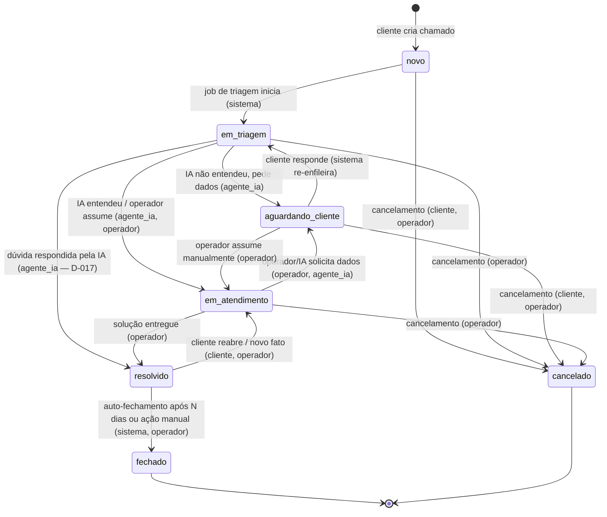

# Chamados: Ciclo de Vida e Regras de Negócio

Este documento define o comportamento funcional da entidade central da plataforma: o **Chamado**. Cobre a máquina de estados, a criação com formulário mínimo, os atributos de classificação (natureza, prioridade, complexidade), a timeline de mensagens e notas internas, rich text e anexos, atribuição de operador, reabertura e fechamento automático, os eventos auditados (`EventoChamado`) e as regras de listagem, filtro e busca.

Escopo relacionado (não duplicado aqui):

- Pipeline de triagem/resolução da IA e geração de SPEC: ver `05-agente-ia.md`.
- Schema de banco, tipos de coluna e estratégia multi-tenant no BD: ver `02-modelo-de-dados.md`.
- Telas, wireframes e fluxos de UI: ver `08-ui-ux.md`.
- Permissões detalhadas por papel e `agente_ia` como service account: ver `03-autenticacao-perfis-permissoes.md`.
- Eventos notificáveis e templates: ver `06-notificacoes.md`.

Papéis referenciados: **admin**, **operador**, **cliente**, **agente_ia** (usuário de serviço). Salvo indicação em contrário, admin possui todas as capacidades de operador.

---

## 1. Máquina de estados

O status de um chamado assume EXATAMENTE um dos valores do enum canônico:

`novo`, `em_triagem`, `aguardando_cliente`, `em_atendimento`, `resolvido`, `fechado`, `cancelado`.

### 1.1 Semântica de cada status

| Status               | Significado                                                                                    | Quem geralmente atua                    |
| -------------------- | ---------------------------------------------------------------------------------------------- | --------------------------------------- |
| `novo`               | Chamado recém-criado, ainda não enfileirado para triagem ou entre a criação e o início do job. | sistema                                 |
| `em_triagem`         | O `agente_ia` está analisando (job na fila ou em execução).                                    | agente_ia                               |
| `aguardando_cliente` | Falta informação do cliente; a IA ou o operador pediu dados objetivos.                         | cliente                                 |
| `em_atendimento`     | Compreendido e em tratamento por operador e/ou IA (diagnóstico, PR, correção).                 | operador / agente_ia                    |
| `resolvido`          | Solução entregue; aguardando confirmação/decurso de prazo. Fecha automaticamente após N dias.  | sistema (auto-fecha) / cliente (reabre) |
| `fechado`            | Terminal. Encerrado por decurso de prazo ou ação manual. Não recebe novas mensagens.           | —                                       |
| `cancelado`          | Terminal. Encerrado sem solução (duplicado, engano, desistência).                              | —                                       |

Estados terminais: `fechado` e `cancelado`. Nenhuma transição parte deles (exceção: nenhuma — reabertura só existe a partir de `resolvido`).

### 1.2 Diagrama

### 1.3 Tabela de transições e autorização

| De                   | Para                 | Gatilho                                       | Quem pode                                   |
| -------------------- | -------------------- | --------------------------------------------- | ------------------------------------------- |
| `novo`               | `em_triagem`         | Job de triagem inicia                         | sistema                                     |
| `novo`               | `cancelado`          | Cancelamento imediato                         | cliente (autor), operador                   |
| `em_triagem`         | `aguardando_cliente` | IA pede informações objetivas                 | agente_ia, operador                         |
| `em_triagem`         | `em_atendimento`     | IA compreendeu; ou operador assume            | agente_ia, operador                         |
| `em_triagem`         | `resolvido`          | Dúvida respondida pela IA (D-017)             | agente_ia, operador                         |
| `em_triagem`         | `cancelado`          | Cancelamento                                  | operador                                    |
| `aguardando_cliente` | `em_triagem`         | Cliente responde (re-enfileira triagem)       | sistema (disparado por mensagem do cliente) |
| `aguardando_cliente` | `em_atendimento`     | Operador decide assumir sem nova rodada de IA | operador                                    |
| `aguardando_cliente` | `cancelado`          | Cliente desiste / operador cancela            | cliente (autor), operador                   |
| `em_atendimento`     | `aguardando_cliente` | Operador ou IA solicita mais dados            | operador, agente_ia                         |
| `em_atendimento`     | `resolvido`          | Solução entregue                              | operador                                    |
| `em_atendimento`     | `cancelado`          | Cancelamento                                  | operador                                    |
| `resolvido`          | `em_atendimento`     | Reabertura pelo cliente ou reabertura manual  | cliente (autor), operador                   |
| `resolvido`          | `fechado`            | Decurso de N dias (auto) ou fechamento manual | sistema, operador                           |

Regras invariantes:

- O `cliente` só pode cancelar/reabrir/responder **seus próprios** chamados (do seu tenant).
- Toda transição gera um `EventoChamado` (ver seção 8). Transições inválidas (fora desta tabela) são rejeitadas pela camada de serviço com erro de domínio, sem tocar no banco.
- `fechado` e `cancelado` não aceitam novas mensagens, transições ou atribuições.
- Reenfileiramento da triagem (`aguardando_cliente` → `em_triagem`) só ocorre para chamados ainda não resolvidos; ver `05-agente-ia.md` para as condições exatas do pipeline.
- **Guardrail humano-no-circuito**: para `problema`/`alteracao`, apenas `operador`/`admin` transicionam para `resolvido` — mesmo quando a IA abre um PR de correção, o chamado permanece em `em_atendimento` e aguarda merge/deploy aprovado por humano. **Exceção única (D-017)**: natureza `duvida` respondida pela IA na triagem — a resposta pública é publicada e o chamado vai direto a `resolvido` (`em_triagem` → `resolvido`; o aplicador só usa essa aresta com resposta real, não rebaixada pelo validador). Nada muda no sistema numa dúvida — o guardrail de produção continua intacto. Ver `05-agente-ia.md` (pipeline) e `09-seguranca-lgpd.md` §5 (guardrails de IA).

> DECIDIDO (2026-07-15): valor padrão de N = 3 dias para auto-fechamento de `resolvido`, configurável por tenant — ver §8.1 (implementado no M10).

> DECISÃO PENDENTE: permitir que `resolvido` seja reaberto indefinidamente ou apenas dentro da janela de N dias (após o auto-fechamento, uma reabertura exigiria abrir novo chamado vinculado). Sugestão: reabertura livre enquanto `resolvido`; após `fechado`, criar chamado novo com referência ao anterior.

---

## 2. Criação de chamado (formulário mínimo)

Princípio de produto (RNF-01/RNF-02): o oposto do osTicket. O formulário de abertura pede o mínimo.

Campos do formulário do cliente:

| Campo                        | Obrigatório | Regra                                                                                                                                                                                                                                                            |
| ---------------------------- | ----------- | ---------------------------------------------------------------------------------------------------------------------------------------------------------------------------------------------------------------------------------------------------------------- |
| Sistema-alvo (`SistemaAlvo`) | Condicional | Exibido e obrigatório **apenas** se o tenant tiver mais de um sistema-alvo. Com um único, é preenchido automaticamente. Alternativamente, a categoria geral do tenant.                                                                                           |
| Natureza                     | Não (D-017) | `problema`, `alteracao` ou `duvida`. No portal do cliente fica em "Opções avançadas" com default "Automático": sem escolha, abre como `problema` e a IA classifica na triagem (`naturezaAjustada`). No painel (operador em nome de cliente), continua explícita. |
| Título                       | Sim         | Texto curto (ver limites na seção 4).                                                                                                                                                                                                                            |
| Descrição                    | Sim         | Rich text com imagens/anexos inline (seção 4).                                                                                                                                                                                                                   |
| Prioridade                   | Não         | Se omitida, entra como `media` (default) e pode ser ajustada pela IA/operador.                                                                                                                                                                                   |

Ao criar:

1. Status inicial = `novo`; `tenant_id` derivado do contexto autenticado; autor = usuário logado.
2. Um `EventoChamado` de criação é registrado.
3. Um job de triagem é enfileirado (BullMQ) — ver `05-agente-ia.md`. A transição `novo` → `em_triagem` ocorre quando o worker inicia.
4. Notificação de "chamado criado" é disparada conforme `06-notificacoes.md`.

Quem pode criar: `cliente` (para si), `operador`/`admin` (em nome de um cliente, informando o solicitante). O `agente_ia` não cria chamados.

> DECISÃO PENDENTE: operador pode abrir chamado "em nome de" um cliente no MVP, ou isso fica para fase posterior? Sugestão: incluir no MVP por ser barato e útil em suporte telefônico.

---

## 3. Natureza, prioridade e complexidade

### 3.1 Natureza — enum `problema` | `alteracao` | `duvida`

- Opcional na criação pelo portal (D-017): o cliente PODE escolher em "Opções avançadas", mas o caminho normal é deixar "Automático" — a IA identifica a natureza na triagem. Após criado, o cliente não pode mais alterá-la (ver matriz de permissões em `03-autenticacao-perfis-permissoes.md` §8.1).
- A IA **valida/ajusta** a natureza durante a triagem (ex.: cliente marcou `problema`, mas o pedido é uma mudança de comportamento → `alteracao`; ou é só uma pergunta → `duvida`). O ajuste gera `EventoChamado` e nota interna.
- Operador pode alterar manualmente.
- Efeito no pipeline: `alteracao` nunca dispara resolução automática de código; a IA produz uma SPEC (nota interna). `problema` pode disparar tentativa de correção sob os guardrails de `05-agente-ia.md`. `duvida` é respondida pela IA (specs/05 §5.5) — nunca SPEC nem PR.

### 3.2 Prioridade — enum `baixa` | `media` | `alta` | `urgente`

- Opcional na criação (default `media`); é o **único momento** em que o cliente define a prioridade. Após a criação, o cliente não pode mais alterá-la — só operador/admin (decisão) e agente_ia (sugestão) atuam sobre ela (ver matriz de permissões em `03-autenticacao-perfis-permissoes.md` §8.1).
- A IA **sugere** prioridade na triagem; operador **decide**. A sugestão da IA não sobrescreve automaticamente uma prioridade escolhida pelo cliente sem registro.
- Visível para todos os papéis (inclusive cliente).
- Toda alteração de prioridade gera `EventoChamado`.

> DECISÃO PENDENTE: a sugestão da IA aplica automaticamente a prioridade (com evento) ou apenas propõe para o operador confirmar? Sugestão: aplicar automaticamente quando o chamado ainda não foi tocado por operador; a partir daí, apenas sugerir.

### 3.3 Complexidade — enum `facil` | `medio` | `dificil`

- Atributo **interno**. Visível somente para `operador`, `admin` e `agente_ia`. **Nunca** exposto ao `cliente` (nem em API, nem em UI, nem em notificações).
- Definida pela IA na triagem; ajustável por operador.
- Governa a elegibilidade para resolução automática: `natureza=problema` + `complexidade=facil` + bem compreendido → IA pode tentar resolver (ver `05-agente-ia.md`).
- Alterações geram `EventoChamado` de visibilidade interna.

---

## 4. Timeline: mensagens públicas e notas internas

Cada chamado possui uma sequência ordenada de `Mensagem` (timeline). Cada mensagem tem um autor (usuário de qualquer papel, incluindo `agente_ia`), um corpo em rich text e uma **visibilidade**: `publica` ou `interna`.

### 4.1 Regras de visibilidade

| Visibilidade             | Quem vê                             | Quem pode escrever                  |
| ------------------------ | ----------------------------------- | ----------------------------------- |
| `publica`                | cliente, operador, admin, agente_ia | cliente, operador, admin, agente_ia |
| `interna` (nota interna) | operador, admin, agente_ia          | operador, admin, agente_ia          |

- O `cliente` **nunca** vê mensagens `interna`, nem recebe notificação sobre elas. A API filtra por visibilidade no servidor com base no papel; nunca confia no cliente para ocultar.
- Notas internas são o canal da IA para diagnóstico, plano de resolução, link de PR e SPEC de alteração.
- Mensagens públicas do cliente em chamados `aguardando_cliente`/`em_triagem` podem re-disparar a triagem (ver seção 1.3 e `05-agente-ia.md`).

### 4.2 Efeitos de uma nova mensagem

- Nova mensagem `publica` do operador/IA em `aguardando_cliente` mantém o status até o cliente responder (ou operador transiciona manualmente).
- Nova mensagem `publica` do cliente re-dispara a triagem em QUALQUER estado não terminal (D-017 parte 3): de `aguardando_cliente` → `em_triagem` (sistema); de `resolvido` → reabre (§8.2) e a triagem analisa; em `novo`/`em_triagem`/`em_atendimento` apenas re-enfileira (sem mudar status). O operador atribuído segue sendo notificado.
- Toda nova mensagem `publica` gera evento notificável ("nova mensagem publica"); notas `interna` notificam apenas a equipe conforme preferências.
- Mensagens são **imutáveis** após o envio no MVP (sem edição/exclusão), preservando a integridade da timeline.

> DECISÃO PENDENTE: permitir editar/excluir a própria mensagem dentro de uma janela curta (ex.: 5 min) ou manter imutável no MVP. Sugestão: imutável no MVP; adicionar "editar em 5 min" depois, mantendo histórico.

---

## 5. Rich text

Formato e sanitização (detalhes de storage em `02-modelo-de-dados.md`; segurança/XSS em `09-seguranca-lgpd.md`):

- Editor: **TipTap**. Persistência como HTML sanitizado no servidor (allowlist de tags/atributos) — nunca renderizar HTML bruto do cliente.
- Recursos suportados: parágrafos, títulos, negrito/itálico/sublinhado/tachado, listas ordenadas/não ordenadas, citações, blocos de código com destaque, links, tabelas simples e **imagens inline**.
- Imagens inline são anexos: fazem upload para o storage S3-compatível e o corpo referencia a URL/asset resultante (não base64 embutido no HTML).
- **Pré-processamento de imagens coladas (obrigatório, ANTES da sanitização).** Ao colar uma imagem, o TipTap emite `` (base64 embutido). No servidor, antes de aplicar a allowlist: (1) extrair cada imagem `data:` do documento; (2) fazer upload como `Anexo` (`inline=true`, vinculado ao `tenant_id` e ao chamado/mensagem); (3) reescrever o `src` para a referência do `Anexo` (URL assinada); (4) só então aplicar a allowlist de sanitização, que remove `data:`. Sem esse passo, a sanitização descartaria o `data:` e a imagem colada sumiria silenciosamente. Ver `09-seguranca-lgpd.md` §6.
- Sanitização server-side obrigatória na escrita (remoção de scripts, handlers `on*`, `javascript:` URIs, iframes). Ver `09-seguranca-lgpd.md`.

Limites:

| Item                        | Limite (sugerido)                                                               |
| --------------------------- | ------------------------------------------------------------------------------- |
| Título                      | 3–160 caracteres (alinhado ao `CHECK length 3..160` de `02-modelo-de-dados.md`) |
| Corpo (descrição/mensagem)  | até 50.000 caracteres de texto renderizado                                      |
| Imagens inline por mensagem | até 20                                                                          |

> DECISÃO PENDENTE: valores exatos dos limites de título e corpo. Números acima são propostas iniciais.

---

## 6. Anexos

`Anexo` cobre tanto imagens inline quanto arquivos anexados à parte, sempre vinculados a uma `Mensagem` (ou à descrição do chamado) e ao `tenant_id`.

| Regra                          | Valor (sugerido)                                                                                    |
| ------------------------------ | --------------------------------------------------------------------------------------------------- |
| Tipos permitidos               | Imagens (png, jpg, webp, gif), PDF, texto/logs (txt, log, csv), documentos comuns (docx, xlsx), zip |
| Tamanho máximo por arquivo     | 25 MB                                                                                               |
| Quantidade por mensagem        | até 20                                                                                              |
| Quota por chamado / por tenant | Configurável por tenant (ver `07-multitenancy-whitelabel.md`)                                       |

- Validação de tipo por **conteúdo** (magic bytes), não apenas extensão/MIME informado.
- Executáveis e tipos ativos são bloqueados por allowlist. Ver `09-seguranca-lgpd.md`.
- Upload direto para storage S3-compatível (MinIO em dev; S3/R2 em prod) via URL pré-assinada; o banco guarda metadados e chave do objeto.
- Acesso a anexos respeita a visibilidade da mensagem: anexo de nota `interna` nunca é servido ao cliente. Downloads passam por URL pré-assinada de curta duração emitida após checagem de permissão.

> DECISÃO PENDENTE: lista definitiva de tipos permitidos, tamanho máximo por arquivo e política de quota (por chamado, por tenant, por período). Números acima são propostas iniciais.

---

## 7. Atribuição de operador

- Um chamado pode ter **um operador responsável** (assignee) por vez. O `agente_ia` participa como operador automatizado, mas não ocupa o slot de assignee humano — sua atuação é registrada via mensagens e `ExecucaoIA`.
- Atribuir/reatribuir: `operador` (auto-atribuição ou entre pares) e `admin`. O `cliente` nunca atribui.
- Desatribuir é permitido; chamado volta a "não atribuído".
- Atribuição não altera o status por si só, mas frequentemente acompanha a transição para `em_atendimento`.
- Toda (re)atribuição gera `EventoChamado` e pode notificar o novo responsável (ver `06-notificacoes.md`).

> DECISÃO PENDENTE: haverá atribuição automática (round-robin, por sistema-alvo, por carga) no MVP ou apenas manual? Sugestão: manual no MVP; regras automáticas como item de roadmap (`10-roadmap-mvp.md`).

---

## 8. Reabertura e fechamento automático

### 8.1 Auto-fechamento de `resolvido`

- Ao entrar em `resolvido`, registra-se o timestamp da resolução (`resolvido_em`) e calcula-se o prazo (`fechar_automaticamente_em`).

> DECIDIDO (2026-07-15): `dias_fechamento_automatico` tem default **3 dias**, configurável por tenant (`Tenant.dias_fechamento_automatico`, ver `02-modelo-de-dados.md`). Um job **repetível** de manutenção (BullMQ repeatable, a cada **5 minutos** por padrão, intervalo configurável) enumera os tenants ativos (`chamados_tenants_ativos()`, ver `02-modelo-de-dados.md`) e, para cada um, varre os chamados `resolvido` com `fechar_automaticamente_em` vencido, transicionando-os para `fechado` — gera `EventoChamado` do tipo `chamado_fechado_auto` e a notificação correspondente (implementado no M10).

- Nova mensagem pública do cliente em `resolvido` **reabre o chamado** (D-017 parte 3): a reabertura (§8.2) limpa `resolvido_em`/`fechar_automaticamente_em` — cancelando o auto-fechamento — e re-dispara a triagem sobre a nova mensagem.

### 8.2 Reabertura

- Enquanto `resolvido`, o `cliente` (autor) pode **reabrir** — pela ação explícita OU simplesmente enviando uma nova mensagem pública (D-017 parte 3): status volta para `em_atendimento`, com `EventoChamado` de reabertura e notificação à equipe; a mensagem re-dispara a triagem.
- Operador/admin também podem reabrir manualmente.
- `fechado` é **terminal**: não há reabertura direta. Ver DECISÃO PENDENTE na seção 1.3 sobre criar novo chamado vinculado.

---

## 9. EventoChamado (auditoria/histórico)

Todo fato relevante gera um registro `EventoChamado` imutável (append-only), com: tenant, chamado, ator (usuário/papel, incluindo `sistema` e `agente_ia`), tipo do evento, timestamp, e payload com o antes/depois quando aplicável. Detalhes de schema em `02-modelo-de-dados.md`.

Eventos auditados (lista mínima):

Os nomes de tipo abaixo correspondem EXATAMENTE ao enum `tipo_evento` de `02-modelo-de-dados.md`. Resolução (`em_atendimento` → `resolvido`) e cancelamento (`* → cancelado`) **não** têm tipo dedicado: são registrados como `status_alterado` com `{de, para}`. As ações da IA usam os tipos `ia_*` específicos, cada um referenciando a `ExecucaoIA` correspondente.

| Tipo de evento           | Origem típica                                        | Payload                                                                                         |
| ------------------------ | ---------------------------------------------------- | ----------------------------------------------------------------------------------------------- |
| `chamado_criado`         | cliente/operador                                     | dados iniciais                                                                                  |
| `status_alterado`        | qualquer transição (inclui resolução e cancelamento) | de → para (+ motivo quando cancelamento/fechamento manual)                                      |
| `prioridade_alterada`    | IA/operador                                          | de → para                                                                                       |
| `natureza_alterada`      | IA/operador                                          | de → para                                                                                       |
| `complexidade_alterada`  | IA/operador                                          | de → para (interno)                                                                             |
| `atribuicao_alterada`    | operador/admin                                       | assignee anterior → novo (`novo = NULL` na desatribuição)                                       |
| `mensagem_publicada`     | qualquer papel                                       | id da mensagem (visibilidade `publica`)                                                         |
| `nota_interna_publicada` | operador/admin/agente_ia                             | id da mensagem (visibilidade `interna`)                                                         |
| `anexo_adicionado`       | qualquer papel                                       | id do anexo, `mensagem_id`/`chamado_id`                                                         |
| `chamado_reaberto`       | cliente/operador                                     | —                                                                                               |
| `chamado_fechado_auto`   | sistema                                              | motivo (decurso de N dias). Fechamento manual é `status_alterado`                               |
| `ia_iniciou`             | agente_ia                                            | referência a `ExecucaoIA` (início da triagem)                                                   |
| `ia_pediu_info`          | agente_ia                                            | referência a `ExecucaoIA` (pedido de dados; acompanha `status_alterado` → `aguardando_cliente`) |
| `ia_diagnosticou`        | agente_ia                                            | referência a `ExecucaoIA` (nota interna de diagnóstico)                                         |
| `ia_abriu_pr`            | agente_ia                                            | referência a `ExecucaoIA` (branch/PR de correção)                                               |
| `ia_gerou_spec`          | agente_ia                                            | referência a `ExecucaoIA` (SPEC de alteração)                                                   |
| `ia_falhou`              | agente_ia                                            | referência a `ExecucaoIA` (erro/timeout)                                                        |
| `ia_silenciada`          | operador/admin                                       | D-024: IA silenciada no chamado (`{de, para}`); interno                                         |
| `ia_reativada`           | operador/admin                                       | D-024: IA reativada no chamado; interno                                                         |

- Eventos de atributos internos (ex.: `complexidade_alterada`) e notas internas (`nota_interna_publicada`) herdam a visibilidade interna: não aparecem no histórico do cliente.
- Detalhamento das ações da IA e da entidade `ExecucaoIA`: ver `05-agente-ia.md`.

---

## 10. Listagens, filtros e busca

### 10.1 Visões por papel

- **Cliente**: vê apenas os próprios chamados do seu tenant. Colunas: título, sistema-alvo, status, prioridade, última atualização. Histórico inclui chamados `fechado`/`cancelado` (RF-04). Nunca vê complexidade nem itens internos.
- **Operador/Admin**: veem todos os chamados do tenant (admin pode ter visão administrativa ampla). Colunas adicionais: complexidade, operador atribuído, indicador de atividade da IA.

Todo acesso é filtrado por `tenant_id` no servidor (Row-Level Security no PostgreSQL — ver `02-modelo-de-dados.md` e `07-multitenancy-whitelabel.md`).

### 10.2 Filtros

Filtros combináveis: status, natureza, prioridade, complexidade (só operador/admin), sistema-alvo, operador atribuído, autor/cliente, intervalo de datas (criação/última atualização), com/sem atividade da IA.

### 10.3 Ordenação

Por última atualização (default, desc), data de criação, prioridade, status.

### 10.4 Busca

> DECIDIDO (2026-07-15): busca full-text com `websearch_to_tsquery('portuguese')` sobre a coluna gerada `busca_tsv` (título peso A + descrição peso B — ver `02-modelo-de-dados.md`), com **ranking** por relevância (`ts_rank`/`ts_rank_cd`, título pesando mais que o corpo da descrição) e **fallback** para `ILIKE` quando o termo é curto demais para `websearch_to_tsquery` produzir um `tsquery` útil (ex.: 1-2 caracteres, siglas). No modo busca (termo preenchido), a ordenação é por relevância, substituindo a ordenação padrão de §10.3. MVP indexa **título + descrição** do chamado; mensagens (públicas e notas internas) ficam fora do índice de busca (implementado no M10).

- A busca respeita RLS e o isolamento por tenant no nível da query; o resultado só retorna chamados visíveis ao papel do solicitante (cliente vê só os próprios — ver §10.1).

> DECISÃO PENDENTE: estratégia de paginação (offset vs. cursor/keyset). Sugestão: keyset por (última atualização, id) para listagens grandes.

---

## 11. Resumo das regras invariantes

1. Status sempre um dos sete valores do enum canônico; transições restritas à tabela da seção 1.3.
2. `fechado` e `cancelado` são terminais e imutáveis (sem mensagens, transições ou atribuições).
3. `complexidade` é interna: invisível ao cliente em toda superfície (UI, API, notificações, histórico).
4. Visibilidade de mensagem filtrada no servidor por papel; cliente jamais acessa conteúdo `interna`.
5. Todo fato relevante gera `EventoChamado` append-only.
6. Todo acesso é isolado por `tenant_id` (RLS).
7. Rich text e anexos são sanitizados/validados server-side antes de persistir e servidos por URL pré-assinada conforme permissão.
