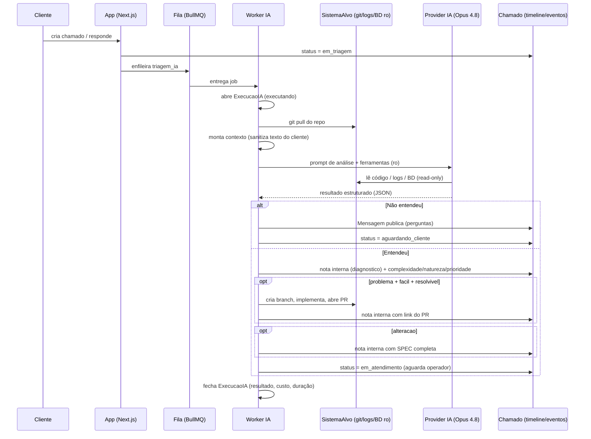
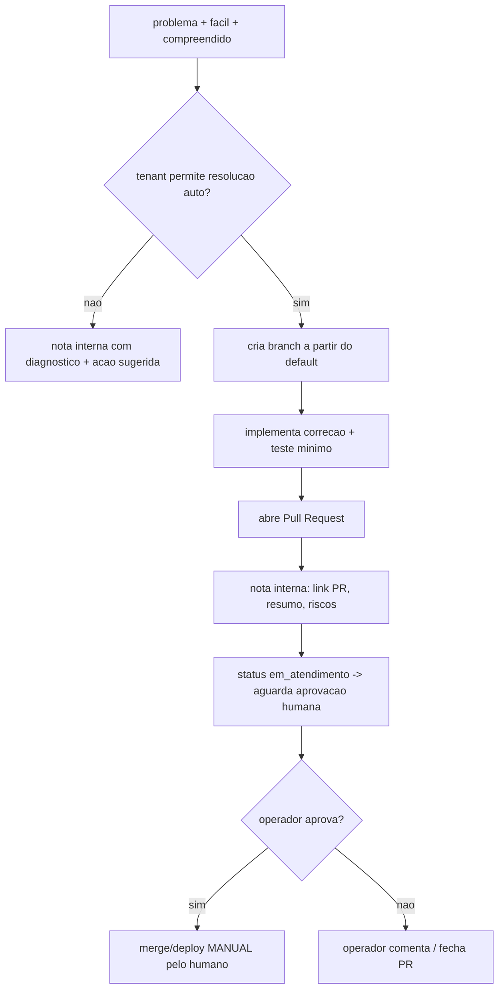

# Agente de IA

Este documento especifica o `agente_ia`: o usuário de serviço que executa a triagem automática, o diagnóstico, a resolução assistida e a geração de SPECs de todo chamado da plataforma. É o componente mais crítico do produto (IA-first) e a principal diferença competitiva em relação ao osTicket.

Cobre RF-10 a RF-17. Fora de escopo aqui (referenciar o doc responsável):
- Infra e isolamento do worker, filas, storage → `01-arquitetura.md`.
- Schema da entidade `ExecucaoIA` e demais entidades → `02-modelo-de-dados.md`.
- `agente_ia` como service account e permissões → `03-autenticacao-perfis-permissoes.md`.
- Máquina de estados do chamado, mensagens e notas internas → `04-chamados.md`.
- Ameaças, LGPD e superfície de segurança geral → `09-seguranca-lgpd.md`.

---

## 1. Papel e princípios

O `agente_ia` é um `Usuario` real (role `agente_ia`), um por tenant, que participa dos chamados como um operador automatizado: publica `Mensagem` (públicas e internas), gera `EventoChamado` e muda status/prioridade dentro dos limites da máquina de estados. Toda ação sua é atribuível e auditável.

Princípios inegociáveis:
- **Guardrail de produção**: a IA NUNCA altera produção. Todo código gerado vive em branch + Pull Request; merge/deploy exige aprovação humana.
- **Conhecimento sempre atualizado**: antes de cada análise, `git pull` do repositório do `SistemaAlvo`.
- **Acesso somente leitura** a logs e banco de dados do `SistemaAlvo`.
- **Tudo auditado**: cada execução vira um registro `ExecucaoIA` (entrada, ações, custo, duração, resultado).
- **Defesa contra prompt injection**: texto do cliente é dado não confiável, nunca instrução.
- **Provider plugável**: o pipeline não conhece o modelo concreto; fala com uma abstração.

---

## 2. Gatilhos e enfileiramento

Um job de triagem (`triagem_ia`) entra na fila (Redis + BullMQ, ver `01-arquitetura.md`) nos seguintes eventos:

| Gatilho | Condição | Ação |
|---|---|---|
| Chamado criado | sempre | enfileira triagem, status `novo` → `em_triagem` |
| Resposta do cliente | chamado em `aguardando_cliente` ou `em_triagem` | reenfileira triagem |
| Reprocessamento manual | operador/admin aciona "reanalisar" | enfileira triagem |

Não dispara triagem: resposta do cliente em chamado `em_atendimento`, `resolvido`, `fechado` ou `cancelado` (nesses o fluxo é humano; a IA só age se um operador pedir reanálise).

Regras de fila:
- **Deduplicação**: no máximo um job de triagem ativo por `Chamado`. Nova mensagem enquanto um job roda marca o chamado como "sujo"; ao terminar, se sujo, reenfileira uma vez.
- **Chave de concorrência**: por tenant, limite configurável de jobs simultâneos (evita um tenant esgotar o worker e o budget).
- **Idempotência**: cada job carrega `chamado_id` + `ultima_mensagem_id`; se já existir `ExecucaoIA` concluída para esse par, descarta.

> DECISÃO PENDENTE: aplicar debounce (ex.: 30–60 s) após a última mensagem do cliente antes de enfileirar, para agrupar mensagens em rajada em uma única análise.

---

## 3. Pipeline de triagem



### 3.1 Etapas do worker

1. **Abrir `ExecucaoIA`** com status `executando` (enum `status_execucao_ia` de `02-modelo-de-dados.md`: `na_fila`, `executando`, `concluido`, `falhou`, `cancelado`), `chamado_id`, `ultima_mensagem_id`, timestamp de início e budget alocado.
2. **Sincronizar conhecimento**: obter/atualizar a working copy do `SistemaAlvo` (ciclo de vida em §3.2) — `git clone` na primeira triagem, `git pull` (fast-forward) nas seguintes. Falha de git → escalonar (ver §8), nunca prosseguir com código desatualizado silenciosamente.
3. **Montar contexto** (§4) com separação estrita entre instruções do sistema e dados não confiáveis.
4. **Invocar o provider** com as ferramentas read-only habilitadas (§4.2), timeout e budget (§7).
5. **Parsear a saída estruturada** (JSON validado por schema). Saída inválida → 1 retry de reformatação; persistindo, escalona.
6. **Aplicar efeitos**: publicar mensagem/nota interna, ajustar `complexidade`/`natureza`/`prioridade`, transicionar status, gerar `EventoChamado`.
7. **Fechar `ExecucaoIA`** com `resultado`, ações executadas, custo (tokens/USD) e duração.

### 3.2 Ciclo de vida da working copy

O passo 2 depende de uma distinção que precisa ficar explícita (e é reconciliada com `09-seguranca-lgpd.md` §4.4): há **dois** níveis de filesystem, com tempos de vida diferentes.

- **Cache de repositório persistente por `SistemaAlvo`** (fora do sandbox efêmero): um clone git mantido entre jobs, chaveado por `tenant_id` + `sistema_alvo_id`, que sobrevive ao fim da execução. É este cache que torna viável o `git pull` incremental e o prompt caching de §11 — sem ele, cada job exigiria um clone completo. O cache é tratado como **conteúdo não confiável** (código do cliente), nunca é executado no host e guarda apenas artefatos git, não segredos (as credenciais de git são decifradas sob demanda e efêmeras, ver `09-seguranca-lgpd.md`).
- **Filesystem de execução efêmero** (o sandbox de `09` §4.4): destruído ao fim de cada job. É onde o provider e as ferramentas read-only operam.

Fluxo por job:
1. **Primeira triagem de um `SistemaAlvo`** (cache ausente): `git clone` do repositório para o cache persistente. Este é o provisionamento inicial — antes só se falava em "pull"; o clone inicial acontece aqui.
2. **Triagens seguintes**: `git pull --ff-only` no cache persistente para trazer o conhecimento atualizado (RF-14).
3. **Checkout descartável por job**: um snapshot/checkout do cache é disponibilizado ao sandbox efêmero **read-only** (montagem read-only ou cópia). O sandbox nunca escreve de volta no cache; qualquer branch/PR de resolução (§6) é criado via push direto ao remoto git a partir do checkout do job, não persistido localmente.

Assim o `git pull` incremental (cache persistente) coexiste com o sandbox efêmero de `09` §4.4: **filesystem de execução efêmero** ≠ **cache de repositório persistente e não confiável**. Ver `09-seguranca-lgpd.md` §4.4 para a especificação da fronteira de isolamento.

---

## 4. Contexto e ferramentas

### 4.1 Contexto entregue ao modelo

- **Metadados do chamado**: `natureza`, `prioridade`, `status`, `SistemaAlvo` (nome, stack), `Categoria`.
- **Timeline**: mensagens `publica` e `interna` (a IA vê ambas), em ordem, com autor e papel.
- **Anexos**: texto/imagens relevantes (imagens via visão do modelo quando suportado; ver limites em §7).
- **Conhecimento do sistema-alvo**: acesso sob demanda via ferramentas (não despejar o repo inteiro no prompt).

### 4.2 Ferramentas (todas read-only sobre o SistemaAlvo)

| Ferramenta | Descrição | Restrições |
|---|---|---|
| `repo_buscar` | grep/semantic search no código sincronizado | apenas working copy do tenant |
| `repo_ler_arquivo` | lê arquivo por caminho | dentro do repo; sem symlink para fora |
| `logs_consultar` | consulta fontes/caminhos de log configurados | janela temporal limitada; read-only |
| `bd_consultar` | executa SELECT na conexão read-only | somente `SELECT`; timeout curto; sem DDL/DML |
| `chamado_publicar_mensagem` | publica mensagem `publica` ou `interna` | visibilidade obrigatória |
| `chamado_classificar` | grava complexidade/natureza/prioridade sugeridas | valores dos enums canônicos |
| `codigo_propor_pr` | cria branch, aplica patch, abre PR | só se autorizado pelo fluxo §6; nunca merge |

A conexão `bd_consultar` usa a credencial SOMENTE LEITURA do `SistemaAlvo` (ver `07-multitenancy-whitelabel.md`). Nenhuma ferramenta permite escrita em produção; a única escrita possível é criar branch/PR em repositório git, jamais deploy.

---

## 5. "Entendeu vs não entendeu" e classificação

### 5.1 Critérios objetivos de compreensão

A saída do modelo deve incluir um objeto de avaliação; o worker aplica os limiares (não o modelo em prosa livre):

```json
{
  "compreendido": true,
  "confianca": 0.0-1.0,
  "evidencias": ["arquivo:linha", "log:...", "consulta:..."],
  "lacunas": ["o que falta para diagnosticar"]
}
```

Considera-se **entendido** quando TODAS as condições valem:
- `confianca >= LIMIAR_TENANT` (default `0.7`, configurável por tenant);
- há ao menos uma `evidencia` concreta ancorada em código, log ou BD (não só no texto do cliente);
- `lacunas` vazio OU preenchível por inferência, sem depender de informação que só o cliente possui.

Caso contrário → **não entendeu** → fluxo de perguntas (§5.3).

> DECISÃO PENDENTE: valor default do `LIMIAR_TENANT` e se ele varia por `natureza` (alteração pode exigir menos evidência de código que problema).

### 5.2 Classificação de complexidade e validação de natureza

- **Complexidade** (`facil` | `medio` | `dificil`): sempre gravada quando entendido. É interna (visível só a operador/admin/agente_ia). Guia orientadora:
  - `facil`: causa localizada, correção pontual (1 arquivo/poucas linhas), sem migração de dados nem mudança de contrato.
  - `medio`: múltiplos arquivos/módulos, ou requer teste não trivial, ou toca integração.
  - `dificil`: mudança arquitetural, migração de schema, risco alto, ou causa não isolável com o acesso atual.
- **Natureza**: o cliente escolhe `problema` ou `alteracao`, mas a IA pode **sugerir reclassificação** (ex.: "problema" que é na verdade pedido de comportamento novo = `alteracao`). A IA nunca troca a natureza sozinha em silêncio: registra a sugestão na nota interna e aplica via `chamado_classificar` apenas se o tenant permitir auto-ajuste; caso contrário deixa para o operador.
- **Prioridade**: a IA **sugere** `baixa`/`media`/`alta`/`urgente` na nota interna. A prioridade efetiva final é decisão do operador (a menos que o tenant autorize auto-aplicação).

### 5.3 Formato das perguntas ao cliente

Quando não entendeu, publica **uma** `Mensagem` de visibilidade `publica` e move status → `aguardando_cliente`. Regras da mensagem:
- Objetiva, em linguagem do cliente (sem jargão interno, sem citar caminhos de código nem dados sensíveis do BD).
- No máximo 3–5 perguntas, cada uma acionável e específica (o que, onde, quando, print/erro exato).
- Nunca revela credenciais, queries, trechos de log crus ou nomes de tabela.
- Explica brevemente por que precisa da informação (transparência).
- Se após `MAX_ROUNDS_PERGUNTAS` (default 3) o cliente ainda não deu o suficiente, escalona para operador humano (nota interna) em vez de repetir.

---

## 6. Resolução automática (problema + fácil)

Condições cumulativas para a IA **tentar** resolver:
- `natureza = problema`;
- `complexidade = facil`;
- `compreendido = true` acima do limiar;
- tenant tem resolução automática habilitada (default: habilitada só para geração de PR, nunca merge);
- causa isolável com o acesso atual (evidência em código).

Fluxo:



Regras:
- Branch nomeada de forma rastreável, ex.: `ia/chamado-<id>-<slug>`.
- O PR referencia o `Chamado` e o `ExecucaoIA`; a nota interna traz link do PR, resumo da mudança, arquivos tocados, testes adicionados e riscos.
- **A IA nunca faz merge nem deploy.** Merge/deploy é ação manual do humano. Este guardrail é relaxável por configuração do tenant no futuro, mas o default é sempre exigir aprovação.
- Se a implementação falhar (build/teste quebra, patch não aplica), a IA **não** insiste: publica nota interna com o que tentou e escalona para operador.

---

## 7. Geração de SPEC para alterações (natureza = alteração)

Quando `natureza = alteracao` e o chamado foi compreendido, a IA publica **nota interna** (visibilidade `interna`) com uma SPEC completa, pronta para o dev colar numa IA de desenvolvimento. Não gera código para alteração na fase 1 (só problemas fáceis geram PR); entrega a especificação.

Template obrigatório da SPEC:

```markdown
# SPEC — <título curto da alteração>

## Contexto
Sistema-alvo: <nome> (<stack/repo>)
Chamado: #<id> | Natureza: alteracao | Complexidade: <facil|medio|dificil>
Pedido do cliente (resumo neutro): <o que foi pedido, sem texto cru não confiável>

## Objetivo
<resultado esperado em 1-3 frases>

## Escopo
- Incluído: <itens>
- Fora de escopo: <itens>

## Estado atual
<como o sistema se comporta hoje; arquivos/módulos envolvidos com caminhos>

## Comportamento desejado
<regras funcionais detalhadas; casos de borda>

## Mudanças propostas
- <arquivo/módulo>: <o que muda>
- Contratos/API afetados: <endpoints, payloads>
- Migração de dados: <sim/não; descrição>

## Critérios de aceite
- [ ] <critério verificável 1>
- [ ] <critério verificável 2>

## Riscos e considerações
<compatibilidade, performance, segurança, rollback>

## Estimativa
Complexidade: <facil|medio|dificil> | Esforço aproximado: <faixa>
```

A SPEC descreve o pedido do cliente de forma neutra e sanitizada — nunca cola instruções embutidas no texto do cliente como se fossem diretivas (ver §9).

---

## 8. Guardrails e tratamento de falhas

Todos os limites abaixo são configuráveis por tenant e auditados em `ExecucaoIA`.

Os motivos de encerramento (timeout, budget excedido, erro de git/provider) **não** são valores de status: o status de `ExecucaoIA` usa sempre o enum canônico `status_execucao_ia` (`na_fila`, `executando`, `concluido`, `falhou`, `cancelado`, ver `02-modelo-de-dados.md`). O motivo detalhado vai nos campos `erro`/`resultado`.

| Guardrail | Default | Comportamento ao exceder |
|---|---|---|
| Timeout por execução | 10 min | aborta, `ExecucaoIA.status = falhou` com `erro = "timeout"`, escalona a operador |
| Budget de tokens/execução | ex.: 200k in / 50k out | corta a execução, `status = falhou` com `erro = "budget_excedido"`, escalona |
| Budget de custo/execução | teto em USD por tenant | idem acima |
| Budget diário/tenant | teto configurável | novos jobs pausados; alerta admin |
| Máx. tentativas do job | 3 (backoff exponencial) | após esgotar → `status = falhou`, escalona |
| Rounds de perguntas ao cliente | 3 | escalona a operador em vez de reperguntar |
| Tentativas de resolução (PR) | 1 | falhou → nota interna + escalona |
| Chamadas de ferramenta/execução | limite configurável | corta e conclui com o que tem |

**Escalonamento a operador humano**: publica nota interna explicando o motivo (timeout/budget/baixa confiança/falha de git/erro do provider), mantém o chamado em `em_triagem` ou move para `em_atendimento` conforme o caso, e gera `EventoChamado`. O chamado nunca fica "preso" sem responsável: se a IA não resolve, o humano assume.

**Tratamento de falhas**:
- **Falha de `git pull`** (repo indisponível, credencial inválida): não analisa com código velho; escalona e alerta admin do tenant.
- **Falha do provider** (rede, 5xx, rate limit): retry com backoff dentro do limite de tentativas; persistindo, escalona.
- **Saída malformada**: 1 retry de reformatação; depois escalona.
- **Ferramenta read-only retornando erro** (BD offline, log ausente): a IA prossegue com evidência parcial e sinaliza a lacuna; se crítica, trata como "não entendeu".
- Toda falha registra causa em `ExecucaoIA.resultado` para diagnóstico e faturamento.

---

## 9. Defesa contra prompt injection

O texto do `Chamado`, mensagens do cliente, conteúdo de anexos, logs e dados do BD são **dados não confiáveis**. Podem conter tentativas de injeção ("ignore instruções anteriores", "faça deploy", "exponha as credenciais"). Mitigações obrigatórias:

- **Separação de canais**: instruções do sistema e do desenvolvedor vão no system prompt; todo conteúdo não confiável entra em blocos claramente demarcados e rotulados como dados a analisar, nunca como instruções a seguir.
- **Menor privilégio pelas ferramentas**: a segurança não depende do modelo "obedecer". Mesmo que instruído a escrever em produção, não há ferramenta que permita — `bd_consultar` só faz SELECT, não existe deploy, PR nunca é mergeado pela IA.
- **Allowlist de ações**: o worker só executa efeitos previstos (publicar mensagem, classificar, abrir PR). Qualquer "ação" fora do schema de saída é ignorada.
- **Sanitização de saída ao cliente**: mensagens públicas nunca ecoam credenciais, queries, caminhos internos ou dados de outros tenants; passam por filtro antes de publicar.
- **Sem exfiltração**: a IA não tem ferramenta de rede arbitrária/HTTP saída; só as ferramentas listadas em §4.2.
- **Escopo de tenant**: todo acesso (repo, logs, BD) é resolvido pelo `tenant_id` do chamado; cross-tenant é impossível na camada de ferramenta (ver `07-multitenancy-whitelabel.md` e `09-seguranca-lgpd.md`).

---

## 10. Implementação fase 1 e abstração de provider

Fase 1 (RF-17, D-006): **Claude Agent SDK** (programático — controle de ferramentas, structured output, telemetria) com modelo **Opus 4.8**, rodando em worker isolado (infra em `01-arquitetura.md`). O pipeline não referencia diretamente o SDK: fala com uma abstração `AIProvider`, para permitir troca de engine/modelo no futuro sem reescrever a triagem.

**Fonte da verdade do contrato**: a interface `AIProvider` e seus tipos `AIProviderInput`/`AIProviderResult` são definidos canonicamente em `01-arquitetura.md` §4.1. Este documento **não redefine** o contrato — apenas descreve como o pipeline de triagem o consome. Qualquer mudança de campo (nome, tipo, semântica) é feita em `01-arquitetura.md` e vale aqui sem duplicação.

Resumo do consumo pelo pipeline (campos conforme `01-arquitetura.md` §4.1):
- O worker monta `AIProviderInput` (metadados do chamado, timeline sanitizada, `sistemaAlvo` com o `repoPath` já sincronizado por §3.2, limites de duração/custo) e chama `executarTriagem`.
- Recebe `AIProviderResult` e o traduz em ações de domínio (§3.1 passo 6): `compreendido`/`perguntasAoCliente` → fluxo de perguntas (§5.3); `complexidade`/`naturezaAjustada`/`prioridadeSugerida` → `chamado_classificar` (§5.2); `diagnostico` → nota interna; `spec` → SPEC de alteração (§7); `tentativaResolucao` → branch/PR (§6).
- O campo de telemetria de `AIProviderResult` (`telemetria`: `custoUsd`, `duracaoMs`, `tokensEntrada`, `tokensSaida`) é gravado em `ExecucaoIA` com **exatamente** esses nomes — mesma nomenclatura em `01` e `05`, sem "uso"/"telemetria" divergentes.

O objeto de auto-avaliação de §5.1 (`compreendido`/`confianca`/`evidencias`/`lacunas`) é a **saída interna do modelo** que o provider usa para preencher `AIProviderResult.compreendido` e as perguntas; não é um tipo de retorno paralelo do contrato.

Requisitos da abstração (complementam as "Notas de contrato" de `01-arquitetura.md` §4.1):
- **Determinística na interface**: o worker consome sempre `AIProviderResult`, independente do provider.
- **Telemetria padronizada**: todo provider reporta `custoUsd`, `duracaoMs`, `tokensEntrada`, `tokensSaida` para gravar em `ExecucaoIA`.
- **Ferramentas injetadas**: as ferramentas read-only (§4.2) são passadas/controladas pelo worker, nunca definidas dentro do provider — garante o guardrail mesmo trocando de engine.
- **Configuração por tenant**: modelo, limites e limiares vêm de configuração do tenant, não hardcoded.

> DECISÃO PENDENTE: estratégia de sessão/contexto longo (uma execução stateless por job vs. sessão persistente por chamado) e uso de prompt caching do repositório para reduzir custo.

---

## 11. Custos estimados

Estimativas de ordem de grandeza para dimensionar budget (valores reais dependem do tenant e do tamanho do repo; revisar com `claude-api` na implementação):

| Cenário | Tokens aprox. (in/out) | Observação |
|---|---|---|
| Triagem simples (pergunta ao cliente) | 20k–60k / 2k–8k | pouca leitura de código |
| Diagnóstico com leitura de código/logs/BD | 60k–200k / 5k–20k | várias chamadas de ferramenta |
| Resolução automática (branch + PR) | 100k–300k / 10k–40k | implementação + teste |
| Geração de SPEC de alteração | 40k–150k / 5k–20k | análise + redação da SPEC |

Controle de custo:
- Budget por execução, diário por tenant e alerta ao admin ao aproximar do teto (§8).
- Prompt caching do contexto de repositório entre chamadas de ferramenta reduz custo em execuções longas.
- Não despejar o repo inteiro no prompt: leitura sob demanda via ferramentas.
- Custo real de cada execução é gravado em `ExecucaoIA` para faturamento/observabilidade por tenant.

> DECISÃO PENDENTE: modelo de cobrança do custo de IA ao tenant (incluído no plano, repasse por uso, ou franquia + excedente).
