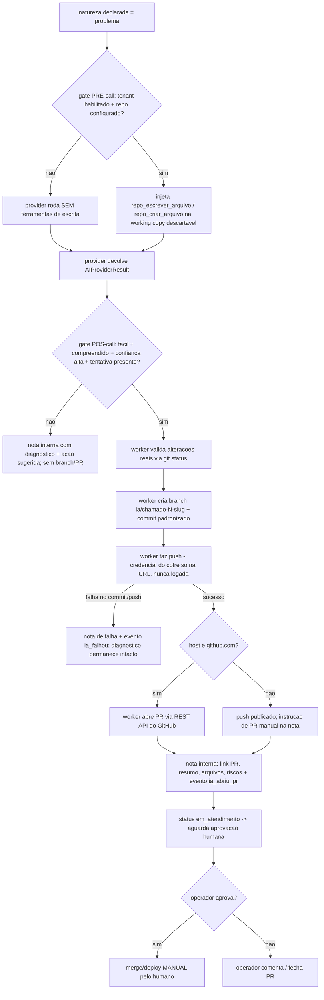

# Agente de IA

Este documento especifica o `agente_ia`: o usuário de serviço que executa a triagem automática, o diagnóstico, a resolução assistida e a geração de SPECs de todo chamado da plataforma. É o componente mais crítico do produto (IA-first) e a principal diferença competitiva em relação ao osTicket.

Cobre RF-10 a RF-17. Fora de escopo aqui (referenciar o doc responsável):

- Infra e isolamento do worker, filas, storage → `01-arquitetura.md`.
- Schema da entidade `ExecucaoIA` e demais entidades → `02-modelo-de-dados.md`.
- `agente_ia` como service account e permissões → `03-autenticacao-perfis-permissoes.md`.
- Máquina de estados do chamado, mensagens e notas internas → `04-chamados.md`.
- Ameaças, LGPD e superfície de segurança geral → `09-seguranca-lgpd.md`.

---

## 1. Papel e princípios

O `agente_ia` é um `Usuario` real (role `agente_ia`), um por tenant, que participa dos chamados como um operador automatizado: publica `Mensagem` (públicas e internas), gera `EventoChamado` e muda status/prioridade dentro dos limites da máquina de estados. Toda ação sua é atribuível e auditável.

Princípios inegociáveis:

- **Guardrail de produção**: a IA NUNCA altera produção. Todo código gerado vive em branch + Pull Request; merge/deploy exige aprovação humana.
- **Conhecimento sempre atualizado**: antes de cada análise, `git pull` do repositório do `SistemaAlvo`.
- **Acesso somente leitura** a logs e banco de dados do `SistemaAlvo`.
- **Tudo auditado**: cada execução vira um registro `ExecucaoIA` (entrada, ações, custo, duração, resultado).
- **Defesa contra prompt injection**: texto do cliente é dado não confiável, nunca instrução.
- **Provider plugável**: o pipeline não conhece o modelo concreto; fala com uma abstração.

---

## 2. Gatilhos e enfileiramento

Um job de triagem (`triagem_ia`) entra na fila (Redis + BullMQ, ver `01-arquitetura.md`) nos seguintes eventos:

| Gatilho                | Condição                                                    | Ação                                                                                                                                                                                             |
| ---------------------- | ----------------------------------------------------------- | ------------------------------------------------------------------------------------------------------------------------------------------------------------------------------------------------ |
| Chamado criado         | sempre (tenant com `agente_ia`)                             | enfileira triagem, status `novo` → `em_triagem`                                                                                                                                                  |
| Resposta do cliente    | mensagem pública em QUALQUER estado não terminal (D-017 p3) | reenfileira triagem; de `aguardando_cliente` → `em_triagem` (sistema); de `resolvido` → REABRE (`em_atendimento`, autor) e triagem analisa; em `novo`/`em_triagem`/`em_atendimento` só enfileira |
| Reprocessamento manual | operador/admin aciona "reanalisar"                          | enfileira triagem                                                                                                                                                                                |

Não dispara triagem: mensagens em `fechado`/`cancelado` (estados terminais não aceitam mensagens), notas internas e mensagens de operador/admin (o fluxo humano não re-dispara a IA; se quiser a IA, o operador usa "reanalisar" ou orienta via nota interna, que a triagem seguinte lê — D-015).

**IA silenciada no chamado (D-024):** operador/admin podem silenciar a IA num chamado específico (`chamado.ia_silenciada`, painel "Assistente IA"). Silenciada, **nenhuma** triagem roda naquele chamado: o worker descarta o job no início do processamento (cobre inclusive jobs enfileirados antes do silêncio) e o reprocessamento manual é recusado na action. A reativação é manual (mesmos papéis) e vale para os **próximos** gatilhos — não há reanálise retroativa. Auditoria: eventos internos `ia_silenciada`/`ia_reativada`; o cliente não vê a flag nem os eventos. A `agente_ia` nunca silencia/reativa a si mesma (matriz de autorização, specs/03 §8).

Regras de fila:

- **Deduplicação**: no máximo um job de triagem ativo por `Chamado`. Nova mensagem enquanto um job roda marca o chamado como "sujo"; ao terminar, se sujo, reenfileira uma vez.
- **Chave de concorrência**: por tenant, limite configurável de jobs simultâneos (evita um tenant esgotar o worker e o budget). Implementação (D-016): lock Redis por tenant com **TTL curto (90 s) renovado por heartbeat (30 s)** enquanto a execução vive — se o processo do worker morrer sem liberar (kill/crash; no Windows o Ctrl+C mata sem sinal), o lock órfão expira em ≤ TTL. **Lock ocupado não é falha**: o job é reagendado (30–45 s, com jitter) via `moveToDelayed` + `DelayedError`, sem consumir tentativa, até um teto de reagendamentos (20); só então a espera passa a contar como tentativa.
- **Idempotência**: cada job carrega `chamado_id` + `ultima_mensagem_id`; se já existir `ExecucaoIA` concluída para esse par, descarta.

> DECIDIDO (M7): debounce substituível de **45 s** (`TRIAGEM_DEBOUNCE_S`) após a última mensagem do cliente — mensagens em rajada colapsam numa única análise sobre a última (novo enfileiramento automático do mesmo chamado remove os jobs pendentes anteriores).

---

## 3. Pipeline de triagem

```mermaid
sequenceDiagram
    participant C as Cliente
    participant API as App (Next.js)
    participant Q as Fila (BullMQ)
    participant W as Worker IA
    participant SA as SistemaAlvo (git/logs/BD ro)
    participant P as Provider IA (Opus 4.8)
    participant CH as Chamado (timeline/eventos)

    C->>API: cria chamado / responde
    API->>CH: status = em_triagem
    API->>Q: enfileira triagem_ia
    Q->>W: entrega job
    W->>W: abre ExecucaoIA (executando)
    W->>SA: git pull do repo
    opt mapa ausente ou commit divergente (§3.3)
        W->>W: abre ExecucaoIA de mapeamento (sem chamado_id)
        W->>P: prompt de mapeamento + ferramentas ro
        P->>SA: explora repo (busca/leitura)
        P-->>W: resumo estruturado
        W->>SA: persiste conhecimento_resumo/commit/gerado_em
    end
    W->>W: monta contexto (sanitiza texto do cliente; injeta conhecimento_resumo)
    W->>P: prompt de análise + ferramentas (ro; + escrita se gate pre-call aberto)
    P->>SA: lê código / logs / BD (read-only)
    P-->>W: resultado estruturado (JSON)
    alt Não entendeu
        W->>CH: Mensagem publica (perguntas)
        W->>CH: status = aguardando_cliente
    else Entendeu
        W->>CH: nota interna (diagnostico) + complexidade/natureza/prioridade
        opt respostaAoCliente presente (validada, sem detalhe tecnico)
            W->>CH: Mensagem publica (resposta amigavel ao cliente)
        end
        opt gate pos-call aberto (problema + facil + resolvivel)
            W->>SA: cria branch, commit, push (+ PR via API se github)
            W->>CH: nota interna com link do PR (ou instrucao de PR manual)
        end
        opt alteracao
            W->>CH: nota interna com SPEC completa
        end
        W->>CH: status = em_atendimento (aguarda operador)
    end
    W->>W: fecha ExecucaoIA (resultado, custo, duração)
```

### 3.1 Etapas do worker

1. **Abrir `ExecucaoIA`** com status `executando` (enum `status_execucao_ia` de `02-modelo-de-dados.md`: `na_fila`, `executando`, `concluido`, `falhou`, `cancelado`), `chamado_id`, `ultima_mensagem_id`, timestamp de início e budget alocado.
2. **Sincronizar conhecimento**: obter/atualizar a working copy do `SistemaAlvo` (ciclo de vida em §3.2) — `git clone` na primeira triagem, `git pull` (fast-forward) nas seguintes. Falha de git → escalonar (ver §8), nunca prosseguir com código desatualizado silenciosamente. Em seguida, verifica se é preciso (re)gerar o mapa de conhecimento do sistema (§3.3) — mapa ausente ou commit divergente — e prepara o `conhecimento_resumo` resultante para a montagem de contexto do passo seguinte.
3. **Montar contexto** (§4) com separação estrita entre instruções do sistema e dados não confiáveis.
4. **Invocar o provider** com as ferramentas read-only habilitadas (§4.2), timeout e budget (§7).
5. **Parsear a saída estruturada** (JSON validado por schema). Saída inválida → 1 retry de reformatação; persistindo, escalona.
6. **Aplicar efeitos**: publicar mensagem/nota interna — incluindo, quando presente e validada, a mensagem pública `respostaAoCliente` (§5.4) —, ajustar `complexidade`/`natureza`/`prioridade`, transicionar status, gerar `EventoChamado`. A saída textual da IA é **markdown** e é convertida para o doc rico canônico (`markdownParaDoc`, tarefa #15) antes de entrar no MESMO pipeline de validação/sanitização do editor (allowlist de nós, href seguro, HTML embutido degrada para texto) — perguntas viram listas, SPECs viram headings/checklists, código vira bloco de código.
7. **Fechar `ExecucaoIA`** com `resultado`, ações executadas, custo (tokens/USD) e duração.

### 3.2 Ciclo de vida da working copy

O passo 2 depende de uma distinção que precisa ficar explícita (e é reconciliada com `09-seguranca-lgpd.md` §4.4): há **dois** níveis de filesystem, com tempos de vida diferentes.

- **Cache de repositório persistente por `SistemaAlvo`** (fora do sandbox efêmero): um clone git mantido entre jobs, chaveado por `tenant_id` + `sistema_alvo_id`, que sobrevive ao fim da execução. É este cache que torna viável o `git pull` incremental e o prompt caching de §11 — sem ele, cada job exigiria um clone completo. O cache é tratado como **conteúdo não confiável** (código do cliente), nunca é executado no host e guarda apenas artefatos git, não segredos (as credenciais de git são decifradas sob demanda e efêmeras, ver `09-seguranca-lgpd.md`).
- **Filesystem de execução efêmero** (o sandbox de `09` §4.4): destruído ao fim de cada job. É onde o provider e as ferramentas read-only operam.

Fluxo por job:

1. **Primeira triagem de um `SistemaAlvo`** (cache ausente): `git clone` do repositório para o cache persistente, **da branch configurada** (`git_branch_padrao`), com `--branch <branch> --single-branch`. _(Defeito corrigido em 2026-07-16: o clone sem `--branch` caía na branch **default do remoto** — a IA analisava código da branch errada sempre que a configurada ≠ default, enquanto o PR de resolução já usava a configurada como base. Branch configurada inexistente falha ALTO com `git_sync_falhou` — nunca cai na default silenciosamente.)_
2. **Triagens seguintes**: `git pull --ff-only` no cache persistente para trazer o conhecimento atualizado (RF-14). Se a branch do checkout difere da configurada (admin trocou `git_branch_padrao`, ou cache anterior ao fix), o cache — descartável — é apagado e re-clonado na branch certa.
3. **Checkout descartável por job**: um snapshot/checkout do cache é disponibilizado ao sandbox efêmero **read-only** (montagem read-only ou cópia). O sandbox nunca escreve de volta no cache; qualquer branch/PR de resolução (§6) é criado via push direto ao remoto git a partir do checkout do job, não persistido localmente.

Assim o `git pull` incremental (cache persistente) coexiste com o sandbox efêmero de `09` §4.4: **filesystem de execução efêmero** ≠ **cache de repositório persistente e não confiável**. Ver `09-seguranca-lgpd.md` §4.4 para a especificação da fronteira de isolamento.

### 3.3 Conhecimento do sistema (mapeamento)

Ler o repositório inteiro em cada triagem é proibitivo em custo/latência. Por isso existe uma **execução de IA dedicada ao `SistemaAlvo`**, com `gatilho = 'mapeamento'`, separada de uma triagem de chamado: diferente do job `triagem_ia` de §2 (que sempre carrega um `chamado_id`), o mapeamento roda como execução própria do `SistemaAlvo`, enfileirada na mesma infraestrutura de filas (`01-arquitetura.md` §3.5). D-013 (`specs/decisoes.md`) é a decisão de origem.

**O que a execução de mapeamento faz**: sobre a working copy já sincronizada (§3.2), o provider explora o repositório com as mesmas ferramentas read-only de §4.2 (`Read`, `Grep`, `Glob` nativas do SDK; `logs_consultar`/`bd_consultar` quando o `SistemaAlvo` tiver essas fontes configuradas) e produz um **resumo estruturado** cobrindo:

- **Stack**: linguagens, frameworks, principais dependências.
- **Módulos**: organização de pastas/serviços e a responsabilidade de cada um.
- **Entidades**: principais modelos de dados/tabelas e como se relacionam.
- **Regras de negócio**: invariantes e comportamentos centrais identificados no código.
- **Fluxos**: principais jornadas/processos do sistema (ex.: como uma requisição entra e é tratada).
- **Glossário**: termos e nomenclaturas específicas do domínio do sistema-alvo, para a IA reconhecer o vocabulário do cliente.

**Persistência**: o resultado grava três campos em `SistemaAlvo` (`02-modelo-de-dados.md`) — `conhecimento_resumo` (o mapa estruturado), `conhecimento_commit` (SHA do commit do repositório no momento da geração) e `conhecimento_gerado_em` (timestamp da geração). Um novo mapeamento sobrescreve os três; o histórico das execuções em si permanece em `ExecucaoIA` (ver "Auditoria" abaixo).

**Gatilhos** (qualquer um dispara uma nova execução de mapeamento):

1. **Primeira triagem sem mapa**: o `SistemaAlvo` ainda não tem `conhecimento_resumo` (nunca foi mapeado). O mapeamento roda dentro do próprio pipeline de triagem, antes da montagem de contexto (§3.1 passo 2; diagrama de §3) — a triagem que disparou o mapeamento já se beneficia do mapa recém-gerado.
2. **Commit divergente**: o commit da working copy sincronizada em §3.2 é diferente de `conhecimento_commit` (o repositório evoluiu desde o último mapa). Também roda dentro do pipeline de triagem, no mesmo ponto do item 1.
3. **Manual pelo admin**: ação "Mapear agora" no painel do admin, a qualquer momento — roda fora do contexto de qualquer chamado específico, bastando o `SistemaAlvo` e o commit atual do repositório.

**Uso do mapa**: `conhecimento_resumo` é injetado como contexto de fundo em **toda** triagem (§4.1), reduzindo a chance de a IA perguntar ao cliente algo que o código já responde e ancorando o protocolo investigação-primeiro (§5.1) com conhecimento prévio do sistema — sem substituir a investigação pontual do chamado, que continua via `Grep`/`Glob`/`Read` (D-014).

**Auditoria**: como qualquer execução de IA, o mapeamento grava um `ExecucaoIA` — mas sem `chamado_id` (pertence ao `SistemaAlvo`, não a um chamado; ver `execucao_ia.sistema_alvo_id` e o CHECK correspondente em `02-modelo-de-dados.md`, D-013).

**Limites próprios**: o mapeamento tem guardrails independentes dos de triagem (§8) — cobre o repositório inteiro (mais caro por execução), mas roda com frequência muito menor:

| Guardrail (mapeamento)                                | Comportamento ao exceder                                                                                                     |
| ----------------------------------------------------- | ---------------------------------------------------------------------------------------------------------------------------- |
| `IA_MAPA_MAX_CHARS` — tamanho máx. do resumo          | resumo truncado/reformatado; se o provider não conseguir compactar, mapeamento falha e o mapa anterior (se houver) é mantido |
| `IA_MAPA_BUDGET` — orçamento de custo da execução     | aborta, `ExecucaoIA.status = falhou` (`erro = "budget_excedido"`); mapa anterior permanece válido                            |
| `IA_MAPA_TURNOS` — máx. turnos/chamadas de ferramenta | corta e conclui com o que tem; se insuficiente para produzir resumo coerente, mapeamento falha                               |

> DECISÃO PENDENTE: valores default de `IA_MAPA_MAX_CHARS`/`IA_MAPA_BUDGET`/`IA_MAPA_TURNOS` (tendem a ser maiores que os guardrails de triagem de §8, por cobrir o repositório inteiro, mas compensados pela frequência muito menor de execução).

Falha na execução de mapeamento **não bloqueia a triagem**: sem mapa (nem anterior), a triagem segue apoiada só na investigação pontual do chamado (§5.1); com mapa anterior desatualizado, ele é usado mesmo assim (best-effort) e a divergência de commit permanece registrada para nova tentativa na próxima triagem.

---

## 4. Contexto e ferramentas

### 4.1 Contexto entregue ao modelo

> **Multimodal (#16)**: os prints colados na descrição e em mensagens **públicas** do chamado (nunca em notas internas) são baixados do storage pelo worker (pós-transação, best-effort, até 8 imagens de ≤ 4 MB) e enviados ao provider como blocos de imagem junto com o prompt — o `ClaudeAgentProvider` usa o modo de streaming input do SDK com uma única mensagem `[texto, imagem...]`. O prompt informa a quantidade de imagens e as marca como dado não confiável.

- **Metadados do chamado**: `título`, `natureza`, `prioridade`, `status`, `solicitante`, `SistemaAlvo` (nome, stack), `Categoria`.
- **Descrição completa do chamado**: o texto pleno (texto plano) informado na abertura do chamado, enviado **integralmente** ao provider — não apenas um resumo ou o título. _(Defeito corrigido em 2026-07-16, D-014: desde o M6 o contexto montado para o provider incluía título e timeline, mas **omitia a descrição do chamado** — comprovado em produção com `entrada_tem_descricao=false` para um chamado com descrição de 287 caracteres já presente no banco. A triagem respondia sem conhecer o pedido real do cliente.)_
- **Timeline completa** (D-015): a IA recebe **todas** as mensagens do chamado, `publica` e `interna`, em ordem, com autor e papel — demarcadas por visibilidade em blocos claramente rotulados ("conversa com o cliente" para `publica`, "notas internas da equipe" para `interna`), nunca misturadas sem identificação. _(Defeito corrigido em 2026-07-16, D-015: o contexto levava só mensagens públicas, então a IA não via o próprio diagnóstico anterior nem orientações internas de operadores, apesar de o papel `agente_ia` já ter permissão de leitura das duas visibilidades pela matriz de `03-autenticacao-perfis-permissoes.md` §8.1.)_ Racional: continuidade entre triagens (a IA enxerga sua própria análise anterior registrada em nota interna) e um canal direto operador→IA (orientação deixada em nota interna antes de uma reanálise).
- **Anexos**: texto/imagens relevantes (imagens via visão do modelo quando suportado; ver limites em §7).
- **Conhecimento do sistema-alvo**: o mapa de conhecimento (`conhecimento_resumo`, §3.3) é injetado como contexto de fundo em toda triagem; a investigação do caso específico do chamado é sob demanda via ferramentas (não se despeja o repo inteiro no prompt).
- **Instruções do tenant (D-020)**: texto livre opcional definido pelo **admin** do tenant (`tenant.ia_instrucoes`, `07-` §4.1) com orientações adicionais para a IA — tom, contexto do negócio, prioridades, vocabulário. Entra no **system prompt** da triagem numa seção demarcada ("instruções do administrador do tenant"), **depois** das regras da plataforma e com precedência explícita: em conflito com os guardrails (separação técnico/cliente, formato de saída, nunca merge/deploy, defesa de injection), **as regras da plataforma prevalecem** — as instruções do tenant são semi-confiáveis (vêm de admin autenticado, não do cliente), personalizam mas nunca relaxam segurança. Cap de 4.000 caracteres imposto na gravação. Não se aplica ao mapeamento (§3.3), que é neutro por design.

### 4.2 Ferramentas (read-only sobre o SistemaAlvo, exceto a dupla de escrita gated)

**Exploração de código no nível do Claude Code (D-014)**: o `ClaudeAgentProvider` (implementação real, §10.1) explora o repositório com as ferramentas **nativas do Claude Agent SDK** — `Read`, `Grep` e `Glob`, as mesmas usadas pelo Claude Code — em vez de ferramentas caseiras de busca por substring/leitura integral. Elas rodam com `cwd` fixado no checkout descartável já sincronizado (§3.2), sob uma guarda `canUseTool` que **nega qualquer caminho fora desse checkout**; essa guarda é a fronteira de segurança do repo (validada por teste). `Bash`, `Write`, `Edit`, `Web*` (`WebFetch`/`WebSearch`) e `Task` permanecem **desabilitadas** — a IA nunca executa comandos, escreve fora do fluxo gated abaixo, nem acessa a rede livremente. Os handles `repo_buscar`/`repo_ler_arquivo` do contrato `AIProvider` (`01-arquitetura.md` §4.1) passam a ser o **fallback do provider fake** (usado em testes/dev sem o SDK real); o `ClaudeAgentProvider` de produção não os invoca para exploração de código. `logs_consultar`, `bd_consultar` e a dupla de escrita gated seguem como **handles MCP do worker** — o worker detém a conexão/credencial real e os expõe ao provider já escopados.

| Ferramenta                             | Descrição                                                                                                                | Restrições                                                                                                                                                                                  |
| -------------------------------------- | ------------------------------------------------------------------------------------------------------------------------ | ------------------------------------------------------------------------------------------------------------------------------------------------------------------------------------------- |
| `Read` _(nativa SDK)_                  | lê arquivo por caminho, leitura paginada como no Claude Code                                                             | `cwd` = checkout descartável do job; `canUseTool` nega caminho fora dele                                                                                                                    |
| `Grep` _(nativa SDK)_                  | busca por regex no código sincronizado, como no Claude Code                                                              | idem acima                                                                                                                                                                                  |
| `Glob` _(nativa SDK)_                  | lista arquivos por padrão de caminho, como no Claude Code                                                                | idem acima                                                                                                                                                                                  |
| `logs_consultar` _(MCP)_               | consulta a fonte de logs configurada — adapters `arquivo` (local do worker) e `sftp` (servidor remoto do cliente, D-021) | read-only; tail limitado por bytes/linhas/arquivos; caminho/host fixados pelo ADMIN (o modelo só controla filtro/limite); credencial SFTP (senha ou chave PEM) do cofre, timeout de conexão |
| `bd_consultar` _(MCP)_                 | executa SELECT na conexão read-only (postgres e mysql/mariadb)                                                           | somente `SELECT`; timeout curto; sem DDL/DML; sessão READ ONLY no servidor; LIMIT forçado                                                                                                   |
| `artefato_gerar` _(MCP, D-026)_        | gera um ARQUIVO entregável ao cliente (relatório PDF a partir de markdown — com identidade visual do tenant e gráficos vetoriais via bloco `grafico`, D-027 —, CSV, md, txt), anexado à resposta pública | tetos de quantidade/tamanho por execução; nome sanitizado com extensão forçada; buffer validado pela MESMA allowlist do upload de usuário; anexado só pelo aplicador (§5.6)                 |
| `chamado_publicar_mensagem`            | publica mensagem `publica` ou `interna`                                                                                  | visibilidade obrigatória                                                                                                                                                                    |
| `chamado_classificar`                  | grava complexidade/natureza/prioridade sugeridas                                                                         | valores dos enums canônicos                                                                                                                                                                 |
| `repo_escrever_arquivo` _(MCP)_        | sobrescreve (ou cria) um arquivo na working copy **descartável**                                                         | só injetada com o gate de resolução aberto (§6); nunca toca o cache persistente nem produção                                                                                                |
| `repo_criar_arquivo` _(MCP)_           | cria um arquivo novo na working copy descartável                                                                         | idem acima; falha se o caminho já existir                                                                                                                                                   |
| `repo_buscar` _(fallback, D-014)_      | grep/semantic search — só no provider fake                                                                               | não usado pelo `ClaudeAgentProvider` real; ver nota acima                                                                                                                                   |
| `repo_ler_arquivo` _(fallback, D-014)_ | lê arquivo por caminho — só no provider fake                                                                             | não usado pelo `ClaudeAgentProvider` real; ver nota acima                                                                                                                                   |

A conexão `bd_consultar` usa a credencial SOMENTE LEITURA do `SistemaAlvo` (ver `07-multitenancy-whitelabel.md`). Nenhuma ferramenta do provider permite escrita em produção nem acesso a git/rede: `Read`/`Grep`/`Glob` são só leitura dentro do checkout, sob a guarda `canUseTool`; `repo_escrever_arquivo`/`repo_criar_arquivo` só escrevem numa working copy **descartável** (clone efêmero do cache, destruído ao fim do job — §6); não existe ferramenta de branch/commit/push/PR no provider. Essa etapa é do **worker**: depois que o provider devolve a tentativa, é o worker — o único que detém a credencial do repositório — quem valida, cria a branch, comita, faz push e (GitHub) abre o PR (menor privilégio; ver §6 e `09-seguranca-lgpd.md` §4).

---

## 5. "Entendeu vs não entendeu" e classificação

### 5.1 Critérios objetivos de compreensão

A saída do modelo deve incluir um objeto de avaliação; o worker aplica os limiares (não o modelo em prosa livre):

```json
{
  "compreendido": true,
  "confianca": "baixa | media | alta",
  "evidencias": ["arquivo:linha", "log:...", "consulta:..."],
  "lacunas": ["o que falta para diagnosticar"]
}
```

**Confiança CATEGÓRICA (D-025, 2026-07-22):** `confianca` é `baixa`/`media`/`alta` — nunca número. Um "0.78" de LLM tem precisão ilusória (é um chute com casas decimais); três níveis expressam o mesmo sem fingir exatidão. Critério dado ao modelo: `alta` só com conclusão ancorada em evidência concreta (código/logs/BD); `media` = plausível com lacunas; `baixa` = mais hipótese que evidência. O provider normaliza defensivamente (número legado → faixa; valor desconhecido → `baixa`, fail-closed).

**Etapa 0 — meta-análise da intenção (tarefa #19)**: ANTES de qualquer ferramenta, a IA decide **o que o cliente quer** (título + descrição + timeline): algo quebrado → `problema`; pedido de que o sistema funcione **diferente** (novos valores/opções, mudar ordem/fluxo/regra, nova funcionalidade — mesmo sem nada quebrado) → `alteracao`; só quer entender → `duvida`. A decisão é registrada em `naturezaAjustada` **sempre** — inclusive quando `compreendido = false` (o aplicador passa a aplicá-la também no fluxo de perguntas), pois a classificação de intenção quase sempre é possível só pelo texto. Toda a análise seguinte segue o protocolo da natureza escolhida — em particular, as perguntas ao cliente são específicas por natureza: perguntas de reprodução ("o que aconteceu", "passo a passo") são EXCLUSIVAS de `problema`; em `alteracao` pergunta-se apenas o que falta para especificar a mudança. Motivação: caso real de um chamado de alterações classificado como problema, com pergunta genérica de reprodução — o protocolo anterior era enviesado para bug.

**Protocolo investigação-primeiro (D-013, mecânica atualizada por D-014)**: antes de decidir `compreendido = false`, a IA É OBRIGADA a investigar — buscar os termos do chamado no código com `Grep`/`Glob` (§4.2, ferramentas nativas do SDK) e ler os arquivos relevantes com `Read`, além de consultar `logs_consultar`/`bd_consultar` quando o `SistemaAlvo` tiver essas fontes configuradas. Em `alteracao`, a investigação mira o **estado atual** (onde vivem os valores/fluxos citados — evidências para a SPEC), não um defeito. Perguntas ao cliente (§5.3) são reservadas a **fatos do lado do cliente** — nunca ao que o código, log ou BD já respondem: `compreendido = false` motivado só por não ter investigado é falha de protocolo, não lacuna legítima. O `diagnostico`, entendido ou não, cita as evidências investigadas (arquivo/trecho, log, consulta), coerente com o array `evidencias` abaixo.

Considera-se **entendido** quando TODAS as condições valem:

- `confianca` em pelo menos `media` (a `baixa` indica hipótese sem lastro — pergunta ou escala);
- há ao menos uma `evidencia` concreta ancorada em código, log ou BD (não só no texto do cliente);
- `lacunas` vazio OU preenchível por inferência, sem depender de informação que só o cliente possui.

Caso contrário → **não entendeu** → fluxo de perguntas (§5.3).

> Resolvido por D-025: o antigo `LIMIAR_TENANT` numérico (0.7) foi abolido junto com a confiança numérica; o limiar do gate de resolução é categórico (`IA_RESOLUCAO_CONFIANCA_MIN`, default `alta`).

### 5.2 Classificação de complexidade e validação de natureza

- **Complexidade** (`facil` | `medio` | `dificil`): sempre gravada quando entendido. É interna (visível só a operador/admin/agente_ia). Guia orientadora:
  - `facil`: causa localizada, correção pontual (1 arquivo/poucas linhas), sem migração de dados nem mudança de contrato.
  - `medio`: múltiplos arquivos/módulos, ou requer teste não trivial, ou toca integração.
  - `dificil`: mudança arquitetural, migração de schema, risco alto, ou causa não isolável com o acesso atual.
- **Natureza**: o cliente escolhe `problema`, `alteracao` ou `duvida`, mas a IA pode **sugerir reclassificação** (ex.: "problema" que é na verdade pedido de comportamento novo = `alteracao`, ou um pedido que é só uma pergunta = `duvida`). A IA nunca troca a natureza sozinha em silêncio: registra a sugestão na nota interna e aplica via `chamado_classificar` apenas se o tenant permitir auto-ajuste; caso contrário deixa para o operador.
- **Prioridade**: a IA **sugere** `baixa`/`media`/`alta`/`urgente` na nota interna. A prioridade efetiva final é decisão do operador (a menos que o tenant autorize auto-aplicação).

### 5.3 Formato das perguntas ao cliente

Quando não entendeu, publica **uma** `Mensagem` de visibilidade `publica` e move status → `aguardando_cliente`. **Sem NENHUMA pergunta válida no resultado, nada é publicado**: não existe fallback genérico ("detalhe o passo a passo…") — a aplicação falha (`aplicacao_falhou:sem_perguntas`) e o chamado escalona a humano com nota interna (§8). Regra nascida do incidente de 2026-07-22, em que um resultado degradado do provider publicou o questionário genérico fora de contexto: **antes nenhuma mensagem do que uma mensagem vazia e genérica.** Regras da mensagem:

- Objetiva, em linguagem do cliente (sem jargão interno, sem citar caminhos de código nem dados sensíveis do BD).
- No máximo 3–5 perguntas, cada uma acionável e específica (o que, onde, quando, print/erro exato).
- Nunca revela credenciais, queries, trechos de log crus ou nomes de tabela.
- Explica brevemente por que precisa da informação (transparência).
- Cada pergunta versa sobre fato do lado do cliente (passos, tela, usuário, quando começou) — nunca sobre algo que código, log ou BD já responderiam (protocolo investigação-primeiro, §5.1).
- Se após `MAX_ROUNDS_PERGUNTAS` (default 3) o cliente ainda não deu o suficiente, escalona para operador humano (nota interna) em vez de repetir.

**Natureza de CHAT e ambiguidade (2026-07-16, pedido do usuário).** O prompt do sistema deixa explícito que o chamado é uma **conversa contínua**: toda mensagem pública da IA chega ao cliente como mensagem de chat, o cliente pode responder e a triagem re-dispara a cada nova mensagem dele (D-017 — triagem contínua). Duas regras derivam disso: (a) **solicitação ambígua** (mais de uma interpretação possível, mesmo após investigar) → **perguntar em vez de assumir** (`compreendido = false` + perguntas) — assumir errado custa um diagnóstico/SPEC na direção errada, perguntar custa uma mensagem; (b) o tom é de conversa (retomar o que o cliente disse, perguntas respondíveis em uma frase), nunca de relatório final ou despedida definitiva; (c) **sem saudação repetida** (2026-07-17): cada acionamento é uma execução nova do modelo, que por padrão abria toda resposta com "Olá" — o prompt agora manda cumprimentar no máximo na PRIMEIRA interação; se a timeline já tem mensagem da IA, a conversa já começou e a resposta entra direto no assunto; (d) **formatação de chat** (2026-07-17): o modelo tendia a responder num parágrafo único corrido (verificado em produção: o texto cru não tinha `\n` — o pipeline markdown→`<br>`/`<p>` estava correto e fiel). O prompt agora exige parágrafos curtos separados por linha em branco e listas markdown para enumerações — nunca bloco único.

### 5.4 Resposta pública ao cliente (D-015)

**Contexto**: antes de D-015, quando a IA entendia o chamado ela só publicava nota interna (diagnóstico) — o cliente ficava sem qualquer retorno até um operador humano agir. `AIProviderResult` ganha o campo `respostaAoCliente: string | null` (contrato canônico em `01-arquitetura.md` §4.1) para fechar essa lacuna.

- **O que é**: uma mensagem pública amigável e **opcional** que o provider pode preencher para confirmar entendimento, dar uma posição sobre o andamento, ou responder diretamente a uma dúvida que a própria IA conseguiu resolver na investigação. Não substitui `perguntasAoCliente` (§5.3, usado quando `compreendido = false`) — é o complemento natural do caminho "entendeu" (§3, diagrama), embora nada impeça o provider de preenchê-lo também ao lado de um pedido de mais informações, quando fizer sentido.
- **Quem publica**: o worker (o "aplicador" do resultado, §3.1 passo 6), como `Mensagem` de visibilidade `publica` autorada pelo `agente_ia`, nunca o provider diretamente. Quando a execução gerou artefatos entregáveis (§5.6, D-026), eles vão como **anexos** desta mensagem.
- **Regra de linguagem (inegociável)**: mensagens públicas ao cliente **nunca** contêm detalhes técnicos — caminhos de arquivo, nomes de função/classe, trechos de código, stack traces, nomes de tabela/coluna ou qualquer jargão de implementação. Tudo isso pertence exclusivamente à nota interna (`diagnostico`, §3.1 passo 6). `respostaAoCliente` fala a língua do cliente, do mesmo jeito que as perguntas de §5.3.
- **Validador conservador**: antes de publicar, o worker valida `respostaAoCliente` contra sinais de conteúdo técnico (ex.: caminhos com `/`, extensões de arquivo, blocos de código/crase, nomes em `camelCase`/`snake_case` típicos de identificador, termos como "função", "classe", "arquivo", "commit", "branch", "endpoint", "query"). Encontrado qualquer sinal, o worker **rebaixa** a resposta pública para uma mensagem genérica de fallback (ex.: "Analisamos seu chamado e já temos um diagnóstico; nossa equipe vai dar sequência.") — o texto original gerado pelo provider é preservado **na nota interna**, marcado com um aviso (ex.: "resposta pública rebaixada pelo validador — conteúdo técnico detectado") para o operador revisar e, se quiser, publicar manualmente uma versão adequada.
- **Validador de promessa falsa (D-022, 2026-07-17)**: além do conteúdo técnico, o worker valida `respostaAoCliente` contra **afirmações de correção já concluída** ("resolvi", "foi corrigido", "a correção foi aplicada", "voltou a funcionar") nos fluxos `problema`/`alteracao` — a tentativa da IA é sempre uma **proposta em PR aguardando revisão humana** (§6), então anunciar "resolvido" é falso até o deploy. Detectada a promessa, a resposta é rebaixada para o fallback genérico ("equipe está analisando") e o texto original vai para a nota interna com o aviso. Em `duvida` o validador de promessa **não** se aplica (a resposta em si resolve o chamado — §5.5). O system prompt também proíbe explicitamente o anúncio de resolução.
- **Ausência**: `respostaAoCliente = null` é o caso normal quando o diagnóstico não gera nada relevante para comunicar ainda (ex.: aguardando decisão do operador); nesse caso não há mensagem pública nova e o chamado segue para `em_atendimento` só com a nota interna, como antes de D-015.

### 5.5 Natureza `duvida`: a IA responde sozinha (D-017)

`duvida` = o cliente só quer **entender** algo (como usar, por que um comportamento é assim, o que um campo significa) — nada precisa mudar no sistema. Fluxo:

- A IA investiga o código até ter certeza e escreve a resposta **completa** em `respostaAoCliente`, em linguagem simples (explica o comportamento, nunca a implementação); o detalhe técnico da investigação vai no `diagnostico` (nota interna).
- **Resposta publicada e válida** (não vazia e **não rebaixada** pelo validador de §5.4): o aplicador transiciona `em_triagem` → `resolvido` — a única situação em que o `agente_ia` marca `resolvido` (aresta exclusiva da máquina de estados, `04-chamados.md` §1.3). O prazo de auto-fechamento corre normalmente; o cliente pode reabrir.
- **Sem resposta utilizável** (rebaixada pelo validador ou ausente): o chamado vai a `em_atendimento` — um humano responde. Dúvida com o fallback genérico NÃO conta como respondida.
- **Não entendeu a dúvida**: fluxo normal de perguntas (§5.3) → `aguardando_cliente`.
- Para `duvida` a IA **nunca** gera SPEC (§7) nem tentativa de resolução/PR (§6) — não há mudança de sistema envolvida.

### 5.6 Artefatos entregáveis (D-026)

Um chamado pode pedir um **material pronto** — "quero um relatório dos números do mês", uma extração de dados, uma listagem — e não uma mudança no sistema. A IA passa a poder **entregar o arquivo de verdade**: levanta os dados com as ferramentas de investigação (`bd_consultar`/`logs_consultar`/código) e chama `artefato_gerar` (§4.2) com o conteúdo completo.

**Divisão de responsabilidade (menor privilégio, como em tudo)**: o provider só entrega **conteúdo textual** (markdown para PDF; texto cru para csv/md/txt). A materialização é toda do **worker**: renderiza o PDF localmente (lexer do marked + pdfkit — nunca HTML intermediário nem browser headless), acrescenta BOM UTF-8 ao CSV (planilhas abrem acentos corretamente), sanitiza o nome (sem diretórios/controle; extensão **forçada** ao formato) e valida o buffer com a **mesma allowlist do upload de usuário** (`detectarTipo`, magic bytes/heurística de texto). Falha de validação/limite volta como erro da ferramenta **para o modelo** (que corrige e re-tenta) — nunca estoura a aplicação em Tx2.

**Entrega (aplicador, §3.1 passo 6)**: os artefatos acumulados na execução viram **anexos** da mensagem pública de `respostaAoCliente` (§5.4) — mesma entidade `Anexo`, mesmo storage, mesma autorização e rota de download de sempre; nenhum canal paralelo. Casos de borda:

- `compreendido = true` **sem** `respostaAoCliente`: os artefatos são anexados à **nota interna** de diagnóstico (o operador baixa e encaminha) — nunca se perdem em silêncio.
- Resposta **rebaixada** pelo validador (§5.4): o texto vira o fallback genérico, mas os anexos **permanecem** — o rebaixamento é do texto (jargão/promessa); o arquivo é o entregável que o cliente pediu.
- `compreendido = false`: artefatos são **descartados** com log — entregável sem contexto não vai ao cliente; o prompt orienta o modelo a não gerar nesse fluxo.

**Guardrails**: teto de artefatos por execução (`IA_ARTEFATOS_MAX`, default 5) e de tamanho de conteúdo por artefato (`IA_ARTEFATO_MAX_CHARS`, default 500k); mesmo `nome_arquivo` repetido **substitui** a versão anterior (retentativa do modelo, não duplica anexo); o conteúdo do artefato segue as mesmas regras de linguagem da mensagem pública (dados que o cliente pediu; sem SQL, caminhos de código ou jargão interno). O prompt manda sempre acompanhar o artefato de uma `respostaAoCliente` mencionando o anexo, e proíbe gerar artefatos não pedidos.

**Formatação nas mensagens (parte do mesmo pacote D-026)**: o pipeline markdown → doc rico (§3.1 passo 6) já cobria negrito, listas, **tabelas GFM**, títulos e código; o que faltava era o modelo saber disso — o system prompt agora anuncia explicitamente que a saída é renderizada com formatação real e orienta a usá-la quando ajudar a leitura (sem forçar em respostas curtas de conversa).

**Identidade visual + gráficos no PDF (D-027)**: o PDF de artefato sai com a **marca do tenant**, montada no worker a partir do `config_branding` (specs/07 §3): capa com faixa na `cor_primaria` (logo claro PNG/JPEG carregado lazy do storage, best-effort; senão `nome_exibicao`) e data; títulos/links/marcadores na cor da marca (escurecida se reprovar contraste sobre branco); tabelas com cabeçalho na cor da marca, zebra em tint e colunas numéricas à direita; rodapé paginado com o nome do tenant. Sem branding, vale a paleta padrão do produto (D-019). Além disso, um bloco de código com linguagem `grafico` no markdown do artefato — JSON `{tipo: barras|linhas|pizza, titulo?, dados: [{rotulo, valor}]}` — vira um **gráfico vetorial** desenhado pelo próprio pdfkit (nenhum chromium/canvas/binário externo; decisão e alternativas descartadas no ADR). Tetos de legibilidade: 24 pontos (barras/linhas) e 8 fatias (pizza — agregar o resto em "Outros"); spec inválida volta ao modelo como erro corrigível (`grafico_invalido:<motivo>`, com a forma esperada). O prompt anuncia que o estilo é automático (o modelo escreve APENAS o conteúdo) e que o bloco `grafico` só é suportado no artefato PDF — nunca em mensagens ou md/txt/csv.

---

## 6. Resolução automática (problema/alteração + fácil)

A tentativa de resolução é controlada por um **gate duplo no pipeline** — nunca no provider (menor privilégio, `09-seguranca-lgpd.md` §4). **D-023 (2026-07-17)**: as naturezas elegíveis são `problema` E `alteracao` — o limitador real é a **complexidade `facil`** + confiança, não a natureza (caso motivador: "alterar um texto" é alteração fácil e ficava sem PR; `duvida` segue fora — nada a mudar no sistema):

- **Gate PRÉ-call**: decide se as ferramentas de **escrita** (`repo_escrever_arquivo`/`repo_criar_arquivo`, §4.2) são sequer injetadas nesta triagem. Condições cumulativas: tenant com resolução automática habilitada (default: habilitada só para geração de PR, nunca merge) + `naturezaDeclarada ∈ {problema, alteracao}` + `SistemaAlvo` com repositório configurado. Se o gate está fechado, o provider não recebe as ferramentas de escrita e não há como tentar resolver.
- **Gate PÓS-call**: decide se o **worker** de fato cria branch/push/PR, com base no resultado real devolvido pelo provider. Condições cumulativas: gate pré-call também satisfeito + `naturezaAjustada ∈ {problema, alteracao}` + `complexidade = facil` + `compreendido = true` + `confianca` no mínimo `IA_RESOLUCAO_CONFIANCA_MIN` (D-025: categórica, default `alta`) + `tentativaResolucao` presente (o provider efetivamente escreveu arquivos). Para alteração, o prompt orienta: só implementa mudança pontual e inequívoca (texto/rótulo/valor); qualquer regra de negócio/fluxo/ambiguidade não é `facil`. A SPEC (§7) continua sendo gerada normalmente.

Quando o gate pré-call está aberto, o provider — se decidir tentar — escreve a correção numa **working copy descartável** (clone efêmero do cache, §3.2) usando `repo_escrever_arquivo`/`repo_criar_arquivo`, e devolve `tentativaResolucao = { resumo, arquivosAlterados }` (contrato canônico em `01-arquitetura.md` §4.1). O provider não tem acesso a git nem à rede — só escreve arquivos.

Fluxo:



Regras:

- Branch nomeada de forma rastreável: `ia/chamado-<numero>-<slug>`, criada pelo **worker** a partir do branch default.
- Commit com mensagem padronizada referenciando `Chamado` e `ExecucaoIA`; autor do commit é a identidade de serviço da IA (sem PII de humano).
- **Push com a credencial do cofre só na URL** (nunca logada, nunca gravada em `.git/config`); qualquer erro de push descarta a mensagem crua do git para não vazar a URL autenticada.
- **PR automático só quando o repositório é `github.com`** e há um token com escopo de PR no cofre: o worker abre o PR via REST API. Para outros hosts (GitLab, Bitbucket, self-hosted etc.), o worker publica a branch (push) e a nota interna traz a instrução para abrir o PR manualmente.
- O PR referencia o `Chamado` e o `ExecucaoIA`; a nota interna traz link do PR (quando houver), resumo da mudança, arquivos tocados e riscos.
- **Comunicação ao cliente (D-022, 2026-07-17)**: quando a tentativa vira PR/push com sucesso, o **pipeline** publica uma mensagem pública **fixa** (nunca escrita pelo modelo — `MENSAGEM_PUBLICA_CORRECAO_EM_REVISAO` em `@chamados/shared`) informando que a análise identificou a causa e a correção proposta está **em revisão pela equipe** — sem jargão (nada de "PR"/"branch"), sem prazo e sem afirmar que algo mudou em produção. É o único canal que fala da correção ao cliente: a `respostaAoCliente` do modelo é proibida (prompt) e rebaixada (validador §5.4) se anunciar resolução.
- **A IA nunca faz merge nem deploy.** Merge/deploy é ação manual do humano. Este guardrail é relaxável por configuração do tenant no futuro, mas o default é sempre exigir aprovação.
- Se a implementação falhar (provider não altera nada, commit falha, push falha), o worker **não** insiste: publica nota interna de falha (evento `ia_falhou`) sem derrubar o diagnóstico já aplicado, e escalona para operador.

---

## 7. Geração de SPEC para alterações (natureza = alteração)

Quando `natureza = alteracao` e o chamado foi compreendido, a IA publica **nota interna** (visibilidade `interna`) com uma SPEC completa, pronta para o dev colar numa IA de desenvolvimento. Não gera código para alteração na fase 1 (só problemas fáceis geram PR); entrega a especificação.

Template obrigatório da SPEC:

```markdown
# SPEC — <título curto da alteração>

## Contexto

Sistema-alvo: <nome> (<stack/repo>)
Chamado: #<id> | Natureza: alteracao | Complexidade: <facil|medio|dificil>
Pedido do cliente (resumo neutro): <o que foi pedido, sem texto cru não confiável>

## Objetivo

<resultado esperado em 1-3 frases>

## Escopo

- Incluído: <itens>
- Fora de escopo: <itens>

## Estado atual

<como o sistema se comporta hoje; arquivos/módulos envolvidos com caminhos>

## Comportamento desejado

<regras funcionais detalhadas; casos de borda>

## Mudanças propostas

- <arquivo/módulo>: <o que muda>
- Contratos/API afetados: <endpoints, payloads>
- Migração de dados: <sim/não; descrição>

## Critérios de aceite

- [ ] <critério verificável 1>
- [ ] <critério verificável 2>

## Riscos e considerações

<compatibilidade, performance, segurança, rollback>

## Estimativa

Complexidade: <facil|medio|dificil> | Esforço aproximado: <faixa>
```

A SPEC descreve o pedido do cliente de forma neutra e sanitizada — nunca cola instruções embutidas no texto do cliente como se fossem diretivas (ver §9).

---

## 8. Guardrails e tratamento de falhas

Todos os limites abaixo são configuráveis por tenant e auditados em `ExecucaoIA`.

Os motivos de encerramento (timeout, budget excedido, erro de git/provider) **não** são valores de status: o status de `ExecucaoIA` usa sempre o enum canônico `status_execucao_ia` (`na_fila`, `executando`, `concluido`, `falhou`, `cancelado`, ver `02-modelo-de-dados.md`). O motivo detalhado vai nos campos `erro`/`resultado`.

| Guardrail                       | Default                 | Comportamento ao exceder                                                                |
| ------------------------------- | ----------------------- | --------------------------------------------------------------------------------------- |
| Timeout por execução            | 10 min                  | aborta, `ExecucaoIA.status = falhou` com `erro = "timeout"`, escalona a operador        |
| Budget de tokens/execução       | ex.: 200k in / 50k out  | corta a execução, `status = falhou` com `erro = "budget_excedido"`, escalona            |
| Budget de custo/execução        | teto em USD por tenant  | idem acima                                                                              |
| Budget diário/tenant            | teto configurável       | novos jobs pausados; alerta admin                                                       |
| Máx. tentativas do job          | 3 (backoff exponencial) | após esgotar → `status = falhou`, escalona (lock ocupado NÃO consome tentativa — D-016) |
| Rounds de perguntas ao cliente  | 3                       | escalona a operador em vez de reperguntar                                               |
| Tentativas de resolução (PR)    | 1                       | falhou → nota interna + escalona                                                        |
| Chamadas de ferramenta/execução | limite configurável     | corta e conclui com o que tem                                                           |

**Escalonamento a operador humano**: publica nota interna explicando o motivo (timeout/budget/baixa confiança/falha de git/erro do provider), mantém o chamado em `em_triagem` ou move para `em_atendimento` conforme o caso, e gera `EventoChamado`. O chamado nunca fica "preso" sem responsável: se a IA não resolve, o humano assume.

A promessa "nunca preso" é garantida em **três camadas** (D-016):

1. **Dentro do pipeline** (falha pós-Tx1: git, provider, aplicação): o próprio processador registra `ExecucaoIA.falhou` + `ia_falhou` e escalona.
2. **No nível da fila** (erro que escapou do processador — lock além do teto, banco fora na Tx1): quando o job esgota as tentativas do BullMQ, o handler de falha final cria uma `ExecucaoIA` já `falhou` (compensação, auditável) e escalona.
3. **Varredura de manutenção** (rede de segurança final, cobre worker morto no meio e job perdido): a cada ciclo, `ExecucaoIA` presa em `na_fila`/`executando` além do limiar (default 30 min) vira `falhou` (`erro = "execucao_orfa"`) com escalonamento do chamado; e chamado parado em `em_triagem` sem execução ativa **e sem job pendente na fila** além do limiar é escalado (`erro = "triagem_nao_executada"`).

**Tratamento de falhas**:

- **Falha de `git pull`** (repo indisponível, credencial inválida): não analisa com código velho; escalona e alerta admin do tenant.
- **Falha do provider** (rede, 5xx, rate limit): retry com backoff dentro do limite de tentativas; persistindo, escalona.
- **Saída malformada/ilegível**: sem `structured_output` e sem JSON parseável na última mensagem, o provider lança `saida_estruturada_ilegivel` → `ExecucaoIA.falhou` + escalonamento, com o texto cru registrado no log (truncado) para diagnóstico. _(Revisado em 2026-07-22 — incidente: a saída ilegível era degradada silenciosamente para "não entendeu" vazio e o cliente recebia um questionário genérico. Não há retry automático de reformatação: o custo de uma reexecução completa é do operador, via "Reexecutar triagem", nunca automático — supersede o "1 retry de reformatação" anterior.)_
- **Ferramenta read-only retornando erro** (BD offline, log ausente): a IA prossegue com evidência parcial e sinaliza a lacuna; se crítica, trata como "não entendeu".
- Toda falha registra causa em `ExecucaoIA.resultado` para diagnóstico e faturamento.

---

## 9. Defesa contra prompt injection

O texto do `Chamado`, mensagens do cliente, conteúdo de anexos, logs e dados do BD são **dados não confiáveis**. Podem conter tentativas de injeção ("ignore instruções anteriores", "faça deploy", "exponha as credenciais"). Mitigações obrigatórias:

- **Separação de canais**: instruções do sistema e do desenvolvedor vão no system prompt; todo conteúdo não confiável entra em blocos claramente demarcados e rotulados como dados a analisar, nunca como instruções a seguir.
- **Menor privilégio pelas ferramentas**: a segurança não depende do modelo "obedecer". Mesmo que instruído a escrever em produção, não há ferramenta que permita — `bd_consultar` só faz SELECT, não existe deploy, PR nunca é mergeado pela IA.
- **Allowlist de ações**: o worker só executa efeitos previstos (publicar mensagem, classificar, abrir PR). Qualquer "ação" fora do schema de saída é ignorada.
- **Sanitização de saída ao cliente**: mensagens públicas nunca ecoam credenciais, queries, caminhos internos ou dados de outros tenants; passam por filtro antes de publicar.
- **Sem exfiltração**: a IA não tem ferramenta de rede arbitrária/HTTP saída; só as ferramentas listadas em §4.2.
- **Escopo de tenant**: todo acesso (repo, logs, BD) é resolvido pelo `tenant_id` do chamado; cross-tenant é impossível na camada de ferramenta (ver `07-multitenancy-whitelabel.md` e `09-seguranca-lgpd.md`).

---

## 10. Implementação fase 1 e abstração de provider

Fase 1 (RF-17, D-006): **Claude Agent SDK** (programático — controle de ferramentas, structured output, telemetria) com modelo **Opus 4.8**, rodando em worker isolado (infra em `01-arquitetura.md`). O pipeline não referencia diretamente o SDK: fala com uma abstração `AIProvider`, para permitir troca de engine/modelo no futuro sem reescrever a triagem.

**Fonte da verdade do contrato**: a interface `AIProvider` e seus tipos `AIProviderInput`/`AIProviderResult` são definidos canonicamente em `01-arquitetura.md` §4.1. Este documento **não redefine** o contrato — apenas descreve como o pipeline de triagem o consome. Qualquer mudança de campo (nome, tipo, semântica) é feita em `01-arquitetura.md` e vale aqui sem duplicação.

Resumo do consumo pelo pipeline (campos conforme `01-arquitetura.md` §4.1):

- O worker monta `AIProviderInput` (metadados do chamado, timeline sanitizada, `sistemaAlvo` com o `repoPath` já sincronizado por §3.2, limites de duração/custo) e chama `executarTriagem`.
- Recebe `AIProviderResult` e o traduz em ações de domínio (§3.1 passo 6): `compreendido`/`perguntasAoCliente` → fluxo de perguntas (§5.3); `respostaAoCliente` → mensagem pública ao cliente, validada contra conteúdo técnico (§5.4, D-015); `complexidade`/`naturezaAjustada`/`prioridadeSugerida` → `chamado_classificar` (§5.2); `diagnostico` → nota interna; `spec` → SPEC de alteração (§7); `tentativaResolucao` → branch/PR (§6).
- O campo de telemetria de `AIProviderResult` (`telemetria`: `custoUsd`, `duracaoMs`, `tokensEntrada`, `tokensSaida`) é gravado em `ExecucaoIA` com **exatamente** esses nomes — mesma nomenclatura em `01` e `05`, sem "uso"/"telemetria" divergentes.

O objeto de auto-avaliação de §5.1 (`compreendido`/`confianca`/`evidencias`/`lacunas`) é a **saída interna do modelo** que o provider usa para preencher `AIProviderResult.compreendido` e as perguntas; não é um tipo de retorno paralelo do contrato.

Requisitos da abstração (complementam as "Notas de contrato" de `01-arquitetura.md` §4.1):

- **Determinística na interface**: o worker consome sempre `AIProviderResult`, independente do provider.
- **Telemetria padronizada**: todo provider reporta `custoUsd`, `duracaoMs`, `tokensEntrada`, `tokensSaida` para gravar em `ExecucaoIA`.
- **Ferramentas injetadas**: as ferramentas read-only (§4.2) são passadas/controladas pelo worker, nunca definidas dentro do provider — garante o guardrail mesmo trocando de engine.
- **Configuração por tenant**: modelo, limites e limiares vêm de configuração do tenant, não hardcoded.

> DECISÃO PENDENTE: estratégia de sessão/contexto longo (uma execução stateless por job vs. sessão persistente por chamado) e uso de prompt caching do repositório para reduzir custo.

### 10.1 Autenticação do `ClaudeAgentProvider` (D-012)

O `ClaudeAgentProvider` suporta duas formas de autenticação junto ao Claude Agent SDK/CLI:

- **`ANTHROPIC_API_KEY`** — caminho conforme para produto/produção (inclusive atendendo outros tenants). Tem **precedência** sobre `CLAUDE_CODE_OAUTH_TOKEN` na cadeia de resolução do CLI.
- **`CLAUDE_CODE_OAUTH_TOKEN`** — token de assinatura Claude, gerado via `claude setup-token`; validade de aproximadamente 1 ano, **sem renovação automática**.

A documentação oficial do Agent SDK traz a ressalva: produtos de terceiros não podem oferecer login `claude.ai`/limites de assinatura aos próprios usuários salvo aprovação prévia da Anthropic. Por isso, o uso do token de assinatura fica a critério e risco do operador da instalação, indicado para uso próprio/dev; a recomendação registrada para produção/multi-tenant é `ANTHROPIC_API_KEY`. Decisão e responsabilidade documentadas em D-012 (`specs/decisoes.md`).

---

## 11. Custos estimados

Estimativas de ordem de grandeza para dimensionar budget (valores reais dependem do tenant e do tamanho do repo; revisar com `claude-api` na implementação):

| Cenário                                   | Tokens aprox. (in/out) | Observação                    |
| ----------------------------------------- | ---------------------- | ----------------------------- |
| Triagem simples (pergunta ao cliente)     | 20k–60k / 2k–8k        | pouca leitura de código       |
| Diagnóstico com leitura de código/logs/BD | 60k–200k / 5k–20k      | várias chamadas de ferramenta |
| Resolução automática (branch + PR)        | 100k–300k / 10k–40k    | implementação + teste         |
| Geração de SPEC de alteração              | 40k–150k / 5k–20k      | análise + redação da SPEC     |

Controle de custo:

- Budget por execução, diário por tenant e alerta ao admin ao aproximar do teto (§8).
- Prompt caching do contexto de repositório entre chamadas de ferramenta reduz custo em execuções longas.
- Não despejar o repo inteiro no prompt: leitura sob demanda via ferramentas.
- Custo real de cada execução é gravado em `ExecucaoIA` para faturamento/observabilidade por tenant.

> DECISÃO PENDENTE: modelo de cobrança do custo de IA ao tenant (incluído no plano, repasse por uso, ou franquia + excedente).
