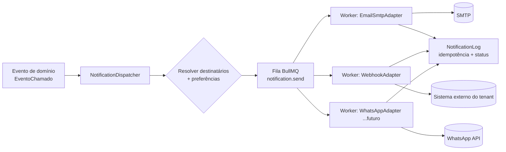

# 06 — Notificações e Gateways

Este documento especifica a camada de notificações da plataforma **Chamados**: a arquitetura de gateways plugáveis (adapter pattern), os adapters de fase 1 (e-mail SMTP e webhook genérico) e os canais futuros (WhatsApp e outros), a matriz de eventos notificáveis × destinatários, os templates com branding por tenant, as preferências por usuário, e o tratamento de fila, retries e idempotência. Cobre também o canal inbound (responder chamado por e-mail/WhatsApp) como item de fase futura.

Escopo relacionado tratado em outros documentos (não duplicar aqui):

- Configuração de canais por tenant e branding assets: `07-multitenancy-whitelabel.md`.
- Schema físico das entidades `CanalNotificacao` e `PreferenciaNotificacao`: `02-modelo-de-dados.md`.
- Eventos de domínio (`EventoChamado`) e máquina de estados que dispara as notificações: `04-chamados.md`.
- Filas BullMQ / Redis a nível de infraestrutura: `01-arquitetura.md`.

Atende diretamente ao requisito **RF-18** (gateways plugáveis: WhatsApp, e-mail etc., arquitetura plugável).

---

## 1. Princípios

1. **Adapter pattern obrigatório**: todo canal de saída implementa a mesma interface. Adicionar WhatsApp, SMS, Slack ou push nunca deve exigir alteração no núcleo de disparo de notificações.
2. **Notificação como efeito de evento de domínio, não como chamada acoplada**. O código de negócio emite um `EventoChamado`; um dispatcher assíncrono decide quem notificar, por quais canais, e enfileira os envios. Nenhum handler de request web envia e-mail de forma síncrona.
3. **Idempotência de ponta a ponta**: um mesmo evento nunca gera duas notificações para o mesmo destinatário no mesmo canal, mesmo com retries de fila ou reprocessamento.
4. **Tenant-first**: templates, remetente, branding e credenciais de gateway são sempre resolvidos pelo `tenant_id` do chamado. Nunca há vazamento de branding ou remetente entre tenants.
5. **Preferência do usuário é soberana** dentro dos limites de eventos obrigatórios (ver §7).

---

## 2. Arquitetura de gateways plugáveis



Componentes:

- **NotificationDispatcher**: recebe o evento, resolve destinatários (§6), aplica preferências (§7), monta um `NotificationJob` por (destinatário × canal) e enfileira. É a única peça que conhece a regra de "quem recebe o quê".
- **Fila `notification.send`** (BullMQ, ver `01-arquitetura.md`): desacopla o disparo do envio e provê retry/backoff.
- **Adapters**: um worker por tipo de canal, cada um implementando `NotificationGateway`. O adapter só sabe _entregar uma mensagem já renderizada_ por um transporte específico. Não conhece regra de negócio.
- **TemplateRenderer**: transforma `(evento, dados, brandingDoTenant, locale)` em payload por canal (§5).
- **NotificationLog**: registro de cada tentativa de entrega — base da idempotência e do status observável.

### 2.1 Contrato do adapter (TypeScript conceitual)

```ts
// Tipo de canal suportado pela plataforma.
type CanalTipo = 'email' | 'whatsapp' | 'sms' | 'push' | 'webhook';

// Payload já renderizado e pronto para transporte.
interface NotificationPayload {
  canal: CanalTipo;
  destino: string; // e-mail, telefone E.164, device token, URL...
  assunto?: string; // usado por e-mail
  corpoTexto: string; // fallback text/plain
  corpoHtml?: string; // e-mail
  // Para canais estruturados (WhatsApp templates aprovados):
  templateExterno?: {
    nome: string; // nome do template aprovado no provider
    idioma: string; // ex.: pt_BR
    variaveis: Record<string, string>;
  };
  anexos?: Array<{ nome: string; contentType: string; url: string }>;
}

interface EnvioResultado {
  status: 'entregue' | 'aceito' | 'falha_temporaria' | 'falha_permanente';
  idExterno?: string; // message id do provider (para conciliação/webhook)
  erro?: string;
  custoEstimado?: number; // em centavos, quando o provider expõe
}

interface NotificationGateway {
  readonly tipo: CanalTipo;

  // Valida credenciais/configuração do canal do tenant sem enviar nada real.
  verificarConfig(config: CanalConfig): Promise<{ ok: boolean; detalhe?: string }>;

  // Envia uma notificação já renderizada.
  enviar(payload: NotificationPayload, config: CanalConfig): Promise<EnvioResultado>;

  // Opcional: normaliza callbacks de status do provider (delivery receipts).
  interpretarWebhook?(req: unknown): Promise<StatusExterno[]>;
}

// Config de canal do tenant — schema/persistência em CanalNotificacao (02-modelo-de-dados.md).
interface CanalConfig {
  tenantId: string;
  tipo: CanalTipo;
  segredos: Record<string, string>; // credenciais cifradas em repouso
  remetente?: string; // "Suporte ACME <suporte@acme.com>"
  ativo: boolean;
}
```

Regras do contrato:

- `enviar` **não** implementa retry — o retry é responsabilidade da fila. O adapter apenas classifica o resultado (`falha_temporaria` → BullMQ re-tenta; `falha_permanente` → descarta e loga).
- O adapter **nunca** monta template de negócio; recebe `NotificationPayload` já renderizado.
- Registro/seleção de adapters via um `GatewayRegistry` (map `CanalTipo → NotificationGateway`), populado no boot do worker.

---

## 3. Adapters de Fase 1

O MVP entrega **dois** canais de saída sob a mesma abstração `NotificationGateway` (D-003): e-mail SMTP (§3.1) e webhook genérico (§3.2).

### 3.1 Adapter de e-mail (SMTP)

- Transporte: SMTP genérico (Nodemailer ou equivalente). Compatível com provedores transacionais (Amazon SES, Resend, Postmark, SMTP próprio do tenant).
- `segredos`: `host`, `port`, `user`, `pass` (ou API key), `secure`.
- Remetente: `remetente` do `CanalConfig`; quando ausente, usa remetente default da plataforma com display name do tenant.
- HTML + fallback text/plain sempre presentes.
- **Deliverability**: exigir SPF/DKIM/DMARC no domínio remetente do tenant. Onboarding de domínio é assunto de `07-multitenancy-whitelabel.md`.
- **Bounce/complaint**: capturar via webhook do provedor (quando houver) → marcar `PreferenciaNotificacao` de e-mail como suspensa para o endereço; evitar reenvio a endereços em hard bounce.

> DECISÃO PENDENTE: provedor SMTP default da plataforma (SES vs Resend vs Postmark). Critérios: custo por 1k e-mails, suporte a domínios verificados por tenant via API, qualidade de webhooks de bounce.

### 3.2 Adapter de Webhook genérico

Gateway de saída de **fase 1** (D-003), ao lado do SMTP. O tenant já possui um sistema externo pronto que recebe o webhook e faz a entrega das mensagens aos destinatários finais; o Chamados apenas o notifica a cada atualização de chamado. Usa o `CanalTipo` `'webhook'` (§2.1).

**Natureza do canal.** Diferente do e-mail, o webhook é um canal **por tenant** (não por usuário): dispara **uma vez** por evento qualificável, independentemente de `PreferenciaNotificacao` individual. É configurado e ativado no nível do `CanalNotificacao` do tenant.

**Configuração por tenant** (`CanalConfig.segredos`):

- `url` — endpoint HTTPS que recebe o `POST`.
- `segredo` — chave usada para assinar o corpo (HMAC).

**Requisição.** `POST` com corpo JSON e `Content-Type: application/json`. O corpo é assinado com **HMAC SHA-256** usando o `segredo` do tenant; a assinatura vai em header (ex.: `X-Chamados-Signature: sha256=<hex>`), permitindo ao receptor validar autenticidade e integridade. Inclui também header de evento (ex.: `X-Chamados-Event`) e o `id` do evento para deduplicação no receptor.

**Eventos** (atualizações de chamado): criado, nova mensagem `publica`, mudança de status, mudança de prioridade, mudança de atribuição, resolvido e fechado — os mesmos eventos da §6 aplicáveis ao tenant.

**Payload** — dados do chamado e do evento suficientes para o sistema externo compor a mensagem: `evento` (tipo + timestamp + id), `chamado` (número, título, status, prioridade, natureza, sistema-alvo/categoria), autor e trecho **público** da mensagem quando aplicável, e `linkChamado`. **NUNCA** inclui conteúdo interno: notas `interna`, `complexidade`, diagnóstico/SPEC, dados de `ExecucaoIA` ou qualquer campo restrito a operador/admin/agente_ia (mesma regra da §5; ver `09-seguranca-lgpd.md`).

**Entrega, retries e idempotência.** Reaproveita a infraestrutura de fila já especificada: cada disparo é um `NotificationJob` em `notification.send`, com **backoff exponencial** (§8.2) e idempotência via `NotificationLog` (§8.3) — `idempotencyKey = hash(eventoId + tenantId + 'webhook')` evita `POST`s duplicados em reprocessamento. `enviar` classifica o resultado (`falha_temporaria` → re-tenta; `falha_permanente` → DLQ), sem implementar retry próprio (§2.1).

**Robustez.** Timeout **curto** por requisição (o worker impõe o limite; resposta 2xx = aceito). Após **N falhas consecutivas** (configurável), o canal é **desativado automaticamente** e um **alerta é enviado ao admin** do tenant, evitando fila entupida e retentativas infinitas contra um endpoint morto. A reativação é manual, após o admin corrigir o destino.

---

## 4. Adapter de WhatsApp — futuro (sem prioridade)

> DECIDIDO (2026-07-15): WhatsApp sai do horizonte imediato — **futuro, sem prioridade** (D-003). A análise comparativa de providers abaixo permanece como referência para quando/se o canal for retomado. — ver specs/decisoes.md (D-003).

WhatsApp exige **template pré-aprovado** para mensagens iniciadas pela empresa fora da janela de 24h de atendimento. Isso molda o design: notificações proativas usam `templateExterno` (§2.1), não texto livre.

### 4.1 Comparação de providers

| Critério                  | Meta WhatsApp Cloud API (oficial)                              | Evolution API (não oficial)                                     | Twilio (BSP oficial)                                                 |
| ------------------------- | -------------------------------------------------------------- | --------------------------------------------------------------- | -------------------------------------------------------------------- |
| **Oficialidade**          | Oficial, direto da Meta                                        | **Não oficial** — automação sobre WhatsApp Web/multi-device     | Oficial, Meta Business Solution Provider                             |
| **Custo**                 | Preço por conversa da Meta; sem markup de BSP; hosting próprio | Sem custo de licença (open source); custo só de infra/VPS       | Preço da Meta **+ markup por mensagem** da Twilio                    |
| **Risco de bloqueio**     | Baixo (dentro dos ToS)                                         | **Alto** — viola ToS; número pode ser banido a qualquer momento | Baixo (dentro dos ToS)                                               |
| **Templates aprovados**   | Sim, fluxo oficial de aprovação                                | Não se aplica (texto livre, mas sob risco)                      | Sim, via console Twilio                                              |
| **Webhooks de status**    | Nativos (sent/delivered/read)                                  | Depende da lib/eventos internos                                 | Nativos, normalizados                                                |
| **Esforço de integração** | Médio (registrar app, número, verificação)                     | Baixo para PoC, alto para produção estável                      | Baixo (SDK maduro)                                                   |
| **Escala multi-tenant**   | Um WABA por tenant, ou números sob um WABA                     | Um número/instância por tenant (frágil)                         | Subcontas Twilio por tenant                                          |
| **Recomendação**          | **Padrão para produção**                                       | Só dev/PoC interno, nunca produção                              | Alternativa se o tenant já usa Twilio ou quer terceirizar compliance |

Leitura: **Meta Cloud API** como implementação de referência do `WhatsAppAdapter`; **Twilio** como segundo adapter opcional (mesma interface `NotificationGateway`, `segredos` diferentes); **Evolution API** desaconselhada para produção pelo risco de banimento do número — aceitável apenas em ambiente de desenvolvimento.

> DECISÃO PENDENTE: provider WhatsApp de produção (Meta Cloud API direto vs Twilio). Trade-off central: custo por mensagem (Meta menor) vs esforço de compliance/onboarding de WABA por tenant (Twilio abstrai). Decidir junto de `07-multitenancy-whitelabel.md` (provisionamento de número por tenant).

### 4.2 Considerações do adapter

- Notificação proativa (chamado criado, mudança de status) → sempre `templateExterno` aprovado, com variáveis (número do chamado, título, status).
- Resposta dentro da janela de 24h (após inbound do cliente) → texto livre permitido; relevante para o canal inbound (§9).
- Mapear telefone do `Usuario` em E.164; validar consentimento (opt-in) antes de enviar — LGPD, ver `09-seguranca-lgpd.md`.

---

## 5. Templates e branding por tenant

Cada evento notificável tem um **template por canal**, renderizado com o branding do tenant.

- **Estrutura**: `template = f(eventoTipo, canal, locale)`. Corpo em sintaxe de templating (ex.: Handlebars/MJML para e-mail HTML responsivo).
- **Variáveis de branding** injetadas em runtime a partir do tenant (assets e config definidos em `07-multitenancy-whitelabel.md`): `logoUrl`, `corPrimaria`, `nomeExibicao`, `enderecoRodape`, `urlPortal`.
- **Variáveis de contexto** por evento: `chamado.numero`, `chamado.titulo`, `chamado.status`, `chamado.prioridade`, `mensagem.autor`, `mensagem.trecho`, `linkChamado` (deep link para o portal do cliente ou painel do operador).
- **Localização**: default `pt_BR`; estrutura preparada para outros locales (chave por `locale`).
- **Camadas de override**: template base da plataforma → override por tenant (opcional). Tenant sem override herda o base com seu branding aplicado.
- **Sanitização**: qualquer conteúdo vindo de mensagem de usuário (rich text) é **escapado/limpo** antes de entrar no HTML do e-mail (anti-XSS; ver `09-seguranca-lgpd.md`). Notas com `visibilidade=interna` **nunca** entram em notificação destinada a `cliente`.
- **Notas internas em notificações**: para destinatários `operador`/`admin`/`agente_ia`, mensagens `interna` podem ser resumidas; para `cliente`, apenas conteúdo `publica`.

Renderização produz `NotificationPayload` (assunto + HTML + texto para e-mail; `templateExterno` para WhatsApp).

---

## 6. Eventos notificáveis × destinatários

Eventos de domínio que disparam notificação. O autor da ação **não** é notificado da própria ação (regra do dispatcher). Papéis conforme brief: `admin`, `operador`, `cliente`, `agente_ia`.

| Evento                | Gatilho                                         | cliente (dono)                     | operador atribuído        | admin    | Obrigatório?  |
| --------------------- | ----------------------------------------------- | ---------------------------------- | ------------------------- | -------- | ------------- |
| Chamado criado        | cliente abre chamado (status `novo`)            | Confirmação de abertura            | Sim (novo na fila)        | Config   | Cliente: sim  |
| IA pediu informações  | IA publica msg `publica` → `aguardando_cliente` | Sim                                | Opcional                  | Não      | Cliente: sim  |
| Nova mensagem pública | mensagem `publica` de operador/IA               | Sim (se autor ≠ cliente)           | Sim (se autor ≠ operador) | Não      | Preferência   |
| Nova nota interna     | mensagem `interna`                              | **Nunca**                          | Sim                       | Opcional | Preferência   |
| Mudança de status     | transição na máquina de estados                 | Sim                                | Sim                       | Não      | Preferência   |
| Mudança de prioridade | prioridade alterada                             | Sim                                | Sim                       | Não      | Preferência   |
| Atribuição de chamado | operador atribuído/alterado                     | Não                                | Sim (novo responsável)    | Não      | Operador: sim |
| Resolvido             | status → `resolvido`                            | Sim (com prazo de auto-fechamento) | Sim                       | Não      | Cliente: sim  |
| Fechamento automático | `resolvido` → `fechado` após N dias             | Sim                                | Opcional                  | Não      | Preferência   |
| Reabertura            | cliente reabre → `em_atendimento`               | Confirmação                        | Sim                       | Não      | Operador: sim |
| Cancelado             | status → `cancelado`                            | Sim                                | Sim                       | Não      | Preferência   |
| PR aberto pela IA     | IA cria branch/PR (nota interna)                | **Nunca**                          | Sim                       | Config   | Operador: sim |
| SPEC gerada pela IA   | IA publica SPEC de `alteracao` (nota interna)   | **Nunca**                          | Sim                       | Config   | Operador: sim |

Notas:

- "Config" = configurável por tenant se admins recebem cópia (padrão: não, para reduzir ruído).
- Eventos com origem `agente_ia` seguem as mesmas regras: a IA age como operador automatizado; suas mensagens `publica` notificam o cliente, suas notas `interna` **nunca** notificam o cliente.
- Detalhes de quais transições existem e quem pode dispará-las: `04-chamados.md`.

---

## 7. Preferências por usuário

Persistidas em `PreferenciaNotificacao` (schema em `02-modelo-de-dados.md`). O dispatcher consulta antes de enfileirar.

- Granularidade: **(usuário × tipoEvento × canal) → habilitado**. Sem linha de preferência, vale o **default do catálogo** (`defaultDoEvento`, ajuste anti-flood 2026-07-17): eventos **ruidosos** — `mudanca_status` e `mudanca_prioridade` — nascem **DESLIGADOS** (opt-in na página de preferências); os demais nascem ligados. Motivo (caso real): uma triagem normal transita `novo → em_triagem → em_atendimento` e ajusta prioridade em minutos — com tudo ligado, cada chamado gerava 5+ e-mails de burocracia; os desfechos que importam (resolvido/fechado/reaberto/cancelado) têm eventos próprios e continuam notificando.
- **Eventos obrigatórios** não podem ser desabilitados (coluna "Obrigatório?" na §6) — ex.: confirmação de abertura, resolução, atribuição ao operador. Garante que o usuário não perca eventos de estado crítico.
- **Canal preferido**: usuário escolhe canais ativos (e-mail sempre disponível na fase 1; WhatsApp quando o tenant o habilitar). Se nenhum canal ativo restar para um evento obrigatório, e-mail é forçado como fallback.
- **Quiet hours / digest** (fase futura): agrupar notificações não urgentes em resumo. Não faz parte do MVP.
- **Opt-in de WhatsApp**: exige consentimento explícito registrado (LGPD, `09-seguranca-lgpd.md`) além da preferência.

> DECISÃO PENDENTE: existência de digest/quiet-hours no MVP. Recomendação: fora do MVP; entregar preferências booleanas por evento/canal primeiro.

---

## 8. Fila, retries e idempotência

### 8.1 Fluxo de fila

- Um `NotificationJob` por (evento × destinatário × canal), enfileirado em `notification.send`.
- Worker consome, resolve `CanalConfig` do tenant, renderiza template, chama `gateway.enviar`, grava resultado em `NotificationLog`.

### 8.2 Retries e backoff

- BullMQ com **backoff exponencial**: ex. tentativas `[30s, 2min, 10min, 1h, 6h]`, máximo 5.
- Só re-tenta em `falha_temporaria` (timeout, 5xx, rate limit do provider). `falha_permanente` (endereço inválido, template rejeitado, opt-out) vai direto para DLQ e loga, sem retry.
- Rate limit por tenant/canal para respeitar limites do provider (ex.: SES sending rate, tiers de WhatsApp).

### 8.3 Idempotência

- Cada `NotificationJob` carrega uma **chave de idempotência** determinística:
  `idempotencyKey = hash(eventoId + destinatarioId + canal)`.
- `NotificationLog` tem índice único sobre `idempotencyKey`. Antes de enviar, o worker faz _insert-if-not-exists_:
  - se já existe registro `entregue`/`aceito` → **skip** (evita duplicata em reprocessamento de fila);
  - se existe registro `falha_temporaria` → prossegue com nova tentativa, atualizando o mesmo registro.
- `jobId` do BullMQ = `idempotencyKey` para deduplicar enfileiramentos concorrentes do mesmo evento.
- Garantia: reprocessar um `EventoChamado` (replay, redeploy, at-least-once da fila) nunca duplica a entrega ao mesmo destinatário no mesmo canal.

### 8.4 Observabilidade

- `NotificationLog` registra: evento, destinatário, canal, status, `idExterno`, custo estimado, tentativas, timestamps.
- Webhooks de status do provider (delivered/read/bounce) atualizam o log via `interpretarWebhook` do adapter.
- Métricas: taxa de entrega, latência de envio, taxa de bounce por tenant/canal (alimenta métricas do `00-visao-geral.md`).

---

## 9. Canal inbound (fase futura)

Responder um chamado **respondendo o e-mail** ou **mandando mensagem no WhatsApp**, sem abrir o portal.

- **E-mail inbound**: endereço de resposta com token embutido — `chamado+<chamadoId>.<token>@inbound.tenant.com` (VERP-like) ou header `In-Reply-To`. Provedor de inbound parsing (SES receiving, Postmark inbound, Mailgun routes) faz POST do e-mail para um webhook; um parser cria uma `Mensagem` `publica` no chamado, com autor resolvido pelo token/remetente.
- **WhatsApp inbound**: mensagem do cliente dentro da janela de 24h → webhook → `Mensagem` no chamado. Abre janela para respostas em texto livre (§4.2).
- **Segurança**: validar assinatura do webhook do provider; validar que o remetente/token corresponde ao dono do chamado; **strip** de conteúdo citado ("quoted reply") e assinaturas; sanitização e limites de anexo iguais aos do portal (`04-chamados.md`, `09-seguranca-lgpd.md`).
- **Idempotência inbound**: `messageId` do provider como chave única para não duplicar a mensagem em reentregas do webhook.
- Reaproveita a arquitetura de adapters, invertida: um `InboundGateway` por canal normaliza o payload externo em um comando `CriarMensagem`.

> DECISÃO PENDENTE: incluir e-mail inbound já na fase 2 (junto do WhatsApp) ou deixar para fase 3. Recomendação: e-mail inbound na fase 2 (alto valor, baixo custo com provedor de inbound parsing); WhatsApp inbound acoplado ao adapter WhatsApp.

---

## 10. Resumo de decisões pendentes

- Provedor SMTP default da plataforma (SES vs Resend vs Postmark).
- Provider WhatsApp de produção (Meta Cloud API direto vs Twilio) — apenas quando o canal for retomado (futuro, sem prioridade; D-003).
- Digest/quiet-hours dentro ou fora do MVP.
- E-mail inbound na fase 2 vs fase 3.
