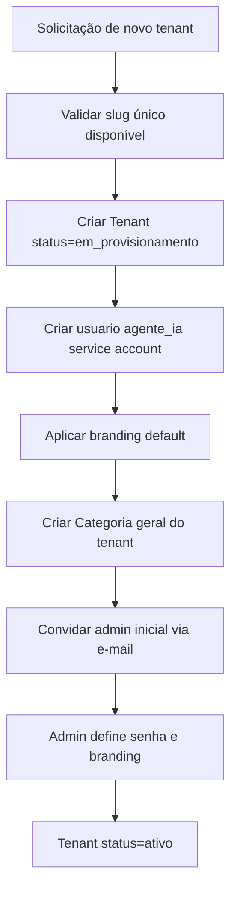
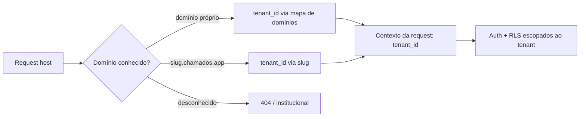

# Multi-tenancy e Whitelabel

Este documento define o modelo de tenant da plataforma **Chamados**, o provisionamento de novos tenants, o branding whitelabel, as configurações por tenant, o cadastro de **SistemaAlvo** e a estratégia de isolamento de dados, storage e segredos entre tenants. É a fonte da verdade para RF-19 (whitelabel multi-tenant) e alimenta os demais documentos.

Fora de escopo deste documento (referenciados onde necessário):

- Mecânica de **Row-Level Security** e modelagem física das tabelas → `02-modelo-de-dados.md`.
- Modelo de ameaças, criptografia, prompt injection e LGPD → `09-seguranca-lgpd.md`.
- Fluxo de autenticação, convites e matriz de permissões → `03-autenticacao-perfis-permissoes.md`.
- Pipeline que consome os segredos do SistemaAlvo (git pull, acesso a logs/BD) → `05-agente-ia.md`.

---

## 1. Conceito de Tenant

Um **Tenant** representa uma empresa cliente da plataforma. Todas as empresas rodam na **mesma instalação** (single database, shared schema), isoladas logicamente por `tenant_id` + Row-Level Security (ver `02-modelo-de-dados.md`). Cada tenant tem sua própria marca (whitelabel), seus próprios usuários, seus próprios sistemas-alvo e suas próprias configurações.

Regras invariantes:

- Todo registro de dados de negócio (Usuario, SistemaAlvo, Categoria, Chamado, Mensagem, Anexo, EventoChamado, ExecucaoIA, CanalNotificacao, PreferenciaNotificacao) pertence a **exatamente um** tenant.
- Nenhuma operação de negócio cruza a fronteira do tenant. Um Usuario pertence a um único tenant (não há conta global compartilhada entre empresas).
- O papel **agente_ia** existe **por tenant**: cada tenant tem seu próprio usuário de serviço `agente_ia`, que participa apenas dos chamados daquele tenant.

### 1.1. Campos do Tenant

| Campo                         | Tipo                 | Descrição                                                                                                                                    |
| ----------------------------- | -------------------- | -------------------------------------------------------------------------------------------------------------------------------------------- |
| `id`                          | uuid                 | Identificador interno.                                                                                                                       |
| `slug`                        | string única         | Identificador curto usado no subdomínio (`slug.chamados.app`). Imutável após criação.                                                        |
| `nome_exibicao`               | string               | Nome da empresa mostrado na UI e em e-mails.                                                                                                 |
| `status`                      | enum `status_tenant` | `ativo`, `suspenso`, `em_provisionamento`, `cancelado`. Coluna e enum devem ser modelados no esquema canônico — ver `02-modelo-de-dados.md`. |
| `criado_em` / `atualizado_em` | timestamp            | Auditoria.                                                                                                                                   |
| `branding`                    | jsonb / tabela       | Ver seção 3.                                                                                                                                 |
| `configuracoes`               | jsonb / tabela       | Ver seção 4.                                                                                                                                 |

> DECISÃO PENDENTE: `branding` e `configuracoes` como colunas `jsonb` no registro Tenant vs. tabelas dedicadas (`TenantBranding`, `TenantConfig`) com colunas tipadas. Recomendação: tabelas tipadas para campos consultáveis/validáveis e `jsonb` apenas para extensões opcionais.

O status do Tenant governa o acesso: `suspenso` bloqueia login de todos os usuários (exibe página de suspensão), `em_provisionamento` libera apenas o admin inicial, `cancelado` é terminal (dados retidos conforme política de LGPD — ver `09-seguranca-lgpd.md`). Este documento é a fonte da semântica do `status`; a coluna física e o enum `status_tenant` pertencem ao esquema canônico em `02-modelo-de-dados.md` (que deve incluí-los na tabela Tenant).

---

## 2. Provisionamento (onboarding de novo tenant)

O provisionamento cria um tenant funcional a partir do zero. Pode ser disparado por:

- **Auto-signup** (visão futura): formulário público cria tenant em `em_provisionamento`.
- **Provisionamento operado**: um super-admin da plataforma cria o tenant (MVP).

> DECISÃO PENDENTE: existência de um papel **super-admin de plataforma** (acima dos tenants) para operar provisionamento, suspensão e billing. Os papéis canônicos (admin, operador, cliente, agente_ia) são **por tenant**; a operação da plataforma precisa de um ator fora do tenant. Definir se é um role adicional, um painel separado, ou acesso restrito por infraestrutura. Cruzar com `03-autenticacao-perfis-permissoes.md`.

### 2.1. Passos do provisionamento



1. **Validar slug**: único globalmente, `[a-z0-9-]`, 3–40 chars, não pode colidir com subdomínios reservados (`www`, `app`, `api`, `admin`, `mail`, etc.).
2. **Criar Tenant** com `status=em_provisionamento`.
3. **Criar o usuario agente_ia** (papel `agente_ia`) como service account do tenant — sem senha de login humano; autentica via mecanismo de serviço (ver `03-autenticacao-perfis-permissoes.md`).
4. **Aplicar branding default** (logo placeholder, paleta neutra, remetente padrão da plataforma).
5. **Criar a Categoria geral** do tenant (fallback para chamados sem sistema-alvo específico).
6. **Convidar o admin inicial** por e-mail (fluxo de convite em `03-autenticacao-perfis-permissoes.md`).
7. O admin completa o setup (branding, primeiro SistemaAlvo, convites de operadores).
8. Transição para `status=ativo` — recomenda-se automática após o admin definir a senha; opcionalmente exige ao menos um SistemaAlvo cadastrado.

O provisionamento deve ser **idempotente e transacional**: falha em qualquer passo não deixa tenant meio-criado ativo. Recomenda-se executar como job (BullMQ) com etapas registráveis.

### 2.2. Seeds por tenant

Todo tenant novo recebe: usuario `agente_ia`, Categoria geral, branding default, `configuracoes` default (seção 4.2) e templates de notificação default (branding aplicado em runtime — ver `06-notificacoes.md`).

---

## 3. Branding (whitelabel)

Cada tenant customiza a aparência e a identidade das comunicações. O branding é aplicado no **portal do cliente**, no **painel operador/admin** e nos **templates de notificação**.

### 3.1. Elementos de branding

| Elemento          | Campo                      | Uso                                                               | Default                    |
| ----------------- | -------------------------- | ----------------------------------------------------------------- | -------------------------- |
| Logo (claro)      | `logo_light_url`           | Cabeçalho em tema claro.                                          | Placeholder da plataforma. |
| Logo (escuro)     | `logo_dark_url`            | Cabeçalho em tema escuro.                                         | Placeholder.               |
| Favicon           | `favicon_url`              | Aba do navegador.                                                 | Placeholder.               |
| Cor primária      | `cor_primaria`             | Botões, links, destaques (hex).                                   | Neutra da plataforma.      |
| Cor de destaque   | `cor_secundaria`           | Acentos secundários (hex).                                        | Neutra.                    |
| Nome de exibição  | `nome_exibicao`            | Título, e-mails, rodapés.                                         | —                          |
| Nome do remetente | `email_remetente_nome`     | Campo _From_ dos e-mails.                                         | Nome de exibição.          |
| E-mail remetente  | `email_remetente_endereco` | Endereço _From_.                                                  | `no-reply@chamados.app`.   |
| Domínio próprio   | `dominio_proprio`          | Ver seções 3.3 e 3.4. Coluna canônica em `02-modelo-de-dados.md`. | `slug.chamados.app`.       |

Assets de imagem (logo, favicon) são armazenados no bucket de storage do tenant (seção 6.2) e servidos por URL assinada ou path público dedicado. Validar tipo MIME, dimensões e tamanho no upload (ver `09-seguranca-lgpd.md`). Cores hex validadas server-side.

> DECISÃO PENDENTE: permitir **CSS/tema customizado avançado** por tenant (ex.: fontes próprias, tokens de design completos) ou limitar a cores + logos no MVP. Recomendação: limitar a cores + logos no MVP para conter superfície de ataque de CSS injection e complexidade de manutenção.

### 3.2. Aplicação do branding na UI

O branding é resolvido no boot da aplicação a partir do tenant corrente (resolvido por domínio/subdomínio — seção 3.4) e injetado como **CSS custom properties** (`--cor-primaria`, etc.) no root. Ver `08-ui-ux.md` para o mapa de telas onde o branding aparece. Assets e paleta devem ter fallback para os defaults da plataforma caso o tenant não tenha customizado.

### 3.3. E-mail remetente e domínio de envio

Para envio via SMTP (fase 1, ver `06-notificacoes.md`), o `email_remetente_endereco` do tenant pode ser:

- **Endereço da plataforma** (default): `no-reply@chamados.app` com o `nome_exibicao` do tenant no _From_. Simples, sem configuração de DNS.
- **Domínio próprio do tenant**: requer o tenant configurar SPF/DKIM/DMARC no seu DNS para autorizar o envio. Sem isso, os e-mails caem em spam.

> DECISÃO PENDENTE: no MVP, suportar apenas remetente da plataforma (`no-reply@chamados.app`) e adiar domínio de e-mail próprio (que exige verificação de DNS e provavelmente um provider como SES/Postmark com domínios verificados) para fase posterior.

### 3.4. Domínio próprio vs subdomínio

Cada tenant é acessível por:

- **Subdomínio da plataforma** (sempre disponível): `slug.chamados.app`. Provisionado automaticamente via wildcard DNS (`*.chamados.app`) + wildcard TLS. É o default.
- **Domínio próprio** (opcional): `suporte.empresa.com`. O tenant cria um `CNAME` apontando para a plataforma; a plataforma emite certificado TLS (ACME/Let's Encrypt) para o domínio e registra o mapeamento `dominio → tenant_id`.

Resolução de tenant por requisição:

1. Extrair o host do request.
2. Se for domínio próprio conhecido → tenant mapeado.
3. Senão, se for `slug.chamados.app` → tenant pelo slug.
4. Senão → 404 / página institucional da plataforma.

O tenant resolvido é injetado no contexto da request e usado pela autenticação própria conforme spec 03 (D-010) para escopar a sessão e pela camada de dados para setar `tenant_id` (RLS — `02-modelo-de-dados.md`).

Esse passo de resolução (por slug/domínio) roda **antes** de estabelecer o contexto RLS da transação, via a função `chamados_resolver_tenant` (SECURITY DEFINER): como a aplicação conecta com um role sem BYPASSRLS, ela não consegue ler a linha do `tenant` para descobrir o `tenant_id` sem antes ter esse `tenant_id` — a própria policy de isolamento esconderia a linha. `chamados_resolver_tenant` resolve essa dependência circular fora do contexto RLS, sem exigir bypass da aplicação (D-010; ver `02-modelo-de-dados.md`).



> DECISÃO PENDENTE: mecanismo de emissão/renovação de TLS para domínios próprios — proxy com ACME on-demand (ex.: Caddy) vs. certificados gerenciados pelo provedor de hosting/CDN (Cloudflare for SaaS, Vercel domains). Impacta deploy (`01-arquitetura.md`).

---

## 4. Configurações por tenant

Configurações que ajustam o comportamento do produto para cada empresa. Todas têm default sensato e são editáveis pelo **admin** do tenant.

### 4.1. Catálogo de configurações

| Chave                                | Tipo           | Default                       | Descrição                                                                                                                                                                                                                                                                                                                                                                                                  |
| ------------------------------------ | -------------- | ----------------------------- | ---------------------------------------------------------------------------------------------------------------------------------------------------------------------------------------------------------------------------------------------------------------------------------------------------------------------------------------------------------------------------------------------------------- |
| `dias_fechamento_automatico`         | int (dias)     | 3                             | Dias que um chamado em `resolvido` aguarda antes de virar `fechado` automaticamente. Ver máquina de estados em `04-chamados.md`. Coluna canônica de mesmo nome e default na tabela Tenant em `02-modelo-de-dados.md`.                                                                                                                                                                                      |
| `permite_reabertura`                 | bool           | true                          | Se o cliente pode reabrir um chamado `resolvido` (volta a `em_atendimento`). `fechado` é sempre terminal.                                                                                                                                                                                                                                                                                                  |
| `ia_resolucao_automatica_habilitada` | bool           | true                          | Liga/desliga a tentativa de resolução autônoma da IA (natureza=`problema` + complexidade=`facil`). **`habilitada` significa apenas geração de PR** — a IA cria branch, implementa e abre PR; merge/deploy **sempre** exige aprovação humana (ver `05-agente-ia.md` §6 e `09-seguranca-lgpd.md`), independente desta chave. Nome e default canônicos alinhados na tabela Tenant em `02-modelo-de-dados.md`. |
| `ia_exige_aprovacao_merge`           | bool           | true                          | Guardrail: merge/deploy do PR gerado pela IA exige aprovação humana. Ver `05-agente-ia.md`.                                                                                                                                                                                                                                                                                                                |
| `ia_prioridade_sugerida_auto`        | bool           | true                          | Se a prioridade sugerida pela IA é aplicada automaticamente ou apenas sugerida.                                                                                                                                                                                                                                                                                                                            |
| `ia_custo_mensal_limite`             | decimal / null | null                          | Teto de custo (USD) de execuções de IA por mês; ao exceder, pausa novas execuções.                                                                                                                                                                                                                                                                                                                         |
| `anexo_tamanho_max_mb`               | int            | 25                            | Tamanho máximo por anexo.                                                                                                                                                                                                                                                                                                                                                                                  |
| `anexo_tipos_permitidos`             | lista MIME     | conjunto seguro               | Whitelist de tipos aceitos em uploads (ver `09-seguranca-lgpd.md`).                                                                                                                                                                                                                                                                                                                                        |
| `notificacoes_padrao`                | objeto         | ver `06`                      | Defaults de PreferenciaNotificacao para novos usuários.                                                                                                                                                                                                                                                                                                                                                    |
| `locale` / `timezone`                | string         | `pt-BR` / `America/Sao_Paulo` | Formatação e agendamento (ex.: cálculo de dias de fechamento).                                                                                                                                                                                                                                                                                                                                             |

As políticas de IA aqui definidas são **guardrails de tenant**; a mecânica de como o pipeline as consome está em `05-agente-ia.md`. Os limites de anexo são aplicados tanto no cliente quanto server-side; a validação de segurança do upload está em `09-seguranca-lgpd.md`.

### 4.2. Herança e validação

- Toda configuração tem default de plataforma; o tenant sobrescreve apenas o que quiser.
- Configurações são validadas server-side (faixas, tipos MIME válidos, limites máximos absolutos que o tenant não pode ultrapassar — ex.: teto global de `anexo_tamanho_max_mb` para proteger o storage).
- Mudanças em configurações sensíveis (políticas de IA, guardrails) geram registro de auditoria.

> DECISÃO PENDENTE: alguns limites (ex.: `anexo_tamanho_max_mb`, `ia_custo_mensal_limite`) provavelmente serão amarrados ao **plano/billing** (seção 7) no futuro. No MVP são livres dentro de tetos globais fixos.

---

## 5. Sistemas-alvo (SistemaAlvo)

Um **SistemaAlvo** é um sistema de software do tenant sobre o qual os chamados são abertos. Um tenant pode ter **vários** sistemas-alvo. Todo Chamado referencia **um** SistemaAlvo — ou, quando o tenant não tem um sistema específico aplicável, a **Categoria geral** do tenant (seção 2.1). Quando o tenant tem mais de um sistema-alvo, o cliente escolhe qual no formulário mínimo de abertura (ver `04-chamados.md`).

O SistemaAlvo é o que dá ao **agente_ia** o conhecimento para triar: código-fonte, logs e banco de dados (RF-13, RF-14).

### 5.1. Campos do SistemaAlvo

O conjunto de colunas é definido pelo esquema canônico em `02-modelo-de-dados.md`; a tabela abaixo repete os campos com a semântica de configuração/segredos deste documento. Não introduzir colunas fora do esquema canônico.

| Campo                                | Tipo        | Descrição                                                                                                                                |
| ------------------------------------ | ----------- | ---------------------------------------------------------------------------------------------------------------------------------------- |
| `id`                                 | uuid        | Identificador.                                                                                                                           |
| `tenant_id`                          | uuid        | Dono (isolamento).                                                                                                                       |
| `nome`                               | string      | Nome do sistema (ex.: "ERP Financeiro").                                                                                                 |
| `descricao`                          | text        | Descrição livre do sistema.                                                                                                              |
| `ativo`                              | bool        | Sistemas inativos não aparecem para abrir novos chamados.                                                                                |
| **Repositório git**                  |             |                                                                                                                                          |
| `git_repo_url`                       | string      | URL do repositório (https ou ssh).                                                                                                       |
| `git_branch_padrao`                  | string      | Branch de referência para o `git pull` (default `main`).                                                                                 |
| `git_credencial_ref`                 | ref segredo | Referência ao segredo de acesso ao repo (seção 5.2). Nunca a credencial em claro.                                                        |
| **Logs**                             |             |                                                                                                                                          |
| `logs_tipo`                          | string      | Tipo/fonte de logs (ex.: `arquivo`, `cloudwatch`, `loki`).                                                                               |
| `logs_config`                        | jsonb       | Configuração não-secreta de acesso aos logs (caminhos, URLs, queries). Eventuais segredos vão por referência de segredo, nunca em claro. |
| `logs_credencial_ref`                | ref segredo | Referência ao segredo de acesso aos logs (seção 5.2). Nunca a credencial em claro.                                                       |
| **Banco de dados (somente leitura)** |             |                                                                                                                                          |
| `bd_tipo`                            | string      | SGBD (ex.: `postgres`, `mysql`).                                                                                                         |
| `bd_host`                            | string      | Host do BD do sistema-alvo.                                                                                                              |
| `bd_porta`                           | int         | Porta.                                                                                                                                   |
| `bd_nome`                            | string      | Nome do banco.                                                                                                                           |
| `bd_credencial_ref`                  | ref segredo | Referência ao segredo da credencial **somente leitura** (usuário/senha) do BD, mantido no cofre (seção 5.2). Nunca em claro.             |
| `criado_em` / `atualizado_em`        | timestamp   | Auditoria.                                                                                                                               |

A conexão de banco é modelada em **campos separados** (`bd_tipo`/`bd_host`/`bd_porta`/`bd_nome`), com **apenas a credencial** (usuário/senha somente leitura) guardada no cofre de segredos via `bd_credencial_ref` (seção 5.2) — host/porta/nome permanecem legíveis nas colunas de negócio e só o segredo sai da tabela, o que permite à UI de cadastro mascarar apenas a credencial. Esta é a mesma representação estruturada do esquema canônico em `02-modelo-de-dados.md`, que é a fonte da verdade.

Regras:

- A conexão de banco **deve** ser com um usuário **somente leitura**. A plataforma não impõe isso do lado do banco do cliente (é responsabilidade do tenant configurar), mas o formulário de cadastro deve documentar e recomendar explicitamente um usuário read-only, e a plataforma **só executa queries SELECT** a partir do pipeline (ver guardrails em `05-agente-ia.md` e `09-seguranca-lgpd.md`).
- O `git_repo_url` e as credenciais são consumidos pelo worker de IA para fazer `git pull` a cada triagem (RF-14). A mecânica está em `05-agente-ia.md`.
- Alterações em conexões/credenciais de SistemaAlvo geram EventoChamado? Não — geram registro de auditoria de configuração do tenant (não é evento de chamado).

### 5.2. Onde ficam os segredos do SistemaAlvo

Segredos (chave SSH/token git, credencial read-only do BD, credenciais de logs) **nunca** são armazenados em claro nas tabelas de negócio. O SistemaAlvo guarda apenas **referências de segredo** (`git_credencial_ref`, `bd_credencial_ref`, `logs_credencial_ref` e eventuais refs em `logs_config`) a segredos mantidos em um **cofre de segredos**.

Opções de cofre:

| Opção                                                         | Prós                                 | Contras                     |
| ------------------------------------------------------------- | ------------------------------------ | --------------------------- |
| Coluna cifrada no Postgres (envelope encryption com KMS)      | Simples, sem infra extra             | Rotação e auditoria manuais |
| Secrets manager externo (Vault, AWS Secrets Manager, Doppler) | Rotação, auditoria, isolamento forte | Infra e custo adicionais    |

Requisitos mínimos, independentemente da escolha:

- Segredos cifrados em repouso; chave de cifragem fora do banco de dados de negócio.
- Cada segredo é **escopado ao tenant**; a referência de segredo (`*_ref`) só resolve dentro do contexto do tenant dono (nenhum tenant lê segredo de outro).
- Apenas o **worker de IA** (e telas de admin de escrita) acessam os segredos; a aplicação web nunca os expõe ao browser. Ao exibir no painel, mostrar mascarado (ex.: `••••`), permitindo apenas substituir.
- Rotação de segredo não deve exigir recadastro do SistemaAlvo (troca-se o valor sob a mesma referência de segredo `*_ref`).

Detalhes de criptografia, gestão de chaves e modelo de ameaças em `09-seguranca-lgpd.md`.

> DECISÃO PENDENTE: cofre de segredos no MVP — colunas cifradas com envelope encryption (KMS) vs. secrets manager dedicado. Recomendação: começar com envelope encryption + KMS para reduzir infra, projetando a camada de acesso a segredos atrás de uma interface (`SecretStore`) que permita migrar para Vault/Secrets Manager sem tocar no resto do código.

---

## 6. Isolamento entre tenants

O isolamento é multicamada. Cada camada é independente; a falha de uma não deve vazar dados entre tenants.

### 6.1. Dados (banco de dados)

- Todo registro de negócio carrega `tenant_id`.
- **Row-Level Security** no PostgreSQL garante que uma sessão só enxergue linhas do seu `tenant_id`. A modelagem, policies e a forma de setar o `tenant_id` na sessão estão em `02-modelo-de-dados.md`.
- A resolução do tenant (seção 3.4) alimenta a variável de sessão que a RLS usa. Nenhuma query de aplicação deve depender apenas de filtro `WHERE tenant_id = ?` em código — a RLS é o backstop.

### 6.2. Storage (anexos e assets de branding)

Armazenamento S3-compatível (MinIO em dev, S3/R2 em prod — ver `01-arquitetura.md`). Isolamento por **prefixo de chave** por tenant:

```
s3://bucket/tenants/{tenant_id}/anexos/{chamado_id}/{anexo_id}
s3://bucket/tenants/{tenant_id}/branding/logo-light.png
```

- Acesso sempre por **URL assinada** de curta duração, gerada server-side após checar que o usuário pertence ao tenant e tem permissão sobre o recurso.
- Nenhum bucket/prefixo é público. Assets de branding, embora "públicos" para visitantes do tenant, são servidos via path controlado pela aplicação (ou URL assinada com TTL longo), não por ACL pública de bucket.

> DECISÃO PENDENTE: bucket único compartilhado com prefixo por tenant (recomendado — simples e barato) vs. bucket por tenant (isolamento físico mais forte, útil para requisitos de residência de dados / billing por uso). Começar com prefixo por tenant.

### 6.3. Segredos

Cada segredo é escopado ao tenant (seção 5.2). A chave/namespace no cofre inclui o `tenant_id`. Nenhuma `credencial_ref` é resolvível fora do contexto do tenant dono.

### 6.4. Filas e jobs (BullMQ)

- Todo job (triagem de IA, provisionamento, envio de notificação) carrega `tenant_id` no payload.
- O worker seta o contexto de tenant (variável de sessão de RLS) **antes** de tocar em qualquer dado, e o limpa ao final.
- Recomenda-se rate limiting / concorrência de execução de IA **por tenant**, para que um tenant não monopolize os workers nem estoure custo (amarrar a `ia_custo_mensal_limite`, seção 4.1).

### 6.5. Cache e sessão

- Chaves de cache (Redis) sempre prefixadas por `tenant_id`.
- Sessões de autenticação amarradas ao tenant resolvido; uma sessão emitida para o tenant A não é válida no domínio do tenant B.

---

## 7. Visão futura: planos e billing (fora do MVP)

Não faz parte do MVP (ver `10-roadmap-mvp.md`), mas o modelo de dados deve deixar espaço para não exigir refatoração grande depois.

Direção prevista:

- **Plano** (`Plano`): define limites (nº de operadores, nº de sistemas-alvo, teto de anexo, cota de execuções/custo de IA por mês) e preço.
- Cada Tenant referencia um plano; as `configuracoes` (seção 4) passam a ser **limitadas pelo plano** (o tenant não pode configurar acima do teto do plano).
- **Medição de uso**: contabilizar execuções e custo de IA (dados já em ExecucaoIA), volume de storage, nº de usuários ativos — para faturamento por uso.
- Integração com gateway de pagamento (ex.: Stripe) e ciclo de assinatura (`ativo`, `inadimplente`, `cancelado`) mapeado ao `status` do Tenant (seção 1.1).

> DECISÃO PENDENTE: modelo comercial (assinatura fixa por plano, por operador, por uso de IA, ou híbrido) e gateway de pagamento. Definir antes de sair do MVP. Nada disso bloqueia o MVP, mas a entidade ExecucaoIA já deve registrar custo e duração desde a fase 1 (ver `05-agente-ia.md`) para viabilizar medição futura.

---

## 8. Resumo de responsabilidades

| Tema                                                                       | Onde é definido                        |
| -------------------------------------------------------------------------- | -------------------------------------- |
| Tenant, provisionamento, branding, config, SistemaAlvo, isolamento (visão) | **este documento**                     |
| RLS, colunas, enums físicos, relações                                      | `02-modelo-de-dados.md`                |
| Resolução de tenant no auth, papéis, agente_ia service account             | `03-autenticacao-perfis-permissoes.md` |
| Consumo dos segredos do SistemaAlvo pelo pipeline (git pull, logs, BD)     | `05-agente-ia.md`                      |
| Templates de notificação com branding do tenant                            | `06-notificacoes.md`                   |
| Criptografia de segredos, uploads, prompt injection, LGPD                  | `09-seguranca-lgpd.md`                 |
| Escopo do MVP e o que fica para depois (billing)                           | `10-roadmap-mvp.md`                    |
