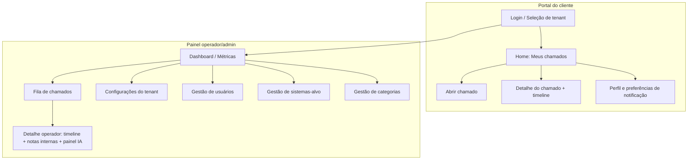

# UI/UX: Telas e Fluxos

Este documento define o mapa de telas, os wireframes das telas principais, os fluxos de interação e os princípios de UX da plataforma **Chamados**. O foco é o *como* a interface se organiza e responde; regras de negócio (ciclo de vida, máquina de estados) vivem em `04-chamados.md`, a matriz de permissões em `03-autenticacao-perfis-permissoes.md`, o pipeline de IA em `05-agente-ia.md`, e o branding whitelabel é detalhado em `07-multitenancy-whitelabel.md` (aqui tratamos só de sua aplicação visual).

Princípio-guia (RNF-01, RNF-02): **formulários mínimos, UX moderna e rápida, IA-first**. Cada tela deve poder ser justificada contra esses três valores.

---

## 1. Áreas da aplicação

A aplicação se divide em duas áreas de UI com layouts distintos, servidas sob o domínio/subdomínio do tenant (ver `07-multitenancy-whitelabel.md`):

| Área | Papéis (ver `03-`) | Objetivo | Densidade visual |
|------|--------------------|----------|------------------|
| **Portal do cliente** | `cliente` | Abrir e acompanhar chamados com o mínimo de atrito | Baixa — espaçoso, poucos controles |
| **Painel operador/admin** | `operador`, `admin` | Triagem, atendimento, configuração e produtividade | Alta — tabelas densas, atalhos, multi-painel |

O `agente_ia` não tem UI própria: ele atua como autor de mensagens e eventos, aparecendo na timeline e no painel de ações da IA (ver §4.3). Um mesmo usuário humano pode ter acesso às duas áreas se acumular papéis; a navegação entre elas é feita por um seletor de contexto no topo.

> DECISÃO PENDENTE: portal do cliente e painel operador podem ser dois apps Next.js separados (rotas `/portal` e `/app`) ou um único app com layouts condicionais por papel. Recomendação: rotas segregadas no mesmo app, compartilhando design system.

---

## 2. Mapa de telas



### 2.1 Telas do portal do cliente

| Tela | Rota sugerida | Conteúdo essencial |
|------|---------------|--------------------|
| Login / seleção de tenant | `/login` | Resolução de tenant por subdomínio; e-mail/senha (ver `03-`) |
| Meus chamados | `/portal` | Lista com filtros por status/natureza/sistema-alvo; busca; botão primário "Abrir chamado" |
| Abrir chamado | `/portal/novo` | Formulário mínimo (§4.1) |
| Detalhe do chamado | `/portal/chamados/:id` | Cabeçalho (status, prioridade, sistema-alvo), timeline de mensagens `publica`, caixa de resposta |
| Perfil e notificações | `/portal/perfil` | Dados, canais e `PreferenciaNotificacao` (ver `06-notificacoes.md`) |

### 2.2 Telas do painel operador/admin

| Tela | Rota sugerida | Conteúdo essencial | Papel mínimo |
|------|---------------|--------------------|--------------|
| Dashboard | `/app` | KPIs, gráficos, filas por status, atalhos | operador |
| Fila de chamados | `/app/chamados` | Tabela densa filtrável; ações em lote; salvamento de filtros | operador |
| Detalhe operador | `/app/chamados/:id` | Timeline (públicas + internas), painel de ações da IA, controles de status/prioridade/atribuição/complexidade | operador |
| Configurações do tenant | `/app/config` | Branding, prazo de auto-fechamento, guardrails de IA, canais de notificação | admin |
| Gestão de usuários | `/app/usuarios` | Lista, convites, papéis | admin |
| Gestão de sistemas-alvo | `/app/sistemas` | CRUD de `SistemaAlvo` (repo git, logs, conexão BD somente leitura) | admin |
| Gestão de categorias | `/app/categorias` | CRUD de `Categoria` do tenant | admin |

---

## 3. Layout e navegação (shell)

**Portal do cliente** — layout de coluna única, largura máxima confortável (~880px), header fixo com logo do tenant, seletor de idioma e menu do usuário. Ação primária "Abrir chamado" sempre visível (botão no header e FAB no mobile).

**Painel operador/admin** — layout de app com:
- **Sidebar** (colapsável) com navegação: Dashboard, Chamados, Usuários, Sistemas-alvo, Categorias, Configurações.
- **Topbar** com busca global (comando `Ctrl/Cmd+K`), seletor de contexto (portal/painel), notificações e menu do usuário.
- **Área de conteúdo** que, no detalhe do chamado, usa layout de duas/três colunas (§4.3).

---

## 4. Wireframes das telas principais

### 4.1 Abrir chamado (portal) — formulário mínimo

Materializa RNF-01/RF-05/RF-06. Só o essencial na tela; tudo mais é inferido pela IA na triagem.

```
┌───────────────────────────────────────────────────────────┐
│  [logo tenant]                          Meus chamados  ▾ IK │
├───────────────────────────────────────────────────────────┤
│  ‹ Voltar                                                   │
│                                                             │
│  Abrir chamado                                              │
│                                                             │
│  Sistema-alvo *        [ Portal de Vendas          ▾ ]     │  ← só se tenant tem >1 SistemaAlvo
│  Natureza *            (•) Problema   ( ) Alteração         │
│                                                             │
│  Título *                                                   │
│  [ Não consigo emitir a segunda via do boleto           ]  │
│                                                             │
│  Descrição *                                                │
│  ┌───────────────────────────────────────────────────────┐ │
│  │ B  I  •  1.  “  <>  🔗  🖼  📎        (toolbar TipTap) │ │
│  ├───────────────────────────────────────────────────────┤ │
│  │ Ao clicar em "gerar segunda via" a tela fica em       │ │
│  │ branco. Segue print:                                  │ │
│  │ [imagem inline]                                       │ │
│  └───────────────────────────────────────────────────────┘ │
│                                                             │
│  ▸ Prioridade (opcional)   [ Média ▾ ]                     │  ← recolhido por padrão
│                                                             │
│                         [ Cancelar ]   [ Abrir chamado ▸ ] │
└───────────────────────────────────────────────────────────┘
```

Notas de implementação:
- **Sistema-alvo** só aparece se o tenant tiver mais de um `SistemaAlvo`; caso contrário é resolvido automaticamente (ou cai na categoria geral do tenant).
- **Natureza** default `problema`.
- **Prioridade** é opcional e recolhida — a IA sugere/ajusta na triagem (ver `05-`).
- Editor **TipTap** com sanitização server-side (ver `09-seguranca-lgpd.md`); imagens/anexos inline viram `Anexo`.
- Ao submeter: feedback otimista (§6) e redirecionamento ao detalhe, já mostrando o estado `novo` → `em_triagem`.

### 4.2 Detalhe do chamado (portal) — timeline do cliente

```
┌───────────────────────────────────────────────────────────┐
│ ‹ Meus chamados            #1042 · Portal de Vendas        │
├───────────────────────────────────────────────────────────┤
│ Não consigo emitir a segunda via do boleto                │
│ ● Em atendimento   · Prioridade: Alta   · Problema        │
│ Aberto há 2h · atualizado há 5min                         │
├───────────────────────────────────────────────────────────┤
│ TIMELINE                                                   │
│                                                            │
│  🧑 Você · 14:02                                           │
│  Ao clicar em "gerar segunda via"...                      │
│                                                            │
│  🤖 Assistente · 14:03                                     │
│  Para investigar, você pode informar o número do          │
│  pedido e se o erro ocorre em todos os boletos?           │
│                                                            │
│  🧑 Você · 14:10                                           │
│  Pedido 8837, acontece em todos.                          │
│                                                            │
│  🧑 Operador (Marina) · 14:20                              │
│  Identificamos a causa, estamos corrigindo.               │
│                                                            │
├───────────────────────────────────────────────────────────┤
│  Responder                                                 │
│  [ editor rich text …                                 📎 ] │
│                                        [ Enviar resposta ] │
└───────────────────────────────────────────────────────────┘
```

O cliente vê **apenas** mensagens `visibilidade = publica` (do cliente, do `operador`/`admin` e do `agente_ia`). Notas `interna` nunca aparecem aqui. O rótulo do autor IA é "Assistente" (nome amigável do `agente_ia`, configurável no branding). Quando o status for `resolvido`, exibir banner com prazo de auto-fechamento e botão **Reabrir** (regra em `04-`).

### 4.3 Detalhe do chamado (operador) — timeline + notas internas + painel IA

Layout de três colunas em telas largas; empilha no mobile.

```
┌──────────────┬────────────────────────────────────┬──────────────────────┐
│  CONTEXTO    │  TIMELINE                          │  PAINEL DA IA        │
│              │                                    │                      │
│ #1042        │  🧑 Cliente · 14:02                │ ExecucaoIA #3        │
│ Portal Vendas│  Ao clicar em "gerar segunda...    │ ● Concluída          │
│              │                                    │ Opus 4.8 · 42s       │
│ Status       │  🤖 Assistente (pública) · 14:03   │ custo: US$0,08       │
│ [Em atend. ▾]│  Para investigar, informe o...     │                      │
│              │                                    │ Diagnóstico:         │
│ Prioridade   │  ─ nota interna ─────────────────  │ NullPointer em       │
│ [Alta ▾]     │  🤖 Assistente (interna) · 14:11   │ BoletoService ao     │
│              │  Diagnóstico: exceção em           │ pedido sem 2ª via.   │
│ Complexidade │  BoletoService.linha 88. Causa     │                      │
│ [Fácil ▾]    │  provável: pedido sem parcela.     │ Natureza: problema   │
│              │                                    │ Complexidade: fácil  │
│ Natureza     │  🧑 Cliente · 14:10                │ Prioridade sug.:alta │
│ [Problema ▾] │  Pedido 8837, acontece em todos.   │                      │
│              │                                    │ [ Ver PR #217 ↗ ]    │
│ Atribuído    │  🧑 Marina (pública) · 14:20       │ [ Ver log completo ] │
│ [Marina ▾]   │  Identificamos a causa...          │                      │
│              │                                    │ [ ▸ Reexecutar IA ]  │
│ Sistema-alvo │ ┌────────────────────────────────┐ │                      │
│ Portal Vendas│ │ Responder / Nota interna       │ │ Guardrail: merge     │
│ SLA: 4h      │ │ (•)Pública ( )Interna     📎   │ │ requer aprovação     │
│ [Ver repo ↗] │ │ [ editor rich text … ]         │ │ humana.              │
│              │ │              [ Enviar ]        │ │ [Aprovar] [Recusar]  │
└──────────────┴────────────────────────────────────┴──────────────────────┘
```

Elementos-chave:
- **Coluna de contexto**: controles de `status`, `prioridade`, `complexidade`, `natureza`, atribuição e link para o `SistemaAlvo`. Toda alteração gera `EventoChamado` (auditoria — ver `04-`).
- **Timeline unificada**: mensagens `publica` e `interna` no mesmo fluxo, com as internas visualmente distintas (fundo âmbar, selo "interna"). O compositor tem toggle **Pública/Interna** — default **Interna** para operador, reduzindo risco de vazamento.
- **Painel da IA**: reflete a `ExecucaoIA` mais recente e o histórico (entrada, ações, custo, duração, resultado — ver `05-`). Botões de aprovação de PR aparecem só quando há guardrail pendente. "Reexecutar IA" reenfileira o job.

### 4.4 Fila de chamados (operador)

```
┌───────────────────────────────────────────────────────────────────────────┐
│ Chamados        [🔎 buscar…]   Filtros: Status▾ Natureza▾ Prioridade▾ Sistema▾ │
│                 Salvos: [ Meus ] [ Não atribuídos ] [ Aguardando cliente ] +  │
├────┬────────────────────────────┬─────────┬──────────┬──────────┬───────────┤
│ ☐  │ Chamado                    │ Status  │ Prior.   │ Complex. │ Atribuído │
├────┼────────────────────────────┼─────────┼──────────┼──────────┼───────────┤
│ ☐  │ #1042 2ª via boleto        │ Em atend│ 🔴 Alta  │ Fácil    │ Marina    │
│ ☐  │ #1041 Erro no login  🤖    │ Triagem │ 🟠 Média │ —        │ —         │
│ ☐  │ #1039 Novo relatório  ✎    │ Ag.clie.│ 🟡 Baixa │ Médio    │ João      │
│ ☐  │ #1038 Timeout no checkout  │ Novo    │ 🔴 Urg.  │ —        │ —         │
├────┴────────────────────────────┴─────────┴──────────┴──────────┴───────────┤
│  2 selecionados:  [ Atribuir ▾ ]  [ Prioridade ▾ ]  [ Status ▾ ]            │
└───────────────────────────────────────────────────────────────────────────┘
```

- Ícones de linha: 🤖 = IA processando/aguardando; ✎ = `natureza = alteracao`.
- Filtros combinam-se com a busca full-text (ver `04-`); conjuntos de filtros podem ser **salvos** por usuário.
- Ordenação default: prioridade desc + atualização recente. Densidade compacta; virtualização para listas longas.

### 4.5 Dashboard (operador/admin)

```
┌───────────────────────────────────────────────────────────────────────┐
│ Dashboard                                          Período: [ 7 dias ▾ ]│
├───────────────┬───────────────┬───────────────┬───────────────────────┤
│ Novos         │ Em atendimento│ Aguard. cliente│ Resolvidos (7d)       │
│   18          │    12         │     5          │   34                  │
├───────────────┴───────────────┴───────────────┴───────────────────────┤
│  Chamados por status (barra)      │  Tempo médio 1ª resposta: 6 min    │
│  ▇▇▇▇▇ novo                       │  Taxa de resolução pela IA: 41%    │
│  ▇▇▇ em_triagem                   │  Backlog aberto: 35                │
│  ▇▇▇▇ em_atendimento              │                                    │
├───────────────────────────────────┴────────────────────────────────────┤
│  Precisa de você                                                        │
│  • 3 PRs da IA aguardando aprovação                                     │
│  • 4 chamados urgentes sem atribuição                                   │
│  • 2 chamados aguardando cliente há +3 dias                             │
└───────────────────────────────────────────────────────────────────────┘
```

Métricas exibidas alinham-se às de `00-visao-geral.md`. O bloco "Precisa de você" transforma o dashboard em fila de ação, não só de leitura.

> DECISÃO PENDENTE: conjunto exato de KPIs do MVP e se há gráficos temporais (série histórica) já na fase 1 ou só cards agregados.

---

## 5. Fluxos principais

### Fluxo 1 — Abrir chamado (cliente)
1. Cliente clica em **Abrir chamado**.
2. Preenche formulário mínimo (§4.1): sistema-alvo (se aplicável), natureza, título, descrição rich text, prioridade opcional.
3. Submete → feedback otimista, chamado criado com status `novo`.
4. Sistema enfileira job de triagem (ver `05-`); UI mostra o estado transicionar para `em_triagem`.
5. Cliente é levado ao detalhe (§4.2) já com a timeline ativa.

### Fluxo 2 — IA pede informação (triagem → aguardando_cliente)
1. Worker processa o job, IA não compreende o chamado.
2. IA publica mensagem `publica` pedindo dados objetivos; status → `aguardando_cliente` (ver `05-`).
3. Cliente recebe notificação (ver `06-`) e vê a pergunta destacada no topo da timeline com CTA **Responder**.
4. Cliente responde → nova rodada de triagem é enfileirada.

### Fluxo 3 — Responder chamado (cliente e operador)
1. Autor escreve no compositor rich text (anexos opcionais).
2. **Cliente**: só envia mensagem `publica`.
3. **Operador**: escolhe toggle Pública/Interna (default Interna).
4. Envio otimista: a mensagem aparece na timeline em estado "enviando" e confirma ao persistir; falha oferece **repetir**.

### Fluxo 4 — Operador atende e resolve
1. Operador abre o detalhe (§4.3), lê o diagnóstico da IA no painel lateral.
2. Ajusta `prioridade`/`complexidade`/atribuição se necessário (gera `EventoChamado`).
3. Se houver PR da IA pendente, **aprova/recusa** (guardrail — merge/deploy exige aprovação humana; ver `05-`).
4. Publica resposta `publica` ao cliente e muda status para `resolvido`.
5. Banner de auto-fechamento aparece ao cliente; após N dias (config. do tenant) o chamado vai para `fechado`, ou o cliente **reabre** (→ `em_atendimento`). Regras em `04-`.

### Fluxo 5 — Admin cadastra sistema-alvo
1. Admin abre **Sistemas-alvo** → **Novo**.
2. Preenche nome, URL do repositório git + credenciais, fontes/caminhos de logs e conexão de BD **somente leitura**.
3. Salva; credenciais são mascaradas na UI após persistência (ver `09-`). O sistema-alvo passa a ser selecionável na abertura de chamados e usado pela IA na triagem.

---

## 6. Princípios de UX

**Requisitos do usuário (D-009).** A UI deve ser **limpa, bonita, intuitiva, fácil de usar e consistente** — princípios explicitados pelo usuário e que valem como requisito de aceite, não preferência estética. Cada tela e componente é avaliado contra eles, além de RNF-01/RNF-02. Ver specs/decisoes.md (D-009).

**Responsivo (mobile-first no portal).** O portal do cliente é usado majoritariamente em telas pequenas: coluna única, FAB para abrir chamado, toques generosos. O painel operador é otimizado para desktop, mas degrada para o mobile empilhando as três colunas do detalhe em abas (Contexto / Timeline / IA).

**Estados vazios úteis.** Toda lista tem *empty state* com ação: "Você ainda não abriu chamados — Abrir o primeiro"; fila filtrada sem resultados oferece limpar filtros. Nada de telas em branco.

**Feedback otimista.** Ações frequentes (enviar mensagem, mudar status, atribuir) refletem-se imediatamente na UI e reconciliam com o servidor; em falha, revertem com toast de erro e opção de repetir. Operações de risco (aprovar PR da IA, excluir usuário) usam confirmação explícita, sem otimismo.

**Feedback de progresso da IA.** Enquanto há `ExecucaoIA` em andamento, o chamado mostra indicador "Assistente analisando…" (badge na fila, skeleton no painel IA). Nunca deixar o usuário sem saber que algo automático está em curso.

**Acessibilidade.** Meta WCAG 2.1 AA: contraste mínimo mesmo com cores de branding do tenant (validar contraste ao salvar branding — ver `07-`), navegação completa por teclado, foco visível, `aria-label` em ícones-ação, timeline como lista semântica, respeito a `prefers-reduced-motion`. Distinção pública/interna nunca depende só de cor (usar selo textual).

**Consistência e velocidade.** Design system único compartilhado pelas duas áreas; navegação otimista com prefetch; alvo de interações percebidas < 100ms e paleta de comandos (`Ctrl/Cmd+K`) para operadores.

> DECIDIDO (2026-07-15): biblioteca de componentes **shadcn/ui + Tailwind**, tematizável por **CSS variables** (facilita o branding whitelabel) — ver specs/decisoes.md (D-009). Todo componente novo segue o design system; nada de estilos ad-hoc.

---

## 7. Aplicação do branding whitelabel

O branding é definido por tenant (detalhes de modelo e provisionamento em `07-multitenancy-whitelabel.md`); aqui está **como** ele se manifesta na UI:

| Token de branding | Onde aparece |
|-------------------|--------------|
| Logo (claro/escuro) | Header do portal, sidebar do painel, e-mails |
| Cor primária / de destaque | Botões primários, links, badges de status, gráficos |
| Nome do tenant | Título da aba, cabeçalhos, rodapé |
| Nome amigável do `agente_ia` | Rótulo do autor IA na timeline (ex.: "Assistente") |
| Favicon | Aba do navegador |
| Domínio próprio | URL do portal/painel |

Implementação: tokens aplicados via **CSS variables** injetadas no `:root` a partir do tenant resolvido, permitindo tema por requisição sem rebuild. Todo par de cores texto/fundo derivado do branding passa por checagem de contraste AA; se reprovar, a UI aplica *fallback* neutro e sinaliza no painel de configuração. Suporte a modo claro/escuro respeitando `prefers-color-scheme`, com override manual.

O portal do cliente **não** exibe marca da plataforma "Chamados" (whitelabel puro); o painel operador pode exibir um discreto "powered by" conforme decisão comercial.

> DECISÃO PENDENTE: o painel operador/admin exibe marca da plataforma (co-branding) ou é whitelabel total como o portal? Depende do posicionamento comercial (ver `07-` e `10-roadmap-mvp.md`).
