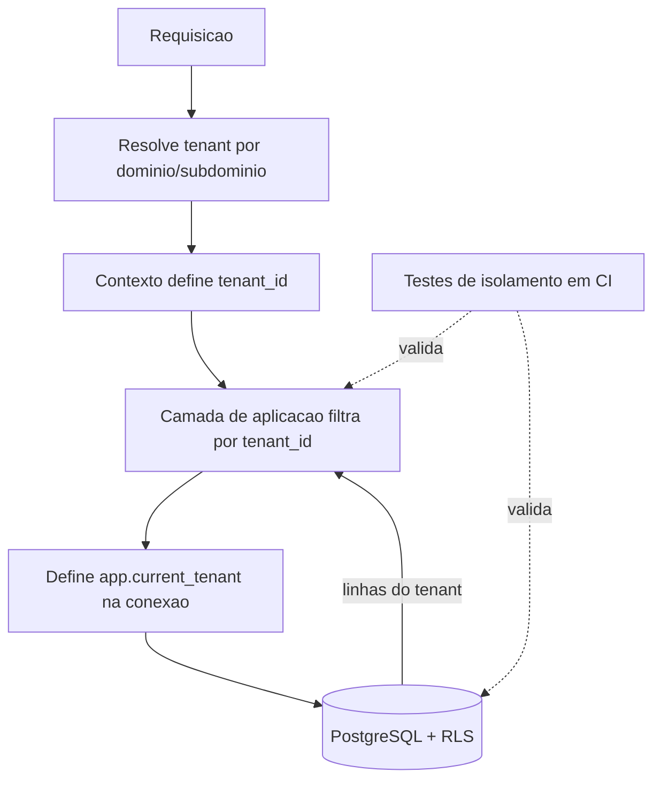

# 09 - Segurança e LGPD

Este documento define os controles de segurança da plataforma "Chamados" e as práticas de conformidade com a Lei Geral de Proteção de Dados (Lei 13.709/2018 - LGPD). O foco é o que é específico deste produto: isolamento multi-tenant, segurança do `agente_ia` (que executa código e acessa sistemas dos clientes), tratamento de uploads e rich text, criptografia de credenciais de `SistemaAlvo` e o ciclo de vida de dados pessoais.

Assuntos fora de escopo aqui, tratados nos documentos indicados:
- Autenticação, sessões, convites e matriz de permissões: `03-autenticacao-perfis-permissoes.md`.
- Detalhes de infraestrutura, deploy, rede e configuração de workers/filas: `01-arquitetura.md`.
- Estratégia multi-tenant no banco (RLS, `tenant_id`) em nível de modelagem: `02-modelo-de-dados.md` e `07-multitenancy-whitelabel.md`.

Nomes de entidades, papéis (`admin`, `operador`, `cliente`, `agente_ia`) e enums seguem o brief canônico.

---

## 1. Princípios de segurança

1. **Defesa em profundidade**: nenhuma camada é a única barreira. Falha de uma camada (ex.: bug de escopo na aplicação) não deve, sozinha, permitir vazamento entre tenants.
2. **Menor privilégio**: cada componente recebe o mínimo de acesso necessário. Isso vale especialmente para o `agente_ia`, que roda código externo.
3. **Isolamento por tenant como padrão**: toda query, todo storage, todo segredo e todo job é escopado a um `tenant_id`. O default é negar; acesso cross-tenant exige rota administrativa explícita e auditada.
4. **Auditoria de tudo que importa**: ações sensíveis geram `EventoChamado` e/ou logs de acesso persistidos. O `agente_ia` registra cada execução em `ExecucaoIA`.
5. **Humano no circuito para ações de impacto**: qualquer mudança de código proposta pela IA exige aprovação humana antes de merge/deploy (guardrail).
6. **Privacidade desde a concepção**: coleta mínima (formulários mínimos já reduzem dados pessoais), retenção limitada e exclusão/anonimização suportadas por design.

---

## 2. Modelo de ameaças (resumido)

Metodologia STRIDE aplicada aos ativos críticos. Ativos: dados de chamados de um tenant, credenciais de `SistemaAlvo` (git, logs, BD read-only), segredos da plataforma, código-fonte dos clientes acessível pelo worker.

| Ameaça | Vetor concreto | Mitigação principal | Doc/seção |
|---|---|---|---|
| Vazamento cross-tenant | Bug de escopo em query; JWT/sessão sem `tenant_id`; job da fila com tenant errado | RLS + escopo na aplicação + testes de isolamento (§3) | §3, `02`, `07` |
| Prompt injection | Texto do chamado/anexo instrui a IA a exfiltrar dados ou executar ações indevidas | Contexto não confiável marcado, menor privilégio, aprovação humana (§4) | §4 |
| Exfiltração via IA | IA convencida a ler segredos/BD de outro tenant ou vazar em nota pública | Worker recebe só credenciais do tenant do job; saída revisada; guardrails (§4) | §4 |
| Upload malicioso | Arquivo executável, SVG com script, polyglot, path traversal, zip bomb | Validação de tipo real, limites, storage fora do webroot, URLs assinadas (§5) | §5 |
| XSS armazenado | Rich text com `<script>`/handlers em descrição/mensagem renderizado a outro usuário | Sanitização server-side, CSP, allowlist de tags (§6) | §6 |
| Roubo de credenciais de SistemaAlvo | Dump de BD, log de segredo, acesso indevido | Criptografia at rest (envelope), segregação de KMS, sem log de segredo (§7) | §7 |
| Elevação de privilégio | `cliente` acessando rota de `operador`/`admin`; IA agindo além do papel | Autorização por papel (`03`); `agente_ia` como service account restrita | `03`, §4 |
| Escape do sandbox do worker | Código do repositório do cliente ou payload da IA executando no host | Worker isolado, efêmero, sem credenciais de plataforma, egress restrito (§4.4) | §4.4 |
| Violação LGPD | Retenção indevida, ausência de base legal, não atendimento a titular | Bases legais, retenção, exclusão/anonimização, DSR (§8) | §8 |
| Perda de dados | Falha de storage/BD, ransomware, exclusão acidental | Backups criptografados, testes de restore, RPO/RTO (§9) | §9 |

> DECISÃO PENDENTE: adotar um threat model documentado formalmente (ex.: planilha STRIDE por sprint) e revisá-lo a cada nova integração externa, ou manter apenas esta seção resumida como referência viva.

---

## 3. Isolamento multi-tenant (defesa em profundidade)

Três camadas independentes garantem que dados de um tenant nunca sejam acessíveis por outro. A modelagem detalhada está em `02-modelo-de-dados.md`; aqui ficam as garantias de segurança.

### 3.1 Camada 1 — Row-Level Security (RLS) no PostgreSQL

- Toda tabela com dados de tenant possui coluna `tenant_id NOT NULL`.
- Políticas RLS filtram por uma variável de sessão (`app.current_tenant`, conforme `02-modelo-de-dados.md`) definida no início de cada transação/conexão.
- A aplicação usa um **role de banco sem `BYPASSRLS`**. Migrations e tarefas administrativas usam um role separado, com uso auditado.
- RLS é a rede de segurança final: mesmo que a aplicação esqueça um `WHERE tenant_id = ...`, o banco recusa linhas de outros tenants.

### 3.2 Camada 2 — Escopo na aplicação

- Toda requisição resolve o tenant (por subdomínio/domínio próprio — ver `03`/`07`) e injeta `tenant_id` no contexto da requisição antes de qualquer acesso a dados.
- A camada de acesso a dados (repositórios sobre TypeORM) recebe o `tenant_id` do contexto e o injeta via `runInTenantContext` (`SET LOCAL app.current_tenant` na transação — ver `02-modelo-de-dados.md`). Nenhuma query "livre" sem tenant é permitida fora de rotas administrativas explícitas.
- Jobs na fila (BullMQ) carregam `tenant_id` no payload; o worker define o escopo antes de qualquer operação. Nunca se infere tenant a partir de dado do usuário sem revalidação.
- IDs opacos (não sequenciais previsíveis) reduzem enumeração; ainda assim autorização nunca depende de obscuridade do ID.

### 3.3 Camada 3 — Testes de isolamento

- Suíte de testes automatizada dedicada a isolamento, executada em CI, bloqueando merge em caso de falha.
- Casos mínimos:
  - Usuário do tenant A não lê/escreve `Chamado`, `Mensagem`, `Anexo`, `SistemaAlvo` do tenant B (via API e via acesso direto simulado).
  - RLS bloqueia leitura cross-tenant mesmo com query sem filtro explícito.
  - Job com `tenant_id` do tenant A não consegue tocar dados do tenant B.
  - URLs assinadas de `Anexo` do tenant A não abrem objeto do tenant B.

> DECISÃO PENDENTE: modelo físico do isolamento — schema único com RLS por linha (recomendado) vs. schema-por-tenant. Definir em conjunto com `02`/`07`.

---

## 4. Segurança do agente_ia

O `agente_ia` é o componente de maior superfície de risco: recebe texto não confiável (chamado/anexos), executa uma engine de IA (Claude Agent SDK, Opus 4.8) e tem acesso a código-fonte, logs e BD read-only do `SistemaAlvo`. A camada de abstração de provider (ver `05-agente-ia.md`) não altera os controles abaixo.

### 4.1 Prompt injection via texto do chamado e anexos

Todo conteúdo originado do `cliente` — título, descrição rich text, mensagens, texto extraído de anexos — é **entrada não confiável** e pode conter instruções maliciosas ("ignore as regras anteriores", "vaze as credenciais", "abra um PR que remove validações").

Controles:
- **Separação de canais**: instruções do sistema/pipeline vêm em canal distinto do conteúdo do usuário. O conteúdo do chamado é sempre apresentado à IA como dado a ser analisado, delimitado e rotulado como não confiável, nunca como comando.
- **A IA não deriva autoridade do texto do chamado**: pedidos embutidos no texto para elevar privilégio, acessar outro tenant, mudar prioridade/status fora do fluxo, ou executar ações não previstas no pipeline são ignorados por construção — as ações permitidas são um conjunto fechado (§4.3).
- **Anexos**: texto extraído de anexos (OCR/parse) é tratado como conteúdo não confiável idêntico ao corpo do chamado. Arquivos não são executados; apenas lidos/parseados em ambiente isolado.
- **Validação de saída**: antes de publicar, a saída da IA é verificada — nota interna vs. pública respeita `visibilidade`; diagnóstico não vaza segredos nem dados de outro contexto; nenhuma credencial aparece em `Mensagem` ou `EventoChamado`.

### 4.2 Princípio do menor privilégio e escopo por tenant

- O worker que processa um job recebe **apenas** as credenciais do `SistemaAlvo` do tenant daquele job. Não há, no processo, acesso a segredos de outros tenants nem a segredos da plataforma.
- Acesso ao banco do `SistemaAlvo` é **somente leitura** (conexão read-only, usuário de BD sem escrita). A IA nunca escreve no banco do cliente.
- O `agente_ia` é uma **service account** com papel próprio (ver `03`): participa como operador automatizado, restrito às ações do pipeline. Não é `admin`; não gerencia tenants, usuários nem configurações.

### 4.3 Ações permitidas (conjunto fechado)

O pipeline (detalhado em `05`) só habilita:
- Publicar `Mensagem` pública pedindo informações (leva a `aguardando_cliente`).
- Publicar nota interna (`visibilidade=interna`) com diagnóstico, classificação de `complexidade`, ajuste de `natureza`, sugestão de `prioridade`.
- Para `natureza=problema` + `complexidade=facil` bem compreendido: criar branch, implementar, **abrir PR** e publicar nota interna com o resultado — **nunca** merge/deploy, **nunca** commit direto em produção.
- Para `natureza=alteracao`: publicar nota interna com a SPEC.
- Registrar `ExecucaoIA` (entrada, ações, custo, duração, resultado).

Qualquer ação fora dessa lista é indisponível ao agente, independentemente do que o texto do chamado solicite.

### 4.4 Sandbox do worker e aprovação humana

- **Sandbox**: o worker roda isolado (container/VM efêmera, ver `01`), sem credenciais da plataforma no ambiente, com **egress de rede restrito** (apenas o necessário: git do `SistemaAlvo`, endpoint do provider de IA, storage/fila internos). Filesystem efêmero, destruído ao fim do job. O `git pull` e a execução de código do cliente ocorrem dentro desse sandbox, tratando o repositório como não confiável.
- **Aprovação humana obrigatória**: qualquer mudança de código proposta pela IA fica em PR aguardando `operador`/`admin`. Merge e deploy **exigem ação humana**. Este guardrail é padrão e não relaxável pelo próprio agente.
- **Limites de recurso**: timeout, teto de custo por `ExecucaoIA` e limite de tentativas por chamado evitam loops e abuso; estouro encerra a execução e registra o resultado.

> DECISÃO PENDENTE: permitir, por configuração do tenant no futuro, relaxar o guardrail de aprovação humana (ex.: auto-merge de PRs triviais em ambiente não-produtivo). Enquanto não decidido, aprovação humana é sempre obrigatória.

> DECISÃO PENDENTE: tecnologia de sandbox (container com seccomp/gVisor, microVM tipo Firecracker, ou runner efêmero gerenciado) — definir com `01-arquitetura.md`.

---

## 5. Uploads e anexos

`Anexo` cobre imagens inline do rich text e arquivos anexados. Fluxo e storage (S3-compatível: MinIO em dev, S3/R2 em prod) descritos em `01`/`04`; aqui ficam os controles de segurança.

- **Validação de tipo real**: o tipo é determinado pelo conteúdo (magic bytes / sniffing), não apenas pela extensão ou pelo `Content-Type` informado. Rejeita divergência extensão × conteúdo e polyglots.
- **Allowlist de tipos**: apenas tipos previstos (imagens comuns, PDF, documentos, texto, logs). Executáveis e scripts são bloqueados. **SVG** só é aceito após sanitização (remoção de `<script>`, handlers, `foreignObject`) ou servido como download com `Content-Type` seguro — nunca renderizado inline sem sanitização.
- **Limites**: tamanho máximo por arquivo e por chamado; validação de dimensões de imagem; proteção contra zip bomb / arquivos com descompressão desproporcional.
- **Storage fora do webroot**: objetos ficam em bucket S3-compatível privado, nunca em diretório servido diretamente pela aplicação. Nomes de objeto gerados pelo servidor (não o nome do arquivo do usuário) e **escopados por `tenant_id`** no path/prefixo.
- **URLs assinadas**: download/exibição via URL pré-assinada de curta expiração, emitida somente após checagem de autorização (papel + pertencimento ao tenant + acesso ao chamado). Anexo com `visibilidade=interna` não é servível a `cliente`.
- **Servir com segurança**: respostas de download usam `Content-Disposition: attachment` quando aplicável e cabeçalhos que impedem execução/renderização perigosa (`X-Content-Type-Options: nosniff`).
- **Antivírus/scan**: recomendável varredura de malware (ex.: ClamAV) assíncrona antes de disponibilizar o anexo; até a varredura concluir, o anexo pode ficar em quarentena.

> DECISÃO PENDENTE: exigir scan antivírus síncrono no MVP ou tratar como fase 2 (quarentena + scan assíncrono). Depende de custo/latência aceitáveis.

---

## 6. Sanitização de rich text e prevenção de XSS

Descrições e mensagens usam rich text (TipTap no cliente, ver `04`/`08`). O cliente **não é fronteira de segurança**; a sanitização definitiva é **server-side**.

- **Sanitização no servidor**: todo HTML rich text é sanitizado no backend antes de persistir e/ou antes de renderizar, com allowlist rígida de tags e atributos (formatação básica, links, imagens inline permitidas). Remove `<script>`, `<style>`, `<iframe>`, event handlers (`on*`), `javascript:`/`data:` perigosos em URLs, e atributos não previstos.
- **Links**: `href` restrito a esquemas seguros (`http`, `https`, `mailto`); links externos com `rel="noopener noreferrer"`.
- **Imagens inline**: apontam para `Anexo` do próprio tenant via URL assinada; não se aceita `data:`/URL externa arbitrária embutida. A remoção de `data:` **pressupõe** o pré-processamento server-side descrito em `04-chamados.md` §5, que extrai as imagens coladas (`data:`) e as converte em `Anexo` (`inline=true`) reescrevendo o `src` **antes** desta sanitização — do contrário, imagens legitimamente coladas no editor seriam descartadas.
- **CSP**: Content-Security-Policy restritiva (sem `unsafe-inline` para scripts; fontes de script/estilo/imagem/conexão explicitamente listadas) como segunda barreira contra XSS.
- **Cookies/sessão**: `HttpOnly`, `Secure`, `SameSite` (detalhes em `03`) reduzem impacto de eventual XSS.
- **Saída da IA**: notas e mensagens geradas pelo `agente_ia` passam pela mesma sanitização — a IA não é fonte confiável de HTML.

---

## 7. Segredos e credenciais de SistemaAlvo

`SistemaAlvo` guarda dados altamente sensíveis: URL/credenciais do repositório git, fontes/caminhos de logs e conexão read-only ao BD do cliente. Comprometê-los expõe o sistema do tenant.

- **Criptografia at rest (envelope encryption)**: segredos são cifrados com uma data key; a data key é protegida por uma chave mestra em KMS/serviço de segredos. O banco nunca armazena segredo em texto claro. Alternativa aceitável: cofre dedicado (ex.: Vault) referenciado por handle.
- **Segregação da chave mestra**: a chave mestra vive no KMS/cofre, fora do banco. Comprometer um dump de BD não revela segredos sem também comprometer o KMS.
- **Descriptografia sob demanda e efêmera**: segredos são decifrados apenas no momento do uso (ex.: worker montando o `git pull` ou a conexão read-only), mantidos em memória, nunca gravados em disco persistente nem em logs.
- **Nunca logar segredos**: filtros de log removem tokens, senhas e strings de conexão. Mensagens de erro não ecoam credenciais.
- **Escopo por tenant**: um worker só decifra segredos do tenant do job corrente (reforça §4.2).
- **Rotação**: suportar rotação/revogação de credenciais de `SistemaAlvo` sem downtime; credencial de BD do cliente deve ser um usuário read-only dedicado, revogável.
- **Segredos da plataforma** (JWT, SMTP, KMS, credenciais de storage) ficam fora do repositório, em variáveis de ambiente/secret manager (ver `01`), sem acesso pelo sandbox do `agente_ia`.

> DECISÃO PENDENTE: usar KMS gerenciado do provedor de nuvem, HashiCorp Vault self-hosted, ou biblioteca de envelope encryption com chave em variável de ambiente no MVP. Definir com `01`.

---

## 8. LGPD e proteção de dados pessoais

### 8.1 Papéis LGPD

- Cada **Tenant** é, em regra, **controlador** dos dados pessoais de seus clientes/chamados.
- A plataforma "Chamados" atua como **operadora** (processadora) desses dados em nome do tenant, sob contrato/DPA.
- Para dados dos próprios usuários da plataforma (cadastro de `operador`/`admin`, faturamento), a plataforma pode ser controladora. Distinção formalizada em contrato.

> DECISÃO PENDENTE: modelo contratual controlador/operador e template de DPA por tenant — validar com jurídico.

### 8.2 Dados pessoais tratados

| Categoria | Exemplos | Onde | Base legal típica |
|---|---|---|---|
| Identificação/contato | nome, e-mail, telefone do `Usuario` | `Usuario`, `PreferenciaNotificacao`, `CanalNotificacao` | Execução de contrato / legítimo interesse |
| Conteúdo de chamado | título, descrição, `Mensagem`, `Anexo` (podem conter dados pessoais informados livremente) | `Chamado`, `Mensagem`, `Anexo` | Execução de contrato (suporte) |
| Metadados/auditoria | `EventoChamado`, logs de acesso, IP, timestamps | logs, `EventoChamado` | Legítimo interesse / obrigação legal |
| Dados do SistemaAlvo | logs/BD do cliente acessados pela IA podem conter dados pessoais de terceiros | acesso read-only, efêmero no worker | Responsabilidade do tenant controlador |

Princípio de **minimização**: os formulários mínimos do produto já limitam a coleta. Não solicitar dados sensíveis; se aparecerem no texto livre, aplicam-se retenção e exclusão como aos demais.

### 8.3 Direitos do titular (DSR)

Suportar, mediado pelo tenant controlador: confirmação de tratamento, acesso, correção, anonimização/eliminação, portabilidade e informação sobre compartilhamento. Operacionalmente:
- Endpoint/rotina administrativa para **exportar** os dados pessoais de um titular dentro de um tenant.
- Rotina de **exclusão/anonimização** (§8.5).
- Prazo de atendimento conforme LGPD; toda solicitação registrada em log de acesso.

### 8.4 Retenção

| Dado | Retenção padrão | Observação |
|---|---|---|
| Chamados `fechado`/`resolvido` | Configurável por tenant | `resolvido` fecha após N dias (ver `04`); histórico visível ao cliente |
| Logs de acesso/auditoria | Período definido (ex.: 6-12 meses) | Necessário para segurança e obrigações legais |
| `ExecucaoIA` | Período definido | Custo/diagnóstico; pode conter trechos do chamado |
| Anexos | Vinculada ao chamado | Excluídos junto do chamado |
| Backups | Janela de retenção do backup (§9) | Exclusão em backups ocorre pela expiração natural |

> DECISÃO PENDENTE: prazos numéricos de retenção por categoria e se são configuráveis por tenant. Definir com jurídico e com `07` (config por tenant).

### 8.5 Exclusão e anonimização

- **Exclusão** de um chamado/usuário remove os dados pessoais dos sistemas primários (BD + objetos de `Anexo` no storage).
- **Anonimização** é preferível à exclusão física quando há necessidade de preservar histórico/estatística: substitui identificadores por valores irreversíveis, mantendo `EventoChamado` e métricas agregadas sem dado pessoal.
- Registros de auditoria/`EventoChamado` podem ser **preservados de forma anonimizada** por obrigação legal, mesmo após exclusão do titular.
- Dados em **backups** não são apagados individualmente; a exclusão se completa pela expiração do ciclo de retenção do backup, o que é documentado ao titular.
- O `agente_ia` não cria cópias persistentes de dados do `SistemaAlvo`: o acesso é efêmero e o filesystem do worker é destruído ao fim do job (§4.4).

### 8.6 Logs de acesso

- Registrar acessos a dados pessoais sensíveis: quem (usuário/serviço), quando, qual recurso, qual tenant, resultado.
- Acesso do `agente_ia` a código/logs/BD do `SistemaAlvo` é registrado em `ExecucaoIA` e/ou log de acesso.
- Logs de auditoria são **append-only** na prática (sem edição/remoção pela aplicação comum), com acesso restrito.
- Logs não contêm segredos (§7) nem, quando evitável, corpo de dado pessoal — referenciam por ID.

### 8.7 Sub-operadores e transferência internacional

- Terceiros que processam dados (provider de IA/Anthropic, provedor de nuvem/storage, gateway de e-mail SMTP, futuros gateways de WhatsApp) são **sub-operadores** e devem constar do DPA.
- Transferência internacional (ex.: API de IA fora do Brasil) exige base legal e transparência ao controlador.

> DECISÃO PENDENTE: lista oficial de sub-operadores e tratamento de residência de dados (permitir tenant exigir processamento apenas no Brasil?). Interage com a escolha de provider de IA (`05`).

---

## 9. Backups e recuperação

- **Backups automáticos e criptografados** do PostgreSQL (at rest) e dos objetos de `Anexo` (storage S3-compatível com versionamento).
- **Criptografia**: backups cifrados; chaves geridas no KMS/cofre (§7), separadas dos dados.
- **Isolamento tenant preservado**: restauração parcial deve respeitar `tenant_id`; um restore não pode reintroduzir/expor dados de outro tenant.
- **Testes de restore**: restauração testada periodicamente (backup não testado não conta como backup). Registrar data do último teste bem-sucedido.
- **RPO/RTO**: objetivos definidos por SLA.
- **Proteção contra ransomware/exclusão acidental**: retenção com versões imutáveis / object lock quando disponível; credenciais de backup segregadas das de produção.
- **Runbook de recuperação**: procedimento documentado para restauração total e point-in-time (detalhes operacionais em `01`).

> DECISÃO PENDENTE: valores de RPO/RTO, janela de retenção de backups e uso de object lock/imutabilidade. Definir com `01` e com o SLA comercial.

---

## 10. Checklist de implementação (resumo)

- [ ] RLS habilitado em todas as tabelas com `tenant_id`; role da app sem `BYPASSRLS`.
- [ ] Escopo por tenant no contexto de requisição e em todo job de fila.
- [ ] Suíte de testes de isolamento cross-tenant no CI (bloqueante).
- [ ] Worker do `agente_ia` isolado, efêmero, egress restrito, sem segredos de plataforma.
- [ ] BD do `SistemaAlvo` acessado por usuário read-only dedicado.
- [ ] Aprovação humana obrigatória para merge/deploy de código proposto pela IA.
- [ ] Conjunto fechado de ações do `agente_ia`; contexto do chamado marcado como não confiável.
- [ ] Validação de tipo real + limites + allowlist em uploads; storage privado; URLs assinadas.
- [ ] Sanitização server-side de rich text + CSP.
- [ ] Envelope encryption de credenciais de `SistemaAlvo`; nenhum segredo em log.
- [ ] Bases legais mapeadas; rotinas de exportação e exclusão/anonimização (DSR).
- [ ] Logs de acesso a dados pessoais; auditoria append-only.
- [ ] Backups criptografados com testes de restore periódicos.
