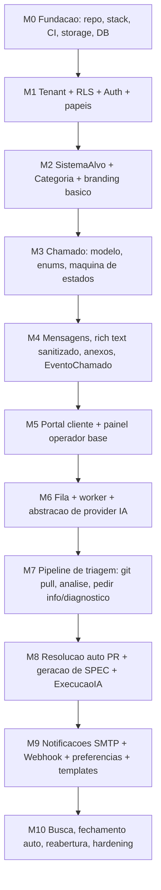

# 10 — Roadmap e Fases de Entrega

Este documento define **o que é entregue e em qual ordem**. Estabelece o corte do MVP (fase 1) com lista fechada de escopo e de não-escopo, descreve as fases 2 e 3 por temas, define critérios de pronto por fase, lista riscos com mitigação e sugere uma ordem de implementação dos módulos dentro do MVP.

Ele **não** detalha features: cada tema aponta para o documento responsável (`00-visao-geral.md` a `09-seguranca-lgpd.md`). A fonte da verdade dos requisitos é `specs/requisitos-originais.md`.

> DECISÃO PENDENTE: datas de calendário e alocação de equipe. Este roadmap ordena escopo e dependências, não estima prazos. As metas numéricas das métricas (ver `00-visao-geral.md`, seção 7) dependem de baseline do osTicket e ficam pendentes.

---

## 1. Princípios do corte de escopo

1. **MVP entrega o loop completo IA-first**, não um helpdesk genérico. Um chamado precisa poder ser aberto, triado pela IA (com git pull, análise de código/logs/BD read-only), diagnosticado e respondido — ponta a ponta — ou o produto não prova sua tese. — RF-10 a RF-16
2. **Isolamento multi-tenant e segurança não são fase posterior.** Row-Level Security, escopo por `tenant_id` e sanitização de rich text entram no MVP; são requisito, não feature. Ver `09-seguranca-lgpd.md`.
3. **Extensibilidade instalada, fornecedores adiados.** As abstrações de provider de IA e de gateway de notificação entram no MVP: a de IA com **uma** implementação (Claude Agent SDK, Opus 4.8) e a de notificação com **duas** (e-mail SMTP e webhook genérico). Expandir para outros fornecedores/canais (ex.: WhatsApp) é futuro, sem reescrever o núcleo. — RF-17, RF-18
4. **Formulário mínimo desde o dia um.** RNF-01 e RNF-02 são critérios de aceite do MVP, não polimento futuro.
5. **Cada fase é utilizável em produção.** Nada de fase que só "prepara terreno" sem valor entregável ao tenant.

---

## 2. Fase 1 — MVP (corte fechado)

Objetivo do MVP: **um tenant real consegue substituir o osTicket para o fluxo essencial** — clientes abrem chamados, a IA tria automaticamente, operadores atendem, notificações por e-mail funcionam, tudo isolado por tenant.

### 2.1 Entra no MVP

| #    | Item                                                                                                                                                                                                                                                                                                            | Doc de referência                                        |
| ---- | --------------------------------------------------------------------------------------------------------------------------------------------------------------------------------------------------------------------------------------------------------------------------------------------------------------- | -------------------------------------------------------- |
| E-01 | Multi-tenancy com isolamento por `tenant_id` + Row-Level Security                                                                                                                                                                                                                                               | `07-multitenancy-whitelabel.md`, `02-modelo-de-dados.md` |
| E-02 | Provisionamento manual de tenant (seed/admin de plataforma via script)                                                                                                                                                                                                                                          | `07-multitenancy-whitelabel.md`                          |
| E-03 | Branding básico por tenant (logo, cores, nome) e resolução de tenant por subdomínio                                                                                                                                                                                                                             | `07-multitenancy-whitelabel.md`, `08-ui-ux.md`           |
| E-04 | Autenticação (login/logout, sessão) e convites para operador e cliente                                                                                                                                                                                                                                          | `03-autenticacao-perfis-permissoes.md`                   |
| E-05 | Papéis admin, operador, cliente e agente_ia como service account                                                                                                                                                                                                                                                | `03-autenticacao-perfis-permissoes.md`                   |
| E-06 | Matriz de permissões aplicada (cliente não vê nota interna nem complexidade)                                                                                                                                                                                                                                    | `03-autenticacao-perfis-permissoes.md`                   |
| E-07 | Cadastro de SistemaAlvo: repo git + credenciais, fontes de logs, conexão BD read-only                                                                                                                                                                                                                           | `07-multitenancy-whitelabel.md`, `02-modelo-de-dados.md` |
| E-08 | Categoria geral do tenant (fallback quando não há sistema-alvo específico)                                                                                                                                                                                                                                      | `02-modelo-de-dados.md`                                  |
| E-09 | Abertura de chamado com formulário mínimo (sistema-alvo se houver >1, natureza, título, descrição rich text, prioridade opcional)                                                                                                                                                                               | `04-chamados.md`                                         |
| E-10 | Editor rich text com imagens/anexos inline e **sanitização server-side**                                                                                                                                                                                                                                        | `04-chamados.md`, `09-seguranca-lgpd.md`                 |
| E-11 | Upload/armazenamento de Anexo em storage S3-compatível                                                                                                                                                                                                                                                          | `04-chamados.md`, `01-arquitetura.md`                    |
| E-12 | Timeline de Mensagem com visibilidade `publica`/`interna`                                                                                                                                                                                                                                                       | `04-chamados.md`                                         |
| E-13 | Máquina de estados completa dos status (`novo`→…→`fechado`/`cancelado`), fechamento automático de `resolvido` após N dias e reabertura pelo cliente                                                                                                                                                             | `04-chamados.md`                                         |
| E-14 | Enums canônicos: status, natureza, prioridade, complexidade, visibilidade                                                                                                                                                                                                                                       | `00-visao-geral.md`, `02-modelo-de-dados.md`             |
| E-15 | EventoChamado (auditoria de status/prioridade/atribuição/ações da IA)                                                                                                                                                                                                                                           | `04-chamados.md`, `02-modelo-de-dados.md`                |
| E-16 | Fila (Redis + BullMQ) e worker isolado do agente_ia                                                                                                                                                                                                                                                             | `01-arquitetura.md`, `05-agente-ia.md`                   |
| E-17 | Pipeline de triagem: git pull, análise de código/logs/BD read-only, entendeu/não-entendeu                                                                                                                                                                                                                       | `05-agente-ia.md`                                        |
| E-18 | IA pede informação (mensagem `publica` → `aguardando_cliente`) e re-enfileira ao responder                                                                                                                                                                                                                      | `05-agente-ia.md`                                        |
| E-19 | IA classifica complexidade, valida/ajusta natureza, sugere prioridade, publica nota interna com diagnóstico                                                                                                                                                                                                     | `05-agente-ia.md`                                        |
| E-20 | Resolução automática `problema`+`facil`: branch + PR + nota interna; **merge/deploy só com aprovação humana**                                                                                                                                                                                                   | `05-agente-ia.md`, `09-seguranca-lgpd.md`                |
| E-21 | Geração de SPEC para `natureza=alteracao` em nota interna                                                                                                                                                                                                                                                       | `05-agente-ia.md`                                        |
| E-22 | ExecucaoIA (entrada, ações, custo, duração, resultado)                                                                                                                                                                                                                                                          | `05-agente-ia.md`, `02-modelo-de-dados.md`               |
| E-23 | Camada de abstração de provider de IA (uma impl.: Claude Agent SDK, Opus 4.8)                                                                                                                                                                                                                                   | `01-arquitetura.md`, `05-agente-ia.md`                   |
| E-24 | Guardrails de IA: worker isolado, escopo read-only no BD, nunca deploy direto, defesa a prompt injection                                                                                                                                                                                                        | `09-seguranca-lgpd.md`, `05-agente-ia.md`                |
| E-25 | Notificações: camada de gateway plugável (duas impls. no MVP: e-mail SMTP e webhook genérico)                                                                                                                                                                                                                   | `06-notificacoes.md`                                     |
| E-26 | CanalNotificacao (SMTP por tenant) e PreferenciaNotificacao por usuário                                                                                                                                                                                                                                         | `06-notificacoes.md`, `02-modelo-de-dados.md`            |
| E-27 | Eventos notificáveis: chamado criado, nova mensagem `publica`, mudança de status, atribuição                                                                                                                                                                                                                    | `06-notificacoes.md`                                     |
| E-28 | Templates de notificação com branding do tenant                                                                                                                                                                                                                                                                 | `06-notificacoes.md`                                     |
| E-29 | Portal do cliente (abrir, acompanhar status/prioridade/mensagens, histórico de fechados, reabrir)                                                                                                                                                                                                               | `08-ui-ux.md`                                            |
| E-30 | Painel do operador/admin (fila de chamados, timeline com notas internas, mudar status/prioridade/atribuição, aprovar/rejeitar ações da IA)                                                                                                                                                                      | `08-ui-ux.md`                                            |
| E-31 | Busca básica de chamados (por texto, status, sistema-alvo) dentro do tenant — **entregue no M10** (full-text `websearch_to_tsquery`/`tsvector` com ranking, ver `04-chamados.md` §10.4)                                                                                                                         | `04-chamados.md`                                         |
| E-32 | Web responsivo (sem app nativo)                                                                                                                                                                                                                                                                                 | `08-ui-ux.md`                                            |
| E-33 | WebhookAdapter genérico por tenant: URL + segredo, POST JSON assinado (HMAC SHA-256), eventos de atualização de chamado (criado, mensagem `publica`, status/prioridade/atribuição, resolvido/fechado), **nunca conteúdo interno**; retries/idempotência via fila; desativação após N falhas com alerta ao admin | `06-notificacoes.md`                                     |

### 2.2 NÃO entra no MVP (explícito)

Estes itens são **conscientemente adiados**. Referência ao tema em fases posteriores na seção 3.

| #    | Fora do MVP                                                                          | Fase alvo                                       |
| ---- | ------------------------------------------------------------------------------------ | ----------------------------------------------- |
| N-01 | Gateway de WhatsApp (Meta Cloud API / Evolution / Twilio)                            | Futuro, sem prioridade (D-003)                  |
| N-02 | Inbound **email-to-ticket** (abrir/responder chamado por e-mail recebido)            | Fase 2                                          |
| N-03 | Base de conhecimento (KB) alimentada pela IA e FAQ/portal público                    | Fase 2/3                                        |
| N-04 | SLA contratual formal (metas, relógios de SLA, escalonamento, penalidades)           | Fase 2                                          |
| N-05 | Pesquisa de satisfação (CSAT) pós-fechamento                                         | Fase 2                                          |
| N-06 | Relatórios/dashboards analíticos e exportação                                        | Fase 2/3                                        |
| N-07 | Billing/cobrança de tenants (planos, medição, faturas)                               | Fase 3                                          |
| N-08 | Self-service de provisionamento de tenant (signup público, onboarding automatizado)  | Fase 3                                          |
| N-09 | Domínio próprio (custom domain além de subdomínio) e certificados automatizados      | Fase 2                                          |
| N-10 | Segundo provider de IA / troca de engine em runtime (abstração existe; 2ª impl. não) | Fase 3                                          |
| N-11 | Relaxamento do guardrail (merge/deploy automático configurável por tenant)           | Fase 3                                          |
| N-12 | Importador de dados históricos do osTicket                                           | Não fazer por ora (osTicket em leitura — D-005) |
| N-13 | App mobile nativo                                                                    | Não planejado                                   |
| N-14 | Live chat síncrono / presença em tempo real                                          | Não planejado                                   |
| N-15 | Super-admin de plataforma como produto (cross-tenant UI)                             | Fase 3                                          |
| N-16 | Categorias avançadas / taxonomia rica por tenant além da categoria geral             | Fase 2                                          |

> DECIDIDO (2026-07-15): **não haverá importador de dados do osTicket por ora** (N-12); a estratégia de transição é manter o osTicket acessível em modo leitura enquanto o histórico for necessário — ver specs/decisoes.md (D-005). Ecoa a decisão de `00-visao-geral.md`, seção 4.

> DECISÃO PENDENTE: profundidade do **branding no MVP** (E-03) — apenas logo/cores/nome vs. CSS/temas customizáveis. Recomendação: mínimo no MVP, avançado na fase 2. Confirmar em `07-multitenancy-whitelabel.md`.

---

## 3. Fases 2 e 3 (temas)

Fases posteriores agrupadas por tema. Ordem interna e cortes finais serão definidos ao fim do MVP, com base em feedback do primeiro tenant.

### 3.1 Fase 2 — Consolidação e canais

| Tema                              | Descrição                                                                                                                                                                                                                                                                                           | Doc                                                            |
| --------------------------------- | --------------------------------------------------------------------------------------------------------------------------------------------------------------------------------------------------------------------------------------------------------------------------------------------------- | -------------------------------------------------------------- |
| WhatsApp (sem prioridade — D-003) | Adapter de notificação **adiado sem prioridade** (o webhook genérico da fase 1 já cobre a integração de entrega via sistema externo do tenant). Quando retomado, **comparar** Meta WhatsApp Cloud API oficial vs. Evolution API vs. Twilio (custo, aprovação de templates, confiabilidade, lock-in) | `06-notificacoes.md`                                           |
| Inbound email-to-ticket           | Abrir e responder chamados a partir de e-mails recebidos; parsing, threading, deduplicação, anexos, defesa a spoofing                                                                                                                                                                               | `04-chamados.md`, `06-notificacoes.md`, `09-seguranca-lgpd.md` |
| SLA                               | Metas de tempo por prioridade/tenant, relógios de SLA, alertas de violação, escalonamento (sem billing)                                                                                                                                                                                             | `04-chamados.md`                                               |
| CSAT                              | Pesquisa de satisfação pós-`fechado`/`resolvido`; alimenta métrica de satisfação                                                                                                                                                                                                                    | `06-notificacoes.md`, `00-visao-geral.md`                      |
| Domínio próprio                   | Custom domain além de subdomínio, emissão/renovação de certificado                                                                                                                                                                                                                                  | `07-multitenancy-whitelabel.md`                                |
| Base de conhecimento (semente)    | IA passa a acumular soluções recorrentes em KB interna consultável na triagem                                                                                                                                                                                                                       | `05-agente-ia.md`                                              |
| Relatórios operacionais           | Painéis de volume, tempo de resolução, taxa de auto-resolução, custo de IA por chamado                                                                                                                                                                                                              | `00-visao-geral.md`, `08-ui-ux.md`                             |
| Categorias/taxonomia              | Estrutura de categorias por tenant além da categoria geral                                                                                                                                                                                                                                          | `02-modelo-de-dados.md`                                        |

### 3.2 Fase 3 — Escala e negócio

| Tema                      | Descrição                                                                         | Doc                                       |
| ------------------------- | --------------------------------------------------------------------------------- | ----------------------------------------- |
| Billing de tenants        | Planos, medição de uso (chamados, custo de IA), faturas, limites                  | `07-multitenancy-whitelabel.md`           |
| Self-service onboarding   | Signup público, provisionamento automatizado de tenant, wizard de setup           | `07-multitenancy-whitelabel.md`           |
| KB pública / portal FAQ   | Base de conhecimento voltada ao cliente, deflexão de chamados                     | `08-ui-ux.md`                             |
| 2º provider de IA         | Segunda implementação da abstração (troca de engine/modelo — "hermes ou similar") | `01-arquitetura.md`, `05-agente-ia.md`    |
| Relaxamento de guardrail  | Merge/deploy automático opt-in por tenant, com trilha de auditoria reforçada      | `05-agente-ia.md`, `09-seguranca-lgpd.md` |
| Super-admin de plataforma | UI cross-tenant de operação, observabilidade e suporte à instalação               | `07-multitenancy-whitelabel.md`           |
| Relatórios avançados      | BI, exportação, métricas de precisão de classificação da IA                       | `00-visao-geral.md`                       |

```mermaid
flowchart LR
    subgraph F1[Fase 1 - MVP]
      A[Loop IA-first completo]
      B[Multi-tenant + RLS]
      C[E-mail SMTP]
      D[Portal + Painel web]
    end
    subgraph F2[Fase 2 - Canais]
      E[WhatsApp]
      G[Email-to-ticket]
      H[SLA]
      I[CSAT]
      J[Relatorios + KB semente]
    end
    subgraph F3[Fase 3 - Negocio]
      K[Billing]
      L[Self-service onboarding]
      M[2o provider IA]
      N[Guardrail relaxavel]
    end
    F1 --> F2 --> F3
```

---

## 4. Critérios de pronto por fase

Cada fase só é considerada entregue quando **todos** os critérios abaixo são atendidos, além dos requisitos transversais (isolamento por tenant, sanitização, auditoria).

### 4.1 Critérios do MVP (Definition of Done da fase 1)

- **Funcional ponta a ponta:** um cliente de um tenant abre um chamado; o agente_ia executa git pull, analisa (código/logs/BD read-only), publica diagnóstico (nota interna) ou pede informação (mensagem `publica`), e o operador consegue atender até `resolvido`/`fechado`. — RF-03 a RF-16
- **Resolução automática demonstrável:** ao menos um caso `problema`+`facil` gera branch + PR + nota interna, sem tocar produção; merge exige aprovação humana. — RF-15, E-20
- **SPEC de alteração:** ao menos um caso `natureza=alteracao` produz nota interna com SPEC utilizável. — RF-16, E-21
- **Isolamento comprovado:** teste automatizado prova que usuário de um tenant não lê/escreve dados de outro (RLS ativa). Ver `09-seguranca-lgpd.md`.
- **Permissões:** cliente nunca vê nota `interna` nem complexidade; verificado por teste. — RF-08, RF-09
- **Notificação:** e-mail SMTP disparado nos 4 eventos do MVP (E-27), com branding do tenant e respeitando PreferenciaNotificacao.
- **Formulário mínimo:** abertura de chamado com no máximo os campos definidos em E-09; validado contra RNF-01.
- **Segurança de upload/rich text:** sanitização server-side ativa; sem XSS em anexos/HTML. Ver `09-seguranca-lgpd.md`.
- **Auditoria:** todo evento relevante gera EventoChamado; toda execução da IA gera ExecucaoIA com custo e duração.
- **Abstrações instaladas:** provider de IA e gateway de notificação atrás de interface; trocar impl. não exige mexer no núcleo (verificado por revisão de arquitetura). — `01-arquitetura.md`
- **Observabilidade mínima:** logs estruturados de jobs da fila e falhas do worker; retry/dead-letter configurados. — `01-arquitetura.md`

### 4.2 Critérios de fase 2 e 3

- **Fase 2:** inbound email-to-ticket criando/atualizando chamados com deduplicação; SLA com alertas de violação; CSAT coletado e refletido na métrica de satisfação. (A pluralidade de gateways sob a mesma abstração já é entregue no MVP — e-mail SMTP + webhook; WhatsApp fica para quando/se retomado, D-003.)
- **Fase 3:** billing medindo uso real por tenant; onboarding self-service provisiona um tenant funcional sem intervenção manual; 2º provider de IA plugado sem regressão no pipeline; guardrail relaxável auditável e desligável por tenant.

---

## 5. Riscos principais e mitigação

| #    | Risco                                                                                           | Impacto | Mitigação                                                                                                                                                        |
| ---- | ----------------------------------------------------------------------------------------------- | ------- | ---------------------------------------------------------------------------------------------------------------------------------------------------------------- |
| R-01 | **Qualidade/consistência da IA** na triagem (diagnósticos errados, classificação ruim)          | Alto    | Guardrails; nunca deploy automático (E-20); operador aprova; medir precisão de classificação; prompts versionados; começar assistindo, não substituindo o humano |
| R-02 | **Custo de IA por chamado** escala além do sustentável                                          | Alto    | Registrar custo em ExecucaoIA; limites/orçamento por tenant; cache de git pull; evitar reprocessamento; medir métrica de custo desde o MVP                       |
| R-03 | **Prompt injection** via descrição/mensagem do cliente ou conteúdo de repositório/logs          | Alto    | Worker isolado, BD read-only, sem credenciais de deploy no contexto da IA; sanitização e separação de instruções; ver `09-seguranca-lgpd.md`                     |
| R-04 | **Vazamento entre tenants** (falha de isolamento)                                               | Crítico | RLS + `tenant_id` obrigatório; testes de isolamento como critério de pronto; revisão de segurança; ver `09-seguranca-lgpd.md`                                    |
| R-05 | **Acesso ao sistema-alvo** (credenciais git/BD/logs) mal gerido                                 | Crítico | Credenciais cifradas, escopo mínimo, conexão BD estritamente read-only; rotação; ver `07-multitenancy-whitelabel.md` e `09-seguranca-lgpd.md`                    |
| R-06 | **Escopo do MVP inchar** (tentação de já entregar WhatsApp/SLA/relatórios)                      | Médio   | Corte fechado da seção 2; itens fora do MVP explicitados; disciplina de fase                                                                                     |
| R-07 | **Latência da triagem** (git pull + análise) degrada UX                                         | Médio   | Fila assíncrona; feedback imediato ao cliente ("em triagem"); git pull incremental/cache; timeouts e retry                                                       |
| R-08 | **Lock-in de provider de IA** ao acoplar ao Claude Agent SDK                                    | Médio   | Camada de abstração obrigatória desde o MVP (E-23), mesmo com uma só impl. — RF-17                                                                               |
| R-09 | **Lock-in de gateway** (esp. WhatsApp na fase 2)                                                | Médio   | Adapter pattern; comparar Meta vs. Evolution vs. Twilio antes de commitar; ver `06-notificacoes.md`                                                              |
| R-10 | **Stack fechada** (resolvido) — confirmada em D-001/D-010 (TypeORM, autenticação própria, etc.) | Baixo   | M0 destravado; ver `01-arquitetura.md` e specs/decisoes.md (D-001, D-010)                                                                                        |
| R-11 | **Migração/adoção** — operação presa a hábitos do osTicket                                      | Médio   | UX moderna (RNF-02); transição com osTicket em leitura; importador descartado por ora (N-12, D-005)                                                              |
| R-12 | **Sanitização de rich text** insuficiente → XSS                                                 | Alto    | Sanitização server-side (E-10); allowlist de tags; testes; ver `09-seguranca-lgpd.md`                                                                            |

---

## 6. Ordem de implementação sugerida (dentro do MVP)

Ordem por **dependência técnica**, não por prioridade de valor. Cada marco (M) é incremental e verificável. Marcos M0–M2 são fundação; o valor IA-first aparece a partir de M6.

| Marco   | Entrega                                                                                                                         | Itens (seção 2.1)               | Depende de                 |
| ------- | ------------------------------------------------------------------------------------------------------------------------------- | ------------------------------- | -------------------------- |
| **M0**  | Fundação: monorepo, banco, storage, fila provisionada, CI, esqueleto de deploy                                                  | infra de E-11/E-16              | —                          |
| **M1**  | Tenant + RLS + autenticação + papéis (inclui agente_ia service account) + convites                                              | E-01, E-04, E-05, E-06          | M0                         |
| **M2**  | SistemaAlvo (repo/logs/BD read-only), Categoria geral, branding e resolução por subdomínio                                      | E-02, E-03, E-07, E-08          | M1                         |
| **M3**  | Modelo de Chamado, enums canônicos, máquina de estados                                                                          | E-09 (backend), E-13, E-14      | M2                         |
| **M4**  | Mensagens (`publica`/`interna`), rich text sanitizado, anexos, EventoChamado                                                    | E-10, E-11, E-12, E-15          | M3                         |
| **M5**  | Portal do cliente (abrir/acompanhar) e painel do operador base (fila/timeline/ações)                                            | E-09 (UI), E-29, E-30, E-32     | M4                         |
| **M6**  | Fila + worker isolado + abstração de provider de IA (Opus 4.8)                                                                  | E-16, E-23, E-24                | M5                         |
| **M7**  | Pipeline de triagem: git pull, análise código/logs/BD, pedir info, diagnóstico, classificação                                   | E-17, E-18, E-19                | M6                         |
| **M8**  | Resolução automática (branch/PR, aprovação humana), geração de SPEC, ExecucaoIA                                                 | E-20, E-21, E-22                | M7                         |
| **M9**  | Notificações: gateway plugável com e-mail SMTP e webhook genérico, CanalNotificacao, PreferenciaNotificacao, templates, eventos | E-25, E-26, E-27, E-28, E-33    | M5 (paralelizável com M6+) |
| **M10** | Busca, fechamento automático de `resolvido`, reabertura, hardening de segurança/observabilidade                                 | E-31, refinamento de E-13, E-24 | M8, M9                     |

> DECIDIDO (2026-07-15): marcos **M0–M10 concluídos** — o escopo do MVP deste roadmap (seção 2.1) está implementado (implementado no M10).

**Paralelização:** M9 (notificações) depende só de M5 e pode correr em paralelo com M6–M8. Segurança/isolamento (E-24, RLS) não é um marco isolado: é validada continuamente e travada como critério de pronto (seção 4.1).

> DECISÃO PENDENTE: se o painel do operador (M5) e o portal do cliente (M5) devem ser aplicações separadas ou uma única app com rotas por papel. Recomendação: app única, layouts distintos. Confirmar em `08-ui-ux.md`.

---

## 7. Rastreabilidade (requisitos → fase)

| Requisito                                                    | Fase                                                            |
| ------------------------------------------------------------ | --------------------------------------------------------------- |
| RF-01, RF-02 (papéis + IA usuário)                           | MVP (E-05)                                                      |
| RF-03, RF-04 (cliente abre/acompanha)                        | MVP (E-29)                                                      |
| RF-05 (rich text/anexos)                                     | MVP (E-10, E-11)                                                |
| RF-06 (natureza)                                             | MVP (E-09, E-14)                                                |
| RF-07, RF-08, RF-09 (operador, notas internas, complexidade) | MVP (E-06, E-12, E-19)                                          |
| RF-10, RF-11 (IA entende/pede info)                          | MVP (E-17, E-18)                                                |
| RF-12 (IA classifica complexidade)                           | MVP (E-19)                                                      |
| RF-13, RF-14 (IA acessa código/logs/BD, git pull)            | MVP (E-07, E-17)                                                |
| RF-15 (IA resolve fácil via PR)                              | MVP (E-20)                                                      |
| RF-16 (SPEC de alteração)                                    | MVP (E-21)                                                      |
| RF-17 (Claude Agent SDK + abstração de provider)             | MVP (E-23); 2º provider fase 3 (N-10)                           |
| RF-18 (gateways de notificação plugáveis)                    | MVP: e-mail SMTP + webhook (E-25, E-33); WhatsApp futuro (N-01) |
| RF-19 (whitelabel multi-tenant)                              | MVP (E-01, E-03)                                                |
| RNF-01 (formulários mínimos)                                 | MVP (E-09)                                                      |
| RNF-02 (UX moderna/rápida)                                   | MVP (E-29, E-30, E-32)                                          |
| RNF-03 (spec-driven)                                         | Transversal (esta spec)                                         |

Todos os RF/RNF originais são cobertos já no MVP, exceto as extensões naturais (2º provider de IA, WhatsApp) que ficam nas fases 2/3 por serem expansões das abstrações já entregues.
