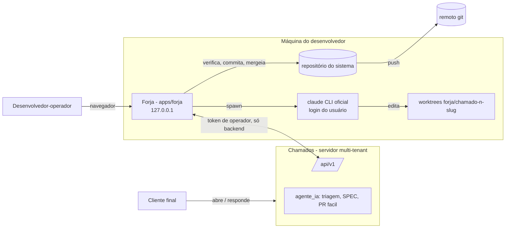
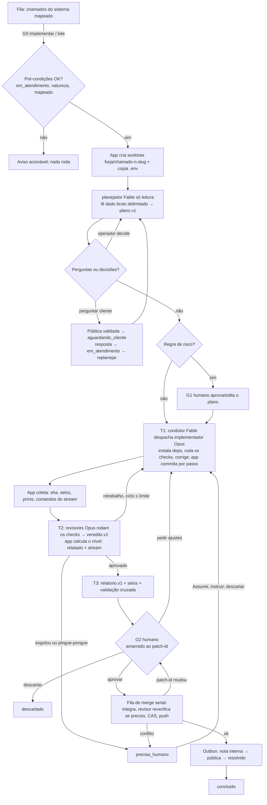

# Forja 00 — Visão Geral e Objetivos

Documento raiz das specs da **Forja** (`apps/forja`). Define o problema, a visão, objetivos e não-objetivos, a persona única, os princípios, o **glossário canônico** que todas as specs da Forja usam, as jornadas J1–J7 em resumo, o mapa "pedido do usuário → onde é atendido", as métricas de sucesso e o fluxo macro.

Fora de escopo aqui — cada tema tem sua spec, e este documento não a duplica:

| Tema                                                                                                         | Documento                               |
| ------------------------------------------------------------------------------------------------------------ | --------------------------------------- |
| Processos, stack, pastas de `apps/forja`, runner da CLI, perfis de spawn por etapa, SSE/WS, retomada, deploy | `specs/forja/01-arquitetura.md`         |
| Entidades SQLite, campos, relações, migrations TypeORM, diretório de dados, retenção                         | `specs/forja/02-modelo-de-dados.md`     |
| Máquina de estados, transições e quem decide, gates, ciclos, lote, freio de cota, fila de merge, outbox      | `specs/forja/03-pipeline.md`            |
| Papéis de agente, prompts, `--agents`, contratos zod, selos, validação cruzada, validador de linguagem       | `specs/forja/04-agentes-e-contratos.md` |
| Modelo de ameaças, separação leitor/executor, deny/settings, modo reforçado, credenciais, servidor local     | `specs/forja/05-seguranca.md`           |
| Telas, wireframes, fluxos de UI, design system, notificações                                                 | `specs/forja/06-ui-ux.md`               |
| Uso da API `/api/v1` por momento, notas da IA, cadeias de status, polling, D-036, identidade                 | `specs/forja/07-integracao-chamados.md` |
| Spikes S1–S10, marcos M0–M5, fases 2–4, riscos                                                               | `specs/forja/08-roadmap.md`             |
| ADRs da Forja (FJ-xxx) e decisões do usuário                                                                 | `specs/forja/decisoes.md`               |

Convenção: **[V]** = verificado (experimento, doc ou código, com fonte); **[NV]** = a validar, sempre com o spike que valida e o plano B. Fontes abreviadas: "01 §n" a "04 §n" = relatórios de pesquisa; "critica Fn" = fatos verificados na crítica adversarial; "C §n" = proposta C (jornada/MVP).

> DECIDIDO (2026-10-02): o nome é **Forja**; vive **dentro do monorepo** como `apps/forja`; o "chat normal" é **os dois** canais — feed estruturado das etapas + terminal real embutido (PTY). Ver `specs/forja/decisoes.md`.
>
> DECIDIDO (2026-10-02): ao concluir, o chamado vai a **`resolvido`** (o auto-fechamento do servidor faz o `fechado`); entrega padrão **`merge_e_push`**; persistência **TypeORM + better-sqlite3**; agentes que escrevem rodam **sem sandbox, com `--dangerously-skip-permissions`** (sandbox da CLI = modo reforçado opcional por projeto; o `bwrap` da verificação ficou sem efeito com FJ-032).

---

## 1. Problema

### 1.1 O que o Chamados já faz sozinho

A `agente_ia` do servidor (`specs/05-agente-ia.md`) tria **todo** chamado: entende, pede informação ao cliente, classifica natureza e complexidade, diagnostica com acesso somente leitura a código, logs e banco, responde `duvida` sozinha (D-017) e, para alterações, escreve uma **SPEC** na nota interna. Quando o caso é `facil` + confiança alta, ela ainda propõe a correção: escreve arquivos numa working copy descartável, o worker cria a branch `ia/chamado-<n>-<slug>`, faz push e abre o PR (`specs/05` §6, D-023). Merge e deploy são sempre manuais (D-022).

### 1.2 O que falta: implementar

| Dimensão              | IA de triagem do servidor (hoje)                                                       | Lacuna                                                                                                      |
| --------------------- | -------------------------------------------------------------------------------------- | ----------------------------------------------------------------------------------------------------------- |
| Escopo de código      | Só `facil`, pontual e inequívoco (texto, rótulo, valor)                                | `medio` e `dificil` param na SPEC: o desenvolvedor lê, implementa à mão, testa, mergeia e responde          |
| Execução              | Escreve arquivos; **não** tem git, rede nem execução de código (`specs/05` §6)         | Nada compila, testa ou roda a mudança antes de ela chegar ao humano                                         |
| Verificação           | Nenhuma                                                                                | O humano não sabe se o PR builda, passa nos testes ou cumpre o critério de aceite                           |
| O que chega ao humano | PR técnico + nota interna                                                              | Para aprovar, é preciso ler código. Ninguém diz, em linguagem de negócio, que regra mudou e se o banco muda |
| Fechamento do ciclo   | Mensagem pública fixa "em revisão" (D-022); merge, resposta final e status são manuais | Após o merge, alguém ainda precisa escrever ao cliente, sem jargão, e levar o chamado a `resolvido`         |
| Volume                | Um chamado por vez, no ritmo da triagem                                                | Não há como pegar 8 chamados de manhã e tê-los prontos para aprovar à tarde                                 |

O trabalho que sobra para o desenvolvedor-operador é repetitivo e caro: ler a SPEC, abrir branch, implementar, testar, revisar o próprio código, explicar ao cliente e mudar o status. É também onde mora o gargalo real dessas ferramentas: **a revisão humana, não a execução** [V como relato de terceiros, 03 §0.9].

### 1.3 Por que local, e não mais um worker no servidor

- O desenvolvedor já tem na máquina os repositórios, o ambiente de build e a assinatura do Claude Code. A forma de usar essa assinatura em conformidade é rodar o **binário `claude` oficial, não modificado, com o login dele** [V 03 §0.1, legal-and-compliance]. O Agent SDK com OAuth da assinatura fica fora.
- Merge e push em repositórios de clientes usam as credenciais git do próprio desenvolvedor, que não devem ir para o servidor.
- O servidor do Chamados é multi-tenant e não deve executar código escrito por agente a partir de texto de cliente. A Forja tira essa execução dele.

## 2. Visão

A **Forja** é um app web **local** e de **um usuário** que transforma chamados prontos para implementar em **mudanças verificadas, explicadas e aprovadas**. Ela lista os chamados do Chamados pela API `/api/v1`, implementa cada um com a CLI oficial do Claude Code numa worktree isolada (um Fable conduz e despacha Opus), verifica, revisa, escreve um **relatório não técnico** (regras de negócio e schema do banco em destaque), espera a **aprovação humana**, faz o **merge** na branch de destino e **responde e encerra** o chamado pela API.

A Forja **complementa** a IA de triagem e não a substitui. A triagem continua no servidor; a Forja entra quando o desenvolvedor decide implementar e consome a SPEC e o diagnóstico da triagem como **dado não confiável**.

## 3. Objetivos

1. **Fechar o ciclo do chamado implementável** sem trabalho manual repetitivo: seleção → plano → implementação → verificação → revisão → relatório → aprovação → merge → resposta → `resolvido`.
2. **Tornar a aprovação possível sem ler código linha a linha**: o relatório não técnico, com seções obrigatórias de regras de negócio e schema do banco, cruzado com selos calculados pelo app, é o artefato central (F-12).
3. **Respeitar o pedido literal de orquestração**: um Fable (configurável) planeja e conduz; Opus implementam e revisam (F-02, F-04).
4. **Nunca enganar**: o nível de verificação é calculado pelo app (comandos relatados pelo revisor × stream, FJ-032) e nunca arredondado para cima. A mensagem ao cliente passa pelo mesmo validador de jargão e promessa do servidor (D-015/D-022), e o merge não é anunciado como publicação (U-5).
5. **Lote com freio**: 8 chamados numa manhã, com concorrência baixa, freio de cota da assinatura e aprovação individual (F-14).
6. **Recuperável**: crash do app, cota esgotada, API fora do ar ou conflito de merge nunca deixam estado inconsistente. Nada é re-mergeado e nenhuma mensagem é duplicada (F-08, F-10, F-16).
7. **O Claude de verdade ao alcance**: terminal PTY com `claude` interativo e "Assumir" qualquer sessão do pipeline (F-13).
8. **Consistência com o monorepo**: mesmo ORM (TypeORM), mesmos tokens visuais (D-009/D-018/D-019), mesmos enums e validadores de `@chamados/shared` (F-17, F-18).

## 4. Não-objetivos

- **Não é CI/CD.** A verificação local é um sinal para o humano aprovar, não um gate de produção. O CI do projeto, se existir, continua soberano.
- **Não faz deploy.** Merge ≠ deploy (D-022). O botão "Publicado em produção" (Gdeploy) só **registra** que alguém publicou; a Forja não publica nada.
- **Não é multiusuário nem multi-tenant.** É uma máquina e um usuário, sem contas e sem RLS no SQLite local. O isolamento entre tenants continua garantido no **servidor**: a Forja só fala com a API escopada pelo token e pelo tenant da conexão.
- **Não roda em servidor nem é exposta à rede.** Bind em `127.0.0.1`, e não vai para a VPS: o rsync e o `npm install` do deploy excluem `apps/forja` (F-18).
- **Não substitui nem relaxa a IA de triagem.** Não muda guardrails do servidor nem cria status novo ("em implementação") no Chamados (F-19).
- **Não é IDE nem um novo cliente de chat.** O chat livre é o próprio `claude` no PTY; a Forja não reimplementa a TUI.
- **Não usa Agent SDK, binário modificado nem flag não documentada** no MVP. A interface `Runner` permite o SDK no futuro, se o usuário optar por `ANTHROPIC_API_KEY` (F-17).
- **No MVP, não:** resolve conflito de merge automaticamente (Fase 3), aprova o G2 em bloco, escreve testes e2e sozinho (Fase 2, U-7), abre PR (modo `pull_request` = Fase 2), parte da branch da IA do servidor (Fase 2), trata dependências entre chamados nem faz rollback (Fase 3).
- **Não é multiplataforma no MVP.** O alvo é Linux; WSL2 entra na Fase 4.

## 5. Persona

### 5.1 O desenvolvedor-operador (persona única)

É quem desenvolve os sistemas-alvo **e** atende os chamados como `operador` no Chamados. Mantém vários repositórios de clientes, tem assinatura do Claude Code (plano com telemetria `five_hour`/`seven_day` [V 03 §0.4]) e trabalha em rajadas: escolhe um lote pela manhã, aprova entre reuniões e intervém quando algo trava.

| Quer                                                                | Não quer                                                                               |
| ------------------------------------------------------------------- | -------------------------------------------------------------------------------------- |
| Aprovar lendo o relatório, os selos e o diff só onde importa        | Ler PR "slop" verboso ou descobrir depois que uma migration passou despercebida        |
| Saber o que **não** foi feito e o que **não** foi testado           | "Testado e2e" quando só rodou typecheck                                                |
| Conversar com o Claude normal a qualquer momento e assumir a sessão | Uma caixa de chat que não é o Claude de verdade                                        |
| Que a cópia de trabalho dele, inclusive na `main`, fique intacta    | `stash`, `reset` ou `--force` feitos por uma ferramenta                                |
| Mensagens ao cliente sem jargão e sem promessa falsa                | Cliente lendo "fiz o merge da branch" ou "já está no ar" antes do deploy               |
| Previsibilidade de cota                                             | Créditos extras consumidos em silêncio (em `-p` a CLI não pede consentimento [V C §2]) |

### 5.2 Afetados indiretos (não usam a Forja)

- **Cliente final:** recebe a mensagem pública e vê o chamado em `resolvido`. Não sabe que a Forja existe; o autor exibido é a identidade de operador dedicada (ex.: "Equipe de Suporte", F-20).
- **Equipe do tenant no painel:** vê a nota interna com relatório técnico, branch, SHA e nível de verificação, no formato próximo da nota de PR da IA (F-16).
- **`agente_ia` do servidor:** irrelevante para a Forja (FJ-031, 2026-10-03): não é pré-condição, a Forja não a silencia nem reativa, e o estado dela aparece só como informação na fila. Quem implementa é o Claude local.

## 6. Princípios

1. **O app decide SE; o Fable decide COMO.** Estados, gates, limites, freio de cota, fila de merge e outbox são código determinístico persistido em SQLite. O Fable decide como dividir o trabalho entre os Opus e quando pedir retrabalho dentro do turno; quem decide se a execução avança é o código (F-01, F-02).
2. **Humano aprova.** O G0 (seleção) e o G2 (aprovação final, amarrada ao `patch-id`) são sempre humanos, e o G2 é individual. Mudou o patch, há reaprovação (F-11).
3. **Nada irreversível por agente.** Merge, push, mensagem pública e mudança de status só são feitos pelo app, depois da aprovação. Os agentes têm `git push`, `git merge`, `git remote` e afins negados por regra que vale em bypass (F-04).
4. **Dado do cliente nunca é instrução.** Texto do chamado, anexos e notas da IA do servidor chegam do app só ao `planejador` (somente leitura), delimitados como dados. Quem tem `Agent`, Edit e Bash recebe do app só o **plano aprovado** (F-03). Desde FJ-030 (2026-10-03) planejador e condutor também leem o Chamados por um MCP **somente leitura**, cujo retorno o prompt trata como dado, nunca instrução. **(FJ-031, 2026-10-03):** decisão aceita — o condutor lê o chamado bruto pelo MCP (a experiência de "usar o `claude` com o MCP do Chamados"); a regra vale como "o planejador é só leitura e o texto do cliente é dado delimitado em todo prompt".
5. **O relatório é o produto.** Ele é curto, estruturado e em linguagem de negócio. Regras de negócio e schema do banco são seções obrigatórias, com declaração explícita quando nada mudou. Selos calculados pelo app são cruzados com o que o modelo declarou, e incoerência vira alerta vermelho (F-12).
6. **A verdade está no SQLite e no git.** Nada que o agente possa editar serve de contexto oficial. O plano aprovado, os achados e os comentários vão por stdin; a retomada monta o estado a partir do banco local e dos commits (F-08).
7. **Honestidade de verificação.** Quem roda os checks é o agente (FJ-032, 2026-10-03: a Forja não executa comandos do projeto); o app cruza o que o revisor relatou com o stream, calcula o nível, que só vale para o `sha` verificado, e o relatório diz "não testado ponta a ponta" quando não houve e2e (U-7).
8. **Camada fina sobre peças oficiais.** Binário `claude` oficial, git, API `/api/v1`. A detecção de recursos se faz pelo `system/init` (`capabilities`), não pela versão (03 §3.4). As ferramentas do nicho morrem rápido [V 03 §0.10].
9. **Nunca mexer no que é do usuário.** A cópia de trabalho do usuário só é lida. A integração acontece em worktree destacada e o avanço da ref é por compare-and-swap (F-10).

> **Risco aceito (U-3, 2026-10-02).** Exposto: um teste ou script escrito pelo agente a partir de um chamado malicioso roda com os privilégios do usuário, lê o que ele lê (inclusive `~/.ssh` e `.env`, porque as regras `deny` barram as **ferramentas** do agente, não o que um processo lançado por Bash faz) e alcança a rede. Compensa: a separação leitor/executor (princípio 4), o `deny` de git destrutivo e de leitura de segredos pelas ferramentas, o fato de push/merge serem só do app, o G2 amarrado ao `patch-id`, o env limpo nos spawns, a faixa permanente no Diagnóstico e o modo reforçado opcional por projeto. Detalhe em `specs/forja/05-seguranca.md`.

---

## 7. Glossário canônico

Os nomes abaixo são **canônicos**: usados exatamente assim em todas as specs da Forja e no código de `apps/forja`. Os campos ficam em `specs/forja/02-modelo-de-dados.md`, as transições em `specs/forja/03-pipeline.md` e os contratos em `specs/forja/04-agentes-e-contratos.md`. Os enums do Chamados (`status`, `natureza`, `prioridade`, `complexidade`, `visibilidade`) seguem `specs/00-visao-geral.md` §8.3 e não são redefinidos aqui.

### 7.1 Entidades (SQLite local)

| Entidade             | O que é                                                                                                                                                                                                        |
| -------------------- | -------------------------------------------------------------------------------------------------------------------------------------------------------------------------------------------------------------- |
| `conexao_chamados`   | Ligação a uma instalação do Chamados: URL base, tenant, usuário `operador` dedicado, token cifrado. A senha fica no keyring do SO (F-20).                                                                      |
| `projeto`            | Um repositório local implementável: diretório, remoto, branch de destino, modo de entrega, política de conclusão, scripts encontrados (dicas ao agente, FJ-032), detectores (globs), modelos, limites e gates. |
| `mapeamento_sistema` | Liga o sistema-alvo do Chamados ao `projeto` (por id quando a API expuser, D-036 L2; por nome até lá).                                                                                                         |
| `chamado_cache`      | Cópia local, só leitura, de um chamado da fila e dos seus sinais (IA silenciada — informativo, FJ-031 —, SPEC, PR da IA, última mensagem).                                                                     |
| `lote`               | Agrupamento de execuções iniciadas juntas. Cada chamado continua com a sua `execucao`.                                                                                                                         |
| `execucao`           | **Entidade-chave**: 1 chamado × 1 tentativa. Tem estado, worktree, branch, `sha_base`/`sha_atual`, ciclos, nível de verificação e `patch-id` aprovado.                                                         |
| `etapa`              | Uma unidade de trabalho de uma execução (§7.3). Guarda `session_id`, `pid`, `pgid`, perfil de spawn e telemetria (custo, `modelUsage`, negações).                                                              |
| `evento`             | Log append-only com `seq` monotônico. Alimenta o feed e o SSE.                                                                                                                                                 |
| `artefato`           | Arquivo versionado de uma execução: plano, veredito, relatório, resposta, diff, log, evidência.                                                                                                                |
| `comentario`         | Comentário humano sobre plano, diff ou relatório, destinado a um ciclo.                                                                                                                                        |
| `aprovacao`          | Decisão humana num gate (plano, final, reaprovação), com `patch-id`, `sha` e texto da resposta aprovados.                                                                                                      |
| `item_fila_merge`    | Posição de uma execução aprovada na fila serial do par projeto + branch de destino.                                                                                                                            |
| `outbox_chamado`     | Um passo idempotente de comunicação com o Chamados (nota interna, mensagem pública, mudança de status).                                                                                                        |
| `uso_assinatura`     | Amostra de cota da assinatura (`five_hour`, `seven_day`, `resetsAt`, overage), lida do `rate_limit_event`.                                                                                                     |
| `sessao_terminal`    | Um PTY aberto, livre ou ligado a uma sessão do pipeline ("Assumir").                                                                                                                                           |

### 7.2 Papéis de agente

| Papel                 | Modelo (default)         | Como roda                                                                    | Escreve código?                                                     | Fase   |
| --------------------- | ------------------------ | ---------------------------------------------------------------------------- | ------------------------------------------------------------------- | ------ |
| `planejador`          | Fable `claude-fable-5-1` | Processo próprio, `--restricted`, `Read/Grep/Glob` + MCP só leitura (FJ-030) | Não                                                                 | MVP    |
| `condutor`            | Fable (configurável)     | Sessão por execução, retomada por turno (T1/T2/T3); despacha Opus            | Não deveria: o prompt manda delegar, e a telemetria marca se editou | MVP    |
| `implementador`       | Opus `claude-opus-5-5`   | Subagente do condutor no T1, um por passo do plano                           | Sim                                                                 | MVP    |
| `revisor_correcao`    | Opus                     | Subagente do condutor no T2: aderência ao plano e aos critérios              | Não                                                                 | MVP    |
| `revisor_seguranca`   | Opus                     | Subagente do condutor no T2: segredos, rede, SQL cru, authz, deps, scripts   | Não                                                                 | MVP    |
| `relator`             | Fable                    | **Turno T3 do condutor**, com `--json-schema relatorio`                      | Não                                                                 | MVP    |
| `testador_e2e`        | Opus                     | Escreve o roteiro e2e; **o app executa**                                     | Só o roteiro                                                        | Fase 2 |
| `resolvedor_conflito` | Opus                     | Resolve conflito textual, sempre com reaprovação                             | Sim                                                                 | Fase 3 |

A troca de `--json-schema` entre `--resume` mantendo a memória da sessão é o que permite os três turnos numa sessão só [V critica F2]. Os perfis exatos de flags ficam em `specs/forja/01-arquitetura.md`.

### 7.3 Etapas (`etapa.tipo`)

| Etapa               | Executor                        | Saída                                                                                                                                                           |
| ------------------- | ------------------------------- | --------------------------------------------------------------------------------------------------------------------------------------------------------------- |
| `planejar`          | `planejador`                    | `plano.v1`                                                                                                                                                      |
| `implementar`       | `condutor` T1 → `implementador` | `resumo_impl.v1` + commit por passo feito pelo app                                                                                                              |
| `verificar`         | **app** (sem agente)            | **Coleta** (FJ-032): commit, `sha_verificado`, selos, prints e os comandos que o T1 rodou, lidos do stream; nenhum comando do projeto é executado pelo app      |
| `evidenciar`        | **app** (coleta)                | Coleta e valida os prints `antes`/`depois` que o condutor tirou no T1 (B7, `forja-print`, FJ-030) quando o selo `altera_ui` liga; `evidencia_visual` ⚙ (FJ-026) |
| `revisar`           | `condutor` T2 → revisores       | `veredito.v1` + `decisao`                                                                                                                                       |
| `relatar`           | `condutor` T3                   | `relatorio.v1` (com `resposta.v1` embutida)                                                                                                                     |
| `conversar`         | sessão da etapa pausada         | Mensagens no painel "Conversa do chamado"                                                                                                                       |
| `integrar`          | **app** (git)                   | Merge em worktree destacada, `patch-id`, reverificação pelo revisor só se o destino andou ∧ arquivos se cruzam (FJ-032), CAS da ref, push                       |
| `resolver_conflito` | `resolvedor_conflito`           | Fase 3                                                                                                                                                          |

### 7.4 Estados de `execucao`

O significado está resumido abaixo; transições, gatilhos e quem decide ficam em `specs/forja/03-pipeline.md`. **Não confundir** com o `status` do chamado no Chamados: a execução vive na Forja e o chamado fica em `em_atendimento` durante quase toda ela.

| Grupo               | Estado                        | Significado curto                                                                                                                        |
| ------------------- | ----------------------------- | ---------------------------------------------------------------------------------------------------------------------------------------- |
| Entrada             | `na_fila`                     | Selecionado (G0), esperando semáforo, cota e pré-condições                                                                               |
|                     | `preparando`                  | Criando a worktree, copiando os arquivos locais e coletando a entrada (sem `setup`, FJ-032)                                              |
| Planejamento        | `planejando`                  | `planejador` em execução                                                                                                                 |
|                     | `plano_pronto`                | Plano válido; o código aplica a regra de gate                                                                                            |
|                     | `aguardando_plano`            | **G1**: humano revisa o plano                                                                                                            |
|                     | `aguardando_decisao`          | **Gdec**: há pergunta ao cliente ou decisão do operador                                                                                  |
|                     | `aguardando_cliente_resposta` | Pergunta publicada; chamado em `aguardando_cliente`                                                                                      |
| Ciclo de construção | `implementando`               | Condutor T1 + implementadores                                                                                                            |
|                     | `verificando`                 | App roda build/typecheck/testes/e2e                                                                                                      |
|                     | `revisando`                   | Condutor T2 + revisores                                                                                                                  |
|                     | `relatando`                   | Condutor T3                                                                                                                              |
| Aprovação           | `aguardando_aprovacao`        | **G2**: relatório + diff + resposta aguardando o humano                                                                                  |
|                     | `retrabalho_humano`           | Humano pediu ajustes; volta a implementar com os comentários                                                                             |
| Merge               | `na_fila_merge`               | Aprovado, na fila serial                                                                                                                 |
|                     | `integrando`                  | App integrando (com reverificação pelo revisor quando exigida, FJ-032) e avançando a ref                                                 |
|                     | `resolvendo_conflito`         | O agente resolve o conflito com o destino na worktree do chamado; o humano só reaprova (FJ-036, 2026-10-04; antes Fase 3)                |
|                     | `mergeado`                    | Ref de destino avançada (e push feito, conforme o modo)                                                                                  |
| Comunicação         | `comunicando`                 | Outbox em andamento                                                                                                                      |
|                     | `mergeado_pendente_chamado`   | Merge feito, mas o Chamados falhou; retentativa e botão "tentar agora"                                                                   |
|                     | `aguardando_deploy`           | Política `aguardar_deploy`: parte pública retida até "Publicado em produção"                                                             |
| Terminais           | `concluido`                   | Outbox completo                                                                                                                          |
|                     | `descartado`                  | Humano rejeitou o trabalho já produzido nesta tentativa (com nota interna opcional)                                                      |
|                     | `cancelado`                   | Encerrada sem trabalho a preservar (desistência antes de implementar) ou porque o chamado foi encerrado no servidor                      |
| Escalonamento       | `precisa_humano`              | Limite, pingue-pongue, incoerência, conflito ou falha classificada como ambiente                                                         |
| Laterais (retornam) | `pausado_usuario`             | Pausa manual (SIGINT); permite conversar                                                                                                 |
|                     | `pausado_cota`                | Etapa parou por limite da assinatura ou overage não autorizado; retoma em `resetsAt` (o freio que só impede _iniciar_ não muda o estado) |
|                     | `assumido_manual`             | Sessão aberta no PTY; volta com "Devolver"                                                                                               |
|                     | `interrompido`                | Crash do app ou do processo; oferece retomar                                                                                             |
|                     | `falhou`                      | Falha de infraestrutura, retentável                                                                                                      |

### 7.5 Gates humanos

| Gate    | Quando                                                                                                                                      | Obrigatório                      |
| ------- | ------------------------------------------------------------------------------------------------------------------------------------------- | -------------------------------- |
| G0      | Seleção: "Implementar" ou "Implementar em lote"                                                                                             | Sempre                           |
| G1      | Padrão `nunca` (FJ-034): só `alertas_seguranca` para; com `por_risco`, também confiança ≠ alta, schema e `dificil` (lote não força, FJ-033) | Por risco                        |
| Gdec    | Pergunta ao cliente ou decisão do operador sem suposição/recomendação (as demais o app assume, FJ-033)                                      | Quando o plano tem alguma        |
| G2      | Aprovação final de relatório + diff + resposta + status, amarrada ao `patch-id`; um clique, só avisos (FJ-034)                              | **Sempre, individual**           |
| G2'     | Reaprovação com interdiff quando o `patch-id` muda depois do G2                                                                             | Sempre que mudar                 |
| Gdeploy | "Publicado em produção" (aceita vários chamados de uma vez)                                                                                 | Só na política `aguardar_deploy` |

### 7.6 Níveis de verificação (⚙ calculado pelo app, nunca arredondado para cima; FJ-032, 2026-10-03)

| Nível                     | Significado                                                                         |
| ------------------------- | ----------------------------------------------------------------------------------- |
| `verificado_pelo_revisor` | O revisor relatou ≥ 1 comando e todos aparecem no stream com exit 0                 |
| `declarado`               | O revisor relatou comandos, mas algum não aparece no stream, diverge dele ou falhou |
| `nao_verificado`          | Nenhum comando relatado                                                             |

Obsoletos (só em execuções antigas): `e2e_automatizado`, `e2e_roteiro`, `verificacao_estatica`. G2 não bloqueia por nível; detalhe em `03-pipeline.md` §5.3.

### 7.7 Contratos (saída estruturada via `--json-schema`, definidos em zod)

| Contrato         | Quem produz              | Para quê                                                                                                                                                             |
| ---------------- | ------------------------ | -------------------------------------------------------------------------------------------------------------------------------------------------------------------- |
| `plano.v1`       | `planejador`             | Entendimento, confiança, perguntas ao cliente, decisões do operador, critérios de aceite, passos, arquivos previstos, regras de negócio, schema, `alertas_seguranca` |
| `resumo_impl.v1` | `condutor` T1            | O que foi feito por passo, arquivos tocados, pendências                                                                                                              |
| `veredito.v1`    | `condutor` T2            | Achados com severidade, status por critério, falhas de verificação classificadas, `decisao`                                                                          |
| `relatorio.v1`   | `condutor` T3            | Relatório não técnico com seções obrigatórias e campos ⚙ do app                                                                                                      |
| `resposta.v1`    | `condutor` T3 (embutida) | Rascunho da mensagem pública, validado antes de mostrar e antes de publicar                                                                                          |

### 7.8 Outros termos

| Termo                          | Definição                                                                                                                                                                                                                                                           |
| ------------------------------ | ------------------------------------------------------------------------------------------------------------------------------------------------------------------------------------------------------------------------------------------------------------------- |
| **sessão condutora**           | A `session_id` Fable de uma execução, retomada por `--resume` em checkpoints definidos pelo app (F-02).                                                                                                                                                             |
| **turno T1/T2/T3**             | Um processo `claude -p` da sessão condutora: implementar, revisar, relatar. Retrabalho = novo T1 na mesma sessão.                                                                                                                                                   |
| **ciclo**                      | Uma volta implementar → verificar → revisar. `max_ciclos_auto` = 2 (automáticos) e `max_ciclos_total` = 5 (automáticos + humanos).                                                                                                                                  |
| **pingue-pongue**              | Mesmo achado reaparecendo em ciclos seguidos; escala para `precisa_humano` antes do limite.                                                                                                                                                                         |
| **worktree / branch da Forja** | Criadas pelo app fora da árvore do repo: `forja/chamado-<n>-<slug>`, a partir da branch de destino (F-09). O prefixo evita colidir com `ia/chamado-<n>-*` da triagem.                                                                                               |
| **`patch-id`**                 | Identidade estável do conteúdo do diff (`git patch-id`). A aprovação vale para ele; se mudar, há G2'.                                                                                                                                                               |
| **selo**                       | Fato calculado pelo app por globs do projeto: `altera_banco`, `altera_regra_negocio`, `altera_ui`, arquivos sensíveis.                                                                                                                                              |
| **`altera_ui`**                | Selo de alteração de interface: algum arquivo casa `detectores.frontend` ou o plano declara a área `ui`. Liga os prints antes/depois, a seção `alteracoes_de_interface` do relatório e o badge `UI` (FJ-026).                                                       |
| **`evidencia_visual`**         | Nível ⚙ dos prints de uma execução: `completa` (toda tela com par antes/depois), `parcial`, `sem_evidencia_visual` (captura impossível, com motivo) ou `nao_se_aplica`. Não é teste e não altera o nível de verificação; sem prints, G2 exige "aprovar sem prints". |
| **validação cruzada**          | Selo × declaração do relatório. Na incoerência, o relatório é regerado 1× e depois vira alerta vermelho + `precisa_humano`.                                                                                                                                         |
| **mesa de planos**             | Tela do lote para revisar planos; aprovação em bloco só de planos limpos (confiança alta, sem perguntas nem decisões do operador, sem schema, sem `alertas_seguranca`; regra em `03-pipeline.md` §7.4).                                                             |
| **freio de cota**              | Bloqueia **iniciar** etapas quando `five_hour ≥ 0,80`, `seven_day ≥ 0,90` ou há overage não autorizado (U-8).                                                                                                                                                       |
| **fila de merge**              | Serial por projeto + branch de destino; integra, confere o `patch-id`, reverifica pelo revisor só se preciso (FJ-032), avança a ref por CAS e faz push.                                                                                                             |
| **outbox**                     | Sequência idempotente nota interna → pública → status, com marcador `[forja:<execucao_id>:<momento>]` anti-duplicação (F-16; formato em `specs/forja/07-integracao-chamados.md` §9).                                                                                |
| **modo de entrega**            | `merge_e_push` (default, U-2), `merge_local` ou `pull_request` (Fase 2).                                                                                                                                                                                            |
| **política de conclusão**      | Por projeto: `resolvido` (default, U-1), fechamento imediato ou `aguardar_deploy`.                                                                                                                                                                                  |
| **modo reforçado**             | Opcional por projeto: sandbox da CLI para os agentes (F-06); o `bwrap` na verificação ficou sem efeito (FJ-032).                                                                                                                                                    |
| **custo equivalente**          | Estimativa a preço de API (`total_cost_usd`/`modelUsage`) [V 03 §0.4]. **Não** é cobrança na assinatura.                                                                                                                                                            |
| **Assumir / Devolver**         | Abrir uma sessão do pipeline no PTY (`claude --resume`) com lock; ao devolver, o app commita e segue para verificar + revisar.                                                                                                                                      |
| **"aguardando você"**          | Qualquer execução parada num gate humano (G1, Gdec, G2, G2') ou em `precisa_humano`.                                                                                                                                                                                |
| **dado não confiável**         | Texto do cliente, anexos e notas da IA do servidor. Só o `planejador` lê, sempre delimitados como dados.                                                                                                                                                            |

---

## 8. Jornadas (resumo)

As jornadas são o **critério de aceite** do conjunto de specs: cada uma precisa ser executável de ponta a ponta com o comportamento descrito em 03/06/07. Fonte: C §2, corrigida pela síntese.

**J1 — Um chamado, caminho feliz.** Isaque vê a fila filtrada pelo sistema mapeado e clica em **Implementar** no #128. O app relê o detalhe e confere as pré-condições: `em_atendimento`, natureza implementável, sistema mapeado (sem `ia_silenciada` desde FJ-031), sem branch `ia/chamado-128-*` em uso. Ele cria a worktree e copia o `.env`. O `planejador` devolve um plano de confiança alta, sem perguntas e sem schema, e o G1 é pulado. O condutor despacha um `implementador`, que instala as dependências, roda os checks do projeto e corrige o que quebra; o app commita. O condutor despacha os revisores, que rodam os checks sobre o diff, relatam os comandos e aprovam; o app confere os comandos no stream (`verificado_pelo_revisor`). O relatório sai coerente com os selos e a notificação diz "#128 aguardando você". Isaque lê os selos, ajusta uma frase da resposta e clica **Aprovar e mergear**. A fila de merge integra, confere o `patch-id` (o destino não andou: sem reverificação), avança a ref e faz push. O outbox publica a nota interna e a mensagem pública e leva o chamado a `resolvido`.

**J2 — Lote de 8 numa manhã.** Às 8h30 Isaque marca 8 chamados. Os planejadores rodam com concorrência 3. Na **mesa de planos**, ele aprova em bloco os 5 limpos, envia a pergunta de um ao cliente, descarta um que era dúvida e aprova individualmente o de schema. A implementação roda com concorrência 2 e só **um chamado de schema em voo** por vez. Quando `five_hour` passa de 80 %, o app para de iniciar etapas, deixa as correntes terminarem e mostra "retoma às 11h52". Um chamado esgota os ciclos e vai a `precisa_humano`; os outros seguem. As aprovações finais são uma a uma e o merge é serial.

**J3 — Chamado ambíguo.** O plano volta com confiança baixa e uma pergunta ("o limite vale por cliente ou por pedido?"): `aguardando_decisao`. Há três saídas. _Perguntar ao cliente_: o rascunho sem jargão é validado e publicado e o chamado vai a `aguardando_cliente`. Quando o cliente responde, com a IA silenciada o servidor deixa o chamado em `em_triagem` [V critica F14]. O polling detecta a mensagem nova e oferece **Replanejar**; ao clicar, o app move o chamado para `em_atendimento` [V critica F15] e retoma o planejador com a resposta. _Eu decido_: a resposta de Isaque retoma o planejador como decisão do operador, registrada no relatório. _Desistir_: descarta, com nota interna opcional.

**J4 — A revisão reprova.** O veredito do ciclo 1 traz um achado bloqueante. O **código** decide: ciclo abaixo do limite → novo T1 na mesma sessão com os achados. (Desde FJ-032 não há verificação do app entre T1 e T2: o implementador corrige o que ele mesmo rodou, e check vermelho visto pelo revisor vira achado.) No ciclo 2 o mesmo achado reaparece (pingue-pongue), e o app escala para `precisa_humano` antes do limite. Isaque escolhe: mais um ciclo com instrução dele, **Assumir** no terminal, seguir para aprovação com os achados em vermelho, ou descartar.

**J5 — Conflito de merge.** O #135 foi aprovado, mas o #128 mergeou antes no mesmo arquivo. A tela de aprovação já avisava "conflita com o destino atual" (`git merge-tree --write-tree`). Na fila, a integração conflita. No MVP, a execução vai a `precisa_humano`, com o contexto do outro chamado; o resolvedor automático (só textual, sempre com reaprovação) é Fase 3. Se a integração for limpa mas o `patch-id` mudar, há G2' com interdiff.

**J6 — Aprovação rejeitada com comentário.** Isaque escreve "aceitar `+tag` no e-mail; não validar na importação por planilha". A execução vai a `retrabalho_humano`: novo T1 com os comentários, depois coleta, revisão e relatório com a seção **"Mudou desde a última versão"** e o interdiff entre os `sha`. O ciclo humano não conta para o limite automático, mas conta para o teto total. Rejeitar o **plano** funciona igual, retomando o planejador.

**J7 — Intervir pelo chat.** Durante `implementando`, Isaque vê no feed que o Opus está paginando com offset. _Conversar_: o app manda SIGINT, a execução fica `pausado_usuario` e as mensagens vão por `claude -p --resume` com o mesmo perfil da etapa; **Retomar** reenvia o prompt do turno com o schema. _Assumir_: a execução fica `assumido_manual` e o PTY abre `claude --resume <sessao>` [V 01 §3: retomar na TUI uma sessão `-p`]. Ao **Devolver**, o app commita o disco e segue para verificação + revisão: o que o humano fez também é revisado. Um processo por `session_id`, com lock.

As jornadas de falha (cliente escreve durante a implementação, PR concorrente da IA, cota, crash, API fora após o merge, token expirado, `409`, CLI atualizada) ficam em `specs/forja/03-pipeline.md` e `specs/forja/07-integracao-chamados.md`.

## 9. Pedido do usuário → onde é atendido

Trechos do pedido como registrados nas propostas (C §4.5, B §3.4) e na pesquisa (03 §2 M1; crítica A-6).

| Pedido                                                                                     | Como a Forja atende                                                                                                                                                                                                                                               | Spec           |
| ------------------------------------------------------------------------------------------ | ----------------------------------------------------------------------------------------------------------------------------------------------------------------------------------------------------------------------------------------------------------------- | -------------- |
| "app web local"                                                                            | Fastify + SPA em `127.0.0.1:4317`, token por boot, um usuário                                                                                                                                                                                                     | 01, 05         |
| "configurações do projeto, diretório do repo, etc."                                        | Entidade `projeto` + tela Projeto: só a pasta é obrigatória, o resto é autodetectado ou global (Configurações); Avançado em texto (FJ-030)                                                                                                                        | 02, 06         |
| lista os chamados do Chamados                                                              | Fila via `/api/v1` pelo backend, filtrada pelos sistemas mapeados, com sinais da triagem                                                                                                                                                                          | 07, 06         |
| "Fable 5.1 (configurável) orquestra"                                                       | Dois níveis: o app é o maestro determinístico; a **sessão condutora** Fable conduz cada execução (T1/T2/T3). Modelo configurável por projeto                                                                                                                      | 03, 04         |
| "aloca um agente Fable para ler cada chamado e criar um plano"                             | Etapa `planejar`: um `planejador` Fable, somente leitura, por chamado; em lote, em paralelo (concorrência 3)                                                                                                                                                      | 04, 03         |
| "subagentes Opus implementam"                                                              | `implementador` Opus forçado por env, despachado pelo condutor via `--agents`; commit por passo feito pelo app                                                                                                                                                    | 04, 01         |
| "subagentes Opus revisam o código"                                                         | `revisor_correcao` + `revisor_seguranca` Opus no T2; o veredito vale só para o `sha` verificado                                                                                                                                                                   | 04             |
| "e testam e2e"                                                                             | O **app** executa build/testes/e2e do projeto (determinístico). Sem suíte e2e, o relatório diz "não testado ponta a ponta". O `testador_e2e` vem na Fase 2 (U-7)                                                                                                  | 03, 04, 08     |
| "gera relatório não técnico (regras de negócio e schema do banco)"                         | `relatorio.v1` com seções obrigatórias + selos do app + validação cruzada                                                                                                                                                                                         | 04, 06         |
| "relatório deve conter prints do ANTES e do DEPOIS" quando altera frontend/UI (2026-10-02) | Selo `altera_ui`; o **condutor** sobe o app, fotografa antes de mudar e depois (B7 + `forja-print`) e o app coleta e valida (FJ-030); `alteracoes_de_interface` no relatório; aba Evidências no G2; sem prints = motivo declarado + "aprovar sem prints" (FJ-026) | 03, 04, 06, 08 |
| "usuário aprova"                                                                           | G2 individual, amarrado ao `patch-id`, com resposta editável                                                                                                                                                                                                      | 03, 06         |
| "mergeado na branch de destino"                                                            | Fila de merge serial, modo `merge_e_push` (U-2), sem tocar a cópia do usuário                                                                                                                                                                                     | 03             |
| "respondido e fechado"                                                                     | Outbox: nota interna → pública validada → `resolvido` (U-1); `fechado` pelo auto-fechamento do servidor ou por política                                                                                                                                           | 07, 03         |
| em lote                                                                                    | `lote` + mesa de planos + freio de cota + 1 schema em voo                                                                                                                                                                                                         | 03, 06         |
| "chat do Claude normalmente"                                                               | Terminal PTY com `claude` interativo + "Assumir/Devolver" + Conversa do chamado                                                                                                                                                                                   | 01, 06         |
| "muitas configurações; mais automático; evidências visuais automáticas" (2026-10-03)       | Config v2 (só a pasta), autodetecção, Configurações globais, onboarding em 2 passos, prints pelo agente, MCP do Chamados somente leitura (FJ-030)                                                                                                                 | 02, 03, 06, 07 |

## 10. Métricas de sucesso

Medidas localmente a partir de `execucao`, `etapa`, `aprovacao` e `evento` (definição dos campos em `specs/forja/02-modelo-de-dados.md`). A tela de Histórico mostra os números por projeto e por janela de tempo.

| Métrica                                         | Definição                                                                                                                                                                        | Direção                                                                               |
| ----------------------------------------------- | -------------------------------------------------------------------------------------------------------------------------------------------------------------------------------- | ------------------------------------------------------------------------------------- |
| **Taxa de aprovação sem ajuste**                | % de execuções que chegam ao G2 e são aprovadas na **primeira** apresentação, sem `retrabalho_humano`. Editar só o texto da resposta não conta como ajuste, mas é medido à parte | ↑                                                                                     |
| **Ciclos médios**                               | Média de `ciclo_total` por execução `concluido`, separando ciclos automáticos e humanos, mais a distribuição (quantas bateram o teto)                                            | ↓                                                                                     |
| **Custo equivalente por chamado**               | Soma do custo equivalente das etapas de uma execução `concluido`, com a parcela Fable × Opus (`modelUsage`) e a fração de `five_hour` consumida. É estimativa, não cobrança      | ↓ / controlado                                                                        |
| **Tempo até "aguardando você"**                 | Do G0 até a primeira entrada num gate humano. Também medido até o G2, **descontado** o tempo parado em gates e pausas (tempo de máquina)                                         | ↓                                                                                     |
| **% de chamados que viram pergunta ao cliente** | Execuções com Gdec resolvido por "Perguntar ao cliente" ÷ execuções que passaram por `planejar`                                                                                  | Calibrar: muito baixa sugere implementar o ambíguo; muito alta, planejador preguiçoso |
| Taxa de conclusão                               | `concluido` ÷ execuções iniciadas; o restante quebrado em `descartado`, `cancelado` e `precisa_humano` não resolvido                                                             | ↑                                                                                     |
| Incoerência relatório × selos                   | % de relatórios rejeitados pela validação cruzada (1ª tentativa e após a regeração)                                                                                              | ↓                                                                                     |
| Reabertura pós-Forja                            | % de chamados levados a `resolvido` pela Forja que o cliente reabre (lido pela API no polling)                                                                                   | ↓                                                                                     |
| Fable editou sozinho                            | % de turnos T1 em que a telemetria mostra edição pelo condutor em vez de delegação                                                                                               | ↓ (sinal para U-9)                                                                    |
| Mensagem pública barrada                        | % de rascunhos com violação do validador; e "publicar mesmo assim" usados                                                                                                        | ↓                                                                                     |

> DECISÃO PENDENTE: metas numéricas. Baseline = a semana de uso real prevista ao fim do M5 (`specs/forja/08-roadmap.md`). O custo de referência de um chamado `facil` sai do spike S5, que também confirma ou refuta o "processo frio" (cache não reaproveitado entre processos) [V critica F3, amostra única → S5].
>
> DECISÃO PENDENTE (U-9): "modo direto Opus para `facil`" (sem condutor). Decidir na Fase 2 com os dados de custo equivalente e de "Fable editou sozinho".

## 11. Fluxo macro

Visão de leitura; a versão normativa (estados, transições, limites) está em `specs/forja/03-pipeline.md`.

## 12. Rastreabilidade e decisões

- As decisões de arquitetura F-01…F-20 e as decisões do usuário já tomadas viram ADRs FJ-001…FJ-026 em `specs/forja/decisoes.md` (a numeração não é 1:1; o índice de lá traz a origem de cada uma). As decisões do usuário U-1…U-9 também ficam registradas lá; U-1, U-2, U-3 e U-4 já estão **DECIDIDAS** (2026-10-02).
- O nascimento da Forja e as extensões mínimas da API do Chamados (L1–L4) são o ADR **D-036** em `specs/decisoes.md`, com spec 11, CHANGELOG e smoke cross-tenant por rota (F-19, regra 6 do `CLAUDE.md`).
- Dependências **[NV]** que condicionam o desenho e o seu spike: perfil do condutor em bypass, com `deny` respeitado, `Agent(<nome>)` restringindo tipos, settings do usuário não carregados, 1 `result` e `modelUsage` só Fable + Opus (S2; plano B: `--settings` com `disableAllHooks` + `--disallowedTools` dos agentes do plugin); paralelismo de revisores (S3; plano B: sequencial); retomada e morte do filho (S4; plano B: watchdog + kill por `pgid`); custo e cota (S5); ciclo do Chamados local (S7); PTY + Assumir (S8); merge com a cópia na `main` (S9); prints antes/depois pelo app em porta livre (S10, antes do M4; plano B: `sem_evidencia_visual` declarado). Os spikes S1 e S6 valem só para o modo reforçado. Critérios em `specs/forja/08-roadmap.md`.

> DECISÃO PENDENTE (U-5): merge = deploy? Por projeto; default **não**, com resposta pública "aguardando publicação".
>
> RESOLVIDO (U-6, 2026-10-02): sim — L1–L4 implementadas no Chamados antes do M5 (`smoke:api` §13 ok). O modo sem D-036 (pré-condição manual de `ia_silenciada`) só vale para servidores antigos.
