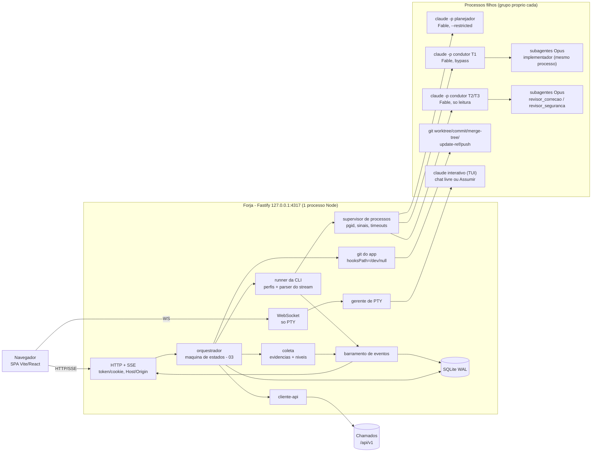

# Forja — Arquitetura

Este documento define a arquitetura técnica da **Forja** (`apps/forja`): princípios, stack com justificativas, árvore de processos, estrutura de pastas, reuso no monorepo, o **runner da CLI do Claude Code** (base de spawn, perfis por etapa, parser do stream, retomada), o protocolo de eventos para a UI, o gerenciador de worktrees, o terminal PTY (o runner de verificação foi removido por FJ-032, §10), o smoke de compatibilidade da CLI, ambientes e deploy.

Escopo: decisões estruturais e o contrato entre o app e os processos que ele supervisiona. Fora de escopo aqui: máquina de estados, gates, lote, freio de cota, fila de merge e outbox → `specs/forja/03-pipeline.md`; entidades SQLite, diretório de dados e retenção → `specs/forja/02-modelo-de-dados.md`; prompts, `--agents` detalhado e contratos zod (`plano.v1` … `resposta.v1`) → `specs/forja/04-agentes-e-contratos.md`; modelo de ameaças, sandbox da CLI, credenciais e servidor local → `specs/forja/05-seguranca.md`; telas → `specs/forja/06-ui-ux.md`; uso da API do Chamados e D-036 → `specs/forja/07-integracao-chamados.md`; spikes e marcos → `specs/forja/08-roadmap.md`.

Convenção: **[V]** verificado (fonte entre parênteses: `01 §n` = pesquisa da CLI, `04 §n` = mecânica local, `critica Fn` = fato verificado na crítica); **[NV]** a validar, sempre com o spike (S1–S10, `08-roadmap.md`) e o plano B.

---

## 1. Princípios arquiteturais

1. **O app é a máquina de estados; o agente é uma função cara e não confiável** (F-01). Cada processo `claude` recebe uma tarefa delimitada e devolve JSON validado. Avançar, aprovar, mergear, publicar e mudar status são decisões de código, persistidas antes de executadas.
2. **Binário oficial, login do usuário.** A Forja dirige o `claude` não modificado, com a assinatura do próprio usuário. Não embute SDK, não intermedeia credencial e não é distribuída a terceiros (compliance, 01 §11).
3. **Configuração explícita e reprodutível em todo spawn** (F-05). Nenhuma flag, settings, plugin, hook ou MCP é herdado por acaso do ambiente do usuário ou do repositório do cliente. Um único módulo (`perfis`) monta as linhas de comando.
4. **SQLite e git são a verdade.** Tudo que o agente pode editar é dado, nunca contexto de controle. O estado de retomada é montado pelo app a partir do banco, dos commits de checkpoint e dos artefatos (F-08; correção de critica C-1).
5. **Quem lê o texto do cliente não executa nada; quem executa nunca lê o texto do cliente** (F-03). Essa separação é estrutural, nos perfis e no fluxo de dados, e não depende do prompt.
6. **Local e single-user.** Bind em `127.0.0.1:4317`, token por boot, sem multi-tenant e sem Docker obrigatório. O SQLite é um arquivo, não uma infra de servidor. As regras 5 e 6 do `CLAUDE.md` (Docker, `runInTenantContext`) valem para o Chamados e para as extensões D-036 que a Forja consome. Elas não valem para o processo local da Forja, e essa exceção é registrada na ADR D-036.
7. **Tudo observável.** Cada passo (estado, spawn, ferramenta, subagente, comando, commit, chamada à API) vira um evento persistido com `seq` e pode ser reproduzido na UI depois de um reload.
8. **Degradar com honestidade.** Capacidade [NV] tem plano B escrito. Se a CLI mudar de versão ou de comportamento, o smoke de compatibilidade bloqueia o pipeline. A Forja nunca segue rodando com flags cujo efeito ela desconhece.

---

## 2. Stack (F-17)

> DECIDIDO (2026-10-02, usuário): a Forja vive **dentro do monorepo** (`apps/forja`), usa **TypeORM + better-sqlite3** (consistência com D-001) e oferece o chat nos dois formatos, feed estruturado e terminal PTY real.

| Camada       | Escolha                                                                                                                    | Papel                                                                            |
| ------------ | -------------------------------------------------------------------------------------------------------------------------- | -------------------------------------------------------------------------------- |
| Runtime      | Node 22 (mesmo `engines` da raiz)                                                                                          | Um processo supervisiona tudo                                                    |
| Servidor     | **Fastify** + `@fastify/static`, `@fastify/cookie`, `@fastify/websocket`                                                   | API REST, SSE, estáticos da SPA, WebSocket **só** do PTY                         |
| UI           | **Vite + React 19 + shadcn/ui + Tailwind 4**, TanStack Query, `EventSource`, `@xterm/xterm`                                | SPA com os tokens de `apps/web/src/app/globals.css` copiados (D-009/D-018/D-019) |
| Persistência | **TypeORM + better-sqlite3** (WAL), entidades por `EntitySchema` (sem decorators, como `packages/db`), migrations próprias | Estado, eventos, outbox (02)                                                     |
| Contratos    | zod 4 (`z.toJSONSchema`)                                                                                                   | Schemas de `--json-schema` e validação no app (04)                               |
| Processos    | `child_process.spawn` (detached) + `node-pty`                                                                              | CLI headless, git, terminal (sem comandos do projeto, FJ-032)                    |
| Agentes      | CLI `claude` (versão fixada, §7)                                                                                           | Planejador, condutor, subagentes Opus                                            |
| Monorepo     | `@chamados/shared`, `@chamados/cliente-api` (§5)                                                                           | Enums, máquina de status, validadores de linguagem, cliente HTTP                 |

### 2.1 Justificativas e alternativas descartadas

**Fastify + SPA, sem Next.js.** O servidor da Forja é, antes de tudo, um **supervisor de processos de horas**: ele mantém um mapa de filhos vivos, pipes de stdout, PTYs e semáforos. No Next, isso exige custom server e estado em `globalThis`, o HMR de dev recarrega módulos e perde o mapa de processos, e o `node-pty` nativo complica o bundling (04 §9; [NV] no Next 16, mas o problema é evitável). As Server Actions ainda aumentariam a superfície de CSRF a revisar num app que executa comandos. No Fastify, o servidor é o supervisor, e SSE e WebSocket são nativos. Hono funcionaria igual; o Fastify ganha pelo ecossistema de plugins. Electron e Tauri foram descartados porque o pedido é um app web local.

- Custo aceito: dois idiomas de UI no monorepo (RSC no `web`, SPA na Forja). A consistência visual vem dos tokens copiados. **Débito registrado:** extrair `packages/ui` quando um terceiro consumidor aparecer.

**CLI crua, sem Agent SDK.** O SDK traria `canUseTool`, `interrupt()` e tipos (01 §11), mas ele mesmo spawna o binário, e a doc de compliance só garante o uso do login da assinatura no **binário não modificado** (01 §11 [V]). O spawn cru dá tudo o que o pipeline usa: stream-json, `--json-schema`, `--resume`, `--agents` e telemetria (01 §2–§8 [V]). A interface `Runner` (§6) isola essa escolha: se o usuário optar por `ANTHROPIC_API_KEY`, um backend SDK entra atrás da mesma interface, sem tocar no orquestrador.

**TypeORM, e não Drizzle.** As pesquisas recomendavam Drizzle por leveza (04 §8, R9). O usuário decidiu por TypeORM (U-4) para manter um único ORM no monorepo (D-001). Para reduzir o peso, a Forja usa `EntitySchema` como `packages/db` (sem `experimentalDecorators` e compatível com `tsx`), um `DataSource` único e síncrono por baixo (better-sqlite3), e migrations explícitas aplicadas no boot. `node:sqlite` foi descartado porque emite `ExperimentalWarning` no Node 22.21 (04 §8 [V]).

**SSE para tudo que desce e WebSocket só para o PTY.** O SSE reconecta sozinho com `Last-Event-ID` e o `EventSource` envia o cookie, o que dispensa token em header. O terminal precisa de canal bidirecional de baixa latência. Comandos do usuário sobem por POST (04 §7.6).

**Descartados também:** a ferramenta `Workflow` da CLI como orquestrador, porque não aceita input humano no meio da execução e falha no limite de cota em `-p` (01 §12 [V]); `--bg`, recusado com `-p` (04 §7.4 [V]); `-w/--worktree`, que não aceita branch base e não limpa (01 §10 [V]); `--bare`, que não lê o OAuth (01 §1 [V]); e um MCP do app no MVP (Fase 3).

---

## 3. Processos e componentes

### 3.1 Árvore de processos



- **Um único processo Node** contém servidor, orquestrador e supervisor. Não há worker separado: o trabalho pesado acontece nos filhos, e o processo Node só lê pipes e grava no SQLite.
- Subagentes Opus rodam **dentro do processo** do condutor (01 §4 [V]). Do ponto de vista do supervisor, cada etapa de agente é um único filho.
- **A Forja não executa comandos do projeto** (FJ-032, 2026-10-03): `setup`, typecheck, testes, build e e2e são rodados pelo próprio agente (T1 e T2), dentro do processo do `claude`. A antiga caixa "comandos do projeto" e o runner de verificação saíram da árvore; o que restou de `verificacao/` é coleta (evidências e nível), sem processo.
- Só o orquestrador fala com o Chamados (via `cliente-api`). Nenhum filho recebe token do Chamados (F-15).

### 3.2 Supervisor de processos

Base única para os filhos da CLI e do git longo (`fetch`/`push`) (a verificação por comando saiu com FJ-032):

| Regra                   | Comportamento                                                                                                                                                                                                                                                                                                                                                                                                      |
| ----------------------- | ------------------------------------------------------------------------------------------------------------------------------------------------------------------------------------------------------------------------------------------------------------------------------------------------------------------------------------------------------------------------------------------------------------------ |
| Registro antes do spawn | Gera o `session_id` (quando houver), grava a linha de `etapa` com perfil e argumentos (sem segredos) e só então chama `spawn`. Grava `pid`/`pgid` logo depois (04 §7.1).                                                                                                                                                                                                                                           |
| Grupo próprio           | `detached: true` em todo filho. Sinais vão para `-pgid` (01 §13.5). [V S4] o `claude` lidera o grupo, mas **cada comando do Bash do agente roda em sessão própria (`setsid`), fora desse `pgid`**: o sinal no grupo não alcança dev servers e testes do agente.                                                                                                                                                    |
| Escada de parada        | SIGINT (encerra o turno com registro) → 10 s → SIGTERM (exit 143; a CLI mata a árvore do Bash, 01 §2.3 [V]) → 10 s → SIGKILL no grupo. Depois, varre `/proc/*/cwd` dentro da worktree para matar sobras (dev servers) — **obrigatório** [V S4: o SIGKILL no grupo não alcança os comandos do Bash].                                                                                                                |
| Timeouts                | Por etapa: planejar 15 min, implementar 90, revisar 45, relatar 5 (configuráveis). Sem evento no stream por 15 min gera **aviso**, nunca kill automático (um build longo não emite evento).                                                                                                                                                                                                                        |
| Leitura contínua        | stdout é lido linha a linha sem nunca bloquear em clientes SSE. A CLI espera até 30 s para drenar a saída ao sair (01 §13.12 [V]).                                                                                                                                                                                                                                                                                 |
| Desligamento do app     | SIGINT/SIGTERM no Node: fecha o HTTP (nenhum comando novo), para o polling, para de iniciar etapas, aplica a escada em todos os grupos, encerra os PTYs, mata descendentes que sobrarem, fecha o SQLite e sai.                                                                                                                                                                                                     |
| Boot                    | Reconciliação (§6.7): nenhum filho "de antes" sobrevive sem dono — mata pelo `pgid` **e** varre a cwd [V S4]. Ordem (implementação, 2026-10-02/03), em `server/boot/forja.ts`: SQLite (VACUUM INTO + migrations) → segredos → compat da CLI → Terminal (opcional) → lock único por `session_id` → orquestrador com a reconciliação **aplicada** → conexões + polling → retenção (1º tick) → Diagnóstico → Fastify. |

---

## 4. Estrutura de `apps/forja`

### 4.1 Pastas (módulos em pt-BR)

```
apps/forja/
├─ package.json                  # @chamados/forja
├─ tsconfig.json                 # servidor + comum (Node)
├─ comum/                        # importado por server/ e web/ — sem dependência de Node nem de DOM
│  ├─ contratos/                 # zod: plano.v1, resumo_impl.v1, veredito.v1, relatorio.v1, resposta.v1 (conteúdo em 04)
│  ├─ protocolo-eventos.ts       # envelope e tipos de evento (§8)
│  ├─ estados.ts                 # enums da Forja: estados de execucao, tipos de etapa, papéis, níveis (glossário 00)
│  └─ dto.ts                     # formas das respostas da API local
├─ server/
│  ├─ main.ts                    # só lê a config e chama iniciarForja (boot/)
│  ├─ boot/                      # sequência de boot e desligamento (FJ-027): forja.ts (iniciarForja), compat-cli.ts (CompatCli, DiagnosticoForja, compat-cli.json), conexoes.ts, locks.ts (LockSessoesCompartilhado), processos.ts (varredura de cwd)
│  ├─ config.ts                  # porta, diretório de dados, modo dev/produção
│  ├─ http/
│  │  ├─ servidor.ts             # plugins, estáticos de web/dist, rotas
│  │  ├─ seguranca-local.ts      # token→cookie, Host/Origin, CSP (regras em 05)
│  │  ├─ eventos-sse.ts          # §8 (replay do SQLite)
│  │  ├─ erros-api.ts · entrada.ts # ErroForja → ErroApiDto; normalização da query de GET
│  │  ├─ terminal-ws.ts          # §11
│  │  └─ rotas/                  # fila, execucoes, aprovacoes, lotes, projetos, conexao, diagnostico, worktrees, terminal — todas via `viaFachada` → ServicosForja
│  ├─ db/                        # DataSource better-sqlite3, entidades EntitySchema, migrations (02)
│  ├─ dominio/                   # 03 — puro: maquina-execucao, gates, ciclos, lote, freio-cota, regras-contratos, regras-relatorio, texto; com I/O: nucleo (transicionar + evento), orquestrador, etapas, aplicacao-resultados, fila-merge, outbox, retencao, servicos (ServicosForja implements FachadaJson)
│  ├─ processos/                 # supervisor, escada de sinais, ambiente, proc-linux, lock-sessao, reconciliacao (decide; o boot aplica)
│  ├─ claude/
│  │  ├─ runner.ts               # interface Runner + implementação "cli" (§6)
│  │  ├─ perfis.ts               # ÚNICA fonte das flags por etapa (§6.2)
│  │  ├─ settings-gerados.ts     # settings/agentes/sistema.<n>.* por etapa (§6.3)
│  │  ├─ stream.ts               # parser + normalizador (§6.5)
│  │  ├─ telemetria.ts           # modelUsage, custo, rate_limit_event → uso_assinatura
│  │  ├─ validacao-init.ts       # §6.4
│  │  ├─ lock-sessoes.ts         # §6.8
│  │  ├─ retomada.ts             # §6.7
│  │  ├─ compat.ts               # §7
│  │  └─ prompts/                # textos-base (04)
│  ├─ git/                       # git.ts (exec com hooksPath neutro), worktrees, checkpoint, selos, integracao
│  ├─ verificacao/               # evidencias (coleta/validação dos prints, FJ-026/FJ-030), niveis (nível pelo relatado × stream, FJ-032), navegador, processo-grupo, confinamento-bwrap (sem uso no pipeline); runner-comandos removido (FJ-032)
│  ├─ projetos/                  # autodeteccao.ts: branch, comandos, detectores, .env (FJ-030)
│  ├─ chamados/                  # conexao, fila/G0, polling, sinais, notas-ia, validador-linguagem, detector-segredos, notas, cadeia-status, outbox-passos (07)
│  ├─ terminal/                  # pty, sessoes (§11)
│  ├─ eventos/                   # barramento (anel + clientes SSE; difundir), normalizador, gravador-bruto, persistência
│  ├─ segredos/                  # keyring do SO com fallback 0600 (05)
│  └─ scripts/                   # smoke-cli.ts, smoke-local.ts, migrar.ts, spikes/spike-s2…s10 (08), forja-print.mjs (print para o agente, env FORJA_PRINT, FJ-030)
└─ web/
   ├─ index.html · vite.config.ts · tsconfig.json · components.json
   └─ src/
      ├─ main.tsx · rotas.tsx
      ├─ telas/                  # fila, execucao, aprovacao, mesa-planos, lote, fila-merge, terminal, projeto, conexao, diagnostico, historico, worktrees (06)
      ├─ componentes/            # feed, arvore-agentes, diff, selos, painel-cota…
      ├─ ui/                     # shadcn/ui (copiados, mesmo estilo do apps/web)
      ├─ lib/                    # api.ts, sse.ts, terminal.ts
      └─ estilos/globals.css     # tokens copiados do Chamados
```

`comum/` é o contrato entre servidor e UI. O servidor nunca importa de `web/`, e `web/` nunca importa de `server/`.

### 4.2 `package.json`, `tsconfig`, testes (padrão do monorepo)

- **Nome:** `@chamados/forja`, `private`, `"type": "module"`, mesmo padrão de `apps/mcp`. O servidor roda com `tsx` (TS cru, sem passo de build, como `mcp` e `worker`). Só a SPA é buildada.
- **Scripts:** `dev` (via `concurrently` da raiz: `tsx watch server/main.ts` + `vite`), `build` (`vite build` da SPA para `web/dist`), `start` (`tsx server/main.ts`, que serve `web/dist`), `typecheck` (`tsc --noEmit` no `tsconfig.json` do servidor e no de `web/`), `smoke:cli` (§7), `smoke:local` (servidor real num diretório temporário, sem Claude real: sessão, conexão, projeto, fila, Diagnóstico, SSE, Terminal, desligamento (implementação, 2026-10-02/03)), `migration:run`/`migration:revert` (manuais; o boot também aplica as pendentes, conforme 02) e `spike:s1` … `spike:s10`.
- **Na raiz:** `forja` (`npm run start -w @chamados/forja`) e `dev:forja`. O `dev` da raiz continua sendo web + worker (a Forja não sobe junto com o Chamados por padrão).
- **Dependências do servidor:** `fastify` e plugins, `typeorm`, `better-sqlite3`, `reflect-metadata` (como em `packages/db`), `zod ^4`, `node-pty`, `@chamados/shared`, `@chamados/cliente-api` e **`@napi-rs/keyring`** (binding Rust mantido para libsecret/gnome-keyring; `keytar` está arquivado) [NV: validar no M1 — grava, lê e apaga; plano B: arquivo `0600` ou pedir a senha no boot, 05 §9]. **Da SPA:** `react`/`react-dom` 19.2.x, `vite`, `@vitejs/plugin-react`, `tailwindcss ^4` + `@tailwindcss/vite`, `@tanstack/react-query`, `@xterm/xterm`, `lucide-react` e o mesmo conjunto shadcn de `apps/web`. **Dev:** `tsx`, `typescript ^5.7`, `@types/node ^22`.
- **Módulos nativos:** `node-pty` e `better-sqlite3` compilam ou baixam prebuild no `npm install` da máquina de dev [NV: prebuild para Node 22/Linux; plano B: toolchain `python3 make g++` documentado em `docs/desenvolvimento.md`]. Por isso eles **nunca** vão para a VPS (§13).
- **tsconfig:** `apps/forja/tsconfig.json` estende `../../tsconfig.base.json` com `noEmit`, `types: ["node"]` e `include: ["server/**/*.ts", "comum/**/*.ts"]`. `web/tsconfig.json` estende a mesma base com `lib: ["ES2022","DOM","DOM.Iterable"]`, `jsx: "react-jsx"` e `include: ["src/**/*", "../comum/**/*.ts"]`.
- **Vitest:** os testes unitários entram no `vitest.config.ts` da raiz, acrescentando `apps/forja/server/**/*.test.ts`, `apps/forja/comum/**/*.test.ts` e `apps/forja/web/src/**/*.test.ts` (só lógica pura, `environment: node`). `packages/cliente-api` já é coberto pelo glob `packages/**/src/**/*.test.ts`. **Nenhum teste unitário chama o `claude` real** (custo e cota). O runner e o parser são testados contra uma **CLI falsa**: um script Node que reproduz `.jsonl` gravados (`pesquisa/exp/a,c.jsonl` e `critica-exp/*.jsonl`, copiados como fixtures) e simula saídas por sinal, `result` duplo e lixo no stdout.

---

## 5. Reuso no monorepo (F-18)

### 5.1 `@chamados/shared` (import direto, sem vendor)

O pacote exporta TS cru sem dependências de runtime ([V] 02 §7). A Forja importa:

- `enums` (status, natureza, prioridade, complexidade);
- `maquina-estados` (`transicaoValida`, `transicoesDoPapel`), para calcular cadeias de status antes de chamar a API (07);
- de `triagem-notas`: `slugChamado`, `nomeBranchResolucao` (para **detectar** a branch `ia/chamado-N-*` da IA do servidor; a branch da Forja usa o prefixo `forja/`, §9), `detectarConteudoTecnico`, `detectarPromessaResolucao`, `montarNotaResolucaoPr` (como referência de formato) e os marcadores das notas da IA.

Regra: a Forja **não altera** `@chamados/shared` para uso próprio. O que for só da Forja fica em `apps/forja/comum/`. Mudar algo no shared exige spec do Chamados + CHANGELOG (D-008).

### 5.2 Extração de `packages/cliente-api` (`@chamados/cliente-api`)

| De (`apps/mcp/src`)                                                                  | Para (`packages/cliente-api/src`) | Mudança                                                                                                                                                                                                                                           |
| ------------------------------------------------------------------------------------ | --------------------------------- | ------------------------------------------------------------------------------------------------------------------------------------------------------------------------------------------------------------------------------------------------- |
| `cliente.ts` (`ClienteChamados`, `ErroApi`, `FetchImpl`, `nomeDoContentDisposition`) | `cliente.ts`, `erros.ts`          | Passa a depender de `ConfigCliente` (`baseUrl`, `email`, `obterSenha()`, `tenantSlug`, `timeoutMs`), e não mais de `ConfigMcp`                                                                                                                    |
| —                                                                                    | `armazenamento-token.ts`          | Interface `ArmazenamentoToken` (`ler()`/`gravar(token, expira_em)`/`limpar()`). O padrão é **em memória** (comportamento atual do MCP). A Forja injeta a versão SQLite cifrada (05)                                                               |
| —                                                                                    | `cliente.ts`                      | **Timeout/abort** por requisição (`AbortSignal`), `quemSou()` passa a expor `usuario.id` e `expira_em`, e entram **métodos tipados** por endpoint (lista, detalhe, mensagens, status, anexos e, depois, as rotas D-036). Os contratos ficam em 07 |
| `config.ts` → `validarBaseUrl`                                                       | `url-base.ts`                     | Devolve `{ origem, avisos[] }`. `127.0.0.1` vira **aviso** ("use `localhost`: com `127.0.0.1` o proxy resolve o tenant `127`", 02 D7 [V]). O MCP loga o aviso no stderr; a Forja **recusa** salvar a conexão com `127.0.0.1`                      |
| `cliente.test.ts`                                                                    | `cliente.test.ts`                 | Move junto, mais casos de timeout e persistência de token                                                                                                                                                                                         |

**O que muda em `apps/mcp`:** `config.ts` mantém só `carregarConfig` (leitura do env, `somenteLeitura`) e mapeia para `ConfigCliente`. `index.ts` e `ferramentas.ts` passam a importar de `@chamados/cliente-api`, e o `package.json` ganha essa dependência. Critério de aceite da extração: `npm run test`, `npm run typecheck` e `npm run smoke:api` passam **sem mudança de comportamento** no MCP, salvo o aviso de `127.0.0.1`. O pacote segue o padrão de `@chamados/shared`: `main`/`exports` em `./src/index.ts`, zero dependência de runtime (usa o `fetch` global).

---

## 6. Runner da CLI

Interface `Runner` (única porta do orquestrador para agentes): `iniciar(perfil, entrada) → ExecucaoProcesso` com `eventos` (assíncrono), `pausar()` (SIGINT), `cancelar()` (escada) e `resultado` (promessa com a classificação de §6.6). A implementação `cli` é a descrita abaixo; um backend SDK só entra pela mesma interface.

### 6.1 Base comum de todo `claude -p` (F-05)

```
claude -p
  --output-format stream-json --verbose
  --session-id <uuid gerado e gravado antes do spawn>   | --resume <uuid>
  --model <id do papel>  --effort <nível do papel>        # sempre explícitos, inclusive no resume
  --settings <diretório da execução>/settings.<n>.json    # gerado (§6.3)
  --strict-mcp-config                                     # + --mcp-config <mcp.<n>.json> no planejador e no condutor: só o MCP `chamados` somente leitura (FJ-030)
  --forward-subagent-text                                 # texto dos subagentes com parent_tool_use_id (árvore do feed, §6.5) [V]
  --append-system-prompt-file <arquivo gerado da etapa>   # blocos B1/B2/B3/B6 de `04-agentes-e-contratos.md` §4.1 (B3 = CLAUDE.md do commit base)
  --max-budget-usd <min(teto da etapa, saldo do chamado)>
  --name forja-<numero>-<etapa>
  --json-schema '<JSON Schema do turno>'                  # ausente só em "conversar"
  + flags do perfil (§6.2)
cwd   = worktree da execução (§9)
stdin = pipe: o app escreve o prompt inteiro e FECHA
spawn = detached: true
env   = allowlist construída do zero (nunca {...process.env} menos algo):
        PATH, HOME, USER, LANG, LC_*, TERM, SHELL, TMPDIR
        + DISABLE_AUTOUPDATER=1   (NUNCA CLAUDE_CODE_SUBPROCESS_ENV_SCRUB=1: ver a tabela)
        + CLAUDE_CODE_DISABLE_CLAUDE_MDS=1 (`04-agentes-e-contratos.md` §4.3) + env do perfil
        AUSENTES: CLAUDECODE, CLAUDE_CODE_CHILD_SESSION, CLAUDE_CODE_SESSION_ID e demais CLAUDE_*
        herdados; GH_TOKEN, GITHUB_TOKEN, ANTHROPIC_API_KEY (salvo opção do usuário),
        CHAMADOS_*, SSH_AUTH_SOCK, GPG_AGENT_INFO
```

| Item                                     | Por quê                                                                                                                                                                                                                                         | Status                                                                                                                                                            |
| ---------------------------------------- | ----------------------------------------------------------------------------------------------------------------------------------------------------------------------------------------------------------------------------------------------- | ----------------------------------------------------------------------------------------------------------------------------------------------------------------- |
| `--session-id` antes do spawn            | O id fica no SQLite antes do primeiro byte. Resume e lock não dependem de parsear o `init`                                                                                                                                                      | [V] 04 §2                                                                                                                                                         |
| `--model`/`--effort` explícitos          | O resume restaura o modelo só quando não se passa `--model`. A Forja sempre passa e não depende do `effortLevel` do usuário (critica F5)                                                                                                        | [V] 01 §3, §5                                                                                                                                                     |
| `--settings` em todo spawn               | Não é restaurado no resume e precisa ser repassado                                                                                                                                                                                              | [V] 01 §3                                                                                                                                                         |
| `--strict-mcp-config`                    | Ignora `.mcp.json` do repo, MCPs do usuário e conectores                                                                                                                                                                                        | [V] 01 §9                                                                                                                                                         |
| `--append-system-prompt-file`            | Leva as regras da plataforma e o `CLAUDE.md` do cliente lido do **commit base**, nunca da worktree (que o agente edita). A carga automática de CLAUDE.md é desligada por `CLAUDE_CODE_DISABLE_CLAUDE_MDS=1` (`04-agentes-e-contratos.md` §4.3)  | flag [V] 01 §1; env [V S2]: o canário de um `CLAUDE.md` do repo não chega ao condutor no T1, no resume (T2) nem ao subagente (sob `--restricted`, não exercitado) |
| stdin fechado                            | Evita o aviso de 3 s e o limite de argv. O pipe aceita até 10 MB                                                                                                                                                                                | [V] 01 §13.2                                                                                                                                                      |
| Sem `--fallback-model`                   | Trocaria o modelo em silêncio, e F-04 exige Opus nos subagentes                                                                                                                                                                                 | decisão                                                                                                                                                           |
| `DISABLE_AUTOUPDATER=1`                  | O binário não muda no meio de um lote                                                                                                                                                                                                           | [V] 01 §13.13                                                                                                                                                     |
| ~~`CLAUDE_CODE_SUBPROCESS_ENV_SCRUB=1`~~ | **Fora da base.** Na 2.1.288 ele força `permissionMode: default`: anula `--dangerously-skip-permissions` e `--permission-mode dontAsk` (o T1 deixa de escrever e o T2 deixa de negar pela allowlist). A allowlist do env já tira as credenciais | [V S2] (spike 2026-10-02)                                                                                                                                         |
| Sem `SSH_AUTH_SOCK`                      | Sem o socket, o agente não usa o ssh-agent do usuário para push, mesmo sem ler a chave. O git **do app** mantém o próprio env                                                                                                                   | decisão                                                                                                                                                           |
| `--max-turns`                            | Aceito na 2.1.288 apesar de não aparecer no `--help`. Freio opcional, desligado por padrão                                                                                                                                                      | [V] critica F1                                                                                                                                                    |

### 6.2 Perfis por etapa (flags exatas)

Modelos padrão (Configurações globais, FJ-030): Fable = `claude-fable-5-1`, Opus = `claude-opus-5-5`, ambos com `--effort high`. Tetos padrão de `--max-budget-usd`: 5 (planejar), 25 (implementar), 10 (revisar), 2 (relatar); 40 por chamado.

| Perfil                                                                         | Sessão                                                  | Flags além da base                                                                                                                                                                                                                                                                                                                                                                                                                                                                                                                                                                                                                                                                                                                                                                                                                                                                                                                                                                                                                                                                                                                                                                         | Env extra                                                                                                                    | `--json-schema`                                 |
| ------------------------------------------------------------------------------ | ------------------------------------------------------- | ------------------------------------------------------------------------------------------------------------------------------------------------------------------------------------------------------------------------------------------------------------------------------------------------------------------------------------------------------------------------------------------------------------------------------------------------------------------------------------------------------------------------------------------------------------------------------------------------------------------------------------------------------------------------------------------------------------------------------------------------------------------------------------------------------------------------------------------------------------------------------------------------------------------------------------------------------------------------------------------------------------------------------------------------------------------------------------------------------------------------------------------------------------------------------------------ | ---------------------------------------------------------------------------------------------------------------------------- | ----------------------------------------------- |
| **planejador** (Fable, F-03)                                                   | própria, `--session-id` novo                            | `--restricted --tools "Read,Grep,Glob" --allowedTools "Read" "Grep" "Glob" --permission-mode dontAsk --permission-prompts none --add-dir <entrada da execução>` (chamado em markdown, anexos, notas da IA, delimitados como dados)                                                                                                                                                                                                                                                                                                                                                                                                                                                                                                                                                                                                                                                                                                                                                                                                                                                                                                                                                         | —                                                                                                                            | `plano.v1`                                      |
| **condutor T1 implementar** (Fable, F-04)                                      | do condutor: `--session-id` no 1º T1, `--resume` depois | `--tools "Agent,Read,Grep,Glob,Edit,Write,Bash" --dangerously-skip-permissions --agents <agentes.json> --disallowedTools <Agent(x) para todo x de init.agents fora do papel> --setting-sources ""` [V S2]. **Sem `--add-dir`**                                                                                                                                                                                                                                                                                                                                                                                                                                                                                                                                                                                                                                                                                                                                                                                                                                                                                                                                                             | `CLAUDE_CODE_SUBAGENT_MODEL=claude-opus-5-5`, `CLAUDE_CODE_SUBAGENT_MODEL_FORCE=1`, `CLAUDE_CODE_DISABLE_BACKGROUND_TASKS=1` | `resumo_impl.v1`                                |
| **condutor T2 revisar** (Fable → `revisor_correcao`, `revisor_seguranca` Opus) | `--resume` do condutor                                  | `--setting-sources "" --tools "Agent,Read,Grep,Glob,Bash" --allowedTools "Agent(revisor_correcao)" "Agent(revisor_seguranca)" "Read" "Grep" "Glob" "Bash(git diff *)" "Bash(git log *)" "Bash(git show *)" + executores de script (FJ-032: "Bash(npm run *)" "Bash(npm test*)" "Bash(npm ci*)" "Bash(npm install*)" "Bash(npx tsc*)" "Bash(npx vitest*)" "Bash(npx jest*)" "Bash(npx eslint*)" "Bash(npx prettier*)" "Bash(npx playwright*)" `pnpm …`, `yarn …`, `bun …`, "Bash(make *)" e os comandos das dicas do projeto) --permission-mode dontAsk --permission-prompts none --agents <agentes.json> --disallowedTools <Agent(x) para todo x de init.agents fora do papel>` [V S2: o allow em `dontAsk` **não** restringe o tipo de subagente — `Agent(general-purpose)` rodou no T2; a negação explícita é obrigatória também aqui]. **Sem `--add-dir`**: plano, SHA verificado, comandos que o T1 rodou e scripts encontrados (dicas) vão por stdin; os revisores rodam os checks e relatam em `comandos_executados` (FJ-032); os revisores leem o diff com `git diff` na própria worktree (`04-agentes-e-contratos.md` §2). `--restricted` não serve aqui porque tira o Bash (F-05) | mesmo do T1                                                                                                                  | `veredito.v1`                                   |
| **condutor T3 relatar** (papel `relator`)                                      | `--resume` do condutor                                  | `--restricted --tools "Read,Grep,Glob" --permission-mode dontAsk --permission-prompts none`. **Sem `--add-dir`**: os "Fatos do app" vão por stdin (`04-agentes-e-contratos.md` §4.7)                                                                                                                                                                                                                                                                                                                                                                                                                                                                                                                                                                                                                                                                                                                                                                                                                                                                                                                                                                                                       | —                                                                                                                            | envelope de `relatorio.v1` + `resposta.v1` (04) |
| **conversar**                                                                  | `--resume` da sessão da etapa pausada                   | **o mesmo perfil da etapa**                                                                                                                                                                                                                                                                                                                                                                                                                                                                                                                                                                                                                                                                                                                                                                                                                                                                                                                                                                                                                                                                                                                                                                | o mesmo                                                                                                                      | nenhum (texto livre)                            |
| **retomar**                                                                    | `--resume` (ou sessão nova, §6.7)                       | o mesmo perfil da etapa                                                                                                                                                                                                                                                                                                                                                                                                                                                                                                                                                                                                                                                                                                                                                                                                                                                                                                                                                                                                                                                                                                                                                                    | + `CLAUDE_CODE_RESUME_INTERRUPTED_TURN=1`                                                                                    | o do turno interrompido                         |
| **Assumir (PTY)**                                                              | `claude --resume <id>` interativo                       | `--settings <settings da etapa> --strict-mcp-config --model <id>`, **sem** bypass e sem `-p`: o humano responde às permissões na TUI                                                                                                                                                                                                                                                                                                                                                                                                                                                                                                                                                                                                                                                                                                                                                                                                                                                                                                                                                                                                                                                       | allowlist base                                                                                                               | —                                               |
| **terminal livre (PTY)**                                                       | do usuário                                              | `claude` puro, com os settings e MCPs do próprio usuário                                                                                                                                                                                                                                                                                                                                                                                                                                                                                                                                                                                                                                                                                                                                                                                                                                                                                                                                                                                                                                                                                                                                   | allowlist base                                                                                                               | —                                               |

Notas do perfil:

- **MCP do Chamados (FJ-030, 2026-10-03):** planejador e condutor levam também `--mcp-config <execucao>/mcp.<n>.json` (stdio do `apps/mcp` com `CHAMADOS_MCP_SOMENTE_LEITURA=true` e `CHAMADOS_TOKEN` no `env` do servidor; `0600`, apagado no fim da etapa). No planejador (`dontAsk`) as quatro ferramentas `mcp__chamados__*` entram em `--allowedTools`. O T1 com UI prevista recebe também `FORJA_PRINT=<caminho absoluto de forja-print.mjs>` no env (B7, `03-pipeline.md` §5.4). [NV: MCP com `--restricted` (planejador, T3); plano B: T3 sem MCP.]

- **T1 de conflito (FJ-036, 2026-10-04):** em `resolvendo_conflito` (etapa `resolver_conflito`) o condutor roda com o **mesmo perfil do T1** (bypass, `--resume` da sessão condutora, mesmas negações e orçamento/timeout de `implementar`). As regras `deny` de `git merge*`/`git commit*` (§6.3) deixam o merge em curso nas mãos do app, que confere os marcadores e commita (`03-pipeline.md` §8.4).
- **Bypass só onde há escrita** (F-04). Em bypass, os subagentes herdam o modo e ignoram o próprio `permissionMode` (01 §4 [V]). As regras `deny` continuam valendo ([V] 01 §6), e por isso a lista de §6.3 é a defesa real. Com bypass, `allow` não restringe nada: a restrição de tipos de subagente no T1 é feita por **negação** de todo `Agent(<nome>)` fora do papel ([V] critica F9 para a sintaxe; efeito em bypass [V S2]; no T2 também, ver a linha do perfil).
- **Lista de agentes negados:** é derivada de `init.agents` (o `init` lista os agentes disponíveis, 01 §2.1 [V]) e guardada em cache por projeto e versão da CLI. Se um `init` mostrar um agente fora do papel que **não** está na lista negada, o runner mata o processo antes de qualquer ferramenta e devolve `agentesForaDoPapel`; o **orquestrador** atualiza a lista e reinicia o turno uma única vez (o runner não reinicia sozinho: reusar `--session-id` após um kill não foi verificado). **Semente** da lista (implementação, 2026-10-02/03): os agentes embutidos vistos no `init` da 2.1.288 (`claude`, `Explore`, `general-purpose`, `Plan`, `statusline-setup`), sem a qual o primeiro T1 de cada projeto seria reiniciado. `--agents` tem precedência sobre `.claude/agents/` do repositório (01 §4 [V]), então um `implementador.md` plantado no repo do cliente não substitui o nosso.
- **Mesmo `session_id` com perfis diferentes por turno** (bypass no T1; `dontAsk` no T2, com `--setting-sources ""`, e no T3, com `--restricted`): a troca de `--json-schema` entre resumes é [V] (critica F2), e o modo de permissão não é restaurado em `-p` (01 §3 [V]). A troca de `--tools` e do modo na mesma sessão é [V S2] (T2 por `--resume` do T1: `dontAsk`, ferramentas do perfil, memória preservada); a do T3 para `--restricted` não foi exercitada. Plano B (se o T3 falhar): T3 vira sessão nova (`--session-id`), com o prompt "estado atual" montado pelo app (§6.7). O retrabalho continua no T1 da sessão original.
- `--setting-sources ""` no T1 e no T2 é [V S2]: o `init` sai sem plugin, agente, MCP e hook do usuário ou do repositório (o controle sem a flag carrega o plugin do usuário e o agente plantado). A variante `--restricted --tools …,Bash` (`05-seguranca.md` §4.6) é **inviável no T1**: a CLI recusa `bypassPermissions not supported in restricted mode` [V S2]. Plano B (não necessário): `--settings` com `disableAllHooks: true` (mitigação documentada contra hooks do repo, 04 §2 [V]) + negação dos agentes de plugin via `init.agents` + alerta se `init.plugins` vier não vazio.
- O condutor **deve delegar**. O parser marca `agente.fora_do_papel` quando um `tool_use` de `Edit`/`Write` sai da thread principal (sem `parent_tool_use_id`). `Bash` na thread principal é inspeção permitida (`git diff/status`) e vira `agente.ferramenta` comum (`04-agentes-e-contratos.md` §9). É sinal no feed e na telemetria, não bloqueio.

> **Exposto pela decisão U-3 (sem sandbox):** o que o condutor e os implementadores executam via Bash (inclusive os checks do projeto que eles rodam, FJ-032), e os testes que eles escrevem, lê tudo o que o usuário lê (`~/.ssh`, `~/.config/gh`, `.env` de outros clientes) e tem rede. As negações `Read(...)` não alcançam um `cat` nem um script. **Compensam:** só o planejador lê o texto do cliente, e ele não executa nada; o condutor só recebe o plano aprovado; o env não carrega tokens nem `SSH_AUTH_SOCK`; push, remote e merge são negados ao agente e feitos só pelo app; a G2 mostra o diff completo; e há o modo reforçado opcional por projeto (05).

### 6.3 Arquivos gerados por etapa

O app grava os arquivos de cada spawn no diretório da etapa (layout em 02). **Nenhum** deles fica na worktree.

- **`settings.<n>.json`** (+ `agentes.<n>.json` e `sistema.<n>.md`, o arquivo de `--append-system-prompt-file`; gravados `0600` no diretório da execução, com sha256 no `perfil` da etapa — implementação, 2026-10-02/03): `disableAllHooks: true` e `permissions.deny` com, no mínimo, `Bash(git push*)`, `Bash(git remote*)`, `Bash(git reset --hard*)`, `Bash(git checkout <destino>*)`, `Bash(git merge*)`, `Bash(git worktree*)`, `Bash(git commit*)` (acréscimo desta spec: quem commita é o app, F-08, o que evita a disputa pelo `index.lock`), `Bash(git rebase*)`, `Bash(git stash*)`, `Bash(git tag*)`, `Read(~/.ssh/**)`, `Read(~/.config/gh/**)`, `Read(~/.claude/.credentials.json)` e `Read`/`Edit` sobre os caminhos do diretório de dados da Forja **enumerados** (SQLite, `execucoes/`, `backups/`, credenciais, worktrees de outras execuções e de integração; no planejador, as subpastas da própria execução fora de `entrada/` e as outras execuções, 05 §4.4). Caminho absoluto em regra de arquivo é `//caminho` (`/caminho` ancora no diretório do settings), e só `Read`/`Edit` são emitidas (`Write(...)` não é consultada pela CLI; `Edit` cobre a escrita [NV]). Um `deny` não tem exceção, e a worktree da própria execução mora em `<dados>/worktrees/` (F-09); a lista exata está em 05 §4.4. Para o T1, também `Edit` em `~/.bashrc`, `~/.zshrc`, `~/.profile`, `~/.gitconfig`, `~/.claude/**`, `~/.config/**` e no checkout principal do usuário. Em bypass, editar fora do cwd sem `--add-dir` **não** é negado [V S2: um `Write` fora do cwd passou], e por isso a negação vem explícita. No modo reforçado, entra o bloco `sandbox` (05).
- **`agentes.json`** (`--agents` aceita arquivo com `-p`, 01 §4 [V]): `implementador` no T1; `revisor_correcao` e `revisor_seguranca` no T2, ambos com `Read,Grep,Glob,Bash`, e o Bash fica limitado a `git diff/log/show` pelo allow do T2 em `dontAsk`. Todos com `model: "claude-opus-5-5"`, `effort` e `maxTurns`. O conteúdo é definido em 04.
- **Prompt (stdin):** é montado pelo app (04). Para o condutor (T1, T2 e T3), contém só o plano aprovado, os achados, os comentários humanos e os fatos calculados pelo app. Nunca contém o texto bruto do cliente nem um caminho gravável fora da worktree (critica F12).

### 6.4 Validação do `init`

O `system/init` chega **a cada turno** e não significa sessão nova (01 §13.4 [V]). Em todo `init`, o runner confere:

| Campo                 | Esperado                                                                              | Divergência                                                                              |
| --------------------- | ------------------------------------------------------------------------------------- | ---------------------------------------------------------------------------------------- |
| `claude_code_version` | igual à versão fixada (§7)                                                            | aborta e bloqueia o pipeline (Diagnóstico)                                               |
| `permissionMode`      | `bypassPermissions` no T1; `dontAsk` nos demais                                       | aborta                                                                                   |
| `tools`               | o conjunto do perfil + `StructuredOutput` quando há `--json-schema`; `Task` ≡ `Agent` | aborta                                                                                   |
| `mcp_servers`         | só `chamados` conectado onde há `--mcp-config` (FJ-030); vazio nos demais             | outro servidor: aborta; `chamados` ausente ou fora do ar: alerta                         |
| `apiKeySource`        | `none` (assinatura), salvo se o usuário escolheu API key                              | aborta: credencial inesperada                                                            |
| `agents`              | só os do papel ou já negados (T1 **e T2**, S2)                                        | §6.2: mata e devolve `agentesForaDoPapel`; o orquestrador atualiza a lista e reinicia 1× |
| `model`               | o do perfil                                                                           | aborta                                                                                   |
| `plugins`             | vazio no T1/T2 com `--setting-sources ""`, ignorando os de `path: "builtin"`          | alerta (plano B de S2)                                                                   |

O `capabilities` é registrado (por exemplo, `interrupt_receipt_v1`) e não bloqueia nada. "Abortar" significa SIGTERM no grupo, etapa classificada como `perfil_divergente` (§6.6) e evento `cli.alerta`.

### 6.5 Parser do stream e telemetria

`stdout → divisor de linhas (sem limite de tamanho de linha) → JSON.parse → normalizador → { evento bruto em eventos.jsonl ; EventoForja em SQLite + barramento }`. Uma linha que não é JSON vai crua para o log, gera alerta e não derruba o parser. O stderr inteiro vai para `stderr.log`.

| Evento da CLI                                            | O que o app faz                                                                                                                                                                                   |
| -------------------------------------------------------- | ------------------------------------------------------------------------------------------------------------------------------------------------------------------------------------------------- |
| `system/init`                                            | §6.4                                                                                                                                                                                              |
| `assistant` (texto/thinking)                             | `agente.texto`. Com `--forward-subagent-text` [V], o `parent_tool_use_id` liga a fala ao subagente (árvore Fable → Opus)                                                                          |
| `assistant` com `tool_use`                               | `agente.ferramenta` (entrada resumida). Quando é `Agent`, guarda `tool_use_id → subagent_type`. Quando é `Edit`/`Write` na thread principal do condutor no T1, gera também `agente.fora_do_papel` |
| `user` com `tool_result`                                 | `agente.resultado_ferramenta`. Quando fecha um `Agent` do tipo `implementador`, dispara o **checkpoint** (§9.2)                                                                                   |
| `system/task_started` · `task_notification`              | `subagente.iniciado` · `subagente.concluido` (status, resumo, `usage`)                                                                                                                            |
| `system/permission_denied` e `result.permission_denials` | `permissao.negada`, mostrado no feed (01 §13.8 [V])                                                                                                                                               |
| `rate_limit_event`                                       | snapshot em `uso_assinatura` + `uso.atualizado` (global). A política do freio está em 03 (F-14)                                                                                                   |
| `system/api_retry`                                       | `authentication_failed` gera alerta de login e pausa o pipeline; `rate_limit`/`overloaded` só geram evento                                                                                        |
| `result`                                                 | guarda **o último** (maior `result_index`) [V 01 §7]. Com `DISABLE_BACKGROUND_TASKS=1` espera-se exatamente 1 (critica F10); mais de um gera alerta `multiplos_result` e vale o último            |

Do `result` final, o app extrai `subtype`, `is_error`, `terminal_reason`, `structured_output`, `total_cost_usd`, `usage`, `modelUsage`, `subagent_stats`, `num_turns`, `duration_ms` e `permission_denials`. O `structured_output` é **revalidado pelo zod do app** (a validação da CLI não basta; a política de correção está em 04). As chaves de `modelUsage` precisam estar contidas em {Fable, Opus} do perfil; um modelo inesperado gera alerta. O custo é "equivalente a preço de tabela" (`costBasis: list`, 01 §8 [V]) e é exibido como tal. Pela doc, `total_cost_usd` e `modelUsage` vêm **acumulados na sessão**, inclusive o gasto restaurado no resume (doc agent-sdk cost-tracking [V doc]; na CLI [V S5]: `total_cost_usd` e `modelUsage` acumulam no `--resume`, e `usage` é só do turno). O app grava o valor bruto e o **delta** em relação ao turno anterior da mesma `session_id` (`04-agentes-e-contratos.md` §9). Se o S5 mostrar que não acumula, o delta passa a ser o próprio valor bruto.

### 6.6 Fim do processo: classificação

O runner devolve ao orquestrador uma única classificação. O mapeamento para estados de `execucao` é feito em 03.

| Classificação           | Detecção                                                                                                                                       |
| ----------------------- | ---------------------------------------------------------------------------------------------------------------------------------------------- |
| `concluido`             | `result.subtype = success` + `structured_output` válido no zod                                                                                 |
| `saida_invalida`        | `success` sem `structured_output` válido, ou `error_max_structured_output_retries`                                                             |
| `limite_orcamento`      | `error_max_budget_usd`                                                                                                                         |
| `limite_turnos`         | `error_max_turns`                                                                                                                              |
| `cota`                  | texto "hit your … limit", `api_retry` com `rate_limit` esgotado, ou `rate_limit_info.status = rejected` (01 §8, 04 §10 [V]). Guarda `resetsAt` |
| `autenticacao`          | `api_retry` com `authentication_failed`, ou `auth status` falhando no pós-mortem                                                               |
| `perfil_divergente`     | §6.4                                                                                                                                           |
| `pausado` / `cancelado` | saída por sinal pedido pelo app (pausa/conversa ou cancelamento)                                                                               |
| `timeout`               | o timeout da etapa disparou a escada                                                                                                           |
| `interrompido`          | saída sem `result` não pedida (crash, OOM, app reiniciado)                                                                                     |
| `erro_execucao`         | `error_during_execution` sem causa acima                                                                                                       |

### 6.7 Retomada (F-08)

**Durabilidade:** o app commita na worktree a cada `implementador` que retorna (§9.2), e todo evento fica no SQLite antes de chegar à UI. Uma etapa perdida custa no máximo um passo.

**Ordem de retomada** (para `interrompido`, `cota` após `resetsAt`, `pausado` e reboot):

1. Se a worktree está suja, o app faz antes um commit de checkpoint `forja: estado ao interromper`.
2. `--resume <session_id>` com o **mesmo perfil e o mesmo schema** + `CLAUDE_CODE_RESUME_INTERRUPTED_TURN=1` (01 §2.3 [V]) + prompt curto "retome; estado atual:", seguido do resumo gerado pelo app.
3. Se o resume falhar (sessão não encontrada, erro antes do `init` ou `erro_execucao` em menos de 60 s), o app abre uma **sessão nova** (`--session-id` novo) com o prompt "estado atual" montado só a partir do SQLite, dos commits e dos artefatos: plano aprovado, passos concluídos (`git log` dos checkpoints), diff atual, vereditos e comentários anteriores. A `etapa` passa a apontar para a sessão nova, e a antiga fica no histórico.
4. Dois resumes seguidos falhando na mesma etapa levam ao estado de falha definido em 03.

**Reconciliação no boot:** para cada `etapa` em execução no banco, o app confere `/proc/<pid>/cmdline` (é um `claude`? o `pgid` bate?). Se sim, aplica a escada no grupo, porque não dá para reanexar ao stdout de outro processo (04 §7.4). Em seguida marca `interrompido` e deixa o orquestrador decidir a retomada. O filho **não** morre sozinho quando o pai morre [V S4: SIGKILL no pai, e o `claude` seguiu executando comandos por ≥ 35 s, mesmo sem leitor no stdout]. A reconciliação mata pelo `pgid` e, como os comandos do Bash ficam fora do grupo [V S4], também pela varredura de cwd (§3.2). Também são encerrados processos de verificação e PTYs órfãos. Worktrees e a fila de merge são reconciliadas por §9 e 03.

### 6.8 Locks e concorrência

- **Lock por `session_id`:** nunca rodam dois processos (runner ou PTY) na mesma sessão. A escrita concorrente é comportamento [NV] (01 §3) e é tratada como proibida. O lock fica em memória e é espelhado no SQLite para a reconciliação.
- **Semáforos** (padrões: agentes 2, planejadores 3, merge 1 por projeto + destino; o de verificações saiu com FJ-032): o runner só os **consulta**. Quem decide é o orquestrador (03).

---

## 7. Smoke de compatibilidade da CLI (`compat.ts`)

A versão fixada nesta spec é **`2.1.288`**, a versão em que tudo o que está marcado [V] foi observado. Atualizar a versão fixada é uma mudança de spec com CHANGELOG.

| Quando                        | Checagem                                                                                                                                                                                                                         | Custo                                 | Falha →                                                                              |
| ----------------------------- | -------------------------------------------------------------------------------------------------------------------------------------------------------------------------------------------------------------------------------- | ------------------------------------- | ------------------------------------------------------------------------------------ |
| **Boot**                      | `claude --version` = fixada                                                                                                                                                                                                      | zero                                  | banner + pipeline bloqueado até "aceitar versão X", que dispara o smoke completo     |
| **Boot**                      | `claude auth status`: exit 0, `authMethod`, `subscriptionType` (01 §1 [V])                                                                                                                                                       | zero                                  | pipeline bloqueado; Diagnóstico oferece login no Terminal (§11)                      |
| **Boot**                      | `git --version` ≥ 2.38 (`merge-tree --write-tree`), `node-pty` e `better-sqlite3` carregam, diretório de dados gravável                                                                                                          | zero                                  | Diagnóstico                                                                          |
| **Versão nova / sob demanda** | **smoke de perfis**: para cada perfil de §6.2, um `claude -p` com o **mesmo conjunto de flags**, mas `--model haiku --tools ""` (quando o perfil permite), `--max-turns 1`, `--max-budget-usd 0.05` e um `--json-schema` trivial | ≈ US$ 0,01 equiv. por perfil (01 §14) | flag recusada (vai para o stderr antes de rodar, 01 §2.4 [V]) bloqueia aquele perfil |
| idem                          | o `init` traz as chaves esperadas (`capabilities`, `apiKeySource: none`, `permissionMode` do perfil), sai exatamente 1 `result` com `structured_output` e chega 1 `rate_limit_event`                                             | —                                     | bloqueia                                                                             |
| idem                          | **`--bare` como padrão futuro** (01 §0.11 [V]): falha de auth com `auth status` OK, ou `apiKeySource` ≠ `none` sem API key                                                                                                       | —                                     | bloqueia com a instrução "fixe a versão anterior (`claude install <versão>`)"        |

O resultado fica gravado por versão em **`<dados>/compat-cli.json`** (versão aceita + resultado do smoke de perfis; sem tabela no SQLite — implementação, 2026-10-02/03). O Diagnóstico mostra a última execução, e o `npm run smoke:cli -w @chamados/forja` roda o smoke fora do app. Os spikes S1–S10 (08) são outra coisa: provas de comportamento antes do M2, e não checagem recorrente.

---

## 8. Eventos para a UI

### 8.1 Canais

| Canal                                  | Conteúdo                                                                                                                           |
| -------------------------------------- | ---------------------------------------------------------------------------------------------------------------------------------- |
| `GET /api/eventos` (SSE, global)       | estados de todas as execuções, fila, cota (`uso.atualizado`), sinais do Chamados, alertas da CLI, fila de merge                    |
| `GET /api/execucoes/:id/eventos` (SSE) | feed completo de uma execução (agentes, ferramentas, subagentes, verificação, checkpoints)                                         |
| `POST /api/…`                          | todo comando do usuário (selecionar, aprovar, pausar, conversar, assumir, descartar…), com cookie + `Origin`/`Host` validados (05) |
| `WS /api/terminal/:sessao`             | bytes do PTY nos dois sentidos + mensagens de controle `{ "tipo": "redimensionar", "colunas", "linhas" }` (§11)                    |

**Publicação** (implementação, 2026-10-02/03): o evento é gravado no SQLite (que atribui o `seq`) e **só depois do commit** vai ao barramento por `difundir(eventoPersistido)`; a persistência do barramento é síncrona e a do SQLite é assíncrona, por isso não há ligação direta (FJ-027). As rotas JSON são servidas pela fachada `ServicosForja implements FachadaJson` — um tipo mapeado sobre `ROTAS_API`, então o typecheck falha se uma rota não tiver função —; erros viram `ErroApiDto` com código estável e 500 nunca vaza detalhe.

O SSE usa `id: <seq>`. Na reconexão, o `Last-Event-ID` reenvia tudo a partir do `seq` persistido (replay lido do SQLite: sobrevive a reboot). Um comentário de heartbeat sai a cada 15 s. Cada cliente tem um **buffer em anel**: o cliente lento recebe `sistema.recarregar` e é desconectado, e nunca bloqueia o leitor do stdout da CLI (04 §7.6).

### 8.2 Envelope (`comum/protocolo-eventos.ts`)

```
EventoForja { seq, em, execucao_id | null, etapa_id | null, tipo, nivel: 'info'|'aviso'|'erro', resumo, dados }
```

Tipos do MVP: `execucao.estado`, `etapa.iniciada`, `etapa.finalizada` (classificação, custo, duração), `agente.texto`, `agente.ferramenta`, `agente.resultado_ferramenta`, `agente.fora_do_papel`, `subagente.iniciado`, `subagente.concluido`, `permissao.negada`, `telemetria.turno`, `uso.atualizado`, `verificacao.comando` (sem emissor desde FJ-032: o app não roda comandos; o tipo fica para eventos antigos), `git.checkpoint`, `chamado.sinal`, `cli.alerta`, `fila_merge.item`, `sistema.recarregar`. (implementação, 2026-10-02/03): Assumir/Devolver **não** são tipos novos do envelope; o gerente de PTY os entrega por callback e o orquestrador os traduz em `sessao_terminal` + `execucao.estado`.

- O SQLite (`evento`, append-only) guarda o envelope com o payload **enxuto**: texto truncado e entradas de ferramenta resumidas. O payload bruto fica só em `eventos.jsonl` da etapa.
- `--include-partial-messages` (token a token) fica **fora do MVP**. Quando entrar, os deltas vão só para a aba aberta, em memória, e nunca para o SQLite.

---

## 9. Worktree manager e git do app (F-09)

### 9.1 Ciclo de vida da worktree

| Momento                  | Ação                                                                                                                                                                                                                                                                                               |
| ------------------------ | -------------------------------------------------------------------------------------------------------------------------------------------------------------------------------------------------------------------------------------------------------------------------------------------------- |
| Criar (`preparando`, 03) | `git -c core.hooksPath=/dev/null worktree add -b forja/chamado-<n>-<slugChamado(título)> <dados>/worktrees/<projeto>/<n>-<exec8> <branch_destino>`. Grava `sha_base`. Se a branch já existe, usa sufixo `-r2`, `-r3` (nunca reescreve). Executa `git worktree lock --reason "forja:<execucao_id>"` |
| Arquivos locais          | Copia (**nunca symlink**) os não versionados declarados no projeto (`.env`, etc.). Um symlink deixaria o agente editar o arquivo do usuário (04 §3.1)                                                                                                                                              |
| Dependências             | **Não** são instaladas pelo app (FJ-032, 2026-10-03): o T1 recebe "o repositório acabou de ser clonado nesta worktree: instale dependências se precisar…" (04 B2 regra 4)                                                                                                                          |
| Durante                  | Só o app commita, faz merge e push. O agente edita arquivos e roda comandos (inclusive os checks do projeto)                                                                                                                                                                                       |
| Limpar                   | `worktree unlock` + `worktree remove --force` + `worktree prune`. A branch é apagada se descartada e mantida se mergeada até o push confirmar. `claude purge <dir>` limpa o estado da CLI desse caminho [efeito NV]                                                                                |
| Boot                     | `git worktree list --porcelain` × SQLite: o que existe sem execução ativa vira **órfão** na tela Worktrees (retomar, inspecionar, descartar), e o que está `prunable` é podado                                                                                                                     |

A branch usa o prefixo `forja/` para não colidir com o `ia/chamado-<n>-*` da IA do servidor, que a Forja só **detecta** (07). O `-w` da CLI não é usado (§2.1).

### 9.2 Git do app

- Todo comando git do app roda como `git -c core.hooksPath=/dev/null …`, com a identidade do repositório do usuário, env próprio (pode ter `SSH_AUTH_SOCK` para push) e timeout. Nunca `--force`, nunca `stash`/`reset` na cópia do usuário (F-10; os detalhes da fila de merge estão em 03).
- **Checkpoint por passo (F-08):** quando o `tool_result` de um `Agent(implementador)` chega, o app roda `git add -A` + `git -c core.hooksPath=/dev/null commit -m "forja: passo <k> (#<n>)"`, se houver diff, e emite `git.checkpoint`. O checkpoint é um **snapshot**, não uma unidade semântica. Com implementadores paralelos em arquivos disjuntos, ele pode capturar a edição parcial do outro, e o próximo checkpoint completa. O histórico da branch é preservado no merge (`--no-ff`, 03).
- **Selos por caminho** (`altera_banco`, `altera_regra_negocio`, alteração em `.claude/`, scripts, lockfile, hooks) são calculados sobre `git diff <sha_base>...HEAD` com os globs do projeto. O uso dos selos está em 04/05.

---

## 10. Runner de verificação (removida por FJ-032)

Removida em 2026-10-03 (FJ-032, decisão do usuário): a Forja não executa comandos do projeto (`setup`, linha de base, verificação, reverificação na fila de merge). Quem roda os checks é o agente (T1 e T2), e o app só registra o que ele relatou e cruza com o stream (`03-pipeline.md` §5). `server/verificacao/runner-comandos.ts`, o `CacheLinhaBase`, o semáforo `verificacoes` e o `bwrap` por comando saíram do pipeline; `confinamento-bwrap.ts` continua no código, sem uso.

---

## 11. Terminal (PTY)

- O `node-pty` executa `claude` com `TERM=xterm-256color` e a env allowlist do §6.1 (sem tokens da Forja), e o `xterm.js` exibe na SPA. O cwd é escolhido pelo usuário: repositório do projeto ou uma worktree.
- **Terminal livre:** é o "Claude normal" do usuário (os settings e MCPs dele). O pipeline não o conhece.
- **Assumir:** pega o lock da sessão (§6.8) e roda `claude --resume <session_id> --settings <settings da etapa> --strict-mcp-config --model <id>` (F-13). O pipeline da execução fica em `assumido_manual` (03). **Devolver:** o app envia `/exit` ao PTY, espera a saída (com timeout, depois SIGHUP), commita `forja: alterações manuais (#<n>)` e devolve ao orquestrador, que segue para verificação e revisão. [V S8] a TUI abre a conversa de uma sessão `-p` e `/exit` + Enter a encerra com código 0. **Numa pasta nunca aberta na TUI (toda worktree nova) aparece antes o diálogo de confiança, com "No, exit" pré-selecionado**: o humano responde no terminal (Enter sozinho encerra a TUI). O commit + retomada do Devolver dependem do orquestrador [NV → M5; plano B: o usuário encerra a TUI e clica em "Devolver"].
- Sessões ficam em `sessao_terminal` (02), com scrollback em anel no servidor (≈ 1 MB) para reanexar após reload. O teto padrão é de 4 PTYs simultâneos. O upgrade do WebSocket valida cookie, `Host` e `Origin` (05).
- (implementação, 2026-10-02/03): protocolo do WebSocket = frame **binário** para teclas, frame de texto só para controle JSON; a rota revalida Host, Origin e cookie. PTY sem cliente anexado é encerrado após 30 s de carência (um reload dentro do prazo reanexa). "Devolver" envia `/exit`, espera até 15 s e escala sinais. `CLAUDE_CODE_DISABLE_CLAUDE_MDS=1` só na sessão assumida, não no terminal livre. A varredura de cwd pula os PTYs abertos do usuário. Sem `node-pty` carregável, a Forja sobe sem Terminal.
- O login da CLI (`/login`), quando o smoke acusa falta de autenticação, é feito pelo usuário nesse terminal. A Forja nunca toca no arquivo de credenciais.

---

## 12. Ambientes

|                    | Desenvolvimento da Forja                                                                    | Produção pessoal (uso real)                               |
| ------------------ | ------------------------------------------------------------------------------------------- | --------------------------------------------------------- |
| Onde roda a Forja  | máquina do dev, `npm run dev -w @chamados/forja`                                            | máquina do dev, `npm run forja` (com `web/dist` buildado) |
| Porta              | Fastify `127.0.0.1:4317`; Vite `127.0.0.1:5173` com proxy de `/api` para 4317               | só `127.0.0.1:4317`                                       |
| `Origin` aceito    | `4317` e, só com `FORJA_MODO=dev`, `5173`                                                   | só `4317`                                                 |
| Chamados           | local: `http://localhost:3000` + `x-tenant-slug: <slug>`, **nunca `127.0.0.1`** (02 D7 [V]) | `https://<domínio do tenant>`, sem header de tenant       |
| Identidade         | operador de teste do seed                                                                   | operador dedicado (F-20, 07)                              |
| Diretório de dados | `${XDG_DATA_HOME:-~/.local/share}/forja-dev/`                                               | `${XDG_DATA_HOME:-~/.local/share}/forja/` (layout em 02)  |
| Repositórios-alvo  | clones descartáveis (ex.: clone do Chamados no scratchpad)                                  | repositórios reais dos clientes                           |

Variáveis de ambiente lidas pela Forja (implementação, 2026-10-02/03) (a Forja **não** lê o `.env` da raiz; valem no shell; exemplo comentado no `.env.example`):

| Variável                                  | Default                                                            | Efeito                                                                                                                     |
| ----------------------------------------- | ------------------------------------------------------------------ | -------------------------------------------------------------------------------------------------------------------------- |
| `FORJA_PORTA`                             | `4317`                                                             | porta do Fastify (bind sempre `127.0.0.1`)                                                                                 |
| `FORJA_DADOS_DIR`                         | `${XDG_DATA_HOME:-~/.local/share}/forja` (`forja-dev` no modo dev) | diretório de dados (02 §7)                                                                                                 |
| `FORJA_MODO`                              | —                                                                  | `dev` aceita a origem do Vite (5173); o `dev:forja` já define                                                              |
| `FORJA_SEM_KEYRING`                       | —                                                                  | `1` = fallback `credenciais.json` `0600` em vez do keyring (05 §9)                                                         |
| `FORJA_PTY_COMANDO`                       | —                                                                  | **só teste/smoke**: binário do Terminal no lugar do `claude`                                                               |
| `FORJA_DB_LOG`                            | —                                                                  | `true` liga o log de SQL do TypeORM                                                                                        |
| `FORJA_SMOKE_*`                           | —                                                                  | parâmetros do `smoke:local` (`CHAMADOS_URL`, `TENANT`, `EMAIL`, `SENHA`, `CLAUDE=1` para o smoke de perfis pago, `MANTER`) |
| `FORJA_SPIKES_SAIDA`, `FORJA_SPIKE_FABLE` | `<tmp>/forja-spikes`                                               | saída dos spikes; `rodar` refaz a rodada Fable do S2                                                                       |

O diretório de dados nunca fica dentro de um repositório. A porta 4317 evita colidir com o `npm run dev` do Chamados (3000). Windows nativo está fora do MVP: no Windows, a Forja roda no WSL2 (Fase 4).

---

## 13. Deploy (VPS do Chamados)

A Forja **não é implantada**. Ela é local. O que muda no deploy do Chamados:

1. **rsync:** o comando canônico (com `--exclude '.env*'`, obrigatório desde o incidente de 2026-07-27) ganha `--exclude apps/forja`. `packages/cliente-api` **vai** junto, porque `apps/mcp` depende dele (TS puro, sem nativo).
2. **Instalação na VPS** (quando o `package-lock.json` mudou): `npm install -w web -w @chamados/worker -w @chamados/mcp`, para não instalar `node-pty`/`better-sqlite3`. [NV: o comportamento do npm com um workspace do lockfile ausente no disco. Plano B: sincronizar só `apps/forja/package.json`, excluindo o resto de `apps/forja`, para o workspace resolver sem dependências instaladas. Validar no primeiro deploy com `--dry-run --itemize-changes`.]
3. **Build:** o `npm run build` da raiz continua buildando só o `web`. Nenhum serviço systemd novo.
4. **Checklist pós-deploy inalterado** (md5 do `.env` de produção, `active` dos serviços, log do worker), mais: `ls /opt/chamados/apps/forja` não existe (ou contém só o `package.json`, no plano B).

O registro dessas mudanças em `docs/desenvolvimento.md` e no `CHANGELOG.md` cabe à entrega da D-036 (síntese §6), não a este arquivo.

---

## 14. Critérios de aceite da arquitetura

| #   | Critério                                                                                                                                                                   | Como verificar                                        |
| --- | -------------------------------------------------------------------------------------------------------------------------------------------------------------------------- | ----------------------------------------------------- |
| A1  | Todo spawn de `claude -p` sai de `perfis.ts`, e nenhum outro módulo monta argv da CLI                                                                                      | teste unitário + busca no código por `spawn('claude'` |
| A2  | A env do filho não contém `CLAUDECODE`, `GH_TOKEN`, `ANTHROPIC_API_KEY`, `CHAMADOS_*` nem `SSH_AUTH_SOCK`, mesmo com o app iniciado de dentro de uma sessão do Claude Code | teste com a CLI falsa que despeja o env               |
| A3  | `result` duplo, linha não-JSON e saída sem `result` são classificados conforme §6.6                                                                                        | fixtures da CLI falsa                                 |
| A4  | Um `init` divergente (versão, `tools`, `permissionMode`, `mcp_servers`, agente fora do papel) aborta antes da primeira ferramenta                                          | CLI falsa                                             |
| A5  | SIGKILL no app no meio de um T1: no boot não sobra filho vivo, a etapa fica `interrompido`, e a retomada parte do último checkpoint                                        | S4 + teste de reconciliação                           |
| A6  | O SSE reconectado com `Last-Event-ID` entrega exatamente os eventos perdidos, sem duplicata                                                                                | teste de integração do servidor                       |
| A7  | `apps/mcp` funciona sem mudança de comportamento após a extração de `cliente-api`                                                                                          | `npm test`, `typecheck`, `smoke:api`                  |
| A8  | Na VPS, depois do deploy, `node-pty`/`better-sqlite3` não estão instalados e web/worker/mcp sobem                                                                          | checklist do §13                                      |
| A9  | O smoke de compatibilidade bloqueia o pipeline com outra versão da CLI até o usuário aceitar e o smoke de perfis passar                                                    | troca simulada do `--version`                         |

> DECISÃO PENDENTE: comportamento do npm na VPS com o workspace `apps/forja` ausente (§13, item 2). A escolha entre o comando direto e o plano B sai do primeiro deploy após o M1.

> RESOLVIDO (2026-10-02, S2): o reuso de sessão do condutor entre perfis funciona do T1 (bypass) para o T2 (`dontAsk`, ferramentas do perfil, memória preservada) — §6.2. A troca para o T3 com `--restricted` não foi exercitada; o plano B (T3 em sessão nova) continua descrito em §6.2.
