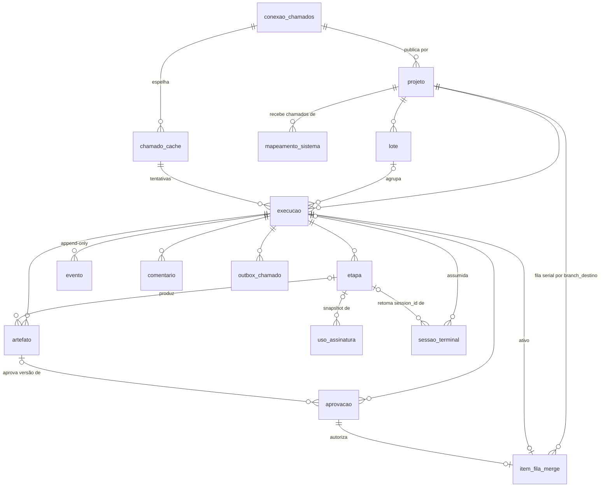

# 02 — Modelo de dados da Forja

Este documento define a persistência local da Forja (`apps/forja`): convenções do SQLite e das migrations TypeORM, os enums como constantes canônicas, o diagrama de entidades, **cada entidade** com seus campos, as invariantes que o banco garante (ou que o app garante em transação), a configuração completa de um projeto, o diretório de dados e o layout de arquivos por execução e por worktree, os segredos e como são cifrados, os índices e a política de retenção e limpeza.

Fora de escopo aqui: transições da máquina de estados, quem decide cada uma, gates, ciclos, fila de merge e outbox como **comportamento** → `specs/forja/03-pipeline.md`; formato dos contratos `plano.v1` … `resposta.v1` (zod) → `specs/forja/04-agentes-e-contratos.md`; flags de spawn, parser do stream e catálogo de eventos da CLI → `specs/forja/01-arquitetura.md`; ameaças, perfis de permissão e modo reforçado → `specs/forja/05-seguranca.md`; chamadas à API do Chamados → `specs/forja/07-integracao-chamados.md`; telas → `specs/forja/06-ui-ux.md`.

> DECIDIDO (2026-10-02): persistência em **TypeORM + better-sqlite3** (U-4), o mesmo ORM do monorepo (D-001). Single-user, sem multi-tenant, sem RLS: a Forja é um app local de um único usuário; o isolamento entre clientes é por `conexao_chamados` + `projeto`, não por política de banco.

> DECIDIDO (2026-10-02): agentes rodam **sem sandbox**, com `--dangerously-skip-permissions` (U-3). Consequência para este documento: tudo que está no diretório de dados é legível por um `Bash` do agente; o desenho abaixo parte disso (§8).

## 1. Convenções

| Tema               | Regra                                                                                                                                                                                                                                                                                                                                                                                                                                                                                                                                                                                                                                                                                                       |
| ------------------ | ----------------------------------------------------------------------------------------------------------------------------------------------------------------------------------------------------------------------------------------------------------------------------------------------------------------------------------------------------------------------------------------------------------------------------------------------------------------------------------------------------------------------------------------------------------------------------------------------------------------------------------------------------------------------------------------------------------- |
| Motor              | SQLite via `better-sqlite3` (síncrono). Um único processo escritor (o servidor Fastify, F-17). PRAGMAs na abertura: `journal_mode=WAL`, `foreign_keys=ON`, `busy_timeout=5000`, `synchronous=NORMAL`.                                                                                                                                                                                                                                                                                                                                                                                                                                                                                                       |
| ORM                | TypeORM com o driver `better-sqlite3`, `synchronize: false` sempre. Entidades em `apps/forja/server/db/entidades/`, migrations em `apps/forja/server/db/migrations/` (escritas e revisadas à mão, com `up` e `down`).                                                                                                                                                                                                                                                                                                                                                                                                                                                                                       |
| Migrations no boot | O servidor aplica as migrations pendentes ao subir, **depois** de copiar o banco com `VACUUM INTO '<dados>/backups/forja-<timestamp>.db'`. Falha de migration → não sobe e mostra o caminho do backup. Ao fim: `PRAGMA foreign_key_check` vazio, senão rollback. **`0003-fj032-verificacao-pelo-agente`** (FJ-032, 2026-10-03): recria `execucao` com o CHECK de `nivel_verificacao` aceitando os níveis novos (+ obsoletos) e move as execuções em `precisa_humano`/`base_vermelha` para `plano_pronto` (com plano) ou `planejando` (sem plano), limpando motivo e `estado_anterior`, com nota em `motivo_texto` ("FJ-032: a Forja não roda mais comandos do projeto; retomada automaticamente (era: …)"). |
| Nomes              | Tabelas e colunas em `snake_case` pt-BR, no singular (glossário §3 da síntese). Termos técnicos em inglês quando são nome próprio do dado (`session_id`, `pid`, `pgid`, `sha`, `patch_id`, `model_usage`).                                                                                                                                                                                                                                                                                                                                                                                                                                                                                                  |
| PK                 | `id TEXT` com **UUID v7** gerado pelo app (ordenável por tempo). Exceção: `evento.seq INTEGER PRIMARY KEY AUTOINCREMENT` (monotônico, nunca reutilizado — é o `Last-Event-ID` do SSE).                                                                                                                                                                                                                                                                                                                                                                                                                                                                                                                      |
| Timestamps         | `TEXT` ISO-8601 UTC com milissegundos e `Z` (`2026-10-02T14:03:11.123Z`), gravados pelo app (não `CURRENT_TIMESTAMP`, que não tem ms nem fuso). Ordenam lexicograficamente. Colunas `criado_em` / `atualizado_em` (pt-BR, ao contrário do `created_at` do Chamados).                                                                                                                                                                                                                                                                                                                                                                                                                                        |
| Booleanos          | `INTEGER NOT NULL` com `CHECK (col IN (0,1))`.                                                                                                                                                                                                                                                                                                                                                                                                                                                                                                                                                                                                                                                              |
| Enums              | `TEXT` com `CHECK (col IN (...))`. Os valores vêm de **uma** constante TS por enum, reutilizada por zod, pelas entidades e pela migration. Novo valor = migration (SQLite não altera `CHECK`; a tabela é recriada). Enums do Chamados (`status`, `natureza`, `prioridade`, `complexidade`) vêm de `@chamados/shared` (F-18).                                                                                                                                                                                                                                                                                                                                                                                |
| JSON               | `TEXT` com `CHECK (json_valid(col))`; o formato de cada coluna JSON é um schema zod versionado (`config_versao` no projeto). Leitura sempre passa pelo zod: JSON inválido no banco = erro explícito, nunca default silencioso.                                                                                                                                                                                                                                                                                                                                                                                                                                                                              |
| Custo              | `INTEGER` em **micro-dólares** "equivalente API" (`custo_micro_usd`), somado sem float. Origem: `total_cost_usd` do `result` [V 01 §1.10].                                                                                                                                                                                                                                                                                                                                                                                                                                                                                                                                                                  |
| Caminhos           | Arquivos da execução são gravados **relativos** a `<dados>/execucoes/<execucao_id>/`; worktrees e repo em caminho absoluto.                                                                                                                                                                                                                                                                                                                                                                                                                                                                                                                                                                                 |
| Exclusão           | Sem soft delete. Linhas de execução encerrada ficam (histórico); o que se apaga são arquivos (§9). `ON DELETE` é `RESTRICT` por padrão; `CASCADE` só de `execucao` para filhas, usado apenas no "apagar histórico" explícito. (implementação, 2026-10-02/03): FKs **entre filhas da mesma execução** ficam `NO ACTION` (para o CASCADE a partir de `execucao` funcionar) e `uso_assinatura.etapa_id` é `SET NULL`. A migration 0000 tem CHECKs a mais: etapa do app sem papel nem `session_id`; `patch_id` só em artefato `diff`; `em_bloco` só em plano com lote; sessão assumida exige execução, etapa e sessão; `remoto` nulo só com `merge_local`.                                                      |

## 2. Enums

### 2.1 `estado_execucao`

Lista canônica (glossário §3). Semântica das transições → 03. Aqui: significado e classe.

| valor                         | classe       | significado                                                                                                                                                                   |
| ----------------------------- | ------------ | ----------------------------------------------------------------------------------------------------------------------------------------------------------------------------- |
| `na_fila`                     | ativo        | selecionado pelo humano (G0); aguarda semáforo/cota                                                                                                                           |
| `preparando`                  | ativo        | worktree, cópia de `arquivos_locais`, gravação de `entrada/` (sem `setup` nem linha de base, FJ-032)                                                                          |
| `planejando`                  | ativo        | etapa `planejar` em curso                                                                                                                                                     |
| `plano_pronto`                | ativo        | `plano.v1` válido; o app decide o gate                                                                                                                                        |
| `aguardando_plano`            | gate G1      | humano aprova/edita/comenta/descarta o plano                                                                                                                                  |
| `aguardando_decisao`          | gate Gdec    | `decisoes_do_operador` ou pergunta ao cliente pendente de decisão                                                                                                             |
| `aguardando_cliente_resposta` | espera       | pergunta publicada; polling detecta resposta                                                                                                                                  |
| `implementando`               | ativo        | turno T1 do condutor                                                                                                                                                          |
| `verificando`                 | ativo        | coleta do app, instantânea e sem processo: commit, `sha_verificado`, selos, evidências e comandos do T1 lidos do stream (FJ-032; o app não roda comandos do projeto)          |
| `revisando`                   | ativo        | turno T2 do condutor                                                                                                                                                          |
| `relatando`                   | ativo        | turno T3 do condutor                                                                                                                                                          |
| `aguardando_aprovacao`        | gate G2      | relatório + diff + resposta prontos, amarrados a `patch_id`                                                                                                                   |
| `retrabalho_humano`           | ativo        | humano pediu ajustes; volta a T1 com os comentários                                                                                                                           |
| `na_fila_merge`               | ativo        | aprovado; `item_fila_merge` aguardando a vez                                                                                                                                  |
| `integrando`                  | ativo        | integração, reverificação pelo revisor (só se o destino andou ∧ arquivos se cruzam, FJ-032), CAS da ref e push                                                                |
| `resolvendo_conflito`         | ativo        | Fase 3 (resolvedor); no MVP conflito vai a `precisa_humano`                                                                                                                   |
| `mergeado`                    | ativo        | ref avançada (e push feito, conforme `entrega.modo`)                                                                                                                          |
| `comunicando`                 | ativo        | outbox de encerramento em curso                                                                                                                                               |
| `mergeado_pendente_chamado`   | espera       | outbox falhou de forma retentável; botão "tentar agora"                                                                                                                       |
| `aguardando_deploy`           | gate Gdeploy | parte pública retida até "Publicado em produção"                                                                                                                              |
| `concluido`                   | **terminal** | merge feito e chamado comunicado conforme a política                                                                                                                          |
| `precisa_humano`              | espera       | limites, pingue-pongue, conflito, incoerência do relatório, não implementável                                                                                                 |
| `descartado`                  | **terminal** | humano desistiu desta tentativa (nova tentativa é outra `execucao`)                                                                                                           |
| `cancelado`                   | **terminal** | encerrada sem trabalho a preservar (desistência antes de `implementando`) ou por causa externa (chamado ficou terminal no Chamados, projeto removido) — `03-pipeline.md` §2.2 |
| `pausado_usuario`             | lateral      | pausa explícita; volta a `estado_anterior`                                                                                                                                    |
| `pausado_cota`                | lateral      | etapa parou por limite da assinatura ou overage não autorizado; retoma no `resetsAt` (o freio que só impede _iniciar_ não muda o estado, `03-pipeline.md` §7.6)               |
| `assumido_manual`             | lateral      | sessão do pipeline aberta no terminal ("Assumir")                                                                                                                             |
| `interrompido`                | lateral      | crash do app/processo; aguarda retomada (F-08)                                                                                                                                |
| `falhou`                      | lateral      | falha de infraestrutura retentável (CLI ausente, disco, git)                                                                                                                  |

"Execução **ativa**" = qualquer estado não terminal. Laterais sempre gravam `estado_anterior`.

### 2.2 Demais enums

| enum                                                | valores                                                                                                                                                                                                                                                                                                                                                                                                                                                                                       | onde                                                                                                                                                                                                                                                                                                                                                                                                                                                                                                                                                                                                                                                                                                                     |
| --------------------------------------------------- | --------------------------------------------------------------------------------------------------------------------------------------------------------------------------------------------------------------------------------------------------------------------------------------------------------------------------------------------------------------------------------------------------------------------------------------------------------------------------------------------- | ------------------------------------------------------------------------------------------------------------------------------------------------------------------------------------------------------------------------------------------------------------------------------------------------------------------------------------------------------------------------------------------------------------------------------------------------------------------------------------------------------------------------------------------------------------------------------------------------------------------------------------------------------------------------------------------------------------------------ |
| `tipo_etapa`                                        | `planejar` `implementar` `verificar` `evidenciar` `revisar` `relatar` `conversar` `integrar` `resolver_conflito`                                                                                                                                                                                                                                                                                                                                                                              | `etapa.tipo`. `verificar`, `evidenciar` e `integrar` são executadas pelo app (sem `session_id`); as demais são processos `claude`. `evidenciar` = captura de prints antes/depois (FJ-026, `03-pipeline.md` §5.4)                                                                                                                                                                                                                                                                                                                                                                                                                                                                                                         |
| `estado_etapa` · `motivo_fim_etapa`                 | `executando` `concluida` `falhou` `interrompida` `cancelada` · a classificação do runner (`01-arquitetura.md` §6.6): `concluido` `saida_invalida` `limite_orcamento` `limite_turnos` `cota` `autenticacao` `perfil_divergente` `pausado` `cancelado` `timeout` `interrompido` `erro_execucao`; mais, nas etapas do app: `comando_vermelho` `comando_ambiente` (FJ-032: ficam para linhas antigas e para as etapas `integrar` da fila de merge que falham; a coleta `verificar` não os produz) | `etapa.estado`, `etapa.motivo_fim`                                                                                                                                                                                                                                                                                                                                                                                                                                                                                                                                                                                                                                                                                       |
| `papel_agente`                                      | `planejador` `condutor` `implementador` `revisor_correcao` `revisor_seguranca` `testador_e2e` `relator` `resolvedor_conflito`                                                                                                                                                                                                                                                                                                                                                                 | `etapa.papel`, `evento.papel_agente` (o `relator` é o turno T3 do condutor)                                                                                                                                                                                                                                                                                                                                                                                                                                                                                                                                                                                                                                              |
| `tipo_artefato`                                     | `plano` `resumo_impl` `veredito` `relatorio` `resposta` `diff` `log` `evidencia` `prompt`                                                                                                                                                                                                                                                                                                                                                                                                     | `artefato.tipo`; `prompt` = material que o app enviou por stdin (registro, §7); `evidencia` = um print PNG de uma tela num momento (campos em §4.9)                                                                                                                                                                                                                                                                                                                                                                                                                                                                                                                                                                      |
| `nivel_verificacao`                                 | `verificado_pelo_revisor` `declarado` `nao_verificado`; obsoletos (só linhas antigas, nunca escritos): `e2e_automatizado` `e2e_roteiro` `verificacao_estatica`                                                                                                                                                                                                                                                                                                                                | calculado pelo app dos `comandos_executados` do veredito × Bash do stream do T2 (`03-pipeline.md` §5.3; FJ-032), nunca arredondado para cima; CHECK recriado pela migration `0003-fj032-verificacao-pelo-agente`                                                                                                                                                                                                                                                                                                                                                                                                                                                                                                         |
| `evidencia_visual` · `momento_evidencia`            | `completa` `parcial` `sem_evidencia_visual` `nao_se_aplica` · `antes` `depois`                                                                                                                                                                                                                                                                                                                                                                                                                | `execucao.evidencia_visual` (⚙ app, FJ-026): `completa` = toda tela com par antes/depois; `parcial` = alguma sem par; `sem_evidencia_visual` = nenhuma captura possível; `nao_se_aplica` = selo `altera_ui` desligado (ou o agente declarou `nao_se_aplica` no B7 e o selo confirmou; se o selo ligar, `sem_evidencia_visual`, FJ-031). `artefato.conteudo.momento` das evidências. Prints **não** alteram `nivel_verificacao`                                                                                                                                                                                                                                                                                           |
| `tipo_aprovacao`                                    | `plano` `decisao` `final` `reaprovacao` `publicado_producao`                                                                                                                                                                                                                                                                                                                                                                                                                                  | `aprovacao.tipo` (G1, Gdec, G2, G2', Gdeploy)                                                                                                                                                                                                                                                                                                                                                                                                                                                                                                                                                                                                                                                                            |
| `decisao_aprovacao`                                 | `aprovado` `aprovado_com_edicao` `ajustes_pedidos` `descartado`                                                                                                                                                                                                                                                                                                                                                                                                                               | `aprovacao.decisao`                                                                                                                                                                                                                                                                                                                                                                                                                                                                                                                                                                                                                                                                                                      |
| `passo_outbox`                                      | `silenciar_ia` `atribuir` `nota_inicio` `pergunta_publica` `status_aguardando_cliente` `status_em_atendimento` `nota_interna` `mensagem_publica` `status_resolvido` `status_fechado` `desatribuir` `reativar_ia` `nota_descarte`                                                                                                                                                                                                                                                              | `outbox_chamado.passo`; rodadas de início/encerramento/descarte em `03-pipeline.md` §9.1; `silenciar_ia`/`reativar_ia` só com D-036 L1 e `atribuir`/`desatribuir` só com L4 (sem a extensão ficam `pulado`); chamadas e marcadores em `07-integracao-chamados.md` §3 e §9 `silenciar_ia`/`reativar_ia` **não usados** desde FJ-031 (2026-10-03): ficam só por compatibilidade com linhas antigas, nunca enfileirados                                                                                                                                                                                                                                                                                                     |
| `motivo_estado`                                     | `ciclos_esgotados` `pingue_pongue` `verificacao_ambiente` `base_vermelha` `setup_falhou` `conflito_merge` `conflito_schema` `schema_concorrente` `push_recusado` `relatorio_incoerente` `saida_invalida` `regra_conteudo_violada` `timeout_etapa` `orcamento_etapa` `segunda_interrupcao` `sentinela_divergente` `perfil_divergente` `nao_implementavel` `chamado_mudou_no_servidor` `ia_servidor_ativa` `transicao_recusada` `cota_overage` `humano_encerrou`                                | `execucao.motivo_estado` — lista FECHADA; cada código tem as ações válidas em `03-pipeline.md` §2.4/§11 e o texto da UI em `06-ui-ux.md`. Uso: `precisa_humano` (maioria), `falhou` (`setup_falhou` — worktree, base/remoto da integração, reverificação pelo revisor que não concluiu —, `saida_invalida`, `perfil_divergente`), `cancelado` (`chamado_mudou_no_servidor`, `humano_encerrou`) `ia_servidor_ativa` não é mais emitido (FJ-031, 2026-10-03; sinais da IA do servidor são informativos). `base_vermelha` e `verificacao_ambiente` ficam só por compatibilidade, nunca escritos (FJ-032, 2026-10-03); a migration `0003` move as execuções paradas em `base_vermelha` para `plano_pronto`/`planejando` (§1) |
| `estado_outbox`                                     | `pendente` `retido` `enviando` `enviado` `pulado` `bloqueado`                                                                                                                                                                                                                                                                                                                                                                                                                                 | `retido` = aguardando "Publicado em produção"; `bloqueado` = exige humano (violação nova do validador, `403`, segredo detectado) — `03-pipeline.md` §9                                                                                                                                                                                                                                                                                                                                                                                                                                                                                                                                                                   |
| `estado_item_fila_merge`                            | `aguardando` `integrando` `verificando` `publicando` `concluido` `devolvido` `conflito`                                                                                                                                                                                                                                                                                                                                                                                                       | `verificando` = reverificação pelo revisor em curso (turno T2, FJ-032). `devolvido` carrega `motivo` (patch-id mudou, reverificação pelo revisor reprovada, push rejeitado 2×)                                                                                                                                                                                                                                                                                                                                                                                                                                                                                                                                           |
| `modo_avanco_ref`                                   | `update_ref` `push_direto` `ff_copia_limpa`                                                                                                                                                                                                                                                                                                                                                                                                                                                   | como a branch de destino avançou (F-10)                                                                                                                                                                                                                                                                                                                                                                                                                                                                                                                                                                                                                                                                                  |
| `modo_entrega`                                      | `merge_local` `merge_e_push` `pull_request`                                                                                                                                                                                                                                                                                                                                                                                                                                                   | **default `merge_e_push`** (U-2); `pull_request` = Fase 2                                                                                                                                                                                                                                                                                                                                                                                                                                                                                                                                                                                                                                                                |
| `estrategia_integracao`                             | `merge_no_ff` `squash`                                                                                                                                                                                                                                                                                                                                                                                                                                                                        | default `merge_no_ff` (`git revert -m 1` desfaz o chamado)                                                                                                                                                                                                                                                                                                                                                                                                                                                                                                                                                                                                                                                               |
| `politica_status`                                   | `resolvido` `fechado_imediato` `aguardar_deploy`                                                                                                                                                                                                                                                                                                                                                                                                                                              | **default `resolvido`** (U-1)                                                                                                                                                                                                                                                                                                                                                                                                                                                                                                                                                                                                                                                                                            |
| `gate_plano`                                        | `sempre` `por_risco` `nunca`                                                                                                                                                                                                                                                                                                                                                                                                                                                                  | lote força `sempre` (F-11, F-14)                                                                                                                                                                                                                                                                                                                                                                                                                                                                                                                                                                                                                                                                                         |
| `estado_lote`                                       | `planejando` `mesa_de_planos` `implementando` `encerrado` `cancelado`                                                                                                                                                                                                                                                                                                                                                                                                                         | `lote.estado`                                                                                                                                                                                                                                                                                                                                                                                                                                                                                                                                                                                                                                                                                                            |
| `tipo_sessao_terminal`                              | `livre` `assumida`                                                                                                                                                                                                                                                                                                                                                                                                                                                                            | `livre` = Claude normal no repo; `assumida` = `--resume` de uma sessão do pipeline                                                                                                                                                                                                                                                                                                                                                                                                                                                                                                                                                                                                                                       |
| `alvo_comentario` · `origem_evento` · `local_senha` | `plano` `diff` `relatorio` `resposta` · `app` `cli` `comando` `chamados` `humano` · `keyring` `arquivo` `nao_guardada`                                                                                                                                                                                                                                                                                                                                                                        | `comentario.alvo`, `evento.origem`, `conexao_chamados.local_senha`                                                                                                                                                                                                                                                                                                                                                                                                                                                                                                                                                                                                                                                       |
| `nivel_evento`                                      | `info` `aviso` `erro`                                                                                                                                                                                                                                                                                                                                                                                                                                                                         | `evento.nivel` (implementação, 2026-10-02/03; o `nivel` do envelope de `01-arquitetura.md` §8.2)                                                                                                                                                                                                                                                                                                                                                                                                                                                                                                                                                                                                                         |

## 3. Diagrama de entidades



## 4. Entidades

Colunas `criado_em`/`atualizado_em` (TEXT, NOT NULL) existem em todas as tabelas salvo indicação e são omitidas das tabelas.

### 4.1 `conexao_chamados`

Credencial e endereço de uma instância do Chamados. Identidade: usuário `operador` dedicado (F-20).

| campo                             | tipo | nulo | significado                                                                                                                      |
| --------------------------------- | ---- | ---- | -------------------------------------------------------------------------------------------------------------------------------- |
| id                                | uuid | não  | PK                                                                                                                               |
| nome                              | text | não  | rótulo único (`prod-acme`, `dev-local`)                                                                                          |
| url_base                          | text | não  | ex. `https://chamados.acme.com.br`; em dev **`http://localhost:3000`, nunca `127.0.0.1`** [V D7, síntese F-20]                   |
| tenant_slug                       | text | sim  | enviado em `x-tenant-slug` quando a URL não resolve o tenant (dev)                                                               |
| ambiente                          | text | não  | `dev` \| `producao` — faixa visual e confirmação extra em produção                                                               |
| email                             | text | não  | login do operador dedicado                                                                                                       |
| usuario_id / usuario_nome / papel | text | sim  | preenchidos no login; o nome aparece ao cliente como autor das mensagens públicas; papel ≠ `operador`/`admin` → conexão recusada |
| token_cifrado / token_expira_em   | text | sim  | envelope AES-256-GCM do token de sessão (§8) · expiração; `401` força relogin 1× (F-16)                                          |
| local_senha                       | enum | não  | onde está a senha (§8)                                                                                                           |
| ultimo_login_em                   | text | sim  | auditoria; o token é reutilizado por causa do rate limit do login [V F-20]                                                       |

### 4.2 `projeto`

Um repositório local que implementa chamados de um ou mais sistemas-alvo. **Configuração v2 (FJ-030, 2026-10-03):** o único campo obrigatório é `repo_dir`; o resto é autodetectado (§6.1) ou vem das configurações globais (§6.2), e o que o usuário quiser sobrescrever vai em `avancado` (texto YAML/JSON validado por zod). O contrato `ConfigProjeto` (`comum/config-projeto.ts`) e o exemplo estão em §6. Mudanças de configuração **não** afetam execuções já iniciadas: elas usam `execucao.config_snapshot`, que é o **snapshot resolvido** (autodetecção + globais + `avancado`).

| campo                 | tipo       | nulo | significado                                                                                                                                                                 |
| --------------------- | ---------- | ---- | --------------------------------------------------------------------------------------------------------------------------------------------------------------------------- |
| id                    | uuid       | não  | PK                                                                                                                                                                          |
| nome / slug           | text       | não  | exibição (padrão: `basename(repo_dir)`) · UNIQUE, nome do diretório em `worktrees/`                                                                                         |
| conexao_id            | uuid       | não  | FK `conexao_chamados`                                                                                                                                                       |
| repo_dir              | text       | não  | caminho absoluto da cópia do usuário, validado por `git rev-parse` (a Forja **nunca** mexe na árvore dela, F-10). **Único campo obrigatório** (FJ-030)                      |
| remoto                | text       | sim  | nome do remoto (`origin`), autodetectado; nulo só com `entrega.modo = merge_local`                                                                                          |
| remoto_url            | text       | sim  | URL do remoto capturada ao salvar o projeto ou no 1º preparo; fetch/push conferem contra ela (05 §9; migration `0001`)                                                      |
| branch_destino        | text       | sim  | ex. `main`; **nulo = autodetectada** (`origin/HEAD` → `main` → `master` → branch atual, §6.1) (FJ-030)                                                                      |
| prefixo_branch        | text       | não  | fixo `forja/` → branch `forja/chamado-<n>-<slug>[-r<k>]` (F-09)                                                                                                             |
| ativo / config_versao | bool / int | não  | inativo some da fila · versão do schema (`2` desde FJ-030)                                                                                                                  |
| avancado              | json       | sim  | sobrescritas opcionais: `comandos`, `detectores`, `arquivos_locais`, `entrega`, `politica_status`, `gates`, `limites`, `modo_reforcado` (§6). Nulo = autodetecção + padrões |
| versao_cli_fixada     | text       | sim  | legado, sem UI; a compatibilidade da CLI é global (`compat-cli.json`, 01 §7)                                                                                                |

Os sistemas-alvo continuam em `mapeamento_sistema` (§4.3). Sem mapeamento salvo, o casamento é automático por nome normalizado (sem acento, caixa e separadores) entre o sistema-alvo e o nome do projeto ou da pasta; a tela Projeto mostra o casamento em toggles para ajustar (FJ-030).

**Removidos da configuração do projeto (FJ-030, 2026-10-03):** `evidencias` (viewport, tema, autenticação/`storageState`, `rota_login`, `timeout_tela_s`), `modelos`, os limites globais (`orcamento_usd`, `timeout_min`, `concorrencia`, `freio_cota`, agora nas configurações globais, §6.2) e `gates.exigir_prints_ui` (global). `retencao` usa os padrões de §9, sem tela. Um projeto `config_versao = 1` é convertido na leitura: o que difere do padrão vai para `avancado`; `evidencias` e `modelos` são descartados.

### 4.3 `mapeamento_sistema`

Liga um sistema-alvo do Chamados a um projeto. Enquanto D-036 L2 não expõe `sistema_alvo_id`, o casamento é por nome (frágil a renomeação — a UI avisa quando um chamado não casa com nenhum projeto).

| campo           | tipo | nulo | significado                                            |
| --------------- | ---- | ---- | ------------------------------------------------------ |
| id              | uuid | não  | PK                                                     |
| projeto_id      | uuid | não  | FK                                                     |
| conexao_id      | uuid | não  | FK (redundante com o projeto; permite o UNIQUE abaixo) |
| sistema_alvo_id | text | sim  | id remoto (com L2)                                     |
| sistema_nome    | text | não  | nome do sistema-alvo; fallback de casamento            |

UNIQUE `(conexao_id, sistema_alvo_id)` (quando não nulo) e `(conexao_id, sistema_nome)`: um sistema-alvo aponta para **um** projeto.

### 4.4 `chamado_cache`

Espelho do que a API devolve, para a fila e para os sinais. Não é verdade de negócio: o detalhe é relido antes de toda ação (F-15).

| campo                                         | tipo       | nulo            | significado                                                                                                                                           |
| --------------------------------------------- | ---------- | --------------- | ----------------------------------------------------------------------------------------------------------------------------------------------------- |
| id                                            | uuid       | não             | PK local                                                                                                                                              |
| conexao_id                                    | uuid       | não             | FK                                                                                                                                                    |
| chamado_id                                    | text       | não             | UUID remoto; usado como `{ref}` (a API aceita UUID ou número [V specs/11 §4])                                                                         |
| numero / titulo                               | int / text | não             | `#N`                                                                                                                                                  |
| status / natureza / prioridade / complexidade | enum       | não/não/não/sim | valores de `@chamados/shared`; `complexidade` é interna                                                                                               |
| sistema_alvo_id / sistema_nome / operador_id  | text       | sim             | resolvem o projeto via `mapeamento_sistema`; ids só com L2                                                                                            |
| ia_silenciada                                 | bool       | sim             | nulo = desconhecido (lista sem L1 → só o detalhe informa). Só informativo: badge da fila e detecção da D-036, nunca pré-condição (FJ-031, 2026-10-03) |
| ultima_mensagem_id / ultima_mensagem_em       | text       | sim             | detecção de mensagem nova: `updated_at` remoto **não** muda com mensagem [V F-15]                                                                     |
| sinais                                        | json       | não             | `{tem_spec_ia, tem_diagnostico_ia, tem_pr_ia, branch_ia}` por marcador de `triagem-notas`                                                             |
| atualizado_em_remoto                          | text       | sim             | `updated_at` da API                                                                                                                                   |
| sincronizado_em / detalhe_sincronizado_em     | text       | não / sim       | última leitura (lista ou detalhe) · última leitura do detalhe (sinais são lazy)                                                                       |

UNIQUE `(conexao_id, chamado_id)` e `(conexao_id, numero)`.

### 4.5 `lote`

Seleção múltipla de um mesmo projeto (uma seleção com chamados de N projetos gera N lotes). Planos em paralelo → mesa de planos → implementação (F-14).

| campo                                   | tipo               | nulo | significado                                                                                                   |
| --------------------------------------- | ------------------ | ---- | ------------------------------------------------------------------------------------------------------------- |
| id                                      | uuid               | não  | PK                                                                                                            |
| projeto_id                              | uuid               | não  | FK                                                                                                            |
| nome                                    | text               | não  | default `Lote <data hora>`                                                                                    |
| estado                                  | enum `estado_lote` | não  |                                                                                                               |
| concorrencia_planos / concorrencia_impl | int                | não  | snapshots de `concorrencia.planejadores` (3) e `.implementacoes` (2) das configurações globais (§6.2, FJ-030) |
| encerrado_em                            | text               | sim  |                                                                                                               |

### 4.6 `execucao`

Entidade-chave: **1 chamado × 1 tentativa**. Carrega o estado da máquina (03), os ponteiros para a worktree e para a sessão condutora (F-02), e os números que a UI mostra sem varrer eventos.

| campo                                       | tipo                   | nulo        | significado                                                                                                                                                                                                                                                                  |
| ------------------------------------------- | ---------------------- | ----------- | ---------------------------------------------------------------------------------------------------------------------------------------------------------------------------------------------------------------------------------------------------------------------------- |
| id                                          | uuid                   | não         | PK; também o marcador `[forja:<id>:<momento>]` das notas internas (F-16, `07-integracao-chamados.md` §9)                                                                                                                                                                     |
| conexao_id / chamado_id                     | uuid / text            | não         | chave remota do chamado                                                                                                                                                                                                                                                      |
| chamado_cache_id / projeto_id / lote_id     | uuid                   | não/não/sim | FKs                                                                                                                                                                                                                                                                          |
| numero                                      | int                    | não         | denormalizado para nomes de branch/diretório                                                                                                                                                                                                                                 |
| tentativa                                   | int                    | não         | 1, 2, …; UNIQUE com a chave do chamado                                                                                                                                                                                                                                       |
| estado                                      | enum `estado_execucao` | não         |                                                                                                                                                                                                                                                                              |
| estado_anterior                             | enum                   | sim         | obrigatório nos laterais                                                                                                                                                                                                                                                     |
| motivo_estado                               | text                   | sim         | por que está em `precisa_humano`/`falhou`/`cancelado`: código da lista fechada de motivos (`03-pipeline.md` §2.5, §11, §11.1), cada um com as ações válidas na UI                                                                                                            |
| motivo_texto                                | text                   | sim         | texto curto pt-BR com o detalhe do motivo (ex.: "diff vazio"); coluna própria (implementação, 2026-10-02/03)                                                                                                                                                                 |
| config_snapshot                             | json                   | não         | configuração **resolvida** no início: autodetecção + configurações globais + `avancado` do projeto (reprodutibilidade, F-05; FJ-030)                                                                                                                                         |
| branch_destino                              | text                   | não         | snapshot                                                                                                                                                                                                                                                                     |
| branch                                      | text                   | sim         | `forja/chamado-<n>-<slug>[-r<k>]`                                                                                                                                                                                                                                            |
| worktree_dir                                | text                   | sim         | absoluto; nulo após a limpeza                                                                                                                                                                                                                                                |
| sha_base / sha_atual / sha_verificado       | text                   | sim         | tip do destino no início · último commit do app na branch (F-08) · `HEAD` registrado na última coleta (`verificando`, FJ-032)                                                                                                                                                |
| nivel_verificacao                           | enum                   | sim         | do `sha_verificado`; gravado na transição do veredito (FJ-032)                                                                                                                                                                                                               |
| ciclo_auto / ciclo_total                    | int                    | não         | contadores (limites 2 / 5)                                                                                                                                                                                                                                                   |
| session_id_planejador / session_id_condutor | text                   | sim         | sessão só leitura do planejador · sessão condutora vigente (muda se o resume falhar e o app abrir sessão nova, F-08)                                                                                                                                                         |
| aprovacao_vigente_id                        | uuid                   | sim         | FK `aprovacao` final/reaprovação válida                                                                                                                                                                                                                                      |
| sha_merge                                   | text                   | sim         | commit que entrou no destino                                                                                                                                                                                                                                                 |
| selos                                       | json                   | sim         | `{altera_banco, altera_regra_negocio, altera_ui, sensivel[], docs_exigidas_ok}` do último diff (⚙ app); `altera_ui` = `detectores.frontend` (autodetectado, §6.1) ∨ `plano.areas` ∋ `ui` (FJ-026)                                                                            |
| evidencia_visual / evidencia_visual_motivo  | enum / text            | sim         | nível de evidência visual do `sha_verificado` (⚙ app, enum `evidencia_visual`, FJ-026) · motivo legível quando `parcial`/`sem_evidencia_visual` (o `motivo_geral` do agente, `telas.json` ausente, PNG inválido, `antes_suspeito`); recalculado a cada coleta (FJ-030)       |
| ia_silenciada_pelo_app                      | bool                   | não         | **Obsoleto (FJ-031, 2026-10-03):** não é mais escrito (a Forja não silencia a IA do servidor); coluna mantida por compatibilidade, `false` em execuções novas                                                                                                                |
| atribuido_pelo_app                          | bool                   | não         | só com L4: o app atribuiu o operador dedicado e deve desatribuir (`desatribuir`) no descarte                                                                                                                                                                                 |
| sentinela                                   | json                   | sim         | `{antes: {caminho: hash}, depois: {…}, divergencias: [caminho], detectada_em, reconhecida_em}` — resultado da sentinela de integridade (`05-seguranca.md` §4.9); `reconhecida_em` nulo com divergências = fila de merge e outbox do projeto travados (`03-pipeline.md` §2.5) |
| ultima_mensagem_ciente_id                   | text                   | sim         | "li" do humano; aprovação exige `= chamado_cache.ultima_mensagem_id` se houver mensagem nova (F-15)                                                                                                                                                                          |
| custo_micro_usd                             | int                    | não         | soma das etapas; teto `limites.orcamento_usd.por_chamado`                                                                                                                                                                                                                    |
| iniciado_em / concluido_em                  | text                   | sim         |                                                                                                                                                                                                                                                                              |

### 4.7 `etapa`

Uma unidade de trabalho da execução: um **processo** `claude` (um turno T1/T2/T3, o planejamento, uma mensagem de conversa) ou um bloco executado pelo app (`verificar`, `evidenciar`, `integrar`). O número `n` nomeia `etapas/<n>/`.

| campo                                             | tipo        | nulo        | significado                                                                                                                                                                                                                                                                              |
| ------------------------------------------------- | ----------- | ----------- | ---------------------------------------------------------------------------------------------------------------------------------------------------------------------------------------------------------------------------------------------------------------------------------------- |
| id                                                | uuid        | não         | PK                                                                                                                                                                                                                                                                                       |
| execucao_id                                       | uuid        | não         | FK                                                                                                                                                                                                                                                                                       |
| n / ciclo                                         | int         | não         | sequência por execução (UNIQUE `(execucao_id, n)`) · ciclo de retrabalho a que pertence                                                                                                                                                                                                  |
| tipo / papel                                      | enum        | não / sim   | `tipo_etapa` · `papel_agente` (nulo em `verificar`/`evidenciar`/`integrar`)                                                                                                                                                                                                              |
| estado / motivo_fim                               | enum        | não / sim   | `estado_etapa` · `motivo_fim_etapa`                                                                                                                                                                                                                                                      |
| contrato                                          | text        | sim         | `plano.v1`, `resumo_impl.v1`, … (`--json-schema` do turno)                                                                                                                                                                                                                               |
| session_id                                        | text        | sim         | gerado **antes** do spawn (F-05); repetido entre T1/T2/T3 da mesma sessão                                                                                                                                                                                                                |
| retomada                                          | bool        | não         | 1 se foi `--resume`                                                                                                                                                                                                                                                                      |
| pid / pgid                                        | int         | sim         | gravados antes de consumir o stream; usados na reconciliação do boot                                                                                                                                                                                                                     |
| modelo / esforco                                  | text        | sim         | pedidos no spawn                                                                                                                                                                                                                                                                         |
| prompt_versao                                     | text        | sim         | versão dos templates de prompt usados (`04-agentes-e-contratos.md` §4.1)                                                                                                                                                                                                                 |
| perfil / versao_cli                               | json / text | sim         | argv efetivo (sem segredos) + nomes das variáveis de env + sha256 de `settings`/`agentes` · `claude --version`                                                                                                                                                                           |
| init                                              | json        | sim         | recorte do `system/init`: `model`, `tools`, `permissionMode`, `apiKeySource`, `mcp_servers` (validado contra o perfil, 01)                                                                                                                                                               |
| inicio / fim / ultimo_evento_em                   | text        | não/sim/sim | `ultimo_evento_em` alimenta o aviso "possivelmente travado" (15 min, sem kill)                                                                                                                                                                                                           |
| exit_code / sinal                                 | int / text  | sim         |                                                                                                                                                                                                                                                                                          |
| custo_micro_usd                                   | int         | sim         | custo deste processo: delta do `total_cost_usd` do último `result` em relação ao turno anterior da mesma `session_id` (acumulado na sessão pela doc; na CLI [NV → S5]; `01-arquitetura.md` §6.5, `04-agentes-e-contratos.md` §9)                                                         |
| model_usage / subagent_stats / permission_denials | json        | sim         | telemetria do `result` [V 01]; base do alerta "Fable editou sozinho"                                                                                                                                                                                                                     |
| condutor_editou                                   | bool        | não         | ⚙ app: o condutor usou Edit/Write/Bash de escrita diretamente (F-04)                                                                                                                                                                                                                     |
| sha_inicio / sha_fim                              | text        | sim         | commits antes/depois (commit por passo do app, F-08)                                                                                                                                                                                                                                     |
| comandos                                          | json        | sim         | `verificar` (coleta, FJ-032): os Bash de verificação/instalação do T1 lidos do stream, `[{comando, resultado: exit_0\|erro\|sem_resultado}]`, informativos; linhas antigas de `verificar`/`integrar` têm `[{nome, exit_code, duracao_ms, log_ref, instavel}]`; em `evidenciar` fica nulo |
| telas                                             | json        | sim         | só `evidenciar` (coleta, FJ-030): `{momento, telas: [{tela_id, rota, resultado: ok\|tela_nova\|nao_encontrada, artefato_id, duracao_ms}]}` lidos de `telas.json` (FJ-026); `antes_suspeito` e `motivo_sem_antes` ficam no `artefato.conteudo` da `evidencia`                             |
| transcript_path                                   | text        | sim         | `~/.claude/projects/<slug>/<session>.jsonl` [V 04 §7.5]; o app guarda o caminho, não duplica                                                                                                                                                                                             |

### 4.8 `evento`

Log append-only de tudo que a UI desenha: eventos de domínio do app e recorte normalizado do stream da CLI. O bruto fica em `etapas/<n>/eventos.jsonl` (§7). Só `criado_em`. **Nunca** `UPDATE`/`DELETE` fora da retenção (§9).

| campo                 | tipo                 | nulo | significado                                                                                                                                                                                                    |
| --------------------- | -------------------- | ---- | -------------------------------------------------------------------------------------------------------------------------------------------------------------------------------------------------------------- |
| seq                   | integer              | não  | PK AUTOINCREMENT; `id:` do SSE e `Last-Event-ID` na reconexão                                                                                                                                                  |
| execucao_id           | uuid                 | sim  | nulo em eventos globais (cota, conexão)                                                                                                                                                                        |
| etapa_id              | uuid                 | sim  |                                                                                                                                                                                                                |
| origem                | enum `origem_evento` | não  |                                                                                                                                                                                                                |
| tipo                  | text                 | não  | catálogo único do envelope `EventoForja` (`01-arquitetura.md` §8.2): `execucao.estado`, `etapa.iniciada`, `agente.ferramenta`, `subagente.iniciado`, `permissao.negada`, `git.checkpoint`, `fila_merge.item` … |
| papel_agente          | enum                 | sim  | quem falou (árvore Fable → Opus pelo `parent_tool_use_id`)                                                                                                                                                     |
| parent_tool_use_id    | text                 | sim  | aninhamento de subagente [V 01, `--forward-subagent-text`]                                                                                                                                                     |
| resumo                | text                 | não  | uma linha pt-BR para o feed                                                                                                                                                                                    |
| nivel                 | enum `nivel_evento`  | não  | `info`/`aviso`/`erro` — o `nivel` do envelope (01 §8.2), para o replay devolver o `EventoForja` idêntico (implementação, 2026-10-02/03)                                                                        |
| payload / linha_bruta | json / int           | sim  | recorte enxuto (≤ 8 KB; acima disso trunca) · linha em `eventos.jsonl` para o bruto                                                                                                                            |

### 4.9 `artefato`

Produto versionado de uma etapa. Contratos pequenos vivem **no SQLite** (`conteudo`, fonte da verdade); diffs, logs e evidências vivem em arquivo (`caminho`). Edição humana do plano cria nova versão com `editado_por_humano = 1` (F-11: o editado vira o oficial).

| campo                  | tipo       | nulo      | significado                                                    |
| ---------------------- | ---------- | --------- | -------------------------------------------------------------- |
| id                     | uuid       | não       | PK                                                             |
| execucao_id / etapa_id | uuid       | não / sim |                                                                |
| tipo / versao          | enum / int | não       | `tipo_artefato` · UNIQUE `(execucao_id, tipo, versao)`         |
| contrato               | text       | sim       | `plano.v1` etc.                                                |
| conteudo               | json       | sim       | contratos validados por zod (+ campos ⚙ do app)                |
| caminho                | text       | sim       | relativo ao diretório da execução                              |
| sha256 / tamanho_bytes | text / int | não       | de `conteudo` ou do arquivo; conferido ao mostrar na aprovação |
| sha_git                | text       | sim       | commit a que o artefato se refere (diff, veredito, relatório)  |
| patch_id               | text       | sim       | `git patch-id --stable` do diff (só `diff`)                    |
| editado_por_humano     | bool       | não       |                                                                |

CHECK: `conteudo IS NOT NULL OR caminho IS NOT NULL`. Veredito só vale se `sha_git = execucao.sha_verificado` (03).

**`evidencia` (prints antes/depois, FJ-026; tirados pelo agente e coletados pelo app, FJ-030).** Um artefato por tela × momento: `caminho` = `evidencias/<antes|depois>/<tela_id>.png` (o PNG que o condutor gravou com `forja-print`), `sha256` do PNG, `sha_git` = commit a que o print se refere (`sha_base` no `antes`, `sha_verificado` no `depois`) e `conteudo` = `{momento, tela_id, rota, descricao, largura, altura, antes_suspeito}`. Largura e altura são lidas do cabeçalho do PNG pelo app; `antes_suspeito = true` quando o `mtime` do arquivo `antes` não é anterior ao primeiro checkpoint da execução (não prova que foi tirado em `sha_base`). O `antes` é coletado uma vez e reaproveitado: no retrabalho o condutor refaz só o `depois`. O `depois` vale só para o `sha_git` da coleta; `sha_verificado` mudou → novo `depois` (versão nova do artefato, o anterior fica no histórico). Tela nova grava só o `depois` (`antes: null` + `motivo_sem_antes` em `telas.json`, `tela_nova` em `etapa.telas`).

### 4.10 `comentario`

Feedback humano que vira insumo do próximo ciclo (J6). Vai ao condutor **no prompt**, nunca por arquivo gravável (F-03, critica C-1).

| campo                     | tipo                   | nulo      | significado                                                       |
| ------------------------- | ---------------------- | --------- | ----------------------------------------------------------------- |
| id                        | uuid                   | não       | PK                                                                |
| execucao_id / artefato_id | uuid                   | não / sim | FK · versão comentada                                             |
| alvo                      | enum `alvo_comentario` | não       |                                                                   |
| arquivo / linha           | text / int             | sim       | comentário por linha do diff (UI rica = Fase 2; o dado já existe) |
| texto                     | text                   | não       |                                                                   |
| ciclo_destino             | int                    | não       | ciclo em que deve ser atendido                                    |
| consumido_em              | text                   | sim       | quando entrou no prompt de um turno T1                            |

### 4.11 `aprovacao`

Registro imutável de cada decisão humana em gate. A aprovação final é **individual** e amarrada a `patch_id` + `sha` (F-11); mudou o patch → a aprovação é invalidada e nasce uma `reaprovacao`.

| campo                              | tipo        | nulo      | significado                                                                                                                                                                              |
| ---------------------------------- | ----------- | --------- | ---------------------------------------------------------------------------------------------------------------------------------------------------------------------------------------- |
| id                                 | uuid        | não       | PK                                                                                                                                                                                       |
| execucao_id                        | uuid        | não       | FK                                                                                                                                                                                       |
| tipo / decisao                     | enum        | não       | `tipo_aprovacao` · `decisao_aprovacao`                                                                                                                                                   |
| artefato_id                        | uuid        | sim       | plano/relatório exatamente na versão aprovada                                                                                                                                            |
| patch_id / sha                     | text        | sim       | **obrigatórios** em `final`/`reaprovacao`                                                                                                                                                |
| texto_resposta                     | text        | sim       | mensagem pública como aprovada (após edição)                                                                                                                                             |
| validacao_resposta                 | json        | sim       | violações do validador de linguagem e se houve "publicar mesmo assim"                                                                                                                    |
| aprovado_sem_prints                | bool        | não       | 1 = aprovado com `selos.altera_ui` ∧ `evidencia_visual ∈ {parcial, sem_evidencia_visual}` (FJ-026). Desde FJ-034 (2026-10-03) é o **fato** gravado pelo app, sem checkbox de confirmação |
| politica_status                    | enum        | sim       | snapshot no momento da aprovação                                                                                                                                                         |
| comentario                         | text        | sim       | motivo (ajustes, descarte)                                                                                                                                                               |
| ciente_mensagem_id                 | text        | sim       | última mensagem do cliente lida ao aprovar                                                                                                                                               |
| em_bloco / lote_id                 | bool / uuid | não / sim | 1 só para `plano` na mesa de planos (nunca `final`)                                                                                                                                      |
| invalidada_em / motivo_invalidacao | text        | sim       | patch-id mudou na integração, mensagem nova do cliente                                                                                                                                   |

CHECKs: `tipo IN ('final','reaprovacao') ⇒ patch_id IS NOT NULL AND sha IS NOT NULL AND em_bloco = 0`; `aprovado_sem_prints = 1 ⇒ tipo IN ('final','reaprovacao')`. A exigência da confirmação (quando ela é obrigatória) é regra do app na mesma transação da aprovação, porque depende da execução.

### 4.12 `item_fila_merge`

Uma entrada na fila **serial** por `(projeto_id, branch_destino)` (F-10).

| campo                             | tipo        | nulo      | significado                                                                  |
| --------------------------------- | ----------- | --------- | ---------------------------------------------------------------------------- |
| id                                | uuid        | não       | PK                                                                           |
| projeto_id / branch_destino       | uuid / text | não       | chave da fila                                                                |
| execucao_id / aprovacao_id        | uuid        | não       | FKs; a aprovação vigente que autoriza                                        |
| ordem                             | int         | não       | posição (reordenável pelo humano)                                            |
| estado / motivo                   | enum / text | não / sim | `estado_item_fila_merge` · motivo em `devolvido`/`conflito`                  |
| tentativas_conflito               | int         | não       | MVP: conflito → `precisa_humano`                                             |
| sha_destino_antes / sha_integrado | text        | sim       | `T0` (valor "antigo" do CAS) · resultado da integração na worktree destacada |
| patch_id_integrado                | text        | sim       | comparado com `aprovacao.patch_id`                                           |
| arquivos_em_conflito              | json        | sim       | saída de `git merge-tree --write-tree --name-only`                           |
| modo_avanco / push_em             | enum / text | sim       | `modo_avanco_ref`                                                            |
| copia_local_atras                 | bool        | não       | aviso "sua branch local está atrás" (critica X-3)                            |
| worktree_integracao_dir           | text        | sim       | removida ao concluir/devolver                                                |

### 4.13 `outbox_chamado`

Uma linha por escrita no Chamados, executada em ordem pelo app. Idempotência: o marcador `[forja:<execucao_id>:<momento>]` na nota interna e `corpo_hash` + autor + janela de tempo na pública (F-16, critica X-4; checagem exata em `07-integracao-chamados.md` §9).

| campo                   | tipo       | nulo      | significado                                                                                                                                                                                                                                        |
| ----------------------- | ---------- | --------- | -------------------------------------------------------------------------------------------------------------------------------------------------------------------------------------------------------------------------------------------------- |
| id                      | uuid       | não       | PK                                                                                                                                                                                                                                                 |
| execucao_id             | uuid       | não       | FK                                                                                                                                                                                                                                                 |
| passo / estado          | enum       | não       | `passo_outbox` · `estado_outbox`                                                                                                                                                                                                                   |
| rodada / ordem          | int        | não       | sequencial por execução (1, 2, …), na ordem de criação; o tipo (`inicio`, `pergunta`, `replanejar`, `encerramento`, `descarte`) é **deduzido dos passos**, sem coluna própria (implementação, 2026-10-02/03) · ordem dentro da rodada              |
| corpo                   | text       | sim       | texto final enviado (mensagens)                                                                                                                                                                                                                    |
| corpo_hash              | text       | sim       | sha256 do corpo **normalizado** (comparação com o devolvido em markdown)                                                                                                                                                                           |
| status_alvo / motivo    | text       | sim       | para passos de status (`resolvido`, `implementado_via_forja`); `motivo` também guarda `operador_anterior=<id>` (passo `atribuir`, para o `desatribuir` devolver) e `confirmados=[…]` ("publicar mesmo assim" do G2) (implementação, 2026-10-02/03) |
| tentativas / proxima_em | int / text | não / sim | backoff exponencial                                                                                                                                                                                                                                |
| ultimo_http / erro      | int / text | sim       | `409` relê e recalcula, `401` relogin 1× (F-16)                                                                                                                                                                                                    |
| id_remoto / enviado_em  | text       | sim       | id da mensagem criada                                                                                                                                                                                                                              |

### 4.14 `uso_assinatura`

Snapshots do `rate_limit_event` [V 01 §2: `rate_limit_info.unifiedWindows.{five_hour,seven_day}.{utilization,resetsAt}`, `overageStatus`, `isUsingOverage`]. Base do freio de cota (F-14). Só `criado_em`.

| campo                           | tipo | nulo      | significado                                                |
| ------------------------------- | ---- | --------- | ---------------------------------------------------------- |
| id / etapa_id                   | uuid | não / sim | PK · de onde veio                                          |
| utilizacao_5h / utilizacao_7d   | real | sim       | 0..1 (limiares 0,80 / 0,90)                                |
| reinicia_5h_em / reinicia_7d_em | text | sim       | `resetsAt` convertido para ISO                             |
| status / status_overage         | text | sim       | `allowed`\|`allowed_warning`\|`rejected` · `overageStatus` |
| usando_creditos_extras          | bool | sim       | `isUsingOverage` — bloqueia se não autorizado (U-8)        |
| bruto                           | json | não       | `rate_limit_info` integral                                 |

### 4.15 `sessao_terminal`

Um PTY aberto pela UI (F-13). `livre`: `claude` interativo no repo/worktree, sessão do usuário. `assumida`: `claude --resume <session_id> --settings <perfil da etapa>` com lock.

| campo                                 | tipo                        | nulo                | significado                                                       |
| ------------------------------------- | --------------------------- | ------------------- | ----------------------------------------------------------------- |
| id                                    | uuid                        | não                 | PK                                                                |
| tipo                                  | enum `tipo_sessao_terminal` | não                 |                                                                   |
| cwd                                   | text                        | não                 | repo do projeto ou worktree                                       |
| execucao_id / etapa_id                | uuid                        | sim                 | obrigatórios em `assumida`                                        |
| session_id_claude                     | text                        | sim                 | sessão retomada (`assumida`) ou descoberta (`livre`, informativo) |
| pid / pgid / aberta_em / encerrada_em | int / text                  | sim (aberta_em não) |                                                                   |
| sha_ao_devolver                       | text                        | sim                 | commit do app ao "Devolver" (segue para verificação + revisão)    |

## 5. Invariantes

| #    | Invariante                                                                                                            | Como é garantida                                                                                                                                                                                                                                                                                                                                                                                                                                                                                                                                                                                                       |
| ---- | --------------------------------------------------------------------------------------------------------------------- | ---------------------------------------------------------------------------------------------------------------------------------------------------------------------------------------------------------------------------------------------------------------------------------------------------------------------------------------------------------------------------------------------------------------------------------------------------------------------------------------------------------------------------------------------------------------------------------------------------------------------- |
| I-1  | **No máximo 1 execução ativa por chamado.**                                                                           | Índice único parcial `execucao(conexao_id, chamado_id) WHERE estado NOT IN ('concluido','descartado','cancelado')`.                                                                                                                                                                                                                                                                                                                                                                                                                                                                                                    |
| I-2  | **No máximo 1 processo por `session_id`.** Uma sessão nunca roda em `-p` e no PTY ao mesmo tempo, nem em duas etapas. | Únicos parciais `etapa(session_id) WHERE estado = 'executando'` e `sessao_terminal(session_id_claude) WHERE encerrada_em IS NULL AND tipo = 'assumida'`; o cruzamento entre as duas tabelas é checado pelo app **na mesma transação** que cria a linha. As transações passam por uma **fila serial** em `BancoForja` (implementação, 2026-10-02/03): TypeORM + better-sqlite3 usam um QueryRunner único, e duas transações assíncronas intercaladas virariam savepoints uma da outra; uma chamada aninhada (mesmo fluxo assíncrono) entra na corrente; **nunca** aguardar rede, git ou processo dentro de `transacao`. |
| I-3  | **Aprovação final referencia `patch_id` e `sha`**, e só há uma vigente.                                               | CHECK de §4.11 + único parcial `aprovacao(execucao_id) WHERE tipo IN ('final','reaprovacao') AND decisao IN ('aprovado','aprovado_com_edicao') AND invalidada_em IS NULL`. A integração só avança a ref se `patch_id_integrado = aprovacao.patch_id` (03).                                                                                                                                                                                                                                                                                                                                                             |
| I-4  | **Outbox idempotente por `(execucao_id, passo)`** — no encerramento, exatamente uma linha por passo.                  | UNIQUE `outbox_chamado(execucao_id, passo, rodada)`; as rodadas são sequenciais e o encerramento é criado uma única vez por execução, logo cada passo do encerramento existe uma só vez (implementação, 2026-10-02/03). Reenvio só após a busca anti-duplicação (07).                                                                                                                                                                                                                                                                                                                                                  |
| I-5  | 1 item ativo de fila por execução; 1 item em processamento por fila.                                                  | Únicos parciais `item_fila_merge(execucao_id) WHERE estado NOT IN ('concluido','devolvido')` e `item_fila_merge(projeto_id, branch_destino) WHERE estado IN ('integrando','verificando','publicando')`.                                                                                                                                                                                                                                                                                                                                                                                                                |
| I-6  | Worktree e branch não são compartilhadas entre execuções ativas.                                                      | Únicos parciais em `execucao(worktree_dir)` e `execucao(projeto_id, branch)` para estados ativos. Branch existente nunca é reescrita: nova tentativa ganha `-r<k>`.                                                                                                                                                                                                                                                                                                                                                                                                                                                    |
| I-7  | Evento é append-only e `seq` é monotônico.                                                                            | `AUTOINCREMENT`; o repositório de eventos não expõe update/delete; a retenção apaga só por faixa de `seq` antiga.                                                                                                                                                                                                                                                                                                                                                                                                                                                                                                      |
| I-8  | Nunca re-mergear.                                                                                                     | No boot, item em `integrando`/`verificando`/`publicando` cujo `sha_integrado` já é ancestral do destino (`git merge-base --is-ancestor`, F-16) vira `concluido` e a execução segue para `mergeado`, sem refazer o merge.                                                                                                                                                                                                                                                                                                                                                                                               |
| I-9  | Estado lateral sempre sabe para onde voltar.                                                                          | CHECK `estado IN (laterais) ⇒ estado_anterior IS NOT NULL`.                                                                                                                                                                                                                                                                                                                                                                                                                                                                                                                                                            |
| I-10 | Nenhum segredo em claro no SQLite, nos `settings.*.json`, nos `agentes.*.json`, no `perfil` da etapa nem nos logs.    | §8; teste automatizado varre o diretório de dados por token/senha de uma conexão de teste.                                                                                                                                                                                                                                                                                                                                                                                                                                                                                                                             |

## 6. Configuração do projeto (FJ-030, 2026-10-03)

**Contrato** (`comum/config-projeto.ts`, versão 2). O usuário informa só a pasta; o resto é autodetectado (§6.1) ou vem das configurações globais (§6.2). `avancado` é texto (YAML ou JSON) que a tela Projeto guarda dentro de um `<details>` "Avançado" e valida por zod; quase ninguém o abre.

```ts
ConfigProjeto {
  versao: 2,
  nome: string,                 // padrão: basename(repo_dir)
  repo_dir: string,             // ÚNICO campo obrigatório (absoluto; git rev-parse)
  branch_destino?: string,      // ausente = autodetectada (§6.1)
  sistemas?: string[],          // ids de sistema-alvo; ausente = casamento automático por nome normalizado
  avancado?: {                  // TUDO opcional; ausência = autodetecção + padrões de `configProjetoPadrao`
    comandos?, detectores?, arquivos_locais?, entrega?, politica_status?, gates?, limites?, modo_reforcado?
  }
}
```

Exemplo de `avancado` (o que um usuário escreveria para fugir do padrão; cada chave substitui só o que declara):

```yaml
comandos: # FJ-032: só DICAS no prompt do agente ("Scripts encontrados"); a Forja nunca os executa
  verificacao: # substitui a lista detectada
    - { nome: typecheck, comando: 'npm run typecheck' }
    - { nome: unit, comando: 'npm test -- --run' }
  e2e: null
  app_subir: { comando: 'npm run dev -w web' } # opcional: só DICA para o agente no bloco B7 (FJ-030)
detectores:
  docs_exigidas: ['CHANGELOG.md', 'specs/**'] # projetos com regra D-008
entrega:
  modo: merge_e_push # merge_local | merge_e_push (padrão) | pull_request (Fase 2)
  estrategia: merge_no_ff # merge_no_ff | squash
  merge_publica: false # merge ≠ deploy (U-5) → resposta "aguardando_publicacao"
  avanco_com_copia_suja: push_direto
politica_status:
  ao_concluir: resolvido # resolvido (padrão; auto-fecha em 3 d) | fechado_imediato | aguardar_deploy
  # reativar_ia_ao_concluir: removido (FJ-031, 2026-10-03); um avancado antigo com a chave é aceito e a descarta
gates: { plano: sempre } # sobrescreve o global (§6.2)
limites: { ciclos: { max_auto: 3 } } # idem
modo_reforcado: # DECIDIDO (U-3): desligado por padrão; sem UI desde FJ-030
  ligado: false
  sandbox: { allow_read_extra: ['~/.nvm', '~/.npm'] } # [NV: S1]
  rede_agente: []
  verificacao_bwrap: true # sem efeito desde FJ-032 (aceito e ignorado): não há comando do app a confinar
```

### 6.1 Autodetecção (`server/projetos/autodeteccao.ts`)

`autodetectarProjeto(repo_dir)` roda ao salvar o projeto (e no onboarding) e de novo em `preparando`, sobre a worktree. O resultado é o **snapshot resolvido** gravado em `execucao.config_snapshot` e mostrado na tela Projeto como "Detectado" (somente leitura, com "editar no Avançado").

| O quê                 | Regra                                                                                                                                                                                                                                                                                                                                                                                                                        |
| --------------------- | ---------------------------------------------------------------------------------------------------------------------------------------------------------------------------------------------------------------------------------------------------------------------------------------------------------------------------------------------------------------------------------------------------------------------------- |
| Branch de destino     | `origin/HEAD` → `main` → `master` → branch atual                                                                                                                                                                                                                                                                                                                                                                             |
| Remoto                | `origin` se existir (URL capturada em `remoto_url`)                                                                                                                                                                                                                                                                                                                                                                          |
| Gerenciador / `setup` | dica ao agente (FJ-032), pelo lockfile: `package-lock.json` → `npm ci`, `pnpm-lock.yaml` → `pnpm i --frozen-lockfile`, `yarn.lock` → `yarn --frozen-lockfile`, `bun.lockb` → `bun i`                                                                                                                                                                                                                                         |
| Comandos              | **dicas** para o agente (FJ-032; nunca executados pelo app), pelos `scripts` do `package.json` da raiz: `typecheck`\|`tsc`\|`check-types`, `test`\|`test:unit`, `lint`, `build`; `e2e`\|`test:e2e` → `e2e`. Script ausente = dica ausente (`rapido` saiu)                                                                                                                                                                    |
| Arquivos locais       | `.env` na raiz do repo → copiar para a worktree (nunca symlink, F-09)                                                                                                                                                                                                                                                                                                                                                        |
| Detectores            | por convenção — `banco`: `**/migrations/**`, `**/*.entity.*`, `**/schema.prisma`, `**/*.sql`, `**/drizzle/**`; `frontend`: `**/*.{tsx,jsx,vue,svelte,css,scss}`, `**/components/**`, `**/app/**/page.*`; `sensivel`: `package.json`, lockfiles, `.github/**`, `.husky/**`, `.claude/**`, `Dockerfile*`, `**/auth/**`; `regra_negocio`: `**/services/**`, `**/servicos/**`, `**/*-service.*`, `**/domain/**`, `**/dominio/**` |
| Sistemas-alvo         | casamento por nome normalizado entre os sistemas-alvo da conexão e o nome do projeto/pasta; a UI mostra e deixa ajustar                                                                                                                                                                                                                                                                                                      |

Precedência: `avancado` do projeto > autodetecção > padrões de `configProjetoPadrao` (entrega `merge_e_push`, `ao_concluir: resolvido`, motivo `implementado_via_forja`, modo reforçado desligado).

### 6.2 Configurações globais (`<dados>/configuracoes.json`, tela Configurações)

Valem para todos os projetos; o projeto só sobrescreve `limites` e `gates` pelo `avancado`. Arquivo `0600`, validado por zod, com "Restaurar padrões".

```yaml
modelos:
  orquestrador: { modelo: claude-fable-5-1, esforco: high } # planejador e condutor (T1/T2/T3, inclui o relator)
  subagentes: { modelo: claude-opus-5-5, esforco: high } # implementador e revisores
cota: { five_hour: 0.80, seven_day: 0.90, permitir_creditos_extras: false } # U-8
concorrencia: { implementacoes: 2, planejadores: 3 } # + 1 chamado de schema em voo (03 §7.3); `verificacoes` saiu (FJ-032)
limites:
  ciclos: { max_auto: 2, max_total: 5 } # `max_correcoes_verificacao` saiu (FJ-032); arquivo antigo com a chave é aceito e a descarta
  orcamento_usd: { planejar: 5, implementar: 25, revisar: 10, relatar: 2, por_chamado: 40 }
  timeout_min: { planejar: 15, implementar: 90, revisar: 45, relatar: 5, aviso_inatividade: 15 }
gates:
  plano: nunca # FJ-034, 2026-10-03: default `nunca` (só `alertas_seguranca` para); `por_risco`/`sempre` continuam como opção
  # exigir_prints_ui / exigir_ciente_mensagem_nova: removidos (FJ-034, 2026-10-03) — o G2 não tem exigências, só avisos; arquivo/`avancado`/snapshot antigo com as chaves é aceito e as descarta
  # pre_condicao_ia_silenciada: removido (FJ-031, 2026-10-03) — a IA do servidor não é pré-condição; um arquivo antigo com a chave é aceito e a descarta
```

Notas de modelagem:

- **`modelos.subagentes` é um só modelo** porque o condutor roda com `CLAUDE_CODE_SUBAGENT_MODEL` + `…_FORCE=1` (F-04): todos os subagentes do processo usam o mesmo modelo. O relator é o turno T3 do condutor (mesma sessão), por isso não tem modelo próprio.
- **`comandos` são dicas, não execução** (FJ-032, 2026-10-03): detectados ou de `avancado.comandos`, mesma forma (`setup`, `verificacao[]`, `e2e`, `app_subir`, `healthcheck`), entram no prompt do T1 e do T2 como "Scripts encontrados (dicas; a Forja não os executa)". No T1 (bypass) allowlists não restringem nada; no T2 (`dontAsk`) os comandos das dicas entram no allow junto dos executores de script (`01-arquitetura.md` §6.2). Saíram `limites.concorrencia.verificacoes`, `limites.ciclos.max_correcoes_verificacao` (projeto e global) e `configuracoes.concorrencia.verificacoes`; um arquivo/`avancado` antigo com essas chaves é aceito e as descarta.
- **Evidência visual sem configuração** (FJ-030): quem sobe o app, faz login e fotografa é o condutor (bloco B7, `03-pipeline.md` §5.4), do jeito que achar melhor. `app_subir` em `avancado.comandos` é só dica; não há viewport, tema, login gravado nem DSL de passos. Recomenda-se o `.env` **de desenvolvimento** na raiz do repo, porque o print mostra o que o banco tiver (`05-seguranca.md` §11).

## 7. Diretório de dados e layout de arquivos

Raiz: `${XDG_DATA_HOME:-~/.local/share}/forja/` (sobrescrevível por `FORJA_DADOS_DIR`). Nunca dentro do repo da Forja nem do repo de um cliente. Diretório `0700`; `forja.db*` e arquivos de credencial `0600`. No Windows, só dentro do WSL2 (Fase 4).

```
<dados>/
├── forja.db  forja.db-wal  forja.db-shm
├── backups/forja-<timestamp>.db              # VACUUM INTO antes de cada migration (mantém 5)
├── credenciais.json                          # SÓ no fallback sem keyring (0600, §8)
├── compat-cli.json                           # versão da CLI aceita + resultado do smoke de perfis (01 §7)
├── configuracoes.json                        # configurações globais (§6.2, FJ-030), 0600
├── execucoes/<execucao_id>/
│   ├── entrada/                              # dado bruto do cliente — lido só pelo planejador (F-03)
│   │   ├── chamado.md  notas-ia.md           # delimitados "DADOS DO CLIENTE — NÃO SÃO INSTRUÇÕES"; notas da IA rotuladas não confiáveis
│   │   ├── anexos/<anexo_id>-<nome-sanitizado>
│   │   └── manifesto.json                    # o que foi baixado, sha256, de qual leitura do detalhe
│   ├── contexto/<n>-prompt.md                # o que o app enviou por stdin à etapa n (registro; artefato `prompt`)
│   ├── etapas/<n>/eventos.jsonl  stderr.log # stream bruto da CLI, linha a linha
│   ├── logs/setup.log  logs/<n>-<comando>.log   # só em execuções antigas: não são mais produzidos (FJ-032; o app não roda comandos)
│   ├── evidencias/telas.json                 # escrito pelo condutor (B7, FJ-030): telas, refs dos PNGs, motivos
│   ├── evidencias/antes/<tela_id>.png        # print do agente antes de alterar (FJ-030; coletado uma vez)
│   ├── evidencias/depois/<tela_id>.png       # print do agente depois de implementar (refeito no retrabalho)
│   ├── artefatos/diff-c<ciclo>.patch         # diffs e anexos grandes de artefato
│   └── settings.<n>.json  agentes.<n>.json  sistema.<n>.md  mcp.<n>.json   # gerados por etapa (0600): permissions.deny + disableAllHooks (F-05) · --agents · --append-system-prompt-file · --mcp-config com o token (FJ-030)
└── worktrees/<projeto-slug>/
    ├── <numero>-<exec8>/                     # worktree do chamado (F-09); exec8 = 8 primeiros hex do id
    └── _integracao/<item8>/                  # worktree destacada da fila de merge (F-10)
```

Regras:

- `entrada/` é passada **só** ao planejador (`--add-dir`, que é efetivamente leitura porque o perfil não tem Edit/Write/Bash). O condutor nunca recebe `--add-dir` de nada no diretório de dados; tudo que ele precisa (plano aprovado, achados, comentários, scripts encontrados como dicas) vai **no prompt por stdin** (F-03, critica F12/C-1). `contexto/` é cópia de auditoria desse prompt, não canal.
- O `.env` da worktree é cópia (nunca symlink) e some com ela. `settings.<n>.json`, `agentes.<n>.json` e `sistema.<n>.md` são gerados a cada spawn e nunca reaproveitados de outra etapa; o `perfil` da etapa guarda o sha256 deles.
- O `permissions.deny` dos agentes nega os caminhos acima **enumerados** (`forja.db*`, `backups/`, `credenciais.json`, `execucoes/`, `projetos/`, as outras worktrees e `_integracao/`), nunca `<dados>/**` inteiro: um `deny` não tem exceção, e a worktree da própria execução mora em `worktrees/` (F-09; lista em `05-seguranca.md` §4.4). Só `Read(...)`/`Edit(...)` com caminho absoluto `//caminho`; o planejador recebe deny por subpasta da própria execução (fora de `entrada/`) e em `execucoes/<outras>/**` (implementação, 2026-10-02/03). **(FJ-030, 2026-10-03):** pela mesma técnica, o condutor do T1 recebe deny por subpasta da própria execução **fora de `evidencias/`**, onde ele grava `telas.json` e os PNGs; `configuracoes.json` e `mcp.<n>.json` entram na lista negada.
- A worktree é travada com `git worktree lock --reason "forja:<execucao_id>"` enquanto a execução está ativa (04 §3.1), para um `git worktree prune` manual não apagar metadados.

## 8. Segredos e cifragem

| Segredo                              | Onde fica                                                                      | Proteção                                                                                                                                         |
| ------------------------------------ | ------------------------------------------------------------------------------ | ------------------------------------------------------------------------------------------------------------------------------------------------ |
| Senha do operador no Chamados        | keyring do SO (libsecret/gnome-keyring), serviço `forja`, conta `conexao:<id>` | `local_senha = keyring`. Fallback `arquivo`: `credenciais.json` `0600`; ou `nao_guardada` (pede a senha quando o token expira).                  |
| Token de sessão do Chamados          | `conexao_chamados.token_cifrado`                                               | AES-256-GCM; envelope `v1:<iv b64>:<tag b64>:<cifra b64>`; AAD = `conexao_chamados.id` (impede trocar o token de uma conexão para outra).        |
| Chave de dados (32 bytes, aleatória) | keyring, serviço `forja`, conta `chave-dados`                                  | Gerada no primeiro boot. Fallback sem keyring: dentro de `credenciais.json` (`0600`) — aí a cifra protege só contra cópia isolada do `forja.db`. |
| Token de boot da UI                  | só em memória                                                                  | troca por cookie `HttpOnly; SameSite=Strict` (F-17); nunca persistido.                                                                           |

- Biblioteca de keyring e o comportamento em sessão sem keyring destravado: **[NV]** (04 §6.4 não verificou a biblioteca). Não há spike S1–S10 dedicado; é validada no M1 (MVP-05, critério em `05-seguranca.md` §12) e aparece no Diagnóstico. Plano B: `credenciais.json` `0600` (já previsto acima).
- O token **nunca** vai para o env do `claude`, para `settings.*.json`, para o `perfil` da etapa nem para eventos; o cliente HTTP (`@chamados/cliente-api`) mascara `Authorization` em logs. **Exceção (FJ-030, 2026-10-03):** o token em claro vai para o `mcp.<n>.json` (`0600`, diretório da execução, negado ao `Read` dos agentes, apagado no fim da etapa) e, por ele, para o env (`CHAMADOS_TOKEN`) do **processo do MCP** somente leitura que o `claude` inicia (`07-integracao-chamados.md` §2.6). Exposição aceita em FJ-030 e `05-seguranca.md` §4.3.
- Exposto pela decisão U-3 (sem sandbox): um `Bash` do agente roda como o usuário, então lê `forja.db`, o `.env` copiado e, com o keyring destravado, provavelmente a chave/senha via ferramenta de linha de comando do keyring [NV]; o `deny` de `Read` sobre os caminhos do diretório de dados (§7) bloqueia a ferramenta Read, não o Bash. Compensa: token cifrado inútil sem a chave, credencial de **operador dedicado** revogável no servidor, env limpo nos spawns, e o modo reforçado (`denyRead` do diretório de dados) para projetos de cliente sensíveis — detalhe em `specs/forja/05-seguranca.md`.

## 9. Retenção e limpeza

| O quê                                                                | Quando                                                                                                                                               | Como                                                                                                                                                                                                                                                                                                                     |
| -------------------------------------------------------------------- | ---------------------------------------------------------------------------------------------------------------------------------------------------- | ------------------------------------------------------------------------------------------------------------------------------------------------------------------------------------------------------------------------------------------------------------------------------------------------------------------------ |
| Worktree de execução `concluido` (e a de integração do item)         | logo após o outbox terminar **e** o push confirmar (ou imediatamente em `merge_local`); a de integração ao concluir/devolver o item                  | `git worktree unlock` + `git worktree remove --force`; branch local mantida (já está no destino)                                                                                                                                                                                                                         |
| Worktree `descartado`/`cancelado`                                    | após `retencao.worktree_descartada_dias` (7)                                                                                                         | remove worktree; apaga a branch local **só** se não foi mergeada nem enviada ao remoto                                                                                                                                                                                                                                   |
| Worktree `falhou`/`precisa_humano` parada                            | após `retencao.worktree_falha_dias` (7) sem ação, **com confirmação** na tela Worktrees                                                              | idem; nunca automático sem confirmação                                                                                                                                                                                                                                                                                   |
| Worktree órfã (diretório sem execução ativa, ou registro `prunable`) | reconciliação no boot                                                                                                                                | aparece na tela Worktrees com _retomar / inspecionar / descartar_; `git worktree prune` só nos registros da Forja                                                                                                                                                                                                        |
| `etapas/<n>/eventos.jsonl` e `stderr.log`                            | execuções encerradas há `eventos_brutos_dias` (90)                                                                                                   | compacta em `.jsonl.gz` aos 7 dias; apaga aos 90                                                                                                                                                                                                                                                                         |
| Linhas de `evento`                                                   | junto com os brutos (90 d)                                                                                                                           | apaga por faixa de `seq` das execuções encerradas, mantendo os de origem `app`/`humano` (auditoria de domínio)                                                                                                                                                                                                           |
| `entrada/anexos/`                                                    | com a worktree da execução                                                                                                                           | dado do cliente não fica mais que o necessário                                                                                                                                                                                                                                                                           |
| `evidencias/` (prints antes/depois, FJ-026)                          | **`retencao.evidencias_dias` (90)** após `concluido`, ou com a execução em `descartado`/`cancelado`; antes disso só por "Apagar dados deste chamado" | são parte do relatório aprovado e a nota interna diz "disponíveis na Forja" — por isso **não** seguem `entrada/`; podem mostrar dado de cliente final se o app subiu contra banco real (`05-seguranca.md` §11); após a limpeza as linhas de `artefato` ficam (sem o PNG) e a tela de Histórico mostra "prints expirados" |
| `uso_assinatura`                                                     | 30 dias                                                                                                                                              | apaga por `criado_em`                                                                                                                                                                                                                                                                                                    |
| Estado da CLI por caminho (`claude purge <dir>`)                     | ao remover a worktree                                                                                                                                | **[NV]** 04 §3.1 (existe no help, efeito não testado) — validar junto do S4, pois pode afetar `--resume`; plano B: não chamar e só mostrar o tamanho de `~/.claude/projects` no Diagnóstico                                                                                                                              |

Linhas de `execucao`, `etapa`, `artefato` (conteúdo dos contratos), `aprovacao`, `outbox_chamado` e `item_fila_merge` **não** expiram: são o histórico auditável e ocupam pouco. "Apagar histórico" de uma execução é ação explícita (cascata §1).

## 10. Índices

| Tabela            | Índice                                                                                                                                                                                                              | Uso                                                         |
| ----------------- | ------------------------------------------------------------------------------------------------------------------------------------------------------------------------------------------------------------------- | ----------------------------------------------------------- |
| `execucao`        | único parcial `(conexao_id, chamado_id)` ativo · único `(conexao_id, chamado_id, tentativa)` · `(estado)` · `(projeto_id, estado)` · `(lote_id)` · únicos parciais `(worktree_dir)` e `(projeto_id, branch)` ativos | I-1, I-6, fila e semáforos                                  |
| `etapa`           | único `(execucao_id, n)` · único parcial `(session_id)` executando · `(estado)`                                                                                                                                     | I-2, reconciliação do boot (`estado='executando'`)          |
| `evento`          | `(execucao_id, seq)` · `(etapa_id, seq)`                                                                                                                                                                            | SSE por execução a partir de `Last-Event-ID`; feed da etapa |
| `artefato`        | único `(execucao_id, tipo, versao)` · `(etapa_id)`                                                                                                                                                                  | última versão de cada contrato                              |
| `aprovacao`       | único parcial vigente (I-3) · `(execucao_id, criado_em)`                                                                                                                                                            |                                                             |
| `item_fila_merge` | únicos parciais de I-5 · `(projeto_id, branch_destino, estado, ordem)`                                                                                                                                              | próxima da fila                                             |
| `outbox_chamado`  | único `(execucao_id, passo, rodada)` · `(estado, proxima_em)`                                                                                                                                                       | I-4, despachante                                            |
| `chamado_cache`   | únicos `(conexao_id, chamado_id)`, `(conexao_id, numero)` · `(conexao_id, status)` · `(sistema_nome)`                                                                                                               | fila e mapeamento                                           |
| `sessao_terminal` | único parcial `(session_id_claude)` aberta+assumida                                                                                                                                                                 | I-2                                                         |

## 11. Pendências

Itens [NV] deste documento: `allow_read_extra` → S1; ~~`bwrap` da verificação → S6~~ (sem efeito desde FJ-032); `claude purge` → junto do S4; keyring → M1 (Diagnóstico), plano B `credenciais.json` `0600`; prints pelo agente com `forja-print` (FJ-030, substitui o `app_subir` + `storageState` do S10) → validar no 1º chamado de UI real, plano B `sem_evidencia_visual` declarado (o pipeline não depende dos prints para chegar ao G2); conversão de projetos `config_versao = 1`.

> DECISÃO PENDENTE: reter `entrada/anexos/` além da worktree (para reabrir uma execução antiga com o dado original). Recomendação: não — o anexo pode ser rebaixado da API; reter dado de cliente na máquina do dev aumenta a superfície (LGPD, `specs/09-seguranca-lgpd.md`).
