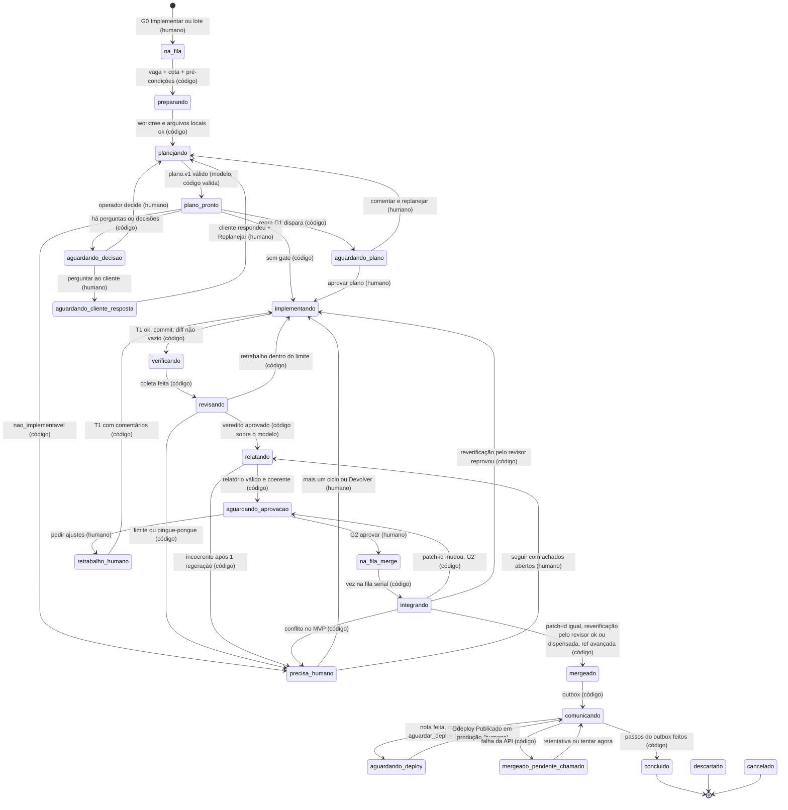
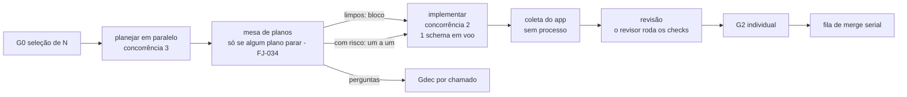

# 03 — Pipeline da execução: estados, gates, lote, merge e outbox

Este documento define o **comportamento do pipeline da Forja** para um chamado: a máquina de estados de `execucao` (1 chamado × tentativa), quem decide cada transição (código, modelo ou humano), os turnos da sessão condutora, os gates humanos, a verificação (feita pelo agente; o app só coleta e registra, FJ-032), os ciclos de retrabalho e seus limites, o lote e o freio de cota, a fila de merge serial, o outbox para o Chamados, a intervenção humana (pausar, conversar, Assumir, Devolver) e os modos de falha com a recuperação de cada um.

Escopo relacionado (não duplicado aqui):

- Processos, runner da CLI, flags exatas de cada perfil, parser do stream e SSE: ver `specs/forja/01-arquitetura.md`.
- Entidades, campos e enums de persistência (`execucao`, `etapa`, `item_fila_merge`, `outbox_chamado`, `uso_assinatura`…): ver `specs/forja/02-modelo-de-dados.md`.
- Prompts, `--agents`, contratos `plano.v1`/`resumo_impl.v1`/`veredito.v1`/`relatorio.v1`/`resposta.v1`, selos e validador de linguagem: ver `specs/forja/04-agentes-e-contratos.md`.
- Modelo de ameaças, perfil sem sandbox, modo reforçado (sandbox da CLI; o `bwrap` ficou sem uso com FJ-032): ver `specs/forja/05-seguranca.md`.
- Telas (Fila, Execução, Aprovação, Mesa de planos, Fila de merge, Terminal): ver `specs/forja/06-ui-ux.md`.
- Contrato de cada chamada à API do Chamados, marcadores das notas da IA, polling e D-036: ver `specs/forja/07-integracao-chamados.md`.

Convenção: **[V]** = verificado (fonte entre parênteses: `01 §n` = pesquisa da CLI, `02 §n` = pesquisa da API, `04 §n` = mecânica local, `critica Fn` = fato da crítica); **[NV]** = a validar, sempre com o spike (S1–S10, `specs/forja/08-roadmap.md`) e o plano B.

---

## 1. Princípios da máquina

1. **O app decide _se_ avança; o modelo decide _como_ trabalha** (F-01/F-02). Todo avanço de estado é uma regra em código sobre fatos persistidos (exit code, `structured_output` validado, `sha`, `patch-id`, clique humano). Saída de modelo é insumo, nunca gatilho direto.
2. **Nada irreversível sai de um agente.** Merge, push, mensagem pública e mudança de status no Chamados são feitos só pelo app, só depois de G2.
3. **SQLite + git são a verdade.** Nada que um agente possa editar (worktree, arquivos de contexto) decide estado. Contexto chega aos agentes por stdin, montado do SQLite.
4. **Toda transição grava um `evento`** com origem (`codigo`, `modelo`, `humano`), estado de saída e de chegada, e motivo. Estados laterais gravam `estado_anterior` para o retorno.
5. **Uma execução por chamado em voo.** Nova tentativa só depois de a anterior chegar a estado terminal (`concluido`, `descartado`, `cancelado`).

---

## 2. Máquina de estados de `execucao`

### 2.1 Diagrama (fluxo principal)



Não desenhados (valem para qualquer estado não terminal anterior a `mergeado`): `→ descartado` e `→ cancelado` (humano) e os estados laterais de §2.3. `resolvendo_conflito` existe no glossário mas **não é alcançável no MVP** (resolvedor automático = Fase 3; conflito vai a `precisa_humano`).

**Prints antes/depois sem estado novo** (FJ-026; FJ-030, 2026-10-03): quem fotografa é o **condutor** dentro do T1 (bloco B7: `antes` antes de alterar qualquer arquivo, `depois` ao fim), e a etapa `evidenciar` do app vira uma **coleta** dentro de `verificando` (que, desde FJ-032, é toda ela coleta: o app não roda comandos). Ela não decide transição: captura impossível vira `execucao.evidencia_visual`, nunca `precisa_humano` antes do G2 (§5.4).

### 2.2 Semântica dos estados

| Estado                        | Significado                                                                                                                                                                         | Recurso preso                      | Terminal |
| ----------------------------- | ----------------------------------------------------------------------------------------------------------------------------------------------------------------------------------- | ---------------------------------- | -------- |
| `na_fila`                     | Selecionado pelo humano, esperando vaga, cota ou ordem do lote                                                                                                                      | —                                  | não      |
| `preparando`                  | App relê o chamado, confere pré-condições (§4.1), cria a worktree e copia `arquivos_locais`; sem `setup` nem linha de base (FJ-032, 2026-10-03)                                     | —                                  | não      |
| `planejando`                  | Processo do `planejador` (Fable, só leitura) em execução ou retomado                                                                                                                | `planejadores`                     | não      |
| `plano_pronto`                | Transitório: app valida o plano e avalia as regras de gate                                                                                                                          | —                                  | não      |
| `aguardando_plano`            | **G1**: plano à espera de aprovação (individual ou na mesa de planos)                                                                                                               | —                                  | não      |
| `aguardando_decisao`          | **Gdec**: plano trouxe `perguntas_ao_cliente` e/ou `decisoes_do_operador`                                                                                                           | —                                  | não      |
| `aguardando_cliente_resposta` | Pergunta publicada; chamado em `aguardando_cliente`; polling esperando resposta                                                                                                     | —                                  | não      |
| `implementando`               | Turno **T1** do condutor (despacha `implementador` Opus); com UI prevista, o condutor tira os prints `antes`/`depois` (B7, §5.4)                                                    | `agentes` (+ `schema`, §7.3)       | não      |
| `verificando`                 | **Coleta** do app, instantânea e sem processo (FJ-032, 2026-10-03): commit, `sha_verificado`, selos, evidências visuais (§5.4) e os comandos que o T1 rodou, lidos do stream (§5.1) | —                                  | não      |
| `revisando`                   | Turno **T2** do condutor (despacha revisores Opus, que rodam os checks do projeto, §5.1)                                                                                            | `agentes`                          | não      |
| `relatando`                   | Turno **T3** do condutor (`relatorio.v1`) + validação cruzada                                                                                                                       | `agentes`                          | não      |
| `aguardando_aprovacao`        | **G2** (ou **G2'** após mudança de `patch-id`)                                                                                                                                      | —                                  | não      |
| `retrabalho_humano`           | Transitório: comentários de G2 viram entrada do próximo T1                                                                                                                          | —                                  | não      |
| `na_fila_merge`               | Aprovado; aguardando a vez na fila serial `(projeto, branch_destino)`                                                                                                               | —                                  | não      |
| `integrando`                  | Fila de merge processando o item (§8); com reverificação pelo revisor quando a regra de §8.1 exige                                                                                  | `merge` do destino                 | não      |
| `resolvendo_conflito`         | Fase 3: resolvedor de conflito textual                                                                                                                                              | —                                  | não      |
| `mergeado`                    | Ref de destino avançada e registrada; transitório para o outbox                                                                                                                     | —                                  | não      |
| `comunicando`                 | Outbox executando os passos (§9)                                                                                                                                                    | —                                  | não      |
| `mergeado_pendente_chamado`   | Merge feito, Chamados não respondeu; retentativa com backoff                                                                                                                        | —                                  | não      |
| `aguardando_deploy`           | **Gdeploy**: nota interna feita; pública e status retidos                                                                                                                           | —                                  | não      |
| `concluido`                   | Outbox completo                                                                                                                                                                     | —                                  | **sim**  |
| `precisa_humano`              | Pipeline parou por regra; `motivo_estado` diz por quê e quais ações valem                                                                                                           | libera tudo, menos `schema` (§7.3) | não      |
| `descartado`                  | Humano rejeitou o trabalho desta tentativa; chamado segue aberto no Chamados                                                                                                        | —                                  | **sim**  |
| `cancelado`                   | Encerrada sem trabalho a preservar (desistência antes de `implementando`) ou porque o chamado foi encerrado no servidor                                                             | —                                  | **sim**  |

### 2.3 Estados laterais

Laterais suspendem o fluxo e voltam para `estado_anterior` (ou para o início da etapa interrompida).

| Lateral           | Entra quando                                                                                                                                                                                             | Sai para                                      |
| ----------------- | -------------------------------------------------------------------------------------------------------------------------------------------------------------------------------------------------------- | --------------------------------------------- |
| `pausado_usuario` | Humano clica Pausar (§10)                                                                                                                                                                                | `estado_anterior` ao clicar Retomar           |
| `pausado_cota`    | Etapa falhou por limite da assinatura ou overage não autorizado (§7.6)                                                                                                                                   | início da etapa, após `resetsAt` (automático) |
| `assumido_manual` | Humano clica Assumir (§10)                                                                                                                                                                               | `verificando` ao clicar Devolver              |
| `interrompido`    | Processo morreu sem `result` sem ter sido pedido (crash do app, SIGKILL, OOM). Timeout da etapa não é interrupção: vai a `precisa_humano` (§6)                                                           | retomada da etapa (§3.3)                      |
| `falhou`          | Erro de infraestrutura: spawn, git, criação da worktree, compatibilidade da CLI, reverificação pelo revisor que não concluiu na fila de merge (FJ-032), saída estruturada inválida após 1 nova tentativa | início da etapa ao clicar Tentar de novo      |

### 2.4 Tabela de transições

| De                                                              | Para                          | Decide                       | Condição exata                                                                                                                                                                                                                                                                                                                                         |
| --------------------------------------------------------------- | ----------------------------- | ---------------------------- | ------------------------------------------------------------------------------------------------------------------------------------------------------------------------------------------------------------------------------------------------------------------------------------------------------------------------------------------------------ |
| (fila do Chamados)                                              | `na_fila`                     | Humano                       | Clique em Implementar ou Implementar em lote (G0). Nunca automático                                                                                                                                                                                                                                                                                    |
| `na_fila`                                                       | `preparando`                  | Código                       | Vaga no semáforo da etapa ∧ freio de cota liberado (§7.6) ∧ ordem do lote respeitada ∧ CLI compatível                                                                                                                                                                                                                                                  |
| `na_fila`                                                       | `cancelado`                   | Humano                       | Desistir antes de começar                                                                                                                                                                                                                                                                                                                              |
| `preparando`                                                    | `planejando`                  | Código                       | Pré-condições de §4.1 ok ∧ worktree criada ∧ `arquivos_locais` copiados. Sem `setup` nem linha de base: a Forja não roda comandos do projeto (FJ-032, 2026-10-03)                                                                                                                                                                                      |
| `preparando`                                                    | `precisa_humano`              | Código                       | Pré-condição falhou (ex.: status não implementável; nunca `ia_silenciada`, FJ-031). `base_vermelha` não existe mais (FJ-032, 2026-10-03)                                                                                                                                                                                                               |
| `planejando`                                                    | `plano_pronto`                | Modelo produz, código valida | Último `result` sem erro ∧ `structured_output` válido contra `plano.v1` ∧ `criterios_de_aceite` ≥ 1                                                                                                                                                                                                                                                    |
| `plano_pronto`                                                  | `precisa_humano`              | Código                       | `natureza_confirmada = nao_implementavel`                                                                                                                                                                                                                                                                                                              |
| `plano_pronto`                                                  | `aguardando_decisao`          | Código                       | `perguntas_ao_cliente` ou `decisoes_do_operador` não vazio (precede G1)                                                                                                                                                                                                                                                                                |
| `plano_pronto`                                                  | `aguardando_plano`            | Código                       | Regra G1 (§4)                                                                                                                                                                                                                                                                                                                                          |
| `plano_pronto`                                                  | `implementando`               | Código                       | Nenhuma das anteriores. Se o plano prevê UI, o prompt do T1 leva o bloco B7 (prints pelo condutor, §5.4)                                                                                                                                                                                                                                               |
| `aguardando_decisao`                                            | `aguardando_cliente_resposta` | Humano                       | Aprova a pergunta (texto validado, 04); app publica e move o chamado para `aguardando_cliente`                                                                                                                                                                                                                                                         |
| `aguardando_decisao`                                            | `planejando`                  | Humano                       | Responde as decisões (ou aceita a `suposicao_padrao`); planejador retomado com a resposta marcada como decisão do operador                                                                                                                                                                                                                             |
| `aguardando_cliente_resposta`                                   | `planejando`                  | Humano                       | Polling viu mensagem pública nova do cliente (badge "cliente respondeu") ∧ humano clica Replanejar; o app então leva o chamado a `em_atendimento` (§11, linha F14/F15; chamadas em `07-integracao-chamados.md` §8.2)                                                                                                                                   |
| `aguardando_plano`                                              | `implementando`               | Humano                       | Aprovar (o plano editado vira a versão oficial). No lote, aprovação em bloco só de planos limpos (§7.4). Com UI prevista, B7 como na linha de `plano_pronto` (§5.4)                                                                                                                                                                                    |
| `aguardando_plano`                                              | `planejando`                  | Humano                       | Comentar: planejador retomado com o comentário                                                                                                                                                                                                                                                                                                         |
| `implementando`                                                 | `verificando`                 | Código                       | Processo saiu com último `result` sem erro ∧ `resumo_impl.v1` válido ∧ commit do app feito ∧ `git diff sha_base..HEAD` não vazio                                                                                                                                                                                                                       |
| `implementando`                                                 | `precisa_humano`              | Código                       | Diff vazio, impedimento declarado em `resumo_impl.v1`, `error_max_budget_usd` [V 01 §8], timeout da etapa, teto por chamado                                                                                                                                                                                                                            |
| `verificando`                                                   | `revisando`                   | Código                       | Coleta feita (FJ-032, 2026-10-03): commit do app, `sha_verificado = HEAD`, selos, token de schema imprevisto, evidências confirmadas no `sha` com qualquer resultado (prints nunca bloqueiam, §5.4) e etapa `verificar` registrada com os comandos do T1 lidos do stream (informativos). Sempre, salvo a linha abaixo                                  |
| `verificando`                                                   | `precisa_humano`              | Código                       | Sentinela divergente (05 §4.9) ou `HEAD` fora da branch da execução. Sem `ciclos_esgotados` por verificação nem pingue-pongue (b) de comandos (FJ-032, 2026-10-03)                                                                                                                                                                                     |
| `revisando`                                                     | `relatando`                   | Código sobre o veredito      | `decisao = aprovado` ∧ 0 achados `bloqueante` ∧ todo critério `atendido` ou `nao_verificavel` com justificativa ∧ `HEAD == sha_verificado` ∧ worktree limpa. Na mesma transição o app grava `nivel_verificacao` (§5.3), que **não** bloqueia (FJ-032)                                                                                                  |
| `revisando`                                                     | `implementando`               | Código                       | Reprovado ∧ `ciclo_auto` < `max_ciclos_auto` ∧ `ciclo_total` < `max_ciclos_total` ∧ sem pingue-pongue                                                                                                                                                                                                                                                  |
| `revisando`                                                     | `precisa_humano`              | Código                       | Limite, pingue-pongue, `decisao = bloqueado`, ou a revisão alterou a worktree                                                                                                                                                                                                                                                                          |
| `relatando`                                                     | `aguardando_aprovacao`        | Código                       | `relatorio.v1` válido ∧ coerente com os selos (04) ∧ `resposta.v1` passa no validador ou violação marcada para G2                                                                                                                                                                                                                                      |
| `relatando`                                                     | `precisa_humano`              | Código                       | Incoerência com os selos após 1 regeração                                                                                                                                                                                                                                                                                                              |
| `aguardando_aprovacao`                                          | `na_fila_merge`               | Humano                       | Aprovar (um clique, sem exigências — FJ-034, 2026-10-03): grava `patch_id`, `sha`, texto da resposta, opções de status, a última mensagem nova do cliente mostrada (`ciente_mensagem_id`) e `aprovado_sem_prints` como fato; recusa só dado velho (relatório/patch/sha/mensagem chegada depois de abrir → 409) ou resposta com violação não confirmada |
| `aguardando_aprovacao`                                          | `retrabalho_humano`           | Humano                       | Pedir ajustes com comentário                                                                                                                                                                                                                                                                                                                           |
| `aguardando_aprovacao`                                          | `assumido_manual`             | Humano                       | Testar/Assumir no terminal                                                                                                                                                                                                                                                                                                                             |
| `retrabalho_humano`                                             | `implementando`               | Código                       | Sempre; `ciclo_total` += 1 (não conta em `ciclo_auto`)                                                                                                                                                                                                                                                                                                 |
| `na_fila_merge`                                                 | `integrando`                  | Código                       | Item é o próximo da fila do destino ∧ semáforo `merge` livre                                                                                                                                                                                                                                                                                           |
| `integrando`                                                    | `mergeado`                    | Código                       | Integração limpa ∧ `patch-id` igual ao aprovado ∧ (reverificação dispensada ∨ reverificação pelo revisor aprovada sem bloqueante, §8.1) ∧ ref avançada (CAS ou push aceito) ∧ registrado                                                                                                                                                               |
| `integrando`                                                    | `aguardando_aprovacao`        | Código                       | `patch-id` integrado ≠ aprovado (G2', com interdiff)                                                                                                                                                                                                                                                                                                   |
| `integrando`                                                    | `implementando`               | Código                       | Reverificação pelo revisor reprovada ou bloqueada (`reverificacao_vermelha`, FJ-032): o app integra o destino na branch do chamado e abre T1 com as instruções do revisor; `ciclo_total` += 1                                                                                                                                                          |
| `integrando`                                                    | `falhou`                      | Código                       | `setup_falhou`: base/remoto da integração falhou ou o turno de reverificação pelo revisor não concluiu (timeout, orçamento, saída inválida…); "Tentar de novo" reenfileira (FJ-032, 2026-10-03; `verificacao_ambiente` não é mais escrito)                                                                                                             |
| `integrando`                                                    | `precisa_humano`              | Código                       | Conflito textual ou de schema (MVP); push recusado 3× seguidas; cópia local suja em `merge_local` além do tempo de espera                                                                                                                                                                                                                              |
| `mergeado`                                                      | `comunicando`                 | Código                       | Sempre                                                                                                                                                                                                                                                                                                                                                 |
| `comunicando`                                                   | `aguardando_deploy`           | Código                       | Projeto com `ao_concluir = aguardar_deploy` ∧ passo `nota_interna` feito                                                                                                                                                                                                                                                                               |
| `aguardando_deploy`                                             | `comunicando`                 | Humano                       | Gdeploy "Publicado em produção" (aceita vários chamados)                                                                                                                                                                                                                                                                                               |
| `comunicando`                                                   | `mergeado_pendente_chamado`   | Código                       | Passo falhou por rede, 5xx ou 401 após relogin                                                                                                                                                                                                                                                                                                         |
| `mergeado_pendente_chamado`                                     | `comunicando`                 | Código ou humano             | Próxima tentativa do backoff ou "tentar agora"                                                                                                                                                                                                                                                                                                         |
| `comunicando`                                                   | `concluido`                   | Código                       | Todos os passos `enviado` ou `pulado`                                                                                                                                                                                                                                                                                                                  |
| `aguardando_decisao`, `aguardando_cliente_resposta`             | `precisa_humano`              | Código                       | O Chamados recusou (`409`/`403`) a transição da pergunta ou do Replanejar (`transicao_recusada`; §11) (implementação, 2026-10-02/03)                                                                                                                                                                                                                   |
| `precisa_humano`                                                | `aguardando_aprovacao`        | Humano                       | `relatorio_incoerente` (só linhas anteriores a FJ-034, 2026-10-03, que segue ao G2 com aviso): o humano edita o relatório (o app registra a edição; §11) (implementação, 2026-10-02/03)                                                                                                                                                                |
| `precisa_humano`                                                | `na_fila_merge`               | Humano                       | `push_recusado`: "tentar de novo mais tarde" com a aprovação ainda vigente (a ação `mais_um_ciclo` vira `tentar_merge_de_novo`) (implementação, 2026-10-02/03)                                                                                                                                                                                         |
| `falhou`                                                        | `assumido_manual`             | Humano                       | Assumir (`falhou` está entre os estados assumíveis, §10) (implementação, 2026-10-02/03)                                                                                                                                                                                                                                                                |
| antes de `mergeado` (exceto `assumido_manual`/`precisa_humano`) | `precisa_humano`              | Código                       | Polling: `chamado_mudou_no_servidor` (implementação, 2026-10-02/03). `ia_servidor_ativa` não é mais emitido: sinais da IA do servidor são só informativos (FJ-031, 2026-10-03; o motivo fica para linhas antigas)                                                                                                                                      |
| `precisa_humano`                                                | vários                        | Humano                       | Ações oferecidas conforme `motivo_estado`: mais um ciclo com instrução (→ `implementando`), Assumir, seguir com achados abertos (→ `relatando`), replanejar (→ `planejando`, só antes de existir commit), Encerrar (→ `cancelado`), Descartar (→ `descartado`)                                                                                         |
| qualquer não terminal antes de `mergeado`                       | `descartado`                  | Humano                       | Descartar (nota interna opcional no chamado)                                                                                                                                                                                                                                                                                                           |
| `mergeado` em diante                                            | —                             | —                            | Não há descarte: o código já está no destino. Desfazer = Fase 3 (`revert -m 1` com novo ciclo de aprovação)                                                                                                                                                                                                                                            |

### 2.5 Invariantes

- **Veredito e nível de verificação valem só para o `sha` em que foram produzidos.** Qualquer commit novo invalida ambos (volta a `verificando`).
- **O print `depois` vale só para o `sha_verificado` em que foi coletado** (FJ-026). Novo ciclo, Devolver ou retrabalho mudam o `sha_verificado` → o condutor refaz o `depois` no T1 (B7), o app coleta de novo no próximo `verificando` e `evidencia_visual` é recalculado (FJ-030). O `antes` coletado é reaproveitado, porque `sha_base` não muda dentro da execução. A reverificação pelo revisor na fila de merge (§8.1) **não** recoleta: o humano aprovou os prints do `sha` que viu.
- **A aprovação vale só para o `patch-id` aprovado.** O `patch-id` é calculado sobre `git diff -U0 <base>..<sha>` com `git patch-id --stable`, insensível a número de linha e contexto: mudança só de contexto no destino não força G2' [V S9: o `patch-id` da integração refeita sobre um `T0` que andou (corrida com outro push) é igual ao aprovado].
- Depois de `mergeado` nenhum estado volta para trás no pipeline. O que sobra é comunicação.
- `precisa_humano` nunca é saída silenciosa: o `execucao.motivo_estado` (`02-modelo-de-dados.md` §4.6) traz um código da lista fechada `motivo_estado` (enumerada em `02-modelo-de-dados.md` §2) e cada motivo tem as ações válidas listadas na UI (06).
- **Sentinela de integridade** (`05-seguranca.md` §4.9): divergência antes/depois de uma etapa com Bash (inclui os checks que o agente roda, FJ-032) → `precisa_humano` com `motivo_estado = sentinela_divergente` e o diff gravado em `execucao.sentinela`; a fila de merge e o outbox **do projeto** ficam travados até a ação humana **Reconhecer** (grava `sentinela.reconhecida_em`), que destrava sem desfazer nada.

---

## 3. Sessões e turnos

### 3.1 Planejador (sessão própria)

Processo `claude -p` do papel `planejador` (perfil só leitura, F-03; flags em 01). Ele lê o **dado bruto** (chamado, anexos, notas da IA do servidor) delimitado como dado e devolve `plano.v1`. A sessão do planejador é **separada** da condutora e é retomada (`--resume`) só antes da implementação: comentário em G1, decisão do operador em Gdec, resposta do cliente. Depois do primeiro commit não se replaneja: mudança de escopo é "Pedir ajustes" (T1) ou nova tentativa.

### 3.2 Sessão condutora: turnos T1, T2, T3

Uma `session_id` Fable por execução (F-02), gerada pelo app antes do primeiro spawn (`--session-id`). Cada turno é um processo `claude -p` próprio que termina com o `--json-schema` daquele turno. Trocar o schema entre `--resume` funciona e mantém a memória da sessão [V critica F2]. Com `CLAUDE_CODE_DISABLE_BACKGROUND_TASKS=1` há **um único `result` por processo** [V critica F10]: fim do turno = saída do processo + último `result`.

| Turno              | Estado          | Entrada (stdin, montada do SQLite)                                                                                                                                                                                                                               | Perfil                                                                                                                                                                                              | Saída                                     | O app depois                                                                                      |
| ------------------ | --------------- | ---------------------------------------------------------------------------------------------------------------------------------------------------------------------------------------------------------------------------------------------------------------- | --------------------------------------------------------------------------------------------------------------------------------------------------------------------------------------------------- | ----------------------------------------- | ------------------------------------------------------------------------------------------------- |
| **T1 implementar** | `implementando` | Plano oficial; decisões do operador; no retrabalho, `instrucoes_para_retrabalho` + achados ou comentários de G2; "estado atual" (commits, `diff --stat`); scripts encontrados como **dicas** e a ordem de instalar dependências e rodar os checks (FJ-032, §5.1) | Condutor com escrita, `--dangerously-skip-permissions` + `deny` (F-04)                                                                                                                              | `resumo_impl.v1`                          | Commit final, diff não vazio, → `verificando` (coleta)                                            |
| **T2 revisar**     | `revisando`     | Plano; faixa `sha_base..sha_verificado` (os revisores leem o diff com `git diff`, `01-arquitetura.md` §6.2) e `diff --stat`; comandos que o T1 rodou (do stream, informativos) e scripts encontrados (dicas); a ordem de rodar os checks sobre o diff (FJ-032)   | Só leitura no código; Bash em `dontAsk` com allow de `git diff/log/show` e dos executores de script (FJ-032, §5.1) (o resume não restaura `--settings`/`--tools` [V 01 §3]; cada turno passa o seu) | `veredito.v1` (com `comandos_executados`) | Confere `HEAD == sha_verificado` e worktree limpa; calcula o nível (§5.3); aplica a regra de §2.4 |
| **T3 relatar**     | `relatando`     | Plano, vereditos, nível de verificação e comandos relatados, selos e campos ⚙ calculados (inclui as telas coletadas e `evidencia_visual` com o motivo, FJ-026)                                                                                                   | Só leitura                                                                                                                                                                                          | `relatorio.v1` (com `resposta.v1`)        | Validação cruzada (04); regeração 1× com o apontamento                                            |

- O retrabalho é **T1 de novo na mesma sessão**: o Fable lembra das tentativas anteriores. O Fable decide como dividir os passos e se reitera um implementador dentro do turno. O app decide se o resultado avança.
- **Processo frio refutado** [V S5]: o cache do prompt é do servidor e atravessa processos — um 2º processo novo com o mesmo prefixo leu 6,5 k tokens do cache e custou ~7 % do 1º, e o `--resume` também lê do cache (o experimento da critica F3 tinha prefixo diferente). O custo do retrabalho continua real (contexto da sessão cresce) e entra na telemetria por turno; atenção: `total_cost_usd`/`modelUsage` do `result` vêm **acumulados da sessão** e o app grava o delta (`01-arquitetura.md` §6.5).
- Telemetria: se `modelUsage`/`subagent_stats` mostram edição feita pelo condutor (e não por `implementador`), o feed marca "condutor editou diretamente". **Isso não muda estado** (o diff passa pela mesma coleta e revisão).

### 3.3 Checkpoints e retomada

- **Commit por passo** (F-08): quando o stream mostra o `tool_result` de um `Agent` do tipo `implementador` e **não há outro implementador em voo**, o app faz `git -c core.hooksPath=/dev/null commit -A` com a mensagem `forja: passo <id>`. Disputa de `index.lock` com um `git status` do agente → nova tentativa após 1 s (até 5).
- **Retomada após `interrompido`**: (1) `--resume <session_id>` com `CLAUDE_CODE_RESUME_INTERRUPTED_TURN=1` e o schema do turno [V 01 §2.3; V S4: SIGINT no meio do turno sai em ~0,5 s com 1 `result` `error_during_execution`/`aborted_streaming`, e o resume com schema trocado continua do passo seguinte sem refazer os anteriores]; (2) se falhar (erro, sessão ilegível, `result` incoerente), **sessão nova** com prompt "estado atual" montado do SQLite, dos commits e dos artefatos. A execução passa a apontar para a nova sessão e a antiga fica no histórico.
- Antes de qualquer retomada, o app commita o que estiver no disco (`forja: recuperado após interrupção`) **somente se a árvore mudou** (`git status --porcelain` não vazio). Se houve commit, o `sha` mudou e o veredito/nível anteriores ficam inválidos por §2.5 — é o desejado, porque o diff não é mais o avaliado; se nada mudou, não há commit e o veredito permanece válido. O disco é o ponto de partida, não a memória da sessão.
- Retomada automática: **1 vez** por etapa, no boot ou ao fim do backoff. Uma segunda interrupção na mesma etapa → `precisa_humano`.

> DECISÃO PENDENTE: a retomada automática após crash fica ligada por padrão (bom para lote noturno) ou só manual (o humano confere o feed antes)? Default adotado aqui: automática 1×, configurável por projeto.

---

## 4. Gates humanos (F-11)

| Gate                   | Dispara                                                                                                                                                                                                                                                                                                                                                                     | Ações                                                       | Amarrado a                                    |
| ---------------------- | --------------------------------------------------------------------------------------------------------------------------------------------------------------------------------------------------------------------------------------------------------------------------------------------------------------------------------------------------------------------------- | ----------------------------------------------------------- | --------------------------------------------- |
| **G0 Seleção**         | Sempre (nada começa sozinho)                                                                                                                                                                                                                                                                                                                                                | Implementar, Implementar em lote                            | Snapshot do chamado (status, última mensagem) |
| **G1 Plano**           | Configuração `gates.plano`: `sempre`; `nunca` (**padrão desde FJ-034**: só `alertas_seguranca` para; os demais riscos viram `plano.avisos` ⚙); `por_risco` = `confianca ≠ alta` **ou** `schema_banco.altera` **ou** complexidade `dificil` **ou** `alertas_seguranca` não vazio. `alertas_seguranca` força G1 **mesmo com `nunca`**. Lote não força G1 (FJ-033, 2026-10-03) | Aprovar (pode editar), Comentar (replaneja), Descartar      | Versão do plano                               |
| **Gdec**               | `perguntas_ao_cliente` ou `decisoes_do_operador` não vazios depois de `assumirDecisoes` (FJ-033)                                                                                                                                                                                                                                                                            | Perguntar ao cliente (texto validado), Eu decido, Desistir  | Versão do plano                               |
| **G2 Aprovação final** | **Sempre**, individual no MVP (nunca em bloco). **Sem exigências** (FJ-034, 2026-10-03): mensagem nova, prints incompletos, achados, conflito previsto, sensíveis e riscos do plano são avisos (`avisosG2`)                                                                                                                                                                 | Aprovar e mergear, Pedir ajustes, Testar/Assumir, Descartar | `patch-id` + `sha`                            |
| **G2' Reaprovação**    | `patch-id` mudou depois de G2                                                                                                                                                                                                                                                                                                                                               | Iguais a G2, com interdiff `sha_aprovado..sha_novo`         | Novo `patch-id`                               |
| **Gdeploy**            | Projeto com `ao_concluir = aguardar_deploy`                                                                                                                                                                                                                                                                                                                                 | "Publicado em produção" (seleção múltipla)                  | Execuções em `aguardando_deploy`              |

**(FJ-033, 2026-10-03) O planejador decide; suposições vão ao relatório.** Ao registrar o plano (e em `reavaliarPlano`, no reboot entre o plano e o gate), **antes** do Gdec, o app roda `assumirDecisoes` (`server/dominio/gates.ts`, pura): toda pergunta cuja `suposicao_padrao` não comece com "sem suposição" (sem acento, sem caixa) sai de `perguntas_ao_cliente` e entra em `suposicoes` como "Pergunta ao cliente não feita: <pergunta> — assumido: <suposição>"; toda decisão cuja `recomendacao` não comece com "sem recomendação" sai de `decisoes_do_operador` e entra como "Decisão: <questão> — adotado: <recomendação>". Com `suposicoes` cheio (15), a excedente continua pergunta. O plano normalizado é o oficial (em `reavaliarPlano`, se assumiu algo, grava nova versão do artefato). Gdec só para quando o planejador disser explicitamente que não há suposição/recomendação razoável (dano difícil de desfazer). O G1 deixa de ter o motivo `em_lote` (fica no enum só para artefatos antigos): no lote vale a mesma regra por risco, e a mesa de planos (§7.4) recebe quem caiu no gate.

**(FJ-034, 2026-10-03) Dois cliques.** A interação humana obrigatória de uma execução é exatamente **duas**: Implementar (G0) e Aprovar e mergear (G2); toda outra parada só existe por mérito (o que a IA não pode resolver), nunca por processo. (1) **G1** com default global `nunca`: em `nunca` só `alertas_seguranca` não vazio para (a tela mostra a citação); `sinais_heuristicos`, `confianca_nao_alta`, `altera_schema`, `complexidade_dificil` e `trabalho_existente` viram `plano.avisos` ⚙ (`avisosPlano`, gravados no plano registrado e exibidos na Execução e na Aprovação); em `por_risco`/`sempre` o comportamento anterior continua. (2) **Gdec** conforme FJ-033. (3) **G2 sem exigências**: `avaliarG2` devolve `avisos` (`avisosG2`: mensagem nova do cliente, relatório divergente, prints incompletos, achados abertos, conflito previsto, arquivos sensíveis, riscos do plano, reaprovação, patch curto informativo) e só recusa dado velho (relatório, `patch_id`, `sha`, mensagem do cliente chegada depois de a tela abrir → 409, a tela recarrega) ou resposta pública com violação não confirmada (F-16). `aprovacao.aprovado_sem_prints` passa a ser o fato (`altera_ui` ∧ prints incompletos) e `ciente_mensagem_id`/`ultima_mensagem_ciente_id`, a última mensagem nova mostrada. `gates.exigir_prints_ui` e `gates.exigir_ciente_mensagem_nova` saíram da configuração. (4) **Pausas que ficam** (por mérito): `precisa_humano` por ciclos esgotados/pingue-pongue, conflito de merge, chamado mudou no servidor, impedimento explícito do agente ("sem suposição"), limite de cota; "Tentar de novo" sempre disponível.

> DECIDIDO (2026-10-02): status final `resolvido` (U-1), com o auto-fechamento do servidor em 3 dias. `fechado_imediato` e `aguardar_deploy` são opções por projeto.

### 4.1 Pré-condições de G0 (conferidas de novo em `preparando`)

O app relê o detalhe do chamado e exige **só isto**: status implementável (`em_atendimento`; `aguardando_cliente` só com confirmação explícita; nunca `novo`/`em_triagem`, porque a triagem do servidor pode estar rodando [V 02 §4]); natureza ≠ `duvida`; sistema-alvo mapeado para um projeto; nenhuma execução não terminal do mesmo chamado; conexão com o Chamados válida; branch de destino existente; CLI na versão compatível. Uma branch/PR `ia/chamado-N-*` não bloqueia: vira sinal para o planejador (`trabalho_existente`) e força G1.

> **(FJ-031, 2026-10-03, decisão do usuário):** **não existe pré-condição de `ia_silenciada`** — nem bloqueio, nem "não se sabe", nem confirmação, nem configuração. A IA do servidor é irrelevante para a Forja: quem implementa é o Claude local. A Forja também não silencia nem reativa a IA (§9.1); o estado da IA aparece na fila só como informação (`07-integracao-chamados.md` §7).

---

## 5. Verificação pelo agente; o app coleta e registra (FJ-032)

> DECIDIDO (FJ-032, 2026-10-03, pedido do usuário): "Não pedi pra ter esse typecheck nem unit." **A Forja nunca executa comandos do projeto**: sem `setup`, sem linha de base, sem verificação por comando em `verificando` e sem reverificação por comando na fila de merge. Quem roda os checks é o agente; o app registra o que ele relatou e cruza com o stream. Substitui F-07/FJ-009 (verificação executada pelo app).

### 5.1 Quem faz o quê

| Quem                                  | Quando                                     | O quê                                                                                                                                                                                                                                                                                                                                                                                                                                                                                                                                                                                                                                                                           |
| ------------------------------------- | ------------------------------------------ | ------------------------------------------------------------------------------------------------------------------------------------------------------------------------------------------------------------------------------------------------------------------------------------------------------------------------------------------------------------------------------------------------------------------------------------------------------------------------------------------------------------------------------------------------------------------------------------------------------------------------------------------------------------------------------- |
| Condutor e `implementador` (T1)       | `implementando`                            | O bloco do prompt diz: "o repositório acabou de ser clonado nesta worktree: instale dependências se precisar, rode os checks que o projeto tiver (typecheck, lint, testes, build) e corrija o que quebrar; nunca commite". Os scripts detectados e `avancado.comandos` entram como **dicas** ("Scripts encontrados (dicas; a Forja não os executa)"). O implementador corrige o que ele mesmo rodou: não existe "vermelho volta ao T1 sem revisor"                                                                                                                                                                                                                              |
| App (etapa `verificar`, **coleta**)   | `verificando`, logo após o T1; instantânea | Commit do app, `sha_verificado = HEAD`, selos, token de schema imprevisto, confirmação das evidências visuais no `sha` (§5.4) e registro da etapa `verificar` com `comandos` = os Bash de verificação/instalação que o T1 e os implementadores rodaram, lidos do stream (`resumo_impl.comandos_stream`: `exit_0`/`erro`/`sem_resultado`; informativos, não decidem nada). Sem processo, sem semáforo. Sempre → `revisando`, salvo sentinela divergente ou `HEAD` fora da branch (→ `precisa_humano`)                                                                                                                                                                            |
| Condutor T2 e `revisor_correcao` (T2) | `revisando`                                | Rodam eles mesmos os checks do projeto sobre o diff e relatam **cada** comando com exit code em `veredito.v1.comandos_executados` (`[{comando, exit_code, resumo}]`, obrigatório, pode ser vazio); falhas explicadas em `falhas_de_verificacao`. Check vermelho por causa do diff = reprovação com instrução, e o retrabalho segue §2.4/§6 como qualquer achado. O allow do T2 (`dontAsk`) inclui os executores de script (`npm run *`, `npm test*`, `npm ci*`, `npm install*`, `npx tsc*`, `npx vitest*`, `npx jest*`, `npx eslint*`, `npx prettier*`, `npx playwright*`, `pnpm …`, `yarn …`, `bun …`, `make *`) e os comandos das dicas do projeto (`01-arquitetura.md` §6.2) |
| App                                   | Na transição do veredito                   | Calcula o nível (§5.3) dos comandos relatados × stream do T2 e grava em `execucao.nivel_verificacao`. G2 **não** bloqueia por nível; o relatório e a Aprovação mostram "Como foi verificado" (lista + nível)                                                                                                                                                                                                                                                                                                                                                                                                                                                                    |

- Todo git **do app** continua com `-c core.hooksPath=/dev/null`; a worktree continua sendo só criar + copiar `arquivos_locais` (`.env`).
- Sem sandbox (U-3), os checks executam código escrito pelo agente com o `$HOME` real, agora **dentro do processo do agente** (T1 em bypass; T2 em `dontAsk` com o allow acima). **Fica exposto:** um teste ou script malicioso pode ler `~/.ssh` e usar a rede. **Compensa:** `deny` de push/remoto/segredos, `revisor_seguranca`, sentinela, arquivos sensíveis no topo de G2; no modo reforçado, o sandbox da CLI no T1 (05). O `bwrap` não tem mais comando a confinar.

> DECIDIDO (2026-10-02): agentes sem sandbox, com `--dangerously-skip-permissions` (U-3). Sandbox da CLI = modo reforçado opcional por projeto (o `bwrap` da verificação ficou sem efeito com FJ-032).

### 5.2 Vermelho volta ao condutor, sem revisor (removida por FJ-032)

A Forja não roda mais comandos, então não há vermelho "do app" para devolver ao T1: o implementador corrige no próprio T1 o que ele rodou, e um check vermelho visto pelo revisor vira reprovação no veredito. Saíram a classificação `codigo`/`ambiente`, a re-execução de instáveis, `max_correcoes_verificacao` e o `falhou` por `verificacao_ambiente`.

### 5.3 Níveis de verificação (⚙ app, nunca arredondado para cima; FJ-032)

`calcularNivelVerificacao({ relatados, stream })` (`server/verificacao/niveis.ts`, puro) casa cada comando de `comandos_executados` com um `tool_use` Bash do stream do T2 (thread principal + subagentes): texto normalizado igual ou um contendo o outro (o stream pode ter `cd x && …` ou vir truncado); o `tool_result` com `is_error` falso conta como exit 0. Cada comando registrado ganha `no_stream: exit_0 | erro | nao_visto`.

| Nível                     | Critério objetivo                                                                            |
| ------------------------- | -------------------------------------------------------------------------------------------- |
| `verificado_pelo_revisor` | ≥ 1 comando relatado, e **todos** aparecem no stream com exit 0 e foram relatados com exit 0 |
| `declarado`               | Há comando relatado, mas algum não aparece no stream, diverge do stream ou falhou            |
| `nao_verificado`          | Nenhum comando relatado                                                                      |

- **Obsoletos** (só linhas antigas, nunca escritos): `e2e_automatizado`, `e2e_roteiro`, `verificacao_estatica`.
- G2 **não** bloqueia por nível: o humano vê a lista de comandos (com exit code e "visto no stream") e decide.
- Projeto sem e2e (U-7): o relatório continua declarando "não testado ponta a ponta" para cada critério com `verificacao = e2e` que nenhum comando relatado exercitou.
- O nível que vai para a nota interna é o do **`sha` mergeado**: o recalculado no turno de reverificação pelo revisor (§8.1), se houve; senão o de G2.
- **Prints não são teste.** A evidência visual (§5.4) mostra a tela; ela não exercita critério de aceite e **não** eleva o nível de verificação. `evidencia_visual` é um eixo separado.

### 5.4 Evidência visual: prints antes/depois (FJ-026; tirados pelo agente, FJ-030)

> DECIDIDO (2026-10-02, pedido do usuário): "Quando o chamado incluir alteração no frontend/UI, o relatório final deve conter prints do ANTES e do DEPOIS da alteração." Gatilho: selo `altera_ui` (`detectores.frontend` ∨ `plano.areas` ∋ `ui`, `04-agentes-e-contratos.md` §7).
>
> DECIDIDO (FJ-030, 2026-10-03, pedido do usuário): "Evidências visuais, tem muita configuração também, deve ser automático, a IA roda como quiser." **Quem sobe o app, faz login e fotografa é o condutor do T1**, do jeito que achar melhor; o app **só coleta e valida**. Não há `app_subir`/`healthcheck` obrigatório, login gravado, viewport/tema configurados nem DSL de passos.

**Quem faz o quê.**

| Quem                               | Quando                                                                                                                                                                                            | O quê                                                                                                                                                                                                                                                                                                                                                                                                                                                                                                                                                                   |
| ---------------------------------- | ------------------------------------------------------------------------------------------------------------------------------------------------------------------------------------------------- | ----------------------------------------------------------------------------------------------------------------------------------------------------------------------------------------------------------------------------------------------------------------------------------------------------------------------------------------------------------------------------------------------------------------------------------------------------------------------------------------------------------------------------------------------------------------------- |
| Condutor (T1, bloco B7)            | **Todo** T1 (FJ-031, 2026-10-03), com linguagem condicional: "se a sua implementação alterar qualquer tela/componente visual…; se não alterar UI, escreva `telas.json` com `nao_se_aplica: true`" | (1) **Antes de alterar qualquer arquivo**: sobe a aplicação como achar melhor (README, `package.json`, `.env` de dev da worktree, `avancado.comandos.app_subir` se houver, porta livre), faz login se precisar (cria ou usa um usuário de dev) e fotografa cada tela que vai mudar com `forja-print`. (2) Depois de implementar e verificar: fotografa as **mesmas** telas (mesma rota, estado e viewport) e as telas novas. (3) Escreve `telas.json`. (4) Derruba o app. Não conseguiu subir ou logar → `telas.json` com `motivo_geral` honesto, nunca print inventado |
| App (etapa `evidenciar`, "coleta") | Em `verificando` (a coleta, §5.1), se `altera_ui`                                                                                                                                                 | Lê `telas.json`, valida cada PNG, calcula `evidencia_visual` e grava os artefatos `evidencia` (`02-modelo-de-dados.md` §4.9) e `etapa.telas` (§4.7). Não sobe app nem navegador                                                                                                                                                                                                                                                                                                                                                                                         |

**`forja-print`** (`server/scripts/forja-print.mjs`): `node $FORJA_PRINT <url> <saida.png> [--viewport 1366x768] [--espera <ms>|<seletor>] [--storage <state.json>] [--full]`. Usa o Playwright/Chromium **da Forja** (o repositório-alvo não precisa ter Playwright; o Chromium é lançado pelo `executablePath` do headless shell instalado, FJ-028). O caminho absoluto vai no prompt (B7) e no env `FORJA_PRINT` do T1. É conveniência: o agente pode usar o Playwright direto se preferir.

**`telas.json`** (em `<dados>/execucoes/<id>/evidencias/`, caminho absoluto no B7; os PNGs em `antes/` e `depois/` ao lado):

```ts
type TelasJson =
  | Array<{
      id: string; // `UI<n>`: reaproveita os ids de `plano.telas_afetadas`; tela nova ganha o próximo
      descricao: string;
      rota: string; // relativa (sem host)
      antes: `antes/${string}.png` | null;
      depois: `depois/${string}.png` | null;
      motivo_sem_antes?: string; // obrigatório com `antes: null` (tela nova, mudança fora do plano…)
    }>
  | { motivo_geral: string; telas?: [] } // não conseguiu subir o app ou logar
  | { nao_se_aplica: true }; // FJ-031: a implementação não altera UI
```

As telas de `plano.telas_afetadas` (`id`, `descricao`, `rota`, `estado_esperado`) são **dica** ao condutor; a lista coletada é a de `telas.json`.

**Coleta e validação pelo app** (sem processo externo; roda no fim de `verificando`):

1. `telas.json` ausente ou inválido no zod → `sem_evidencia_visual` com o motivo "o agente não registrou os prints". **`{ nao_se_aplica: true }`** (sem telas) → `nao_se_aplica`; se o selo `altera_ui` ligar mesmo assim (arquivo de frontend no diff ou `areas` ∋ `ui`), → `sem_evidencia_visual` com o motivo "o agente declarou não alterar UI, mas o diff toca <arquivos>" (FJ-031, 2026-10-03). A coleta roda no fim de todo T1 com `telas.json` e é confirmada no fim de `verificando` com os arquivos do selo.
2. Para cada PNG referenciado: caminho dentro de `evidencias/` (sem `..`), **magic bytes** de PNG, tamanho > 0 e dimensões lidas do cabeçalho (IHDR). Falhou → `png_invalido` na tela.
3. **Prova de momento do `antes`**: o `mtime` do arquivo `antes/*` tem de ser **anterior ao primeiro checkpoint** da execução (o primeiro commit do app, §3.3), o que mostra que foi tirado no `sha_base`. Senão a tela fica marcada `antes_suspeito` (o print pode já mostrar a mudança).
4. Grava um `artefato` `evidencia` por tela × momento; o `antes` é coletado uma vez e reaproveitado nos ciclos seguintes; o `depois` é coletado de novo a cada `sha_verificado`.

**No retrabalho** (novo T1 na mesma sessão), o B7 manda refazer **só** o `depois`; o `antes` coletado continua valendo.

**Resultado** → `execucao.evidencia_visual` + `evidencia_visual_motivo` (⚙):

| Situação                                                                                                           | Nível                  |
| ------------------------------------------------------------------------------------------------------------------ | ---------------------- |
| `altera_ui = false` (com ou sem `nao_se_aplica` declarado)                                                         | `nao_se_aplica`        |
| `altera_ui = true` e o agente declarou `nao_se_aplica` (FJ-031)                                                    | `sem_evidencia_visual` |
| Toda tela com `antes` válido (ou `antes: null` com `motivo_sem_antes`) e `depois` válido, nenhuma `antes_suspeito` | `completa`             |
| Alguma tela sem par, com PNG inválido ou `antes_suspeito`                                                          | `parcial`              |
| `telas.json` ausente/inválido, `motivo_geral` (app não subiu, login falhou) ou nenhuma tela                        | `sem_evidencia_visual` |

O app não compara as imagens nem congela os dados entre `antes` e `depois`; diferença causada por dado aparece na legenda escrita pelo relator e é julgada pelo humano. Captura impossível **nunca** bloqueia o pipeline antes do G2 e não é `falhou`: a execução segue para `revisando`. O relatório declara "alteração de interface sem prints: <motivo>" (`04-agentes-e-contratos.md` §7.2) e o G2 mostra a faixa amarela e o aviso de prints incompletos, sem confirmação (FJ-034, 2026-10-03: `exigir_prints_ui` saiu; §4, `06-ui-ux.md` §4.3).

**Removido (FJ-030):** os sub-passos `evidenciar antes`/`antes (tardio)`/`depois` executados pelo app, a worktree destacada `_integracao/base-<exec8>`, porta sondada pelo app, `app_subir` + `healthcheck` como requisito, autenticação por `storageState`/script e a DSL de passos.

---

## 6. Ciclos, limites e pingue-pongue

| Contador / limite            | Default                                            | Conta                                                                                                     | Ao exceder                                                                                                                                                    |
| ---------------------------- | -------------------------------------------------- | --------------------------------------------------------------------------------------------------------- | ------------------------------------------------------------------------------------------------------------------------------------------------------------- |
| `max_ciclos_auto`            | 2                                                  | Retrabalho revisão → T1                                                                                   | `precisa_humano` ("revisão não convergiu")                                                                                                                    |
| `max_ciclos_total`           | 5                                                  | Ciclos automáticos + pedidos de ajuste + Devolver + reverificação pelo revisor reprovada na integração    | `precisa_humano` ("não está convergindo"), com recomendação de Assumir ou Descartar; acima disso, "mais um ciclo" exige confirmação                           |
| Regeração do relatório       | 1                                                  | Incoerência relatório × selos                                                                             | `precisa_humano` com faixa "o relatório contradiz o diff"                                                                                                     |
| Saída estruturada inválida   | 1                                                  | Turno sem `structured_output` que passe no zod (classificação `saida_invalida`, `01-arquitetura.md` §6.6) | `falhou`. Saída válida na forma, mas que viola regra de conteúdo (`04-agentes-e-contratos.md` §6), tem 1 recusa com instrução e depois vai a `precisa_humano` |
| Timeouts por etapa           | plano 15 · impl. 90 · revisão 45 · relatório 5 min | Relógio do processo                                                                                       | Escada de sinais → `precisa_humano` ("tempo esgotado"); 15 min sem evento = só aviso                                                                          |
| `--max-budget-usd` por etapa | 5 · 25 · 10 · 2                                    | Custo equivalente do processo                                                                             | `result` `error_max_budget_usd` [V 01 §8] → `precisa_humano`                                                                                                  |
| Teto por chamado             | 40                                                 | Soma das etapas                                                                                           | Nenhuma etapa nova começa → `precisa_humano`                                                                                                                  |

**Pingue-pongue** (escala **antes** do limite): achado `bloqueante`/`importante` com a mesma `(categoria, arquivo)` e descrição com similaridade ≥ 0,8 (trigramas) em dois vereditos consecutivos → `precisa_humano`, com os dois ciclos lado a lado.

**Removido (FJ-032, 2026-10-03):** `max_correcoes_verificacao` e o pingue-pongue (b) "o mesmo comando vermelho em duas verificações consecutivas" — o app não roda comandos. Um check vermelho repetido aparece como achado repetido do revisor e cai no caso acima.

---

## 7. Lote e freio de cota (F-14)

### 7.1 Fluxo



Lote é **agrupamento**: cada chamado tem a sua `execucao`, com a mesma máquina de §2. O `lote` registra seleção, ordem, concorrência e a fase (`estado_lote`, `02-modelo-de-dados.md` §2.2): `planejando` → `mesa_de_planos` → `implementando` → `encerrado` (todas as execuções terminais) ou `cancelado`. "Com pendências" (há execução em `precisa_humano`/`falhou`) é derivado das execuções, não é estado.

### 7.2 Semáforos, ordem e prioridade de vaga

- Semáforos: `planejadores` 3 · `agentes` 2 (T1/T2/T3) · `merge` 1 por `(projeto, destino)` · `schema` 1 por `(projeto, destino)`. O semáforo `verificacoes` deixou de existir (FJ-032, 2026-10-03): `verificar`/`evidenciar` são coletas sem processo e não prendem vaga. A vaga de `agentes` é presa **por turno**, não pela execução inteira.
- Ordem de início: prioridade (`urgente` → `baixa`), depois complexidade (`facil` primeiro), depois idade do chamado. O humano pode reordenar.
- **Vaga liberada vai primeiro para quem está mais adiante** (`relatando` > `revisando` > `implementando` > nova execução): termina o que começou antes de abrir frente nova e reduz o tempo até "aguardando você".
- A conversa do chamado (§10) não usa vaga, porque é iniciada pelo humano. Ela respeita o lock da sessão e o freio de cota (só com aviso).

### 7.3 Um chamado de schema em voo

O token `schema` é tomado quando o **T1 consegue vaga** (não ao entrar no estado) quando `plano.schema_banco.altera = true`, e é solto em `mergeado`, `descartado` ou `cancelado`. Em `precisa_humano` o token **continua preso** (soltar permitiria uma segunda migration contra a mesma base). O humano pode liberá-lo explicitamente. Uma execução de schema sem token fica em `implementando` **sem processo**, com a razão "aguardando vaga de schema" no painel (implementação, 2026-10-02/03): a §2.4 não tem aresta de volta para `na_fila`. Se o selo `altera_banco` aparecer sem ter sido previsto no plano, o app tenta tomar o token. Se estiver ocupado, a execução segue até G2 com o alerta "schema concorrente com #N", e a fila de merge só a integra depois de #N, com a reverificação pelo revisor quando a regra de §8.1 a exigir.

### 7.4 Mesa de planos

No lote, G1 segue a mesma regra de §4 (FJ-033, 2026-10-03: antes era sempre exigido); a mesa recebe os planos que caíram no gate. **(FJ-034, 2026-10-03)** Com o default `nunca`, Implementar em lote = planejar + implementar tudo **sem mesa de planos**: ela só aparece se algum plano parar (`alertas_seguranca`, Gdec ou `por_risco`/`sempre` configurado); a aprovação continua individual (um clique por chamado, lista "Aguardando você"). A **aprovação em bloco** só aceita planos limpos: `confianca = alta`, sem `perguntas_ao_cliente`/`decisoes_do_operador`, `schema_banco.altera = false` e `alertas_seguranca` vazio. Os demais são aprovados um a um. Planos com perguntas seguem Gdec por chamado, sem segurar o resto do lote.

### 7.5 Falha parcial

Uma execução em `precisa_humano`, `falhou` ou `descartado` não para as outras. Só o freio de cota e o token `schema` ligam execuções entre si. A fila de merge processa os aprovados pela ordem do lote, sem esperar aprovações pendentes de itens anteriores.

### 7.6 Freio de cota

- Fonte: o `rate_limit_event` mais recente do stream de qualquer processo (`uso_assinatura`): `unifiedWindows.five_hour.utilization`, `seven_day.utilization`, `resetsAt`, `overageStatus`, `isUsingOverage` [V 01 §2.1/§8].
- **Freio** (bloqueia _iniciar_ etapa de agente; as que estão rodando continuam): `five_hour ≥ 0,80` **ou** `seven_day ≥ 0,90` **ou** `isUsingOverage = true` sem autorização (U-8). Execuções esperando vaga ficam em `na_fila`/etapa sem processo, com "retoma às HH:MM".
- **Liberação**: quando passa o `resetsAt` da janela que acionou o freio. Não depende de um evento novo (sem processo rodando não chega evento). O primeiro processo depois disso atualiza a leitura.
- **Limite batido no meio** (`result` com erro de limite, `api_retry` `rate_limit`, `status = rejected` [V 01 §8]): em `-p` a etapa **falha** em vez de pausar [V 01 §8] → `pausado_cota`. No `resetsAt`, ela é retomada pela regra de §3.3 (não conta como a retomada automática de crash).
- Overage: em `-p` a CLI cobra créditos extras sem pedir [V 01 §5]. Bloqueado por padrão.

> DECISÃO PENDENTE: com `isUsingOverage = true` não autorizado, além de bloquear novas etapas, o app deve interromper (SIGINT) as etapas em curso? Interromper protege o custo, mas perde trabalho em voo (recuperável por §3.3). Default adotado: só bloquear e alertar.

---

## 8. Fila de merge (F-10)

> DECIDIDO (2026-10-02): modo de entrega padrão `merge_e_push` (U-2); `merge_local` e `pull_request` (Fase 2) são opções por projeto.

### 8.1 Passos de `integrando` (um item por vez por `(projeto, destino)`)

Cada passo grava a intenção no SQLite **antes** de agir (para a reconciliação de §9.5).

1. **Base**: `merge_e_push` → `git fetch <remoto>` e `T0 = <remoto>/<destino>`; `merge_local` → `T0 = refs/heads/<destino>`.
2. **Worktree de integração destacada** em `T0` (`git worktree add --detach`), que funciona mesmo com o destino em checkout na cópia do usuário [V 04 §4.4]. Nenhum comando do projeto roda nela (FJ-032, 2026-10-03).
3. **Integrar**: `git -c core.hooksPath=/dev/null merge --no-ff` da branch do chamado, com a identidade do usuário e a mensagem `Chamado #N: <título>`. Conflito → `precisa_humano` com a lista de arquivos (worktree do chamado preservada; a de integração é removida).
4. **`patch-id`** de `T0..resultado` (regra de §2.5) comparado com o aprovado. Diferente → G2' (`aguardando_aprovacao`). Após a reaprovação (G2') o item é **reenfileirado no FIM** da fila do destino (implementação, 2026-10-02/03): a posição original não é preservada (pendência registrada no CHANGELOG, D-036, caso se queira a posição original).
5. **Reverificação pelo revisor, só quando necessária** (FJ-032, 2026-10-03; sem reverificação por comando). Exigida quando o destino **andou** desde a aprovação (`T0` não é ancestral do `sha` aprovado) **e** os arquivos que mudaram no destino (`merge-base..T0`) **se cruzam** com os do patch (`merge-base..sha aprovado`). Aí o item vai a `verificando` (estado do item da fila = "reverificação pelo revisor em curso") e a Forja roda um **turno T2 de reverificação** (condutor T2 + revisores Opus, sessão avulsa, cwd = worktree de integração, mesmo contrato `veredito.v1`, rodando os checks como em §5.1). Aprovado sem bloqueante → segue para o passo 6, com o nível recalculado desse turno. Reprovado/bloqueado → o app faz o merge de `T0` na branch do chamado (limpo, já provado no passo 3) e abre T1 com as instruções (`reverificacao_vermelha`, `ciclo_total` += 1). Turno que não conclui (timeout, orçamento, saída inválida…) → `falhou` `setup_falhou` com o texto ("Tentar de novo" reenfileira). Sem interseção (ou destino parado) → integra direto. Os próximos itens da fila seguem.
6. **Avançar o destino** (§8.2).
7. Registrar `sha_merge`, remover a worktree de integração, `→ mergeado`. Depois de cada merge, recalcular a pré-checagem (§8.3) de todos os itens do mesmo destino.

Invariantes: nunca `--force`/`--force-with-lease`, nunca `stash`/`reset` na cópia do usuário, nunca `update-ref` numa branch em checkout (deixa alterações fantasma na cópia [V 04 §4.4]).

### 8.2 Avanço da ref e a cópia do usuário

| Modo           | Remoto                                                                                                                                      | Ref local `<destino>`                                                                                                                                                                                                                                                                                                                                                                                                                                                                   |
| -------------- | ------------------------------------------------------------------------------------------------------------------------------------------- | --------------------------------------------------------------------------------------------------------------------------------------------------------------------------------------------------------------------------------------------------------------------------------------------------------------------------------------------------------------------------------------------------------------------------------------------------------------------------------------- |
| `merge_e_push` | `git push <remoto> <sha_merge>:refs/heads/<destino>` sem force. Recusado (não-ff) → volta ao passo 1; 3 recusas seguidas → `precisa_humano` | Fora de checkout e é ancestral de `sha_merge` → `update-ref` CAS (`<novo> <antigo>`) [V 04 §4.4]. Em checkout **limpo** com `HEAD` ancestral → `merge --ff-only` na cópia. Em checkout **sujo** ou divergente → **não mexe**; aviso "sua `<destino>` local está atrás" [V S9: push direto não-ff recusado e refeito, cópia suja intacta, CAS recusa ref que andou; plano B se falhar (`08-roadmap.md` S9): bloquear o item com cópia suja e avisar "limpe sua cópia ou mude de branch"] |
| `merge_local`  | —                                                                                                                                           | Fora de checkout → `update-ref` CAS. Em checkout limpo → `merge --ff-only`. Em checkout sujo → item **bloqueado** com aviso "limpe sua `<destino>`", nova tentativa a cada 1 min e botão; a fila desse destino espera; depois de 30 min → `precisa_humano`                                                                                                                                                                                                                              |

CAS recusado (a ref local andou durante a integração) → volta ao passo 1. No `merge_e_push`, o remoto é a verdade: o push aceito já basta para `mergeado`, e a atualização local é cortesia.

### 8.3 Pré-checagem de conflito (antes de G2)

Ao entrar em `aguardando_aprovacao`, ao abrir a tela de aprovação e depois de cada merge no mesmo destino, o app roda `git merge-tree --write-tree <destino atual> <branch>` (exit 1 = conflito, com a lista de arquivos [V 04 §4.2]). Conflito vira o selo "conflita com o destino atual" em G2. **Não bloqueia** a aprovação, porque o humano pode querer aprovar e resolver depois. Na fila, o conflito leva a `precisa_humano`. A previsão por `arquivos_previstos` (grupos de conflito) é Fase 2.

---

## 9. Outbox para o Chamados (F-16)

### 9.1 Passos (em ordem; uma linha de `outbox_chamado` por passo)

Antes de cada passo: `GET` do detalhe (status atual, última mensagem). A cadeia de status é calculada com a `maquina-estados` de `@chamados/shared` a partir do status lido, nunca presumida.

| #   | Passo                   | Regra                                                                                                                                                                                                                                                                                                                                             |
| --- | ----------------------- | ------------------------------------------------------------------------------------------------------------------------------------------------------------------------------------------------------------------------------------------------------------------------------------------------------------------------------------------------- |
| 1   | `nota_interna`          | Relatório técnico resumido + branch + `sha_merge` + modo de entrega + nível de verificação, no formato próximo de `montarNotaResolucaoPr`, com rodapé `[forja:<execucao_id>:conclusao]` (formato e chamadas em `07-integracao-chamados.md` §9). Antes do envio passa pelo **detector de segredos** (`05-seguranca.md` §8.2): acerto → `bloqueado` |
| 2   | `mensagem_publica`      | Texto aprovado em G2, **revalidado** no envio (`detectarConteudoTecnico` + `detectarPromessaResolucao` + léxico extra, 04) **e pelo detector de segredos** (05 §8.2). Violação nova → passo `bloqueado` até o humano editar. **Retido** em `aguardar_deploy`                                                                                      |
| 3   | `status_em_atendimento` | Só se o status lido for `aguardando_cliente` ou `em_triagem`                                                                                                                                                                                                                                                                                      |
| 4   | `status_resolvido`      | `motivo: implementado_via_forja`; o servidor agenda o auto-fechamento (3 dias) [V 02 §4]                                                                                                                                                                                                                                                          |
| 5   | `status_fechado`        | Só com `ao_concluir = fechado_imediato`. Sempre depois do passo 2 (`fechado` recusa mensagens [V 02 §4])                                                                                                                                                                                                                                          |

Com L4, `desatribuir` devolve a atribuição se foi o app que atribuiu. **(FJ-031, 2026-10-03):** a Forja não silencia nem reativa a IA do servidor — `silenciar_ia`/`reativar_ia` nunca são enfileirados (ficam no enum só para linhas antigas) e não há lembrete "reativar a IA". Fora do encerramento, o mesmo outbox (rodadas sequenciais por execução, tipo deduzido dos passos: `02-modelo-de-dados.md` §4.13) leva a **rodada de início** (G0 → `preparando`: `atribuir` [L4] → `nota_inicio`, nesta ordem; sem L4 o primeiro fica `pulado`), a pergunta ao cliente (`pergunta_publica` + `status_aguardando_cliente`, Gdec) e a **rodada de descarte** (`nota_descarte` → `desatribuir`); as chamadas estão em `07-integracao-chamados.md` §3. Todos os passos são idempotentes pelo mesmo mecanismo de §9.2 (L1 e L4 são idempotentes por natureza: o estado-alvo é declarativo).

### 9.2 Idempotência

A API não é idempotente [V 02 §4; 04 R12]. Cada passo tem os estados `pendente` (ou `retido`, em `aguardar_deploy`) → `enviando` → `enviado` | `pulado` | `bloqueado` (`estado_outbox`, `02-modelo-de-dados.md` §2.2), e o `id_remoto` do `201` é gravado. Passo em `enviando` com resultado desconhecido (timeout, crash) **não é reenviado às cegas**: antes, roda a checagem "já feito?" de cada passo, especificada em `07-integracao-chamados.md` §9:

- nota interna: nota `interna` de papel `operador`/`admin` contendo o marcador `[forja:<execucao_id>:<momento>]` → achou = `enviado` (o UUID torna o marcador único; o nome do autor **não** é comparado (implementação, 2026-10-02/03));
- mensagem pública (sem marcador, porque o cliente a lê): pública do mesmo autor na janela de tempo com corpo normalizado igual [NV S7, critica X-4; janela, normalização e plano B em `07-integracao-chamados.md` §9];
- status: o `GET` já mostra se a transição aconteceu.

### 9.3 Erros

| Resposta                 | Tratamento                                                                                                                                                                                                        |
| ------------------------ | ----------------------------------------------------------------------------------------------------------------------------------------------------------------------------------------------------------------- |
| `409 transicao_invalida` | Relê e recalcula a cadeia; se o status já é o alvo, passo `enviado`. Nunca repetir a mesma chamada (o código vale também para aresta inexistente [critica A-5])                                                   |
| `409 estado_terminal`    | Chamado `fechado`/`cancelado` por fora: passos restantes `pulado`; se a pública não foi, alerta "resposta não publicada" na tela de concluídos                                                                    |
| `403 sem_permissao`      | Em `/status`, o papel não pode nessa aresta [V 02 §1.10]: relê e recalcula a cadeia 1× (`07-integracao-chamados.md` §2.4); persistindo, ou em outra rota, `bloqueado` + alerta de configuração (identidade, F-20) |
| `401 nao_autenticado`    | Relogin 1× com a senha do keyring e repete; falhou → `mergeado_pendente_chamado` + "reconectar"                                                                                                                   |
| Rede / 5xx / timeout     | Backoff exponencial (1, 2, 4… até 30 min) em `mergeado_pendente_chamado`, com o botão "tentar agora"                                                                                                              |

### 9.4 `aguardar_deploy`

Passo 1 roda logo após o merge. Passos 2–5 ficam retidos em `aguardando_deploy` até Gdeploy. Enquanto isso o chamado fica em `em_atendimento`: uma mensagem do cliente só enfileira a triagem, que o servidor descarta se a IA estiver silenciada pelo painel [V 02 §5.2] — e roda se não estiver (a Forja não silencia, FJ-031; o polling mostra as notas como informação). O app mostra o badge de novidade e o humano pode editar a resposta antes de publicar. O texto é revalidado no envio.

### 9.5 Reconciliação no boot

- Item em `integrando` com `sha_merge` gravado: `git merge-base --is-ancestor <sha_merge> <ref de destino>` (no `merge_e_push`, a ref remota depois do `fetch`). Sim → `mergeado` e segue para o outbox; **nunca re-mergeia**. Não → recomeça do passo 1 de §8.1 (nada foi publicado).
- Passos do outbox em `enviando` → regra de §9.2 antes de qualquer reenvio.

---

## 10. Pausar, conversar, Assumir, Devolver (F-13)

- **Lock por sessão**: no máximo **um processo por `session_id`** (turno do pipeline, mensagem da conversa ou PTY assumido). Duas instâncias na mesma sessão são tratadas como proibidas: o comportamento é desconhecido (01 §3). O lock fica no SQLite (`etapa` com `pid`) e em memória. A UI desabilita o envio enquanto ele está preso.
- **Pausar** (estados com processo de agente): SIGINT encerra o turno com registro [V 01 §2.3] → `pausado_usuario`, e o app commita o disco. Em `verificando`/`integrando`, a pausa vale ao fim do passo corrente: o app não interrompe um CAS ou um push.
- **Conversar**: cada mensagem do humano é um `claude -p --resume <session_id>` com o perfil da etapa pausada e sem `--json-schema`, renderizado no painel. A mensagem do humano é instrução confiável. Mensagens novas do **cliente** nunca são injetadas: o humano as repassa se quiser.
- **Retomar**: reenvia o prompt do turno com o seu `--json-schema` e o "estado atual". O que mudou na conversa fica na memória da sessão.
- **Assumir**: a partir de `planejando`, `implementando`, `revisando`, `relatando`, `pausado_usuario`, `precisa_humano` ou `aguardando_aprovacao` → `assumido_manual`. O app abre o PTY com `claude --resume <session_id> --settings <perfil>` [V 01 §3 e S8: a TUI abre a sessão `-p`, o lock recusa um segundo processo e `/exit` encerra; worktree nova mostra o diálogo de confiança, `01-arquitetura.md` §11]. Nada do pipeline roda nessa sessão enquanto o PTY estiver aberto.
- **Devolver**: só com o PTY fechado. O app commita (`forja: alterações manuais`), `ciclo_total` += 1 → `verificando` → T2 → T3 → G2. **O que o humano fez também é verificado e revisado.**
- Injeção ao vivo durante um turno (`--input-format stream-json`) = Fase 3 [NV].

---

## 11. Modos de falha e recuperação

| Situação                                                     | Detecção                                                                                                              | Estado resultante                                                                                                                                       | Recuperação                                                                                                                                                                                                                                                                                                                                                                                                            |
| ------------------------------------------------------------ | --------------------------------------------------------------------------------------------------------------------- | ------------------------------------------------------------------------------------------------------------------------------------------------------- | ---------------------------------------------------------------------------------------------------------------------------------------------------------------------------------------------------------------------------------------------------------------------------------------------------------------------------------------------------------------------------------------------------------------------- |
| Crash do app                                                 | Boot: etapas com processo registrado                                                                                  | Processo vivo (`/proc/<pid>/cmdline` é `claude`) → escada SIGINT → 10 s SIGTERM → 10 s SIGKILL no `pgid`; etapa e execução → `interrompido`             | Commit do disco e retomada 1× (§3.3); a coleta de `verificando` é refeita; merge e outbox por §9.5                                                                                                                                                                                                                                                                                                                     |
| SIGKILL no app pai com filho em stream                       | Boot, como acima                                                                                                      | `interrompido`                                                                                                                                          | O filho **não** sai sozinho ao perder o stdout [V S4: seguiu executando comandos ≥ 35 s depois do SIGKILL no pai]; o boot mata pelo `pgid` e varre a cwd (os comandos do Bash ficam fora do grupo, S4). **Exposto:** sem sandbox, um condutor órfão em bypass continua editando a worktree até o boot. **Compensa:** `deny` de push/segredos vale em bypass (F-04), `--max-budget-usd`, só a worktree é gravável       |
| Limite da assinatura no meio                                 | `result` de erro de limite, `api_retry rate_limit`                                                                    | `pausado_cota` com `resetsAt`                                                                                                                           | Retomada no reset (§7.6); freio impede iniciar outras                                                                                                                                                                                                                                                                                                                                                                  |
| Créditos extras em uso sem autorização                       | `isUsingOverage = true`                                                                                               | Freio ligado; etapas em curso seguem (§7.6, pendente)                                                                                                   | Humano autoriza ou espera o reset                                                                                                                                                                                                                                                                                                                                                                                      |
| API do Chamados fora depois do merge                         | Rede/5xx/timeout no outbox                                                                                            | `mergeado_pendente_chamado`                                                                                                                             | Backoff + "tentar agora"; idempotência de §9.2                                                                                                                                                                                                                                                                                                                                                                         |
| Revisor nunca aprova                                         | Contadores e pingue-pongue (§6)                                                                                       | `precisa_humano`                                                                                                                                        | Mais um ciclo com instrução, Assumir, seguir com achados abertos (vermelhos no relatório, confirmação em G2), Descartar                                                                                                                                                                                                                                                                                                |
| Projeto sem e2e                                              | Nenhum comando e2e relatado pelo revisor                                                                              | Segue normal                                                                                                                                            | Nível pelos comandos relatados (§5.3); relatório diz "não testado ponta a ponta" (U-7)                                                                                                                                                                                                                                                                                                                                 |
| Agente não roda os checks ou relata o que não rodou (FJ-032) | `comandos_executados` vazio, ou comando relatado sem `tool_use` correspondente no stream do T2                        | Segue normal: nível `nao_verificado` ou `declarado` (§5.3); G2 não bloqueia                                                                             | O humano vê "Como foi verificado" no G2; Pedir ajustes ("rode X"), Assumir ou aprovar ciente                                                                                                                                                                                                                                                                                                                           |
| Chamado ambíguo                                              | Plano com perguntas/decisões ou `confianca` baixa                                                                     | `aguardando_decisao`                                                                                                                                    | Perguntar ao cliente, Eu decido (`suposicao_padrao` como atalho), Desistir                                                                                                                                                                                                                                                                                                                                             |
| Cliente responde a pergunta com a IA silenciada              | Polling: mensagem nova do cliente; o servidor leva o chamado a `em_triagem` e o worker descarta o job [V critica F14] | Continua em `aguardando_cliente_resposta`, com badge "cliente respondeu"                                                                                | Humano clica Replanejar. O app espera o debounce do servidor (45 s [V 02 §5.2]; **não implementado no MVP** (implementação, 2026-10-02/03): o app relê o status e segue); vendo `em_triagem`, move para `em_atendimento` [V critica F15]; se ainda estiver `aguardando_cliente`, move direto (aresta do operador). Só então → `planejando` com a resposta como dado [S7; chamadas em `07-integracao-chamados.md` §8.2] |
| Cliente escreve durante a implementação                      | Polling de 3 min do detalhe (mensagem nova não muda `updated_at` [V 02 §5.4])                                         | Sem mudança de estado; badge "novidade do cliente"                                                                                                      | Antes do 1º commit: sugere pausar e replanejar. Depois: nada é injetado no agente; G2 exige "li a mensagem nova"; o humano decide entre Pedir ajustes e seguir                                                                                                                                                                                                                                                         |
| Chamado cancelado/fechado/reaberto por fora                  | Polling: status fora do esperado                                                                                      | Antes de `mergeado` → `precisa_humano` (`chamado_mudou_no_servidor`); nunca mergeia sem humano                                                          | Encerrar (`cancelado`), seguir ou Descartar. Depois do merge, o outbox trata por §9.3                                                                                                                                                                                                                                                                                                                                  |
| IA do servidor reativada ou abre PR                          | Polling: `ia_silenciada = false`; nota do `agente_ia` com `Branch: ia/chamado-N-*`; `git ls-remote`                   | **Nenhuma** (FJ-031, 2026-10-03): evento `chamado.sinal` informativo; o PR aparece como aviso no G2                                                     | Nada a fazer; aproveitar/ignorar o PR no plano (partir da branch da IA = Fase 2)                                                                                                                                                                                                                                                                                                                                       |
| CLI atualizada                                               | `claude --version` ≠ versão fixada ou `capabilities` do `init` diferentes                                             | Nenhuma etapa nova começa (as execuções ficam em `na_fila`/sem processo); as em curso terminam (`DISABLE_AUTOUPDATER=1` evita troca durante o processo) | Smoke de compatibilidade (01) passa → libera; falha → fixar a versão anterior                                                                                                                                                                                                                                                                                                                                          |
| Transição recusada pelo Chamados                             | `409`/`403`                                                                                                           | Por §9.3; em Gdec (pergunta) → `precisa_humano`                                                                                                         | Releitura e recálculo pela `maquina-estados`; nunca nova tentativa cega                                                                                                                                                                                                                                                                                                                                                |
| Criação da worktree falha                                    | Erro do git em `preparando` (sem `setup` nem linha de base desde FJ-032)                                              | `falhou` (`setup_falhou`)                                                                                                                               | Tentar de novo                                                                                                                                                                                                                                                                                                                                                                                                         |
| Reverificação pelo revisor não conclui na fila               | Timeout, orçamento ou saída inválida no turno T2 de reverificação (§8.1)                                              | `falhou` (`setup_falhou`, com o texto)                                                                                                                  | Tentar de novo reenfileira o item (FJ-032)                                                                                                                                                                                                                                                                                                                                                                             |
| Saída estruturada inválida                                   | Sem `structured_output` válido                                                                                        | 1 nova tentativa (resume pedindo o schema) → `falhou`                                                                                                   | Tentar de novo; Assumir                                                                                                                                                                                                                                                                                                                                                                                                |
| Relatório contradiz o diff                                   | Selo × declaração (04)                                                                                                | Regera 1× → segue ao G2 com aviso (FJ-034, 2026-10-03; antes `precisa_humano`)                                                                          | Assumir ou editar o relatório (o app registra a edição humana)                                                                                                                                                                                                                                                                                                                                                         |
| Prints antes/depois impossíveis                              | `telas.json` ausente/inválido, `motivo_geral` do agente (app não sobe, login falha), PNG inválido, `antes_suspeito`   | Nenhuma mudança de estado: `evidencia_visual = parcial`/`sem_evidencia_visual` com motivo; a execução segue para `revisando` (§5.4)                     | Relatório declara "alteração de interface sem prints: <motivo>"; G2 com faixa amarela e aviso (FJ-034: sem "aprovar sem prints"); o humano pode "Pedir ajustes" com a instrução (novo T1 refaz o `depois`) ou Assumir (FJ-030)                                                                                                                                                                                         |
| Conflito na fila                                             | `merge` com conflito                                                                                                  | `precisa_humano`                                                                                                                                        | Assumir na worktree do chamado (merge do destino feito pelo humano) → Devolver → G2'                                                                                                                                                                                                                                                                                                                                   |
| Push recusado repetidamente                                  | 3 não-ff seguidos                                                                                                     | `precisa_humano`                                                                                                                                        | Tentar de novo mais tarde                                                                                                                                                                                                                                                                                                                                                                                              |
| Token do Chamados expirou                                    | `401`                                                                                                                 | Relogin 1×                                                                                                                                              | Falhou → "reconectar" na tela de Conexão                                                                                                                                                                                                                                                                                                                                                                               |
| Timeout ou orçamento da etapa                                | Relógio do app / `error_max_budget_usd`                                                                               | `precisa_humano`                                                                                                                                        | Mais um ciclo (com orçamento novo confirmado), Assumir, Descartar                                                                                                                                                                                                                                                                                                                                                      |

### 11.1 Situações sem código próprio na lista fechada de motivos (implementação, 2026-10-02/03)

A lista de `motivo_estado` (02) é fechada. Situações sem código próprio usam o mais próximo, com o detalhe em `execucao.motivo_texto`; a UI (06) oferece as ações pelo **código**.

| Situação                                                                                                    | `motivo_estado` (+ `motivo_texto`)                                                                                                                                                                        |
| ----------------------------------------------------------------------------------------------------------- | --------------------------------------------------------------------------------------------------------------------------------------------------------------------------------------------------------- |
| Diff vazio após o T1                                                                                        | `regra_conteudo_violada` ("diff vazio")                                                                                                                                                                   |
| Impedimento declarado em `resumo_impl.v1`                                                                   | `regra_conteudo_violada` (o impedimento)                                                                                                                                                                  |
| Revisão `bloqueado`, recomendação `escalar` ou revisão que alterou a worktree                               | `regra_conteudo_violada` (a razão)                                                                                                                                                                        |
| Veredito com `sha_avaliado` ≠ `sha_verificado`                                                              | sem motivo na 1ª vez: o T2 roda de novo 1×; repetido → `regra_conteudo_violada`                                                                                                                           |
| Cópia local suja (`merge_local`) além da espera                                                             | `push_recusado`                                                                                                                                                                                           |
| Branch ausente, falha de spawn, criação da worktree ou reverificação pelo revisor que não concluiu (FJ-032) | `setup_falhou`                                                                                                                                                                                            |
| CLI perdeu a autenticação (classificação `autenticacao`, 01 §6.6)                                           | etapa `interrompido` + `cli.alerta` bloqueante (`codigo: autenticacao`); sem motivo novo                                                                                                                  |
| Execução antiga parada em `base_vermelha` (antes de FJ-032)                                                 | a migration `0003-fj032-verificacao-pelo-agente` a move para `plano_pronto` (com plano) ou `planejando` (sem plano), com nota em `motivo_texto`; "seguir mesmo assim"/`liberar_comandos` não existem mais |
| Limite de cota sem `resetsAt` legível                                                                       | `pausado_cota`; o app grava uma leitura `rejected` em `uso_assinatura`, que segura o freio e preenche "retoma às"                                                                                         |

**Estado só em memória** (um reboot zera): lotes pausados, o badge "cliente respondeu" e os contadores de recusa/regeneração dentro de um turno. **Não implementado no MVP:** gzip dos logs brutos aos 7 dias (02 §9) e o debounce de 45 s antes de `em_triagem → em_atendimento` (tabela acima).

---

## 12. Critérios de aceite desta spec

1. Máquina pura (`maquina-execucao`) testada por unidade: toda transição de §2.4 aceita com a condição verdadeira e recusada sem ela; nenhuma transição fora da tabela.
2. Repo de brinquedo com bug plantado (FJ-032): a Forja não spawna nenhum comando do projeto (só `claude` e git); o revisor roda o check, relata exit ≠ 0 em `comandos_executados` e reprova; ciclo 2 aprova com os comandos vistos no stream (`verificado_pelo_revisor`); comando relatado e ausente do stream → `declarado`; nada relatado → `nao_verificado`, e o G2 aceita mesmo assim; achado repetido leva a `precisa_humano` antes do limite. Projeto cujo `package.json` só tem `start`/`build` nunca para em `precisa_humano` por comando.
3. Alterar 1 byte depois de G2 exige G2'; merge limpo com só o contexto mudado no destino **não** exige (S9).
4. Matar o app entre o avanço da ref e o registro: no boot, `mergeado` sem segundo merge; derrubar a API no meio do outbox: exatamente uma nota interna e uma pública depois da volta (S7).
5. Lote de 3 com 1 de schema: o segundo chamado de schema espera em `implementando` sem processo ("aguardando vaga de schema", §7.3); `five_hour ≥ 0,80` simulado impede iniciar etapas e libera no `resetsAt`.
6. Cópia do usuário na `main` suja em `merge_e_push`: push direto aceito, cópia intacta, aviso exibido (S9).
7. Pergunta ao cliente → resposta → `em_triagem` → Replanejar → app move para `em_atendimento` → `planejando` (S7).
8. Chamado com mudança de CSS numa tela (FJ-030): o T1 recebe o B7; `telas.json` com par `antes`/`depois` por tela; o `mtime` do `antes` é anterior ao primeiro checkpoint (sem `antes_suspeito`); a coleta em `verificando` grava os artefatos e `evidencia_visual = completa`; um segundo ciclo traz só o `depois` novo. Agente que escreve `motivo_geral`: `evidencia_visual = sem_evidencia_visual`, a execução chega ao G2 e a aprovação exige "aprovar sem prints". Um `antes` gravado depois do primeiro checkpoint → `antes_suspeito` e `parcial`.
9. Fila de merge (FJ-032): destino que andou com interseção de arquivos → item em `verificando` com um turno T2 de reverificação (aprovado → publica; reprovado → T1 com `ciclo_total` += 1; não concluiu → `falhou` `setup_falhou`); destino que andou sem interseção → integra direto, sem turno nem comando.
