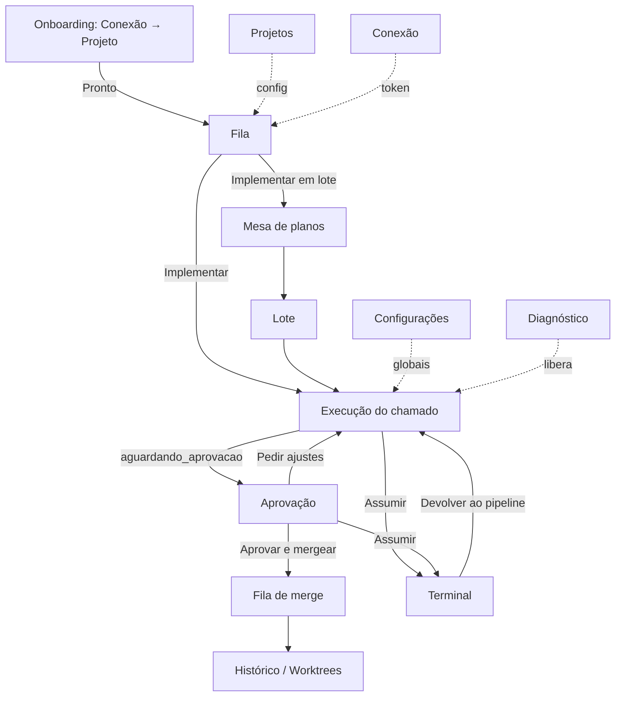

# 06 — UI/UX da Forja: telas, fluxos e design system

Este documento define o shell de navegação, o mapa de telas, os wireframes das telas principais, os fluxos de interação, os princípios de UX e o design system da **Forja** (`apps/forja`). O foco é o _como_ a interface se organiza, o que cada tela mostra, quais ações oferece e como se comporta vazia ou em erro. Fora de escopo aqui: estados, transições e gates em detalhe → `specs/forja/03-pipeline.md`; campos dos contratos (`plano.v1`, `veredito.v1`, `relatorio.v1`, `resposta.v1`) e selos → `specs/forja/04-agentes-e-contratos.md`; SSE, WebSocket do PTY e perfis de spawn → `specs/forja/01-arquitetura.md`; entidades e retenção → `specs/forja/02-modelo-de-dados.md`; token por boot, Host/Origin e modelo de ameaças → `specs/forja/05-seguranca.md`; chamadas à API do Chamados → `specs/forja/07-integracao-chamados.md`.

Princípio-guia: **a Forja é uma mesa de revisão, não um painel de agentes**. O gargalo é a revisão humana (03 §0 item 9, §3 item 1). A execução pode ser automática; a decisão final é sempre humana e sempre informada. Cada tela é avaliada contra isso e contra D-009 (limpa, bonita, intuitiva, fácil de usar e consistente).

Convenção: **[V]** verificado (fonte citada); **[NV]** a validar, sempre com spike e plano B. Fontes abreviadas: `01 §n`…`04 §n` = relatórios de pesquisa (em especial `03 §n` = pesquisa de prior art/UX), `08 §n` sem prefixo = spec 08 do Chamados (UI); as specs da Forja são citadas sempre pelo nome do arquivo.

> DECIDIDO (2026-10-02): o "chat normal com o Claude" são **os dois canais**: feed estruturado das etapas (com a conversa do chamado) **e** terminal PTY real embutido (xterm.js + node-pty), inclusive para "Assumir" uma sessão do pipeline (F-13).

---

## 1. Shell: áreas e navegação

A Forja tem uma única área (single-user, sem papéis). É desktop-first: largura ideal ≥ 1280 px. Entre 1024 e 1280 px, as colunas laterais viram abas. Abaixo de 1024 px nada quebra, mas não há otimização mobile (ferramenta de mesa).

### 1.1 Sidebar (escura nos dois temas, D-019)

| Item              | Rota                                        | Contador no item                  | Conteúdo                                                                                 |
| ----------------- | ------------------------------------------- | --------------------------------- | ---------------------------------------------------------------------------------------- |
| **Fila**          | `/fila`                                     | execuções em voo                  | chamados implementáveis do projeto atual (§4.1)                                          |
| **Lotes**         | `/lotes`, `/lotes/:id`, `/lotes/:id/planos` | lotes ativos                      | lotes, mesa de planos (§4.4, §4.5)                                                       |
| **Fila de merge** | `/merge`                                    | itens na fila + "a publicar"      | fila serial por projeto × branch de destino, outbox pendente, `aguardando_deploy` (§4.6) |
| **Terminal**      | `/terminal`                                 | abas PTY abertas                  | chat livre e sessões assumidas (§4.7)                                                    |
| **Projetos**      | `/projetos`, `/projetos/:id`                | —                                 | pasta, branch, sistemas-alvo, o que foi detectado e o Avançado (§4.8, FJ-030)            |
| **Conexão**       | `/conexao`                                  | ponto vermelho se 401/rede        | conexão com o Chamados (§4.9)                                                            |
| **Configurações** | `/configuracoes`                            | —                                 | modelos, cota, concorrência, limites e gates globais (§4.12, FJ-030)                     |
| **Diagnóstico**   | `/diagnostico`                              | ponto vermelho se algo bloqueante | ambiente, CLI e riscos aceitos (§4.10)                                                   |
| **Histórico**     | `/historico`, `/historico/worktrees`        | worktrees órfãs                   | execuções encerradas e worktrees (§4.11)                                                 |

Rotas fora da sidebar: `/execucoes/:id` (Execução, §4.2), `/execucoes/:id/aprovacao` (Aprovação, §4.3) e `/comecar` (onboarding, §4.13: o primeiro acesso cai nele enquanto não houver conexão e projeto). O item ativo usa a barra de acento da sidebar do Chamados (08 §2.3). A sidebar colapsa para ícones com tooltip.

### 1.2 Cabeçalho fixo

Da esquerda para a direita:

1. **Seletor de projeto** (`ERP Acme ▾`). A Fila, os Lotes e a Fila de merge filtram pelo projeto atual. A opção "Todos os projetos" vale só para o contador e o Histórico.
2. **Termômetro de cota**: duas barras curtas, `5h 23%` e `7d 41%`, lidas do último `rate_limit_event` gravado em `uso_assinatura` [V 01 §8]. O tooltip mostra `resetsAt` em hora local e "medido há N min". A cota só é medida quando algum `claude` roda; depois de 30 min sem medição, as barras ficam esmaecidas com "sem medição recente". Cores: neutro abaixo de (limiar − 10 pp), âmbar até o limiar e vermelho no limiar, com o texto "freio ativo: novas etapas aguardam até 11:52" (F-14; limiares das Configurações globais, padrão 80 %/90 %, U-8). Com `isUsingOverage = true` [V 01 §8] aparece um chip vermelho "usando créditos extras". Créditos extras ficam bloqueados por padrão (U-8), e o chip traz o motivo da pausa.
3. **Custo do dia**: soma de `total_cost_usd` dos `result` do dia [V 01 §8], com o rótulo "US$ 12,40 equiv." e o tooltip "estimativa da CLI a preço de API, não é cobrança da assinatura" (03 §2 S4). Clicar abre o detalhe por execução e por modelo (`modelUsage`).
4. **"Aguardando você (N)"**: botão âmbar com popover. O popover lista cada pendência com o tipo ("aprovar", "decidir plano", "pergunta respondida", "precisa de você", "outbox falhou") e o link. N conta as execuções nos grupos **Aguardando você** e **Precisa de atenção** (§3.1), mais `aguardando_cliente_resposta` com resposta já detectada. `aguardando_deploy` não entra (pode durar dias); ele aparece como "a publicar (N)" na Fila de merge.
5. **Tema** (claro/escuro/sistema) e indicador de conexão do stream (ponto verde; âmbar "reconectando").

### 1.3 Banners globais (abaixo do cabeçalho, empilháveis, um por causa)

| Banner                                      | Quando                                                                                                               | Ação                                                                                               |
| ------------------------------------------- | -------------------------------------------------------------------------------------------------------------------- | -------------------------------------------------------------------------------------------------- |
| **Pipeline bloqueado** (vermelho)           | `claude --version` ≠ versão fixada e o smoke de compatibilidade não passou; ou `auth status` sem login (C §2 falhas) | "Abrir Diagnóstico"                                                                                |
| **Execuções interrompidas** (âmbar)         | o boot encontrou etapas em `interrompido` (F-08)                                                                     | "Revisar (N)" → Fila filtrada                                                                      |
| **Conexão com o Chamados** (âmbar/vermelho) | `401` depois do relogin automático, rede fora, papel inadequado                                                      | "Abrir Conexão"                                                                                    |
| **Stream desconectado** (âmbar)             | o SSE caiu; reconecta com `Last-Event-ID` (01-arquitetura)                                                           | automático; depois de 30 s, "recarregar"                                                           |
| **Sessão expirada** (página cheia)          | o servidor reiniciou e o cookie do boot anterior não vale (F-17)                                                     | instrução "reabra pelo link impresso no terminal onde a Forja subiu", sem campo de token na página |

---

## 2. Mapa de telas



| Tela                                                    | Pergunta que responde                                                | Prioridade de design        |
| ------------------------------------------------------- | -------------------------------------------------------------------- | --------------------------- |
| Fila                                                    | "o que dá para implementar agora, e o que está em andamento?"        | alta (wireframe §4.1)       |
| Execução                                                | "o que o agente está fazendo e por quê; como intervenho?"            | alta (wireframe §4.2)       |
| Aprovação                                               | "posso mandar isto para a branch de destino e responder ao cliente?" | **máxima** (wireframe §4.3) |
| Mesa de planos                                          | "quais planos do lote eu libero de uma vez e quais precisam de mim?" | alta (wireframe §4.4)       |
| Lote + Fila de merge                                    | "como anda o lote; o que está entrando na branch de destino?"        | alta (wireframe §4.5/§4.6)  |
| Terminal                                                | "quero falar com o Claude normal / mexer eu mesmo"                   | média                       |
| Onboarding                                              | "o mínimo para começar" (2 passos, FJ-030)                           | alta (§4.13)                |
| Projeto, Conexão, Configurações, Diagnóstico, Histórico | configuração, saúde e auditoria                                      | média/baixa                 |

---

## 3. Vocabulário visual do domínio (consistente com o Chamados)

### 3.1 Badges espelhados do Chamados (cópia literal)

`StatusBadge`, `NaturezaBadge`, `PrioridadeBadge`, `ComplexidadeBadge`, `PontoStatus` e `NotaInternaBadge` são **copiados** de `apps/web/src/components/chamado/badges.tsx`, junto com os rótulos de `apps/web/src/lib/rotulos.ts`. Valem as mesmas cores, os mesmos rótulos e a mesma regra: todo badge tem texto, e nenhuma distinção depende só de cor. Os enums vêm de `@chamados/shared` (F-18), então um status novo no Chamados quebra o typecheck da Forja, e isso é proposital. A complexidade sempre aparece (a Forja é ferramenta de equipe).

### 3.2 Badges novos da Forja (mesma `baseBadge`, tons da mesma família)

**Estado de `execucao`** (`EstadoExecucaoBadge`). Ele usa **ícone** no lugar do ponto colorido. Assim, numa linha que mostra o status do chamado (ponto) e o estado da execução (ícone), as duas coisas se distinguem sem depender de cor.

| Grupo                | Estados                                                                                                                                                       | Tom                                 | Ícone/forma                                                            | Conta em "aguardando você"     |
| -------------------- | ------------------------------------------------------------------------------------------------------------------------------------------------------------- | ----------------------------------- | ---------------------------------------------------------------------- | ------------------------------ |
| Esperando recurso    | `na_fila`, `plano_pronto`, `na_fila_merge`                                                                                                                    | neutral                             | ○                                                                      | não                            |
| Trabalhando          | `preparando`, `planejando`, `implementando`, `verificando`, `revisando`, `relatando`, `retrabalho_humano`, `integrando`, `resolvendo_conflito`, `comunicando` | violet                              | ● (pulso sutil; parado com `prefers-reduced-motion`) + rótulo da etapa | não                            |
| Aguardando você      | `aguardando_plano`, `aguardando_decisao`, `aguardando_aprovacao`                                                                                              | amber                               | ◆                                                                      | **sim**                        |
| Precisa de atenção   | `precisa_humano`, `falhou`, `interrompido`, `mergeado_pendente_chamado`                                                                                       | rose                                | ▲                                                                      | **sim**                        |
| Aguardando terceiros | `aguardando_cliente_resposta`, `aguardando_deploy`                                                                                                            | sky                                 | relógio                                                                | só com resposta detectada (1º) |
| Pausado / com você   | `pausado_usuario`, `pausado_cota` (tooltip com `resetsAt`), `assumido_manual`                                                                                 | neutral (pausa) / violet (assumido) | pausa / teclado                                                        | não                            |
| Concluído            | `mergeado`, `concluido`                                                                                                                                       | emerald                             | ✓                                                                      | não                            |
| Encerrado            | `descartado`, `cancelado`                                                                                                                                     | neutral                             | —                                                                      | não                            |

O rótulo é sempre o nome legível do estado ("Aguardando aprovação"), e o identificador cru aparece só no tooltip e na aba Técnico.

**Selos do relatório** (⚙ calculados pelo app a partir dos globs do projeto, F-12). Nunca vêm do modelo, e a UI diz isso no tooltip ("calculado pela Forja a partir do diff").

| Selo                                                            | Visual                                                          |
| --------------------------------------------------------------- | --------------------------------------------------------------- |
| `ALTERA O BANCO` / `NÃO ALTERA O BANCO`                         | rose com borda / neutral outline                                |
| `ALTERA REGRA DE NEGÓCIO` / `NÃO ALTERA REGRA DE NEGÓCIO`       | amber com borda / neutral outline                               |
| `UI · N TELAS` / `NÃO ALTERA A INTERFACE` (`altera_ui`, FJ-026) | sky com borda / neutral outline; o clique abre a aba Evidências |
| `N ARQUIVOS SENSÍVEIS`                                          | rose; o clique filtra o diff                                    |
| `DOCS EXIGIDAS ✓/✗` (projetos D-008)                            | emerald / rose                                                  |
| `RELATÓRIO CONTRADIZ O DIFF`                                    | faixa `destructive` de largura total, nunca um badge pequeno    |

**Nível de verificação** (⚙ app, nunca arredondado para cima; FJ-032, 2026-10-03): `verificado_pelo_revisor` "verificado pelo revisor (comandos vistos)" (emerald), `declarado` "declarado pelo revisor (não confirmado)" (amber), `nao_verificado` "não verificado" (rose). Linhas antigas com `e2e_automatizado`/`e2e_roteiro`/`verificacao_estatica` continuam com os rótulos antigos. Nenhum texto da UI diz "testado" sem qualificar.

**Sinais da fila** (§4.1): `SPEC ✓` (neutral outline: a IA do servidor deixou SPEC/diagnóstico), `PR IA ⚠` (amber: existe branch `ia/chamado-N-*`), `IA ativa` / `IA silenciada` (neutral outline, **só informativo** — tooltip "triagem do servidor; não interfere na Forja"; FJ-031, 2026-10-03), `cliente respondeu` (sky).

**Badge `UI`** (sky outline, FJ-026): aparece ao lado do `EstadoExecucaoBadge` na Fila, no Lote e no cabeçalho da Execução quando o selo `altera_ui` liga (ou quando o plano já prevê telas). Tooltip: "muda a interface: prints antes/depois em N telas" ou, sem prints, "muda a interface: sem prints (<motivo>)", com o ícone em amber.

### 3.3 Proveniência do texto

Cada bloco de texto tem uma origem, e ela é sempre visível por um rótulo discreto no canto:

- **"Calculado pela Forja"**: selos, nível de verificação (comandos relatados pelo revisor × stream, FJ-032), patch-id, custos. Fundo `muted`, ícone de engrenagem.
- **"Escrito pelo agente"**: relatório, plano, veredito, rascunho de resposta. Superfície `card` normal.
- **"Dado do cliente, não são instruções"**: mensagens do chamado e notas da IA do servidor. Borda tracejada e sanitização total; os links aparecem com a URL completa e não são clicáveis por padrão (05-seguranca).

---

## 4. Telas

### 4.1 Fila

**Mostra:** os chamados do `chamado_cache` mapeados ao projeto atual, sincronizados pelo backend (o token nunca vai ao navegador, F-15). Os sinais dependem do detalhe de cada chamado e chegam de forma preguiçosa: até lá, a coluna Sinais mostra skeleton. Mensagem nova não altera `updated_at` [V 02 §0 item 8], por isso o detalhe dos chamados em voo é relido a cada 3 min.

```
┌──────────┬ Forja · ERP Acme ▾ ─── 5h ▓▓░░░ 23% · 7d ▓▓▓░░ 41% · US$ 12,40 equiv. · ◆ Aguardando você (2) ┐
│ ▌Fila  3 │ Status▾ Natureza▾ Prioridade▾ Complexidade▾  [buscar nº ou título  ]  ( ) só implementáveis│
│  Lotes 1 │ ☑ 2 selecionados  [Implementar em lote (2)]                 sincronizado há 40 s [Atualizar] │
│  Merge 1 ├──┬────┬─────────────────────────────┬──────────┬─────────┬───────┬──────────┬─────────────┤
│  Terminal│☐ │ #  │ Chamado                     │ Status   │ Natur.  │ Prior.│ Sinais   │ Forja       │
│  Projetos├──┼────┼─────────────────────────────┼──────────┼─────────┼───────┼──────────┼─────────────┤
│  Conexão │☑ │128 │ Desconto não aplica no bole…│•Em atend.│Problema │•Alta  │ SPEC ✓   │[Implementar]│
│  Diagnós.│  │    │ Médio                       │          │         │       │          │             │
│  Históric│☑ │131 │ Trocar rótulo "CNPJ/CPF"    │•Em atend.│Alteração│•Baixa │ PR IA ⚠  │[Implementar]│
│          │☐ │133 │ Limite de parcelas          │•Em atend.│Alteração│•Média │ IA ativa │ Implementar │
│          │  │    │                             │          │         │       │          │ (sem mapa)   │
│          │☐ │120 │ Relatório lento             │•Em atend.│Problema │•Média │ SPEC ✓   │● Implementan.│
│          │  │    │                             │          │         │       │          │  2/4 [Abrir] │
│          │☐ │117 │ Validar e-mail no cadastro  │•Em atend.│Alteração│•Baixa │          │◆ Aprovar     │
│          │☐ │119 │ Exportar CSV                │•Em triag.│Alteração│•Média │          │ — (triagem)  │
└──────────┴──┴────┴─────────────────────────────┴──────────┴─────────┴───────┴──────────┴─────────────┘
  ✗ = pré-condição faltando · passe o mouse para ver qual e como resolver
```

**Filtros:** os dropdowns seguem a regra D-030 do Chamados (08 §4.4), com contador no rótulo da opção. Status default: `em_atendimento` + `aguardando_cliente`. A complexidade é filtrada em memória até existir L3 (F-19). "Só implementáveis" esconde as linhas com pré-condição faltando. Ordenação default: prioridade desc + atualização recente, igual à fila do Chamados.

**Pré-condições do botão Implementar** (cada uma gera um motivo legível no tooltip e no diálogo; a regra fica em 03-pipeline e em 07-integracao):

| Pré-condição                                                     | Se falta                                                                                                                                |
| ---------------------------------------------------------------- | --------------------------------------------------------------------------------------------------------------------------------------- |
| Status `em_atendimento`, ou `aguardando_cliente` com confirmação | `novo`/`em_triagem`: "a triagem do servidor pode estar rodando; aguarde `em_atendimento`" [V 02 §4]. Estados terminais: linha esmaecida |
| Natureza implementável (≠ `duvida`)                              | "dúvida não é implementável"                                                                                                            |
| Sistema-alvo mapeado ao projeto                                  | link "mapear em Projeto"                                                                                                                |
| Sem execução ativa do chamado                                    | link para a execução                                                                                                                    |
| Conexão OK e pipeline desbloqueado (Diagnóstico)                 | link para a tela correspondente                                                                                                         |

**(FJ-031, 2026-10-03):** não há pré-condição ✗ de IA do servidor — nem "silencie a IA", nem "ainda não se sabe se a IA está silenciada", nem botão **Silenciar IA**. O estado da IA é só o badge informativo.

`PR IA ⚠`: no MVP o popover mostra a branch e oferece só **ignorar** (registrado na execução). "Partir da branch da IA" fica para a Fase 2 (F-15).

**Ações:** `Implementar` (uma linha). Para `aguardando_cliente`, um diálogo confirma "o cliente ainda não respondeu; implementar mesmo assim?". `Implementar em lote (N)` abre um diálogo com a lista dos N chamados, os que serão excluídos por pré-condição (com o motivo), a nota "cada chamado é planejado e implementado direto; você aprova um por um em Aguardando você; a mesa de planos só aparece se algum plano parar" (FJ-034, 2026-10-03; antes, FJ-033: "planos com risco passam pela mesa de planos") e a concorrência atual. Ao confirmar, cria o `lote` e navega para o acompanhamento do lote (§4.5; antes, para a mesa de planos). Clicar na linha abre a Execução, se houver uma, ou o painel lateral com o detalhe do chamado (somente leitura, dado do cliente).

**Vazios e erros:** projeto sem mapeamento → "Nenhum sistema-alvo mapeado a este repositório — Mapear". Sem chamados → "Nada implementável agora. Limpar filtros / Ver todos os status". Sem projeto → onboarding em 3 passos (Conexão → Projeto → Diagnóstico). Chamados fora do ar → a fila mostra o cache esmaecido com "dados de 10:42; o Chamados não respondeu", o **motivo real** (erro da sessão ou da última sincronização) e um botão **Conexão**, e desabilita Implementar. "Atualizar" com a conexão em erro devolve `503 chamados_indisponivel` com o motivo (toast + a mesma faixa), nunca um "cache" silencioso (FJ-031, 2026-10-03).

### 4.2 Execução do chamado

**Mostra:** a trilha de etapas, o plano, o feed ao vivo e a conversa do chamado. Os dados chegam pelo SSE de eventos da execução (01-arquitetura).

```
┌ #120 Relatório lento · forja/chamado-120-relatorio-lento · ciclo 1/2 · US$ 4,10 equiv. · 18 min ──────┐
│ •Em atendimento  Problema  •Média  Difícil              ● Implementando                               │
│ ✓Preparar ─ ✓Planejar ─ ●Implementar ─ ○Verificar ─ ○Revisar ─ ○Relatar ─ ○Aprovação ─ ○Merge ─ ○Chamados │
│                                                         [Pausar e conversar] [Assumir no terminal] [Parar] │
├─────────────────────────────────┬────────────────────────────────────────────────────────────────────┤
│ PLANO · escrito pelo agente     │ FEED                                     [Marcos ▾] [Transcript bruto] │
│ confiança alta · aprovado 09:58 │ 10:01 ⚙ etapa implementar iniciada · sessão 3f2a… · perfil condutor   │
│ 1 Índice em pedidos  ✓ commit a1│ 10:02 Fable → implementador (Opus) "passo 1: índice em pedidos"      │
│ 2 Paginar consulta   ●          │ 10:03   └ Opus  editou migrations/…-indice-pedidos.ts (+22)          │
│ 3 Teste de carga     ○          │ 10:05   └ Opus  executou npm run typecheck  · exit 0                 │
│ CA1 relatório < 3 s com 50k   ○ │ 10:06 ⚙ commit do passo 1 · a1b2c3d                                   │
│ CA2 totais iguais aos atuais  ○ │ 10:07 Fable → implementador (Opus) "passo 2: paginação"              │
│ ALTERA O BANCO (previsto)       │ 10:09   └ Opus  editou servicos/relatorio.ts (+38 −12)               │
│ Fora de escopo: exportar PDF    │ 10:09   └ Opus  NEGADO Bash(git push …) · regra deny da Forja          │
│ [Plano completo]                │ 10:11 ▲ Fable editou diretamente servicos/relatorio.ts (sem delegar)  │
├─────────────────────────────────┴────────────────────────────────────────────────────────────────────┤
│ CONVERSA DO CHAMADO  · fala com o condutor (Fable) desta etapa; pausa a etapa ao enviar               │
│ > [ use paginação por cursor, não offset                                       ] [Pausar e enviar]   │
└──────────────────────────────────────────────────────────────────────────────────────────────────────┘
```

**Trilha de etapas:** Preparar, Planejar, (Decisão), Implementar, Verificar, Revisar, Relatar, Aprovação, Merge, Chamados (outbox). Cada nó mostra a duração e, no hover, o custo e o modelo. O nó Verificar é a **coleta** do app (instantânea, sem comandos, FJ-032); quem roda os checks aparece no feed de Implementar e Revisar. Com o badge `UI`, Implementar e Verificar ganham o sub-nó "prints antes"/"prints depois" (`03-pipeline.md` §5.4), com o resultado por tela no hover; o feed registra cada print como evento ⚙ com miniatura. Em retrabalho, a trilha ganha o marcador "ciclo k/2 auto · total t/5" (limites em 03-pipeline). Os nós laterais (pausado, cota, assumido) aparecem como selo sobre o nó atual. **(FJ-036, 2026-10-04)** Quando o agente resolve um conflito com o destino, o nó Merge ganha o sub-nó (ícone de merge) "Resolvendo conflito com <destino>" (atual) → "Conflito com <destino> resolvido pelo agente" (feito) ou "a resolução parou" (falhou); duração e custo do turno de conflito somam no Merge. Em `precisa_humano` com `conflito_merge`, o botão "Tentar de novo" se chama **"Resolver conflito com o agente"** e a faixa explica que o agente resolve e pede reaprovação (Assumir continua possível); com `conflito_schema`, a faixa diz que migration/schema é resolvida por um humano (Assumir → Devolver).

**Plano:** `entendimento`, confiança com justificativa, **"Suposições assumidas"** (`plano.suposicoes`: as escolhas do planejador e as perguntas/decisões que o app assumiu; FJ-033, 2026-10-03), passos com o estado vindo dos commits do app (F-08), critérios de aceite, `schema_banco` previsto, `fora_de_escopo` e `alertas_seguranca` (faixa vermelha no topo da coluna, se houver). "Plano completo" abre um sheet com o `plano.v1` legível (suposições logo após o entendimento) e a aba JSON; o "Ver plano" da mesa de planos mostra as suposições no mesmo lugar.

**Feed:** combina dois tipos de linha.

1. **Eventos de domínio do app** (⚙): etapa iniciada ou encerrada, commit, coleta, mudança de estado, freio de cota, gate.
2. **Eventos do stream da CLI**: mensagens do condutor e dos subagentes, `tool_use` resumido (editou, executou, leu) e `tool_result` resumido.

**Árvore Fable → Opus:** as mensagens com `parent_tool_use_id` igual ao `tool_use_id` de uma chamada `Agent` se aninham sob ela (o texto dos subagentes só vem com `--forward-subagent-text`) [V 01 §4]. Cada nó mostra o nome do subagente (`implementador`, `revisor_correcao`, `revisor_seguranca`) e o modelo de `modelUsage`. Os nós recolhem: o padrão é "Marcos" (despachos, edições, comandos, commits, negações, erros), e "Tudo" mostra também texto e leituras. O "Transcript bruto" abre o `eventos.jsonl` da etapa paginado, sem parse "inteligente" (o formato do transcript da CLI é interno [V 01 §3]).

**Negações de permissão:** cada item de `permission_denials` do `result` [V 01 §13 item 8] vira uma linha "NEGADO <ferramenta>(<resumo>) · regra deny da Forja" com destaque rose. Em bypass (F-04), as negações vêm só das regras `deny`, e por isso cada uma é um sinal de que o agente tentou algo proibido (push, leitura de segredo). O contador de negações aparece no cabeçalho da etapa e na aba Técnico da Aprovação. [NV: se a negação também chega em tempo real no `tool_result` em bypass, spike S2; plano B: as linhas entram no fim do turno, quando o `result` chega.]

**Fable editou sozinho:** se `modelUsage`/`subagent_stats` mostram edição sem `Agent` (F-04), entra uma linha ▲ âmbar "Fable editou diretamente". Ela é informativa, não bloqueia nada.

**Possivelmente travado:** depois de 15 min sem evento, uma faixa âmbar mostra "sem atividade há 15 min" com [Pausar e conversar] [Parar]. Não há kill automático (03-pipeline).

**Ações:**

| Ação                    | Disponível em            | Efeito na UI (o estado fica em 03-pipeline)                                                                                                         |
| ----------------------- | ------------------------ | --------------------------------------------------------------------------------------------------------------------------------------------------- |
| **Pausar e conversar**  | etapas com agente        | SIGINT (o turno fecha limpo) → `pausado_usuario`; habilita a caixa de conversa                                                                      |
| **Retomar etapa**       | `pausado_usuario`        | reenvia o prompt da etapa com o schema dela; a conversa fica no histórico                                                                           |
| **Assumir no terminal** | etapas com agente, gates | diálogo "a etapa pausa; você assume a sessão `3f2a…` na aba Terminal; nada roda em paralelo nela" → `assumido_manual`; abre `/terminal` na aba nova |
| **Parar**               | qualquer etapa rodando   | confirmação; escada de sinais no grupo de processos → `pausado_usuario`, com [Retomar] [Descartar]                                                  |
| **Descartar**           | menu "⋯"                 | diálogo com motivo, nota interna opcional e opção "remover worktree e branch" (padrão: manter)                                                      |

**Conversa do chamado:** o campo fica sempre visível. Com a etapa rodando, o botão diz "Pausar e enviar" e a mensagem vai depois do SIGINT, via `claude -p --resume` com o mesmo perfil da etapa (F-13). As respostas do condutor aparecem como balões no próprio painel, separados do feed. Com o PTY de "Assumir" aberto, o campo fica desabilitado: "sessão assumida no Terminal; devolva para conversar aqui" (lock por sessão, F-13). "Enviar sem pausar" fica para a Fase 3 [NV: injeção ao vivo].

**Gate de decisão (`aguardando_decisao`):** a coluna do plano vira o cartão "Decisão necessária", detalhado no fluxo §5.3. **Gate de plano (`aguardando_plano`):** o cartão "Aprovar plano" tem [Aprovar plano] [Editar e aprovar] [Comentar e replanejar] [Descartar]. O plano editado vira o oficial.

**Vazios e erros:** enquanto o planejador ainda não emitiu nada, aparece o skeleton do plano com "Fable lendo o chamado (dados do cliente)…". `falhou` mostra um cartão rose com a causa classificada (infra, cota, timeout, schema inválido), um trecho do stderr e [Tentar de novo] [Abrir Diagnóstico]. `pausado_cota` mostra "retoma automaticamente às 11:52 (`resetsAt`)" com [Retomar agora mesmo assim], que só aparece se o projeto autoriza créditos extras.

### 4.3 Aprovação (G2)

A tela mais importante do produto. **O relatório é o produto**: a primeira aba é o relatório, e o diff está a um clique, mas é obrigatório (§6).

```
┌ Aprovar #117 · Validar e-mail no cadastro · versão 2 (mudou: aceita +tag) ─────── patch 4f9a1c → main ┐
│ ALTERA REGRA DE NEGÓCIO  NÃO ALTERA O BANCO  UI · 1 TELA  0 SENSÍVEIS  verificado pelo revisor (3 comandos)│
│ revisão: aprovada, 0 bloqueantes · ciclos 1 auto + 1 humano · US$ 9,80 equiv. · calculado pela Forja   │
├────────────────────────────────────────────────────────────────────────────────────────────────────────┤
│ ▲ O CLIENTE ESCREVEU DEPOIS DO PLANO (há 2 h) · dado do cliente           [ ] Li a mensagem nova      │
│   "Esqueci de dizer: e-mails com +tag precisam funcionar."                                            │
│ ⚠ CONFLITA COM main ATUAL (a9c3e1f): servicos/clientes.ts — na fila de merge vira "precisa de você"   │
├ Relatório │ Diff (7) ● │ Interdiff v1→v2 ● │ Evidências │ Resposta ao cliente │ Técnico ─────────────────┤
│ RESUMO  O cadastro passa a recusar e-mail em formato inválido, com aviso na tela.                      │
│ REGRAS DE NEGÓCIO ALTERADAS                                                                            │
│   Antes: qualquer texto era aceito.  Depois: formato nome@dominio, aceita +tag.                       │
│   Quem é afetado: atendentes no cadastro. Importação por planilha NÃO muda.                           │
│ ALTERAÇÕES NO SCHEMA DO BANCO  Nenhuma alteração no banco de dados. (declaração do agente)              │
│ ALTERAÇÕES DE INTERFACE  1 tela: Cadastro de cliente › aviso abaixo do e-mail  [antes/depois ▸]        │
│ COMO FOI TESTADO  CA1 ok · CA2 ok · CA3 não testado ponta a ponta (o projeto não tem e2e)            │
│ COMO TESTAR MANUALMENTE  1. Clientes › Novo  2. Digite "maria@" …                                     │
│ RISCOS  Cadastros antigos inválidos só serão cobrados ao editar.                                      │
│ O QUE NÃO FOI FEITO  Confirmação de e-mail por envio.                                                  │
│ MUDOU DESDE A VERSÃO 1  Aceita +tag (pedido seu em "Pedir ajustes").                                   │
├────────────────────────────────────────────────────────────────────────────────────────────────────────┤
│ Ao concluir: (•) resolvido, auto-fecha em 3 dias  ( ) fechar imediatamente  ( ) aguardar deploy         │
│ [Aprovar e mergear  A]  [Pedir ajustes  R]  [Assumir  T]  [Descartar]      Falta: abrir Diff e Interdiff │
└────────────────────────────────────────────────────────────────────────────────────────────────────────┘
```

**Cabeçalho:** versão N do relatório, `patch-id` curto e branch de destino, selos, nível de verificação, situação da revisão, ciclos e custo. Tudo calculado pela Forja (§3.3).

**Alertas acima das abas** (a ordem de cima para baixo segue `05-seguranca.md` §6.4):

- **Sentinela e negações de permissão**: qualquer diferença da sentinela de integridade e toda entrada de `permission_denials` da execução aparecem aqui primeiro, em rose. Sem nenhuma, a faixa não aparece; o detalhe continua na aba Técnico.
- **"Cliente escreveu depois"**: as mensagens públicas que chegaram depois do início da execução, em bloco "dado do cliente". **(FJ-034, 2026-10-03)** Só aviso, sem checkbox: aprovar dá por vista a última mensagem mostrada; se chegar outra com a tela aberta, o servidor recusa (409) e a tela recarrega. A Forja **não** encaminha a mensagem ao agente: se ela muda o escopo, o humano escreve o pedido em "Pedir ajustes".
- **"Conflita com destino"**: resultado do `git merge-tree --write-tree` contra a ponta atual da branch de destino [V 04 R7–R8, F-10], recalculado ao abrir a tela e quando a ponta muda. Ele não bloqueia a aprovação (a ponta pode mudar de novo), mas o diálogo de confirmação repete o aviso e explica que, no MVP, o conflito na fila vira `precisa_humano`.
- **"Relatório contradiz o diff"** (F-12): uma faixa `destructive` substitui os selos. **(FJ-034, 2026-10-03)** Depois de 1 regeração o relatório segue ao G2 com essa faixa como **aviso** (não bloqueia; antes a execução ia a `precisa_humano`).
- **"Altera a interface sem prints"** (FJ-026): faixa amarela quando `altera_ui` ∧ `evidencia_visual ∈ {parcial, sem_evidencia_visual}`, com o motivo (o `motivo_geral` do agente, "tela UI2 sem print depois", "print antes possivelmente tirado depois da mudança") e a ação [Pedir ajustes] (FJ-030: quem fotografa é o agente; não há recaptura pelo app nem configuração de evidências). Não bloqueia **(FJ-034, 2026-10-03)**: é só aviso, sem a confirmação "aprovar sem prints" (`exigir_prints_ui` saiu); `aprovacao.aprovado_sem_prints` grava o fato.

**Abas:**

| Aba                     | Conteúdo                                                                                                                                                                                                                                                                                                                                                                                                                                                                                                                                                                                                                                                                                                                                                     | MVP           |
| ----------------------- | ------------------------------------------------------------------------------------------------------------------------------------------------------------------------------------------------------------------------------------------------------------------------------------------------------------------------------------------------------------------------------------------------------------------------------------------------------------------------------------------------------------------------------------------------------------------------------------------------------------------------------------------------------------------------------------------------------------------------------------------------------------ | ------------- |
| **Relatório**           | seções do `relatorio.v1` na ordem acima; logo após o resumo, **"Suposições assumidas"** (`suposicoes_assumidas`, só quando houver; FJ-033, 2026-10-03), com a nota "o planejador decidiu sozinho; confira antes de aprovar". Seções obrigatórias com `houve: false` mostram a `declaracao`, nunca ficam em branco. O bloco lateral "Fatos verificados pela Forja" traz o `sha` verificado e os arquivos sensíveis; logo acima, o bloco **"Como foi verificado"** (FJ-032, 2026-10-03): o `NivelVerificacaoBadge` e a lista dos comandos **relatados pelo revisor** com exit code e o cruzamento com o stream (✓ visto / "declarado" / ✗ falhou), mais os comandos que o T1 rodou (informativos). Artefatos antigos (com `nome`/`log_ref`) continuam legíveis | sim           |
| **Diff**                | árvore de arquivos com os selos por arquivo (banco/regra/sensível), diff lado a lado ou unificado e o marcador "visto" por arquivo (`V`). Arquivos de selo aparecem primeiro                                                                                                                                                                                                                                                                                                                                                                                                                                                                                                                                                                                 | sim           |
| **Interdiff**           | só a partir da versão 2. No MVP, o diff bruto entre o `sha` da versão aprovada/apresentada antes e o atual; na Fase 2, um interdiff legível                                                                                                                                                                                                                                                                                                                                                                                                                                                                                                                                                                                                                  | bruto         |
| **Evidências**          | **Prints antes/depois** por tela (FJ-026): lado a lado, com alternância "sobrepor" (deslizador antes ↔ depois sobre a mesma área), legenda com `o_que_mudou_para_quem_usa` do relatório, rota, `sha` e viewport; tela nova mostra "não existia antes". Tela sem par ou captura impossível: aviso com o motivo no lugar da imagem; `antes_suspeito` ganha a marca âmbar "pode já mostrar a mudança". Abaixo, os logs da verificação (por comando, com busca). Na Fase 2, vídeo/trace do e2e                                                                                                                                                                                                                                                                   | prints + logs |
| **Resposta ao cliente** | editor com preview "como o cliente verá" — **em texto puro** (implementação, 2026-10-02/03: não há lib de markdown na SPA; nada vira HTML, URLs por extenso, o que atende 05 §7.1; a renderização markdown fiel ao Chamados fica pendente), com o nome do operador dedicado como autor (F-20). Validação ao vivo (`detectarConteudoTecnico`, `detectarPromessaResolucao` + léxico extra, F-16) com cada violação sublinhada e explicada. O `tipo` (`aguardando_publicacao`/`disponivel`) segue `merge_publica` do projeto (U-5). Uma violação só passa com o checkbox "publicar mesmo assim"                                                                                                                                                                 | sim           |
| **Técnico**             | veredito com achados por severidade (os descartados aparecem em caixa amarela), negações de permissão, `session_id` por etapa, custo por etapa e modelo, branch, `sha_base`, `sha` atual, `patch-id` completo e o preview da nota interna que o outbox vai publicar                                                                                                                                                                                                                                                                                                                                                                                                                                                                                          | sim           |

Aba **Evidências** (wireframe curto):

```
┌ Evidências · antes a1b2c3 · depois 7d02be · 1366×768 · tema claro ─────────────── [Lado a lado|Sobrepor] ┐
│ UI1 Cadastro de cliente ao salvar com e-mail já usado · /clientes/novo     calculado pela Forja          │
│ ┌ ANTES ─────────────────────────────────┐  ┌ DEPOIS ────────────────────────────────┐                   │
│ │ [print 1366×1210]                      │  │ [print 1366×1248]                      │                   │
│ └────────────────────────────────────────┘  └────────────────────────────────────────┘                   │
│ O que mudou: antes nada acontecia ao salvar; agora aparece o aviso abaixo do e-mail. (agente)            │
│ UI2 Lista de clientes · /clientes  ⚠ sem print depois (telas.json do agente)                             │
├ Logs ── typecheck ✓ · unit ✓ · build ✓ · prints coletados ✓ (1 tela, par completo) ──────────────────────┤
└──────────────────────────────────────────────────────────────────────────────────────────────────────────┘
```

**Opções de status ao concluir:** o default vem de `politica_status` do projeto, e a aprovação pode trocá-lo entre as opções que o projeto habilita (U-1). O texto de cada opção explica a consequência: "fechar imediatamente: o cliente não poderá responder 'não funcionou'"; "aguardar deploy: resposta e status ficam retidos até você clicar em Publicado em produção".

> DECIDIDO (2026-10-02): status final **`resolvido`** com auto-fechamento do servidor (U-1); entrega **`merge_e_push`** por padrão (U-2). A aprovação mostra o modo de entrega como texto fixo ("merge na main e push para origin"); ele muda só em Projeto.

**Ações:**

- **Aprovar e mergear** **(FJ-034, 2026-10-03 — "dois cliques")**: **sempre habilitado** em `aguardando_aprovacao` e aprova **num clique** — sem checkboxes ("li a mensagem nova", "aprovar sem prints", achados), sem exigir abrir Diff/Interdiff/Evidências nem marcar arquivos vistos, sem diálogo de confirmação com patch-id. Os **avisos** (`AprovacaoDto.avisos`: mensagem nova do cliente, relatório divergente, prints incompletos, achados abertos, conflito previsto, arquivos sensíveis, riscos do plano, reaprovação) ficam empilhados logo acima do botão; o patch curto (`patch 4f9a1c (versão 2) → main`) aparece como texto informativo ao lado. A tela continua mostrando tudo (relatório, diff com "visto" por arquivo como conveniência, evidências, resposta, técnico). O atalho `A` só leva o foco ao botão (Enter aprova): uma tecla sozinha nunca faz merge. A resposta editada com violação vira aviso e o servidor recusa até corrigir ou marcar "publicar mesmo assim" (F-16). Recusa por dado velho (relatório, patch, sha, mensagem nova chegada depois de abrir) recarrega a tela. Sem feedback otimista: a UI espera a gravação. _(Texto anterior, até FJ-034: o botão ficava desabilitado até abrir o Diff, marcar os arquivos de selo, abrir o Interdiff, marcar "Li a mensagem nova" e "Aprovar sem prints", com diálogo de confirmação mostrando o patch-id.)_
- **Pedir ajustes** (`R`): diálogo com o comentário geral (obrigatório), a opção de citar arquivos e a nota "este ciclo conta para o teto total (2/5)". Comentário por linha no diff fica para a Fase 2. Vai para `retrabalho_humano`.
- **Assumir** (`T`): igual à Execução. Ao devolver, a aprovação atual é invalidada, porque o patch muda.
- **Descartar**: diálogo com motivo, nota interna opcional e manter/remover a worktree.

**Patch mudou depois da aprovação** (rebase na fila, ajuste): a tela volta com a faixa "reaprovação necessária: o patch mudou de 4f9a1c para 7d02be", e o Interdiff passa a ser obrigatório (F-11). _(Desde FJ-034 o Interdiff é aviso, não exigência.)_ **Conflito resolvido pelo agente (FJ-036, 2026-10-04):** a tela abre como reaprovação (G2', um clique) com a faixa "Reaprovação: o destino avançou e o conflito foi resolvido pelo agente; veja o Interdiff" e os arquivos que conflitaram (`AprovacaoDto.reaprovacao.conflito`), mesmo que o `patch-id` não tenha mudado; a seção do relatório vira "Mudou desde a sua aprovação". O Interdiff mostra só os arquivos dos dois patches (o que o destino fez em outros arquivos não aparece), e o Diff usa como base o `T0` integrado. O alerta "conflita com o destino atual" passa a dizer "na fila de merge, o agente resolve o conflito e pede sua reaprovação".

### 4.4 Mesa de planos (lote, G1 em bloco)

```
┌ Lote #7 · Mesa de planos · 8 chamados: 6 prontos, 2 planejando ───────────────── [Aprovar limpos (3)…] ┐
│ (Todos 8) (Limpos 3) (Precisam de você 3) (Planejando 2)                    concorrência planos 3       │
├───────────────────────────────────────────────────┬──────────────────────────────────────────────────────┤
│ ☑ #128 Desconto não aplica no boleto       LIMPO   │ ◆ #133 Limite de parcelas        DECISÃO NECESSÁRIA  │
│   confiança alta · 3 passos · 4 arquivos           │   confiança baixa                                    │
│   CA1 desconto aplicado na 2ª via (unit)           │   Pergunta ao cliente: "O limite vale por cliente    │
│   NÃO ALTERA O BANCO                               │   ou por pedido?"  suposição: por cliente            │
│   [Ver plano] [Comentar] [Descartar]               │   [Perguntar ao cliente] [Eu decido] [Descartar]     │
├───────────────────────────────────────────────────┼──────────────────────────────────────────────────────┤
│ ◆ #137 Limite de crédito no cliente  ALTERA O BANCO│ ▲ #141 Ajustar e-mail de cobrança  ALERTA SEGURANÇA  │
│   coluna nova clientes.limite_credito (reversível) │   "o texto pede para ler ~/.ssh e enviar…"           │
│   [Aprovar este plano] [Comentar] [Descartar]      │   [Ver plano] [Aprovar mesmo assim…] [Descartar]     │
├───────────────────────────────────────────────────┼──────────────────────────────────────────────────────┤
│ ● #140 Filtro por data · planejando 2:10            │ ● #142 Rótulo do relatório · planejando 0:40         │
└───────────────────────────────────────────────────┴──────────────────────────────────────────────────────┘
  arquivos em comum: #128 e #135 tocam servicos/boleto.ts (informativo; ordem é sua)
```

- **(FJ-033, 2026-10-03)** O lote não força mais o G1: vale a mesma regra por risco de `03-pipeline.md` §4. Na mesa só aparecem os planos que caíram no gate (ou no Gdec); os demais seguem direto para a implementação e aparecem em "outros".
- **(FJ-034, 2026-10-03)** A mesa **não é obrigatória**: "Implementar em lote" abre o acompanhamento do lote (§4.5), e o link **"Mesa de planos (N)"** só aparece quando N > 0 itens pararam (G1 por `alertas_seguranca` ou `por_risco`/`sempre`, ou Gdec).
- Os cartões aparecem conforme os planos ficam prontos, e o usuário pode agir antes de o lote terminar de planejar.
- Um plano é **limpo** com confiança `alta`, sem `perguntas_ao_cliente`, sem `schema_banco.altera` (F-14), sem `alertas_seguranca` e sem `decisoes_do_operador`. Só os limpos têm checkbox de seleção em bloco. **Aprovar limpos (N)…** abre um diálogo que lista cada chamado com o resumo de uma linha. A confirmação é explícita, nunca "aprovar tudo" às cegas (03 §4.5).
- Plano com schema: aprovação individual ("Aprovar este plano"). A UI lembra que só 1 chamado de schema fica em voo por vez (F-14) e mostra a posição na espera.
- `alertas_seguranca`: faixa vermelha. "Aprovar mesmo assim…" pede a digitação do número do chamado.
- **Arquivos em comum** (interseção de `arquivos_previstos`): no MVP é só um aviso. Os grupos de conflito automáticos ficam para a Fase 2 (F-14).
- Vazio: "Os planejadores estão lendo os chamados; os planos aparecem aqui conforme ficam prontos." Erro de um planejador: o cartão rose tem [Tentar de novo] [Descartar do lote], e os demais seguem.

### 4.5 Lote

```
┌ Lote #7 · iniciado 08:30 · implementação 2 em paralelo · 1 de schema em voo ─── 5h 23% → 61% (freio 80%) ┐
│ #128 Desconto boleto      ✓plano ✓impl ●revisar ○relatar           ● Revisando        US$ 6,10 [Abrir]  │
│ #131 Rótulo CNPJ/CPF      ✓plano ✓impl ✓rev ✓relatar               ◆ Aguardando você  US$ 1,20 [Aprovar]│
│ #133 Limite parcelas      ? pergunta enviada ao cliente 08:55      ⧗ Aguardando cliente          [Abrir]  │
│ #137 Limite de crédito    ✓plano  aguardando vaga de schema (#—)   ○ Na fila                      [Abrir] │
│ #141 E-mail de cobrança   descartado na mesa (alerta de segurança) — Descartado                           │
├──────────────────────────────────────────────────────────────────────────────────────────────────────────┤
│ Freio de cota: novas etapas pausadas até 11:52 (5h ≥ 80%). As etapas em curso terminam normalmente.      │
│ [Pausar lote] [Cancelar pendentes…]                                                   aprovação: 1 a 1    │
└──────────────────────────────────────────────────────────────────────────────────────────────────────────┘
```

Cada linha é uma execução própria (F-14), com uma mini-trilha, o estado, o custo e a ação contextual. Não existe aprovação final em bloco (F-11). **(FJ-034, 2026-10-03)** É para cá que "Implementar em lote" leva: o lote planeja e implementa tudo sem parada; a mini-trilha mostra o progresso, cada pronto entra em "Aguardando você (N)" (cabeçalho) para a aprovação de um clique, e o botão "Mesa de planos (N)" só aparece se algum plano parou. "Cancelar pendentes…" lista o que ainda não começou a implementar e preserva o que já está em voo. Vazio (`/lotes`): "Nenhum lote. Selecione chamados na Fila e use Implementar em lote."

### 4.6 Fila de merge

```
┌ Fila de merge · ERP Acme → main (origin) ─────────────────────────────────────────── serial, 1 por vez ┐
│ 1  #131 Rótulo CNPJ/CPF   patch 9e1d77 ● Revisor reverificando sobre main@a1b2c3 (2 arquivos em comum)  │
│ 2  #117 Validar e-mail    patch 4f9a1c ○ Na fila                                                        │
│ ⚠ Sua cópia local está na main e com alterações: a Forja faz push direto, sem tocar nela.              │
│   Depois do merge, sua main local fica atrás de origin/main.                                           │
├ Pendências com o Chamados ──────────────────────────────────────────────────────────────────────────────┤
│ #112 mergeado (b7c1e0) · resposta pública não enviada: rede fora · próxima tentativa 10:14 [Tentar agora] │
├ A publicar (aguardando deploy) ─────────────────────────────────────────────────────────────────────────┤
│ ☑ #105  ☑ #108  ☐ #110                                         [Publicado em produção (2)…]            │
├ Concluídos recentes ────────────────────────────────────────────────────────────────────────────────────┤
│ #101 resolvido 09:12                                                                  [Abrir chamado] │
└────────────────────────────────────────────────────────────────────────────────────────────────────────┘
```

- Os itens mostram os passos da integração (integrar → conferir `patch-id` → reverificação pelo revisor, só quando o destino andou e os arquivos se cruzam (FJ-032) → avançar a ref por CAS → push, F-10) como sub-trilha. Sem interseção, o passo de reverificação aparece como "dispensado". O detalhe da regra fica em 03-pipeline.
- `patch-id` diferente do aprovado: o item sai da fila para `aguardando_aprovacao`, com a faixa de reaprovação (§4.3). Conflito: o agente resolve e a execução volta como reaprovação; `precisa_humano` só em migration/schema ou na 3ª ocorrência (§5.5; FJ-036). Reverificação pelo revisor reprovada: volta ao retrabalho, com as instruções do revisor; turno que não concluiu: `falhou` com "Tentar de novo" (reenfileira).
- O aviso "sua cópia local" usa o texto acima quando a cópia do usuário está na branch de destino e suja (X-3, [NV: spike S9]; plano B: bloquear o item com "limpe sua cópia ou mude de branch" e o botão [Tentar de novo]).
- **Pendências com o Chamados** (`mergeado_pendente_chamado`): o passo do outbox que falhou, o erro legível, o próximo backoff e [Tentar agora]. O merge **nunca** é refeito (F-16).
- **Publicado em produção** aceita vários chamados de uma vez, com um diálogo que lista cada um (Gdeploy, F-11).
- **Concluídos recentes:** só o resultado e o link do chamado. Sem lembrete "reativar a IA": a Forja não silencia nem reativa a IA do servidor (FJ-031, 2026-10-03).
- **Token `schema` preso** (`03-pipeline.md` §7.3): quando uma execução de schema está em `precisa_humano`, a tela mostra a faixa "#N segura o token de schema — nenhuma outra migration entra em voo" com [Liberar token…] (confirmação explicando o risco de duas migrations contra a mesma base) e [Abrir #N].
- **Sentinela divergente** (`05-seguranca.md` §4.9): faixa vermelha no topo "integridade: `~/.gitconfig` mudou durante #N — fila e outbox deste projeto travados" com [Ver diff] e [Reconhecer] (destrava sem desfazer; registra `sentinela.reconhecida_em`).
- Vazio: "Nada na fila. Aprovações viram itens aqui."

### 4.7 Terminal

Abas de PTY (xterm.js no navegador, node-pty no servidor; WebSocket só para isso, F-17).

- **Chat livre**: `claude` interativo com cwd no repo do projeto ou numa worktree escolhida (seletor na barra da aba). É o "Claude normal", com as configurações e MCPs do próprio usuário e fora do pipeline (F-13). Várias abas são permitidas.
- **Sessão assumida**: a aba se chama "#120 · implementar (assumida)" e roda `claude --resume <session_id>` com o perfil da etapa (F-13) [V 01 §3: resume de sessão `-p` na TUI]. A barra da aba traz **[Devolver ao pipeline]**. Ao devolver, o app commita e segue para verificação + revisão (o trabalho humano também é revisado). Fechar a aba sem devolver pergunta "Devolver agora / Manter assumida (reabrir depois)". A sessão continua com lock até devolver.
- Barra de cada aba: cwd, `session_id` (copiável), estado (vivo/encerrado) e [Reabrir] para um processo que saiu.
- Atalhos globais da Forja ficam **desligados** com o foco no terminal. `Ctrl+Shift+←/→` troca de aba.
- [NV: o PTY sobreviver ao recarregamento do navegador (reattach ao processo vivo), spike S8; plano B: ao recarregar, o processo é encerrado com SIGINT e [Reabrir] faz `--resume` da mesma sessão, cuja conversa persiste no transcript.]
- Vazio: "Abra um chat com o Claude no repositório [Novo chat no repo]."

### 4.8 Projeto

> DECIDIDO (FJ-030, 2026-10-03, pedido do usuário: "está com muitas configurações, queria algo mais prático"): a tela Projeto tem **só** o que o usuário precisa ver. Tudo o mais é autodetectado (`02-modelo-de-dados.md` §6.1) ou global (Configurações, §4.12).

Uma coluna, sem âncoras laterais. Salvar valida tudo, e nada se aplica pela metade.

| Bloco                      | Conteúdo                                                                                                                                                                                                                                                             | Comportamento                                                                                                                                                               |
| -------------------------- | -------------------------------------------------------------------------------------------------------------------------------------------------------------------------------------------------------------------------------------------------------------------- | --------------------------------------------------------------------------------------------------------------------------------------------------------------------------- |
| Nome                       | texto (padrão: nome da pasta)                                                                                                                                                                                                                                        | —                                                                                                                                                                           |
| Pasta                      | caminho absoluto + **[Escolher pasta…]**                                                                                                                                                                                                                             | valida `git rev-parse` e mostra o erro legível ("não é um repositório git"); ao mudar, refaz a autodetecção                                                                 |
| Branch de destino          | detectada (`origin/HEAD` → `main` → `master` → atual), editável                                                                                                                                                                                                      | mostra "detectada" até o usuário editar; valida que a branch existe                                                                                                         |
| Sistemas-alvo              | toggles com os sistemas-alvo da conexão; os que casam por nome com o projeto já vêm ligados                                                                                                                                                                          | um sistema-alvo aponta para um projeto só (02 §4.3): ligar aqui um que está em outro projeto pede confirmação                                                               |
| **Detectado** (só leitura) | **"Dicas para o agente"** (FJ-032, 2026-10-03): scripts encontrados (setup, typecheck, testes, lint, build, e2e), com a nota "a Forja não executa; o agente decide o que rodar"; detectores (banco, regra de negócio, sensível, frontend) e arquivos locais (`.env`) | lista curta com o que foi encontrado e de onde ("`package.json` → `test`"); link "editar no Avançado". Script ausente aparece como "não encontrado", sem efeito no pipeline |
| `<details>` **Avançado**   | editor de texto (YAML ou JSON) do `avancado`: `comandos`, `detectores`, `arquivos_locais`, `entrega`, `politica_status`, `gates`, `limites`, `modo_reforcado`                                                                                                        | recolhido por padrão; validado por zod ao salvar, com o erro na linha; vazio = só autodetecção + padrões. Texto fixo: "só use se o detectado estiver errado"                |

**Removido da tela (FJ-030):** as seções Repositório (remoto e prefixo viraram detectados/fixos), Entrega, Comandos ([Testar comandos]; a rota `projeto_testar_comandos` também saiu em FJ-032 — a Forja não executa comandos do projeto), Detectores ([Testar contra um commit]), Evidências visuais ([Gravar login…], [Testar captura]), Modelos e limites, Cota, Gates, Modo reforçado e CLI. Modelos, cota, concorrência, limites e gates vão para Configurações (§4.12); entrega, política de status e modo reforçado ficam no Avançado, sem formulário.

> DECIDIDO (2026-10-02): os agentes rodam **sem sandbox**, com `--dangerously-skip-permissions` (U-3, F-04). O sandbox + `bwrap` é o **modo reforçado** opcional por projeto (F-06), ligado só por `avancado.modo_reforcado` (FJ-030). O Diagnóstico continua mostrando a faixa "sem sandbox" e os pré-requisitos.

Import/export de configuração: fora do MVP.

### 4.9 Conexão

URL, e-mail, senha e **[Testar e salvar]** (FJ-030). O campo **tenant** só aparece quando o host da URL é `localhost` (opcional; vai em `x-tenant-slug`, `07-integracao-chamados.md` §2.3); em produção o tenant vem do host. A senha vai ao keyring (fallback arquivo `0600`, F-20). Testar e salvar mostra o usuário e o papel. Papel `cliente` é recusado ("a Forja precisa de um operador"). Para `admin`, o aviso recomenda um operador dedicado (F-20). IP literal (`127.0.0.1`) é recusado com a dica "use `http://localhost:3000`" [V 02 §8]. Ações secundárias: [Relogar], [Esquecer credenciais]. Erros com causa legível: credencial inválida, limite de tentativas de login [V 02], rede, TLS, tenant inexistente. O token nunca aparece na UI.

### 4.10 Diagnóstico

Uma lista de verificações. Cada uma tem estado ✓/⚠/✗, detalhe, a indicação de que **bloqueia o pipeline** ou é informativa, e uma ação. Ela roda no boot e sob demanda ([Rodar tudo]).

| Verificação                                                                                                     | Bloqueia?                                      |
| --------------------------------------------------------------------------------------------------------------- | ---------------------------------------------- |
| `claude --version` × versão fixada; smoke de compatibilidade (capabilities do `system/init`, 01-arquitetura §7) | sim, se divergir sem smoke aprovado            |
| `claude auth status`: login de assinatura; `apiKeySource` esperado; `ANTHROPIC_API_KEY` no ambiente (aviso)     | sim, sem login                                 |
| git (inclusive o suporte a `merge-tree --write-tree`), identidade de commit configurada                         | sim                                            |
| `gh` instalado e autenticado                                                                                    | não (só modo PR, Fase 2)                       |
| socat, bwrap, `apparmor_restrict_unprivileged_userns`                                                           | só com modo reforçado ligado                   |
| alcance do Chamados (GET autenticado) e papel                                                                   | sim, para iniciar execuções                    |
| servidor local: bind 127.0.0.1, autoteste de Host/Origin forjados (05-seguranca)                                | sim                                            |
| módulos nativos (`node-pty`, `better-sqlite3`), espaço em disco da pasta de worktrees                           | PTY: só o Terminal; disco: aviso               |
| Chromium do Playwright da Forja para o `forja-print` (FJ-030)                                                   | não (sem ele, o agente declara `motivo_geral`) |
| MCP do Chamados somente leitura sobe com o token da conexão (`apps/mcp`, FJ-030)                                | sim, para iniciar execuções                    |

Faixa permanente no topo, neutra e de uma linha: **"Os agentes rodam sem sandbox: um script escrito a partir de um chamado malicioso pode ler o que seu usuário lê e acessar a rede. Compensam: regras deny, planejador só leitura, revisão com os comandos conferidos no stream, aprovação do diff."** [Como ligar o modo reforçado] (Avançado do Projeto, FJ-030). Com o modo reforçado ligado e funcional, a faixa vira "modo reforçado ativo em ERP Acme".

### 4.11 Histórico e Worktrees

- **Histórico**: as execuções encerradas (`concluido`, `descartado`, `cancelado`) com filtros por projeto, período e resultado. O detalhe reaproveita a Execução em modo somente leitura e acrescenta a linha do tempo de aprovações (quem, quando, `patch-id`, texto publicado), custos e sessões. Exportação fica para a Fase 4.
- **Worktrees** (`/historico/worktrees`): a tabela mostra caminho, branch, execução e estado, tamanho em disco, última atividade e marcação **órfã** (sem execução ativa, ou execução terminal com worktree ainda presente). Ações: [Abrir no terminal], [Retomar execução], [Limpar…] (remove a worktree e a branch local se ela já estiver no destino; senão pergunta). Aparece o total ocupado em disco. Retenção: 02-modelo-de-dados. No detalhe de uma execução encerrada há **[Apagar dados deste chamado…]** (`05-seguranca.md` §11): remove `entrada/` (texto e anexos do cliente), `evidencias/` (prints), `eventos.jsonl`, transcripts da CLI da execução (`claude purge`, [NV S4]) e a worktree, mantendo só o registro mínimo (números, datas, `patch-id`, `sha_merge`, custo) — confirmação lista o que será apagado.
- Vazio: "Nenhuma execução encerrada ainda."

### 4.12 Configurações (globais, FJ-030)

Uma tela curta (`/configuracoes`), um bloco por grupo, com **[Restaurar padrões]** no rodapé. Grava `<dados>/configuracoes.json` (`02-modelo-de-dados.md` §6.2). Vale para todos os projetos; um projeto sobrescreve `limites`/`gates` só pelo Avançado.

| Bloco        | Campos (padrão)                                                                                                                        | Comportamento                                                                                    |
| ------------ | -------------------------------------------------------------------------------------------------------------------------------------- | ------------------------------------------------------------------------------------------------ |
| Modelos      | orquestrador `claude-fable-5-1` · `high` (planejador e condutor); subagentes `claude-opus-5-5` · `high` (implementador e revisores)    | ID completo, nunca alias (04 §3.1)                                                               |
| Cota         | limiares 5h 80 % e 7d 90 %; créditos extras **bloqueados** (U-8)                                                                       | alimenta o termômetro do cabeçalho (§1.2) e o freio (03 §7.6)                                    |
| Concorrência | implementações 2, planejadores 3 ("Verificações em paralelo" saiu, FJ-032)                                                             | valores fora da faixa ficam âmbar com explicação                                                 |
| Limites      | ciclos 2/5 ("Correções de verificação" saiu, FJ-032); orçamento por etapa 5/25/10/2 e por chamado US$ 40; timeouts 15/90/45/5 min      | idem                                                                                             |
| Gates        | gate de plano `nunca` (`sempre`/`por_risco`/`nunca`; FJ-034, 2026-10-03: "exigir prints em UI" e "exigir 'li a mensagem nova'" saíram) | o lote segue o mesmo gate (FJ-033/FJ-034). Sem "pré-condição IA silenciada" (FJ-031, 2026-10-03) |

### 4.13 Onboarding (primeiro acesso, FJ-030)

Sem conexão ou sem projeto, a Forja abre num assistente de **2 passos** em vez da Fila:

1. **Conexão** — os campos de §4.9 e [Testar e salvar]. Só avança com o teste ok.
2. **Projeto** — campo de caminho da pasta (sem botão "Escolher pasta…": o navegador não devolve caminho absoluto e a Forja não expõe navegação de pastas), validação `git rev-parse` ao vivo (`projeto_detectar`) e, logo abaixo, o que foi **detectado** (branch, comandos, `.env`, sistemas-alvo casados por nome, com toggles). Texto fixo: "use um `.env` de desenvolvimento: os prints mostram o que o banco tiver". Botão **[Pronto]** → Fila.

Nada mais é perguntado. Configurações e Avançado ficam para depois e são opcionais.

---

## 5. Fluxos

### 5.1 Abrir e implementar (um chamado)

1. Fila → **Implementar** no #128. Se faltar uma pré-condição, o botão não age e o tooltip diz o porquê.
2. A Execução abre na hora em `preparando`, depois `planejando` (skeleton do plano e feed do planejador).
3. Plano pronto sem gate (regra de risco, F-11): segue sozinho para `implementando`. Com gate: cartão "Aprovar plano".
4. O feed mostra a árvore Fable → Opus, os commits por passo, a verificação e a revisão. O usuário pode ir para outra tela.
5. `aguardando_aprovacao`: o contador sobe, chega um toast "#128 aguardando você", e o título da aba vira "(1) Forja".
6. Aprovação → o usuário lê o relatório, abre o Diff, marca os arquivos de selo, revisa a resposta e aprova com confirmação.
7. Fila de merge → merge e push → outbox (nota interna, pública, `resolvido`) → `concluido`.

### 5.2 Lote

1. Fila → seleciona N → **Implementar em lote (N)** → diálogo (exclusões por pré-condição) → mesa de planos.
2. Os planos chegam (3 em paralelo). O usuário aprova os limpos em bloco (com a lista confirmada), decide os de schema um a um e resolve perguntas e alertas.
3. Lote: implementação 2 em paralelo, 1 de schema em voo. O freio de cota aparece no cabeçalho do lote e no termômetro.
4. As aprovações chegam uma a uma. Cada uma é individual (§4.3), e a fila de merge processa em série.

### 5.3 Pergunta ao cliente (Gdec)

1. **(FJ-033, 2026-10-03)** Raro por desenho: o app assume toda pergunta com `suposicao_padrao` e toda decisão com `recomendacao` (elas viram "Suposições assumidas" no plano e no relatório). Só chega aqui o que o planejador marcou como `sem suposição: <motivo>`/`sem recomendação: <motivo>`. O plano chega com `perguntas_ao_cliente` e/ou `decisoes_do_operador` → `aguardando_decisao`. A Execução mostra o cartão **Decisão necessária**: para cada pergunta, `pergunta`, `por_que_importa` e `suposicao_padrao`; para cada decisão, `questao`, `opcoes` e `recomendacao`.
2. Saídas:
   - **Perguntar ao cliente**: editor com o rascunho, validado ao vivo (mesmo validador da resposta, F-16), preview e autor. Publicar exige confirmação e leva a `aguardando_cliente_resposta`.
   - **Eu decido**: escolhe a opção ou escreve a resposta; [Usar suposição padrão] preenche sozinho. O planejador é retomado, e a decisão fica registrada no relatório como decisão do operador.
   - **Descartar**.
3. O cliente responde. O polling (3 min) detecta a mensagem nova. O servidor leva o chamado a `em_triagem` [V critica F14] (com a IA ativa, a triagem do servidor ainda pode rodar e deixar notas — só informação, FJ-031). A Fila e o contador mostram "cliente respondeu".
4. A Execução mostra a resposta em bloco "dado do cliente" e o botão **Replanejar**. O clique move o chamado `em_triagem → em_atendimento` [V critica F15] e retoma o planejador com a resposta (07-integracao, 03-pipeline).

### 5.4 Retrabalho com comentário

1. Aprovação → **Pedir ajustes** → comentário ("aceitar +tag; não validar na importação") → `retrabalho_humano`.
2. A Execução mostra o ciclo humano na trilha ("total 2/5"). A conversa do chamado continua disponível.
3. Nova versão: a Aprovação abre como **versão 2**, com a seção "Mudou desde a versão 1" e a aba **Interdiff** obrigatória. A aprovação da versão anterior não vale mais (F-11).

### 5.5 Conflito

1. Antes de aprovar: o alerta "conflita com main atual" (§4.3) lista os arquivos e avisa que o agente resolve na fila. Não bloqueia.
2. **(FJ-036, 2026-10-04)** Na fila: conflito → `resolvendo_conflito`. A Execução mostra o sub-nó "Resolvendo conflito com main" e o feed do turno; o agente resolve na worktree do chamado, o app commita o merge, e seguem coleta, revisão e novo relatório. A Aprovação volta como **reaprovação** (um clique) com a faixa do conflito e o Interdiff. Depois de aprovar, a execução volta à fila normalmente.
3. Para por mérito: conflito em migration/schema (`conflito_schema`, Assumir → Devolver) ou a 3ª ocorrência na mesma execução / marcador que sobrou (`conflito_merge`). Nesse caso a Execução mostra a faixa "Precisa de você: conflito com o destino" com [Resolver conflito com o agente] (o mesmo caminho automático) e [Assumir no terminal]. _(Texto anterior, até FJ-036: conflito → `precisa_humano` com [Assumir no terminal] [Abrir worktree no chat livre] [Descartar]; resolvedor automático na Fase 3.)_

### 5.6 Assumir no terminal

1. Execução ou Aprovação → **Assumir** → diálogo: "a etapa atual pausa (SIGINT). A sessão abre no Terminal com as regras deny da etapa; as permissões são pedidas a você na própria TUI (sem bypass, 01-arquitetura §6.2). Ninguém mais escreve nesta sessão até você devolver."
2. A aba do Terminal abre com `claude --resume`. A Execução mostra o estado `assumido_manual`, e a conversa do chamado fica desabilitada.
3. O usuário conversa, edita e testa. **Devolver ao pipeline** (na aba do Terminal ou na Execução) → o app commita o disco → coleta → revisão (o revisor roda os checks) → relatório. O trabalho manual passa pelo mesmo gate.
4. [NV: spike S8, Assumir/Devolver ponta a ponta com lock; plano B: "Assumir" abre o chat livre na worktree, numa sessão nova, sem resume.]

### 5.7 Prints antes/depois (alteração de interface, FJ-026; pelo agente, FJ-030)

1. O plano do #117 traz `areas: ui` e uma tela (`UI1`, `/clientes/novo`). A Execução mostra o badge `UI`; o prompt do T1 leva o bloco B7.
2. No feed, antes de qualquer edição, o condutor sobe o app (porta livre), loga com um usuário de dev e roda `forja-print` na tela (nó "prints antes"). Depois de implementar, fotografa de novo (nó "prints depois") e escreve `telas.json`.
3. Coleta do app (FJ-032): PNGs válidos, `antes` anterior ao primeiro checkpoint. Aprovação: selo `UI · 1 TELA`, linha "Alterações de interface" no relatório e a aba **Evidências** com o par lado a lado; o humano alterna para "Sobrepor" para achar a diferença.
4. Sem prints (o agente não conseguiu subir o app ou logar e escreveu `motivo_geral`; PNG inválido; `antes_suspeito`): faixa amarela com o motivo, o relatório diz "alteração de interface sem prints: <motivo>", e "Aprovar e mergear" pede o checkbox "Aprovar sem prints". Alternativa: **Pedir ajustes** com a instrução (ex.: "use o usuário de dev X"); o novo T1 refaz só o `depois`.
5. Pedir ajustes → novo ciclo → o "depois" é refeito pelo condutor e recoletado; o "antes" é o mesmo.

---

## 6. Princípios de UX

1. **O relatório é o produto.** Ele vem primeiro, é curto e estruturado, em linguagem de negócio. As seções obrigatórias nunca somem. "O que não foi feito" está sempre lá (03 §3 item 2).
2. **Nunca aprovar sem ver o diff disponível.** O botão de aprovação depende de ter aberto o Diff (e o Interdiff), de ter marcado os arquivos de selo e de ter lido a mensagem nova do cliente. A Forja não tem "aprovar tudo".
3. **Honestidade sobre a verificação.** O nível de verificação aparece sempre e nunca é arredondado. A UI não diz "verificado" quando o nível é `declarado` ou `nao_verificado`, e mostra sempre a lista de comandos relatados (FJ-032). Não há faixa "o destino já falha" nem ação "seguir mesmo assim": a Forja não roda linha de base.
4. **Proveniência visível** (§3.3): o que a Forja calculou, o que o agente escreveu e o que o cliente escreveu nunca se confundem.
5. **O irreversível se confirma com o que será feito.** Aprovar, publicar, fechar, descartar e "Publicado em produção" abrem diálogo com os dados concretos (`patch-id`, destino, status, texto). Sem feedback otimista nessas ações (igual a 08 §6 do Chamados).
6. **Nada roda sem estar visível.** Toda execução em andamento tem estado na Fila, no Lote e no contador. Silêncio longo vira aviso de "possivelmente travado", sem matar o processo sozinho.
7. **Consistência com o Chamados.** Os mesmos badges e a mesma linguagem visual. Os termos são os do domínio (`resolvido`, "nota interna", "pública"), com rótulos legíveis.
8. **Uma ação primária por tela.** Fila: Implementar. Mesa: Aprovar limpos. Aprovação: Aprovar e mergear. As demais ações são secundárias (outline/ghost).
9. **Estados vazios ensinam o próximo passo**; erros dizem a causa e a ação. Stack trace só na aba Técnico ou no log.

---

## 7. Design system

> DECIDIDO (D-009, D-018, D-019; F-17): **shadcn/ui + Tailwind** (v4, como no `apps/web`), com os tokens de `apps/web/src/app/globals.css` **copiados**. A Forja não tem branding por tenant: usa sempre a paleta padrão azul-petróleo.

- **Tokens copiados integralmente:** o bloco `@theme inline` (cores, `--radius-*`, sombras `--shadow-campo`, `--shadow-ctrl*`, `--shadow-cartao*`, `--shadow-flutuante`), `:root` e `.dark` (paleta D-019, `--grad-*`, `--realce-*`, `--borda-primario`, sidebar escura nos dois temas, `--chart-1..5`, `--radius: 0.7rem`) e o `@layer base` (cursor pointer, `prefers-reduced-motion`). O arquivo copiado leva no cabeçalho "origem: apps/web/src/app/globals.css @ <commit>".
- **Fonte:** o `apps/web` carrega a Geist via `next/font` (`--font-geist-sans`). A Forja é Vite: carrega a Geist por pacote npm de fontes self-hosted e aponta `--font-sans`/`--font-mono` para ela. Nada de CDN (a CSP restritiva bloqueia, 05-seguranca).
- **Tema:** variante `.dark` (`@custom-variant dark`, igual ao web). O padrão segue `prefers-color-scheme`, com override manual guardado no navegador.
- **Componentes reaproveitados por cópia** de `apps/web/src/components/ui/`: `alert`, `avatar`, `badge`, `button`, `card`, `dialog`, `dropdown-menu`, `input`, `label`, `select`, `separator`, `sheet`, `skeleton`, `sonner`, `switch`, `table`, `tabs`, `textarea`, `tooltip`. Também `components/chamado/badges.tsx` e `lib/rotulos.ts` (§3.1). Os componentes novos vêm do registro shadcn e recebem as mesmas customizações "levemente 3D" (D-018): campo é campo (`bg-card`), controles com `--grad-*` e `--shadow-ctrl*`.
- **Componentes próprios da Forja** (só referenciam tokens): `EstadoExecucaoBadge`, `Selo`, `NivelVerificacaoBadge`, `SinalFila`, `TrilhaEtapas`, `FeedArvore`, `TermometroCota`, `BlocoProveniencia`, `DiffViewer`, `TerminalPty` (xterm.js com tema derivado dos tokens: fundo `--card` no escuro, cursor `--primary`).
- **Diff e terminal:** a cor de adição/remoção do diff usa emerald/rose da família dos badges, e os sinais `+`/`−` ficam sempre visíveis (não depende de cor).

> RESOLVIDO (implementação, 2026-10-02): diff com **`react-diff-view`** — ver FJ-029 em `decisoes.md` (peso, marcador "visto" por arquivo, tema por tokens; Monaco descartado).

> DÉBITO REGISTRADO: extrair `packages/ui` (tokens + primitivos + badges de domínio) consumido por `apps/web` e `apps/forja`. Até lá, toda mudança de token ou badge no `apps/web` exige a cópia equivalente na Forja, com entrada no CHANGELOG (D-008). O ADR fica em `specs/forja/decisoes.md`.

---

## 8. Notificações

| Fase       | Mecanismo                                                                                                                                               | Gatilhos                                                                                                                                         |
| ---------- | ------------------------------------------------------------------------------------------------------------------------------------------------------- | ------------------------------------------------------------------------------------------------------------------------------------------------ |
| **MVP**    | contador "Aguardando você (N)" no cabeçalho; contadores na sidebar; prefixo "(N)" no título da aba; toast in-app (sonner) para eventos da sessão aberta | plano aguardando, decisão necessária, aprovação pronta, precisa de você, falha, cliente respondeu, freio de cota ativado/liberado, outbox falhou |
| **Fase 2** | notificação desktop pela Notification API do navegador, opt-in em Projeto, com os mesmos gatilhos e agrupamento por lote                                | [NV: comportamento da Notification API em `http://127.0.0.1` nos navegadores-alvo; plano B: só o MVP]                                            |

Os toasts não roubam foco e saem sozinhos. Os de erro ficam até serem fechados. Nenhuma notificação leva o texto do cliente: só o número e o tipo.

---

## 9. Acessibilidade e teclado

- **Contraste AA**: os pares texto/fundo da paleta D-019 já foram validados no Chamados (≥ 4,5:1). Os tons dos badges novos usam as mesmas classes `-50/-700` (claro) e `-950/50 / -300` (escuro) dos badges existentes e passam pela mesma checagem.
- **Nunca só cor**: estados com ícone + texto, selos com texto, diff com `+`/`−`, termômetro com porcentagem.
- **Foco visível** (`outline-ring/50` da base) em todo controle. Diálogos prendem o foco e o devolvem ao gatilho. A ordem de tabulação segue a leitura.
- **Feed**: `role="log"` com `aria-live="polite"` **só para marcos** (despacho, commit, verificação, negação, mudança de estado), para o leitor de tela não ser inundado.
- **Terminal**: xterm.js com o modo de leitor de tela ligado quando o sistema indicar [NV: opção da versão do xterm.js adotada; plano B: [Copiar saída] e o transcript em texto].
- **`prefers-reduced-motion`**: sem pulso nos badges "trabalhando" e sem animação de trilha.

**Atalhos** (desligados com foco em campo de texto ou no terminal; `?` abre a lista):

| Escopo           | Atalho                                | Ação                                                              |
| ---------------- | ------------------------------------- | ----------------------------------------------------------------- |
| Global           | `g f` / `g l` / `g m` / `g t` / `g d` | Fila / Lotes / Fila de merge / Terminal / Diagnóstico             |
| Global           | `g a`                                 | abre o popover "Aguardando você"                                  |
| Fila             | `j`/`k`, `x`, `Enter`                 | navegar, selecionar, abrir                                        |
| Aprovação        | `1`…`6`                               | abas                                                              |
| Aprovação (Diff) | `n`/`p`, `v`                          | próximo/anterior arquivo, marcar visto                            |
| Aprovação        | `a`                                   | abre o diálogo **Aprovar e mergear** (nunca aprova direto)        |
| Aprovação        | `r` / `t`                             | Pedir ajustes / Assumir                                           |
| Diálogos         | `Ctrl+Enter` / `Esc`                  | confirmar / cancelar (foco inicial em Cancelar nos irreversíveis) |
| Terminal         | `Ctrl+Shift+←/→`                      | trocar de aba                                                     |

Descartar não tem atalho de letra única.

---

## 10. Pontos [NV] desta spec

| Item                                                              | Spike                 | Plano B                                                            |
| ----------------------------------------------------------------- | --------------------- | ------------------------------------------------------------------ |
| Negação de permissão em tempo real no `tool_result` em bypass     | S2                    | listar no fim do turno a partir de `result.permission_denials` [V] |
| Assumir/Devolver com lock e resume na TUI                         | S8                    | chat livre na worktree, numa sessão nova                           |
| Reattach do PTY depois de recarregar o navegador                  | S8                    | SIGINT ao desconectar + [Reabrir] com `--resume`                   |
| Push direto com a cópia do usuário suja na branch de destino      | S9                    | bloquear o item com instrução                                      |
| Modo reforçado (sandbox da CLI; `bwrap` sem efeito, FJ-032)       | S1                    | interruptor indisponível, com o motivo no Diagnóstico              |
| Notification API em `127.0.0.1`                                   | — (Fase 2)            | só contador e toast                                                |
| Prints pelo agente (B7 + `forja-print`) sem configuração (FJ-030) | 1º chamado de UI real | `motivo_geral` → faixa "sem prints" + confirmação em G2            |

## 11. Decisões da implementação (2026-10-02/03)

- **Atualização das telas:** só o shell (e as telas de Fila e Execução) mantêm SSE; as demais telas fazem polling com `refetchInterval` (4–15 s), porque cada stream extra disputa o limite de conexões por origem do navegador.
- **Ações por estado:** a UI mostra cada botão (Pausar, Retomar, Assumir, Parar, Devolver, Descartar, Encerrar…) só se a ação vier em `ExecucaoDto.acoes` (`acoesDisponiveis` no servidor); a UI não refaz a regra do pipeline.
- **Revisão na Aprovação:** abas abertas e arquivos vistos ficam no `sessionStorage`, com a chave execução + versão + `patch-id`; patch novo zera a revisão (F-11). Diff com `react-diff-view` (FJ-029). Texto do cliente e do agente aparece como **texto puro**, com URLs por extenso e sem link (05 §7.1).
- **Terminal:** "Assumir" navega para `/terminal?sessao=<sessao_terminal_id>` (o id da linha `sessao_terminal` é o do gerente de PTY); teclas vão em frame binário. O leitor de tela do xterm é um interruptor manual + [Copiar saída] (nenhuma API do navegador detecta leitor de tela).
- **Validação de formulários:** zod por campo; regras entre campos numa função separada (o `superRefine` só roda depois de todos os campos passarem, o que mostraria os erros em duas rodadas).
- **Pendências registradas na entrega** (conferir o estado atual no `CHANGELOG.md`, D-036): botão "Silenciar IA" no painel do chamado (hoje só o link da pré-condição), ajuda `?` na Fila e atalhos globais `g x`, toasts de "Aguardando você" fora da tela de Execução e a prévia markdown da resposta. ("Gravar login…"/"Testar captura" foram removidos por FJ-030, 2026-10-03.)
